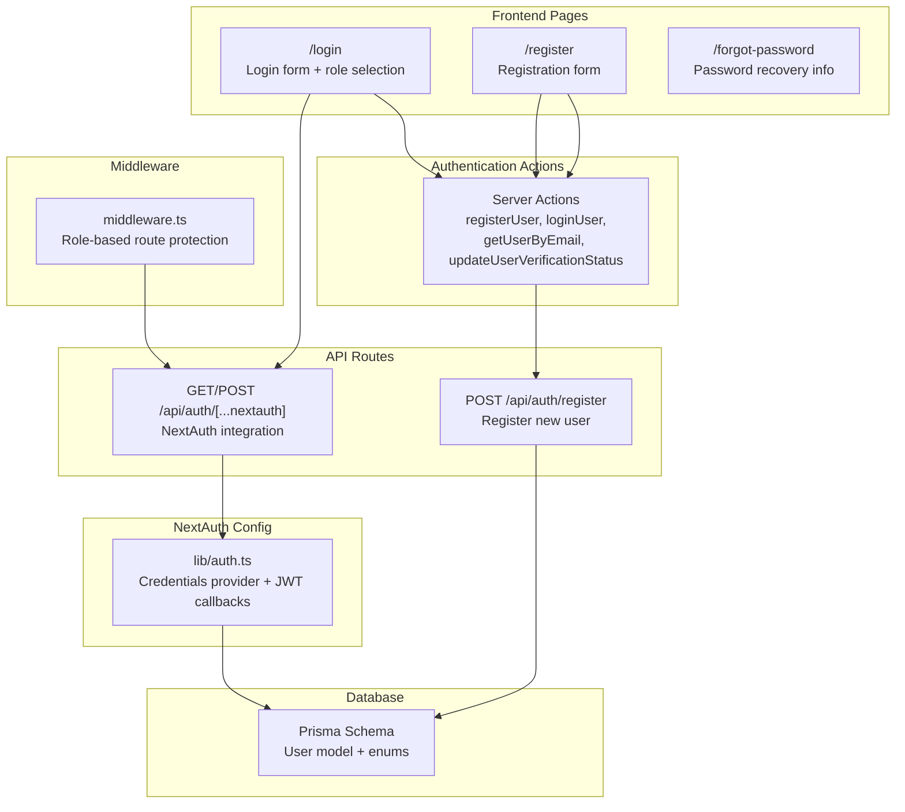
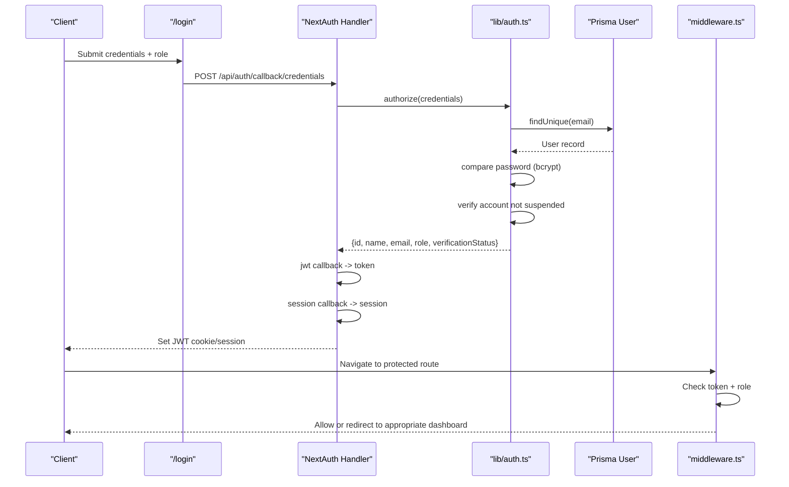
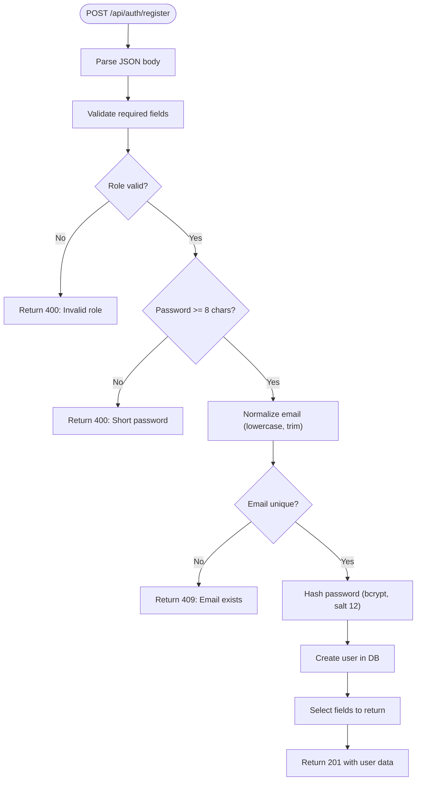
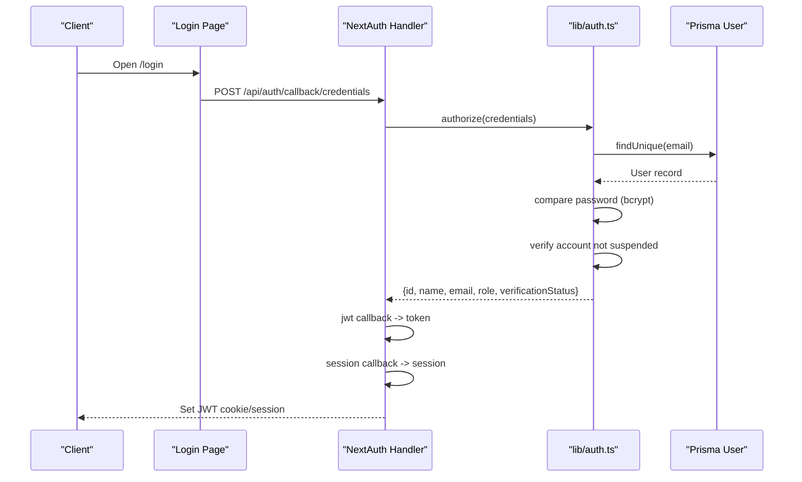
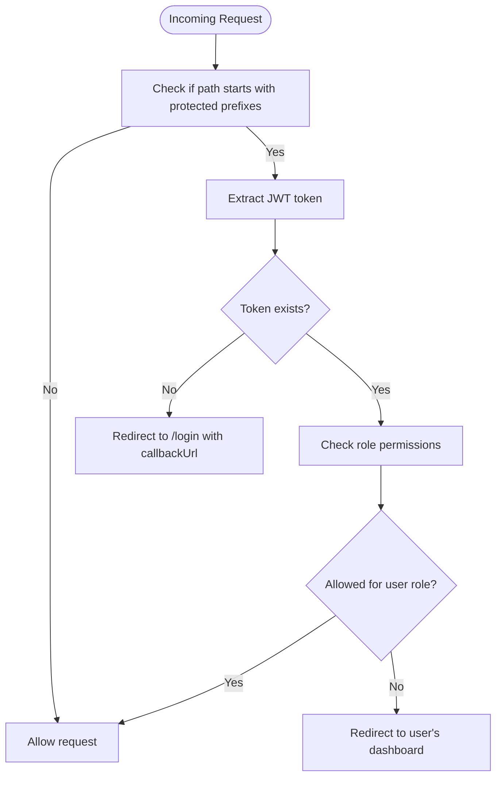
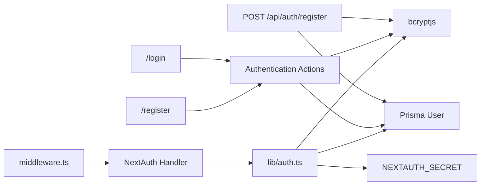

# Authentication API

<cite>
**Referenced Files in This Document**
- [src/app/api/auth/register/route.ts](file://src/app/api/auth/register/route.ts)
- [src/app/api/auth/[...nextauth]/route.ts](file://src/app/api/auth/[...nextauth]/route.ts)
- [src/lib/auth.ts](file://src/lib/auth.ts)
- [src/middleware.ts](file://src/middleware.ts)
- [src/actions/auth.actions.ts](file://src/actions/auth.actions.ts)
- [src/app/(auth)/login/page.tsx](file://src/app/(auth)/login/page.tsx)
- [src/app/(auth)/register/page.tsx](file://src/app/(auth)/register/page.tsx)
- [src/app/(auth)/forgot-password/page.tsx](file://src/app/(auth)/forgot-password/page.tsx)
- [prisma/schema.prisma](file://prisma/schema.prisma)
- [package.json](file://package.json)
</cite>

## Update Summary
**Changes Made**
- Added comprehensive documentation for the new authentication API endpoints
- Updated middleware documentation to reflect the new role-based routing system
- Enhanced registration endpoint documentation with improved validation rules
- Added detailed coverage of NextAuth.js integration and JWT handling
- Expanded authentication actions documentation for server-side operations
- Updated frontend authentication pages documentation with new login/logout flows

## Table of Contents
1. [Introduction](#introduction)
2. [Project Structure](#project-structure)
3. [Core Components](#core-components)
4. [Architecture Overview](#architecture-overview)
5. [Detailed Component Analysis](#detailed-component-analysis)
6. [Dependency Analysis](#dependency-analysis)
7. [Performance Considerations](#performance-considerations)
8. [Troubleshooting Guide](#troubleshooting-guide)
9. [Conclusion](#conclusion)

## Introduction
This document provides comprehensive API documentation for the Authentication endpoints in the RentalHub-BOUESTI application. It covers:
- User registration endpoint with validation, password hashing, and role assignment
- NextAuth.js integration endpoint for session management and JWT handling
- Role-based routing system with middleware enforcement
- Authentication actions for server-side operations
- HTTP methods, URL patterns, request/response schemas, error handling, and security considerations
- Practical usage examples for login, logout, and user management flows

## Project Structure
The authentication system spans API routes, NextAuth configuration, middleware, authentication actions, and frontend pages:
- Registration API: POST /api/auth/register
- NextAuth integration: /api/auth/[...nextauth]
- Authentication actions: Server-side operations for registration, login, and user management
- Role-based routing: Student, landlord, and admin dashboards
- Frontend authentication pages: Login, registration, and password recovery
- Middleware for protected routes with role-based access control

**Diagram sources**
- [src/app/api/auth/register/route.ts:1-90](file://src/app/api/auth/register/route.ts#L1-L90)
- [src/app/api/auth/[...nextauth]/route.ts:1-7](file://src/app/api/auth/[...nextauth]/route.ts#L1-L7)
- [src/actions/auth.actions.ts:1-208](file://src/actions/auth.actions.ts#L1-L208)
- [src/lib/auth.ts:1-119](file://src/lib/auth.ts#L1-L119)
- [src/middleware.ts:1-76](file://src/middleware.ts#L1-L76)
- [src/app/(auth)/login/page.tsx:1-206](file://src/app/(auth)/login/page.tsx#L1-L206)
- [src/app/(auth)/register/page.tsx:1-244](file://src/app/(auth)/register/page.tsx#L1-L244)
- [src/app/(auth)/forgot-password/page.tsx:1-25](file://src/app/(auth)/forgot-password/page.tsx#L1-L25)
- [prisma/schema.prisma:1-136](file://prisma/schema.prisma#L1-L136)

**Section sources**
- [src/app/api/auth/register/route.ts:1-90](file://src/app/api/auth/register/route.ts#L1-L90)
- [src/app/api/auth/[...nextauth]/route.ts:1-7](file://src/app/api/auth/[...nextauth]/route.ts#L1-L7)
- [src/actions/auth.actions.ts:1-208](file://src/actions/auth.actions.ts#L1-L208)
- [src/lib/auth.ts:1-119](file://src/lib/auth.ts#L1-L119)
- [src/middleware.ts:1-76](file://src/middleware.ts#L1-L76)
- [prisma/schema.prisma:1-136](file://prisma/schema.prisma#L1-L136)

## Core Components
- Registration endpoint: Validates input, enforces role constraints, hashes passwords, prevents duplicate emails, and returns user data with verification status.
- NextAuth integration: Provides credentials-based authentication, JWT token storage, session management, and role-aware redirects.
- Authentication actions: Server-side functions for user registration, login validation, user retrieval, and verification status updates.
- Role-based routing: Middleware enforces authentication and role-based access control across student, landlord, and admin dashboards.
- Database schema: Defines roles (STUDENT, LANDLORD, ADMIN) and verification statuses (UNVERIFIED, VERIFIED, SUSPENDED).

**Section sources**
- [src/app/api/auth/register/route.ts:13-89](file://src/app/api/auth/register/route.ts#L13-L89)
- [src/actions/auth.actions.ts:24-93](file://src/actions/auth.actions.ts#L24-L93)
- [src/lib/auth.ts:36-119](file://src/lib/auth.ts#L36-L119)
- [src/middleware.ts:5-66](file://src/middleware.ts#L5-L66)
- [prisma/schema.prisma:17-27](file://prisma/schema.prisma#L17-L27)

## Architecture Overview
The authentication architecture integrates NextAuth.js with a custom credentials provider and Prisma-backed user storage. Registration uses bcrypt for password hashing and creates users with default verification status. NextAuth manages sessions via JWT tokens and enforces role-based access control through middleware. Authentication actions provide server-side operations for enhanced security and flexibility.

**Diagram sources**
- [src/app/(auth)/login/page.tsx:19-77](file://src/app/(auth)/login/page.tsx#L19-L77)
- [src/app/api/auth/[...nextauth]/route.ts:1-7](file://src/app/api/auth/[...nextauth]/route.ts#L1-L7)
- [src/lib/auth.ts:53-92](file://src/lib/auth.ts#L53-L92)
- [prisma/schema.prisma:44-62](file://prisma/schema.prisma#L44-L62)
- [src/middleware.ts:15-66](file://src/middleware.ts#L15-L66)

## Detailed Component Analysis

### Registration Endpoint: POST /api/auth/register
- Purpose: Create a new user account (STUDENT or LANDLORD). Admin accounts are created via seed script or direct DB access.
- Method: POST
- URL: /api/auth/register
- Request Body Schema:
  - name: string (required)
  - email: string (required)
  - password: string (required, minimum 8 characters)
  - role: enum (optional, defaults to STUDENT; allowed values: STUDENT, LANDLORD)
- Response Schema:
  - success: boolean
  - data: user object with id, name, email, role, verificationStatus, createdAt
  - message: string
- Validation Rules:
  - name, email, and password are required
  - role must be STUDENT or LANDLORD
  - password must be at least 8 characters long
  - email must be unique (case-insensitive)
- Password Hashing:
  - Passwords are hashed using bcrypt with a salt factor of 12 before storage.
- Role Assignment:
  - Default role is STUDENT if not provided.
  - ADMIN role is reserved for seed-created accounts.
- Error Responses:
  - 400 Bad Request: Missing required fields, invalid role, or short password
  - 409 Conflict: Email already exists
  - 500 Internal Server Error: Unexpected server error
- Practical Usage Example:
  - Submit a POST request with JSON payload containing name, email, password, and optional role.
  - On success, receive a 201 Created with the created user data.

**Diagram sources**
- [src/app/api/auth/register/route.ts:20-81](file://src/app/api/auth/register/route.ts#L20-L81)

**Section sources**
- [src/app/api/auth/register/route.ts:1-90](file://src/app/api/auth/register/route.ts#L1-L90)
- [prisma/schema.prisma:44-62](file://prisma/schema.prisma#L44-L62)

### Authentication Actions: Server-Side Operations
- Purpose: Provide server-side authentication operations with enhanced security and validation.
- Available Actions:
  - registerUser: Complete user registration with validation and password hashing
  - registerUserFromForm: Registration from FormData for form submissions
  - loginUser: Login validation (client-side handling via NextAuth)
  - loginUserFromForm: Login from FormData
  - getUserByEmail: Retrieve user information by email
  - updateUserVerificationStatus: Update user verification status (admin only)
- Request/Response Patterns:
  - All actions return structured objects with success/error indicators
  - Passwords are hashed using bcrypt with salt factor 12
  - Email normalization to lowercase for consistency
- Security Features:
  - Server-side validation prevents bypassing client-side checks
  - Direct database access restricted to authorized operations
  - Passwords never stored in plain text

**Section sources**
- [src/actions/auth.actions.ts:1-208](file://src/actions/auth.actions.ts#L1-L208)

### NextAuth.js Integration: /api/auth/[...nextauth]
- Purpose: Provide NextAuth.js endpoints for authentication flows, session management, and JWT handling.
- Methods: GET and POST
- URL Pattern: /api/auth/[...nextauth]
- Implementation Details:
  - Delegates to NextAuth with configuration from lib/auth.ts.
  - Exposes NextAuth endpoints for sign-in/sign-out and credential verification.
- Session Management:
  - Strategy: JWT
  - Max age: 30 days
  - Update age: 24 hours
- JWT Token Handling:
  - Callbacks populate token with user id, role, and verification status.
  - Session callback enriches session.user with the same fields.
- Authentication Flow:
  - Frontend posts credentials to /api/auth/callback/credentials.
  - NextAuth authorize validates credentials against Prisma user records.
  - On success, JWT is set and session is established.
- Security Considerations:
  - Secret configured via NEXTAUTH_SECRET environment variable.
  - Debug mode enabled in development.
  - Password comparison uses bcrypt.

**Diagram sources**
- [src/app/(auth)/login/page.tsx:19-77](file://src/app/(auth)/login/page.tsx#L19-L77)
- [src/app/api/auth/[...nextauth]/route.ts:1-7](file://src/app/api/auth/[...nextauth]/route.ts#L1-L7)
- [src/lib/auth.ts:53-92](file://src/lib/auth.ts#L53-L92)
- [prisma/schema.prisma:44-62](file://prisma/schema.prisma#L44-L62)

**Section sources**
- [src/app/api/auth/[...nextauth]/route.ts:1-7](file://src/app/api/auth/[...nextauth]/route.ts#L1-L7)
- [src/lib/auth.ts:1-119](file://src/lib/auth.ts#L1-L119)
- [src/app/(auth)/login/page.tsx:19-77](file://src/app/(auth)/login/page.tsx#L19-L77)

### Role-Based Routing and Middleware Protection
- Purpose: Enforce authentication and role-based access control for protected routes.
- Protected Path Groups:
  - /student: Accessible to STUDENT role only
  - /landlord: Accessible to LANDLORD role only
  - /admin: Accessible to ADMIN role only
- Middleware Logic:
  - Extracts JWT token from request using next-auth/jwt
  - Validates token existence and role permissions
  - Redirects unauthenticated users to /login with callbackUrl
  - Redirects unauthorized users to their appropriate dashboard
- Token Access:
  - Middleware reads token from req.nextauth.token and applies role checks.
  - Supports role-based redirects based on user's actual role.
- Route Matching:
  - Uses matcher configuration for efficient route pattern matching
  - Processes all subpaths under protected groups

**Diagram sources**
- [src/middleware.ts:15-66](file://src/middleware.ts#L15-L66)

**Section sources**
- [src/middleware.ts:1-76](file://src/middleware.ts#L1-L76)

### Frontend Authentication Pages
- Login Page (/login):
  - Role selector allows users to specify their intended role
  - Credentials-based authentication via NextAuth
  - Post-login role verification to prevent role mismatch
  - Automatic redirection based on actual user role
  - Password recovery link for account issues
- Registration Page (/register):
  - Role selection with automatic URL parameter detection
  - Password confirmation validation
  - Real-time password strength checking
  - Terms and conditions agreement requirement
  - Success feedback and automatic redirect to login
- Password Recovery (/forgot-password):
  - Current limitation: Password reset not implemented
  - Support contact information provided
  - Clear messaging about account recovery process

**Section sources**
- [src/app/(auth)/login/page.tsx:1-206](file://src/app/(auth)/login/page.tsx#L1-L206)
- [src/app/(auth)/register/page.tsx:1-244](file://src/app/(auth)/register/page.tsx#L1-L244)
- [src/app/(auth)/forgot-password/page.tsx:1-25](file://src/app/(auth)/forgot-password/page.tsx#L1-L25)

### Database Model and Schema
- User Model:
  - Fields: id, name, email (unique), password, role (default STUDENT), verificationStatus (default UNVERIFIED), timestamps
  - Relations: properties (landlord), bookings (student)
- Enums:
  - Role: STUDENT, LANDLORD, ADMIN
  - VerificationStatus: UNVERIFIED, VERIFIED, SUSPENDED
- Indexes:
  - Unique index on email for fast lookups
  - Index on role for role-based filtering
  - Additional indexes on frequently queried fields
- Security:
  - Passwords stored as bcrypt hashes
  - Email normalization to lowercase
  - Verification status tracking for account lifecycle management

**Section sources**
- [prisma/schema.prisma:44-62](file://prisma/schema.prisma#L44-L62)
- [prisma/schema.prisma:17-27](file://prisma/schema.prisma#L17-L27)

## Dependency Analysis
Key dependencies and integrations:
- NextAuth.js: Provides authentication framework and session management
- bcryptjs: Handles password hashing and verification
- Prisma: Database ORM for user storage and queries
- Next.js Edge Middleware: Enforces route protection and role checks
- Authentication Actions: Server-side operations for enhanced security
- Environment Variables: NEXTAUTH_SECRET for signing JWTs

**Diagram sources**
- [src/app/api/auth/register/route.ts:8-11](file://src/app/api/auth/register/route.ts#L8-L11)
- [src/actions/auth.actions.ts:3-5](file://src/actions/auth.actions.ts#L3-L5)
- [src/lib/auth.ts:5-6](file://src/lib/auth.ts#L5-L6)
- [src/middleware.ts:3](file://src/middleware.ts#L3)
- [package.json:21-27](file://package.json#L21-L27)

**Section sources**
- [package.json:20-32](file://package.json#L20-L32)
- [src/lib/auth.ts:87-89](file://src/lib/auth.ts#L87-L89)

## Performance Considerations
- Password hashing cost: bcrypt salt factor of 12 balances security and performance; adjust based on deployment capacity.
- Session strategy: JWT reduces server-side session storage overhead; keep payloads minimal (as implemented).
- Database indexing: Unique email index and role index improve lookup performance.
- Middleware checks: Minimal overhead due to token presence checks and simple role comparisons.
- Authentication actions: Server-side processing adds security but may increase latency for certain operations.

## Troubleshooting Guide
- Registration errors:
  - Missing fields: Ensure name, email, and password are provided.
  - Invalid role: Only STUDENT or LANDLORD are accepted.
  - Short password: Must be at least 8 characters.
  - Duplicate email: Use a unique email address.
- NextAuth errors:
  - Missing credentials: Provide both email and password.
  - Incorrect password: Verify credentials match stored hash.
  - Suspended account: Contact support if blocked.
- Middleware redirections:
  - /login: Authenticate first.
  - User's dashboard: Redirected based on actual role when role mismatch occurs.
- Authentication actions:
  - Server-side validation failures: Check input parameters and database connectivity.
  - Role verification failures: Ensure user has proper role assignment in database.
- Environment configuration:
  - NEXTAUTH_SECRET must be set; otherwise, JWT signing will fail.

**Section sources**
- [src/app/api/auth/register/route.ts:25-56](file://src/app/api/auth/register/route.ts#L25-L56)
- [src/actions/auth.actions.ts:26-52](file://src/actions/auth.actions.ts#L26-L52)
- [src/lib/auth.ts:53-82](file://src/lib/auth.ts#L53-L82)
- [src/middleware.ts:35-60](file://src/middleware.ts#L35-L60)

## Conclusion
The Authentication API provides a secure and extensible foundation for user registration and session management. Registration enforces strong validation and hashing, while NextAuth.js handles credentials-based authentication, JWT token lifecycle, and role-aware routing. Authentication actions offer server-side security enhancements, and middleware ensures protected routes remain inaccessible to unauthorized users. The role-based routing system provides intuitive navigation based on user roles, creating a seamless experience across student, landlord, and admin dashboards. Together, these components deliver a robust authentication experience aligned with the application's role model and security requirements.