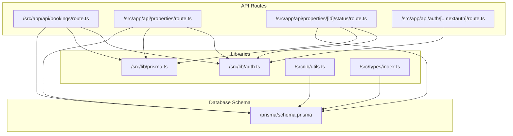
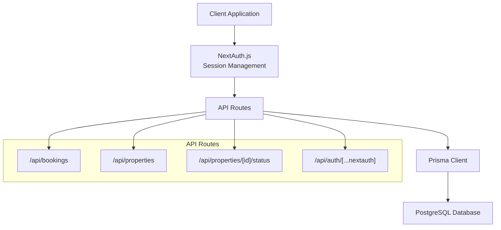
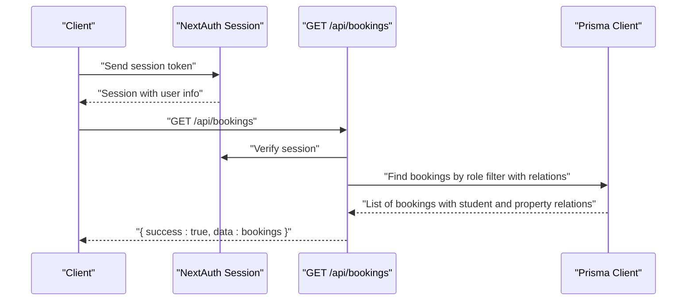
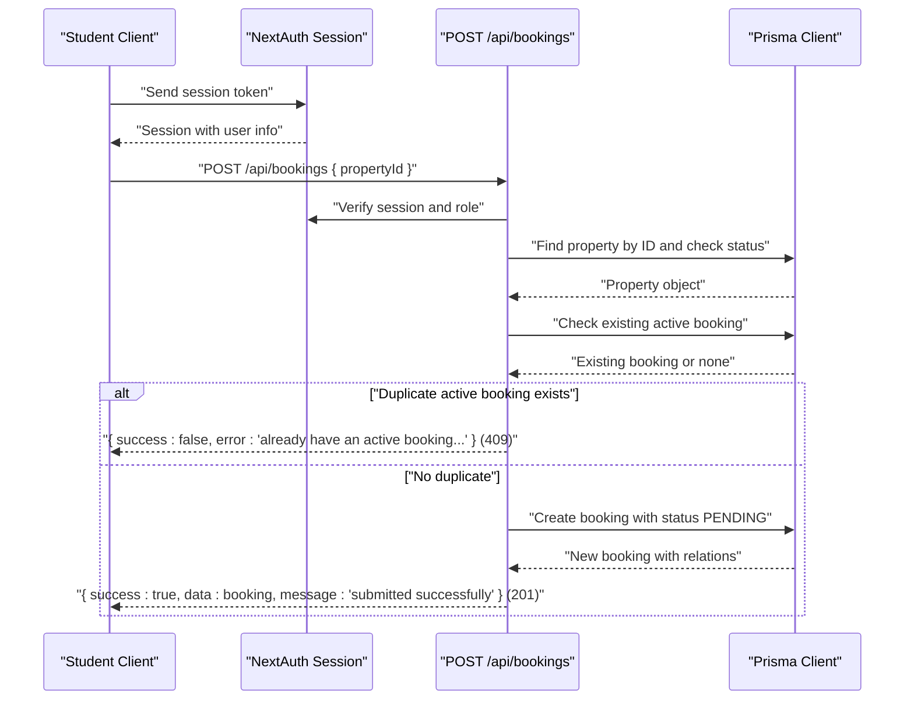
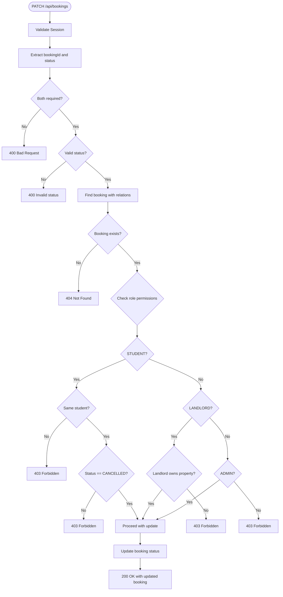
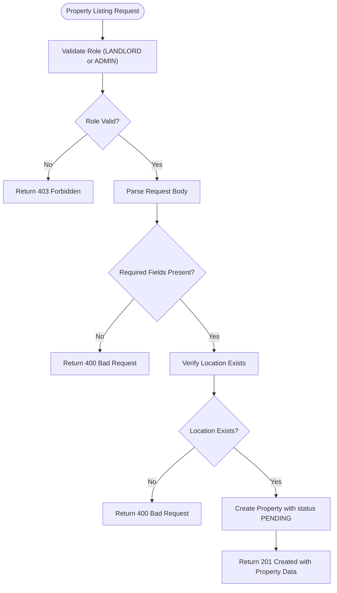
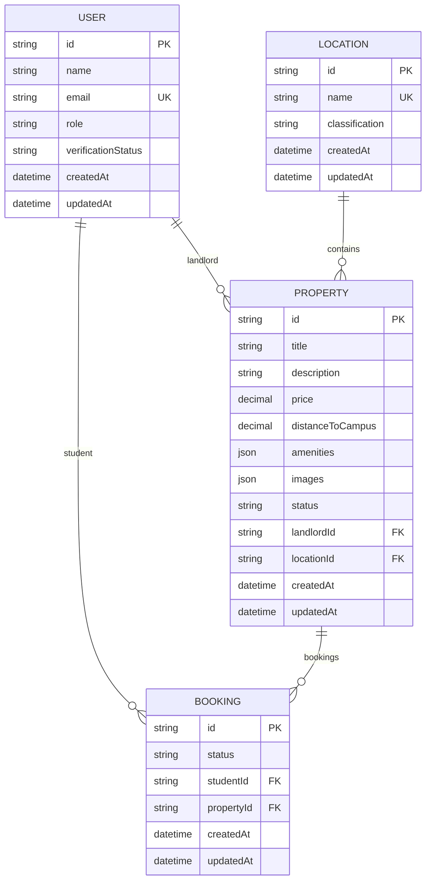
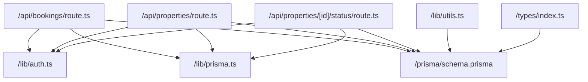

# Booking System API

<cite>
**Referenced Files in This Document**
- [src/app/api/bookings/route.ts](file://src/app/api/bookings/route.ts)
- [prisma/schema.prisma](file://prisma/schema.prisma)
- [src/lib/prisma.ts](file://src/lib/prisma.ts)
- [src/lib/auth.ts](file://src/lib/auth.ts)
- [src/types/index.ts](file://src/types/index.ts)
- [src/app/api/properties/route.ts](file://src/app/api/properties/route.ts)
- [src/app/api/properties/[id]/status/route.ts](file://src/app/api/properties/[id]/status/route.ts)
- [src/lib/utils.ts](file://src/lib/utils.ts)
- [package.json](file://package.json)
</cite>

## Update Summary
**Changes Made**
- Added comprehensive PATCH endpoint documentation for booking status management
- Enhanced role-based permission documentation for booking modifications
- Updated validation rules to include student-only cancellation capability
- Expanded status tracking documentation with CONFIRMED and CANCELLED states
- Added detailed conflict resolution mechanisms for duplicate bookings
- Updated API reference with complete CRUD operations

## Table of Contents
1. [Introduction](#introduction)
2. [Project Structure](#project-structure)
3. [Core Components](#core-components)
4. [Architecture Overview](#architecture-overview)
5. [Detailed Component Analysis](#detailed-component-analysis)
6. [Dependency Analysis](#dependency-analysis)
7. [Performance Considerations](#performance-considerations)
8. [Troubleshooting Guide](#troubleshooting-guide)
9. [Conclusion](#conclusion)
10. [Appendices](#appendices)

## Introduction
This document provides comprehensive API documentation for the Booking System endpoints within the RentalHub BOUESTI platform. The system now supports full booking lifecycle management including creation, modification, and cancellation workflows. Students can request property bookings, landlords can approve or reject requests, and admins oversee the entire process. The documentation details request/response schemas, status tracking (PENDING, CONFIRMED, CANCELLED), conflict resolution mechanisms, validation rules, user role permissions, and notification triggers. It also covers booking history, reporting capabilities, and integration patterns with property and user management systems.

## Project Structure
The Booking System API is implemented as a set of Next.js App Router API routes under `/src/app/api`. The backend integrates with Prisma ORM for database operations and NextAuth.js for authentication and session management. The database schema defines core entities: User, Location, Property, and Booking, along with associated enums for roles and statuses.



**Diagram sources**
- [src/app/api/bookings/route.ts:1-182](file://src/app/api/bookings/route.ts#L1-L182)
- [src/app/api/properties/route.ts:1-162](file://src/app/api/properties/route.ts#L1-L162)
- [src/app/api/properties/[id]/status/route.ts:1-69](file://src/app/api/properties/[id]/status/route.ts#L1-L69)
- [src/lib/auth.ts:1-119](file://src/lib/auth.ts#L1-L119)
- [src/lib/prisma.ts:1-27](file://src/lib/prisma.ts#L1-L27)
- [src/lib/utils.ts:1-158](file://src/lib/utils.ts#L1-L158)
- [src/types/index.ts:1-109](file://src/types/index.ts#L1-L109)
- [prisma/schema.prisma:1-136](file://prisma/schema.prisma#L1-L136)

**Section sources**
- [src/app/api/bookings/route.ts:1-182](file://src/app/api/bookings/route.ts#L1-L182)
- [src/app/api/properties/route.ts:1-162](file://src/app/api/properties/route.ts#L1-L162)
- [src/app/api/properties/[id]/status/route.ts:1-69](file://src/app/api/properties/[id]/status/route.ts#L1-L69)
- [src/lib/auth.ts:1-119](file://src/lib/auth.ts#L1-L119)
- [src/lib/prisma.ts:1-27](file://src/lib/prisma.ts#L1-L27)
- [src/lib/utils.ts:1-158](file://src/lib/utils.ts#L1-L158)
- [src/types/index.ts:1-109](file://src/types/index.ts#L1-L109)
- [prisma/schema.prisma:1-136](file://prisma/schema.prisma#L1-L136)

## Core Components
- **Authentication and Authorization**: Managed via NextAuth.js with JWT sessions. Roles include STUDENT, LANDLORD, and ADMIN. Session user data includes role and verification status.
- **Database Layer**: Prisma Client singleton provides type-safe database access with logging configured per environment.
- **Booking Management**: Complete CRUD endpoints for bookings with role-based visibility, validation rules, and status tracking.
- **Property Management**: Property listing and status management with admin oversight.
- **Types and Utilities**: Shared TypeScript types and helper utilities for status labels and formatting.

Key implementation references:
- Authentication configuration and session callbacks: [src/lib/auth.ts:36-118](file://src/lib/auth.ts#L36-L118)
- Prisma Client initialization: [src/lib/prisma.ts:13-24](file://src/lib/prisma.ts#L13-L24)
- Booking endpoints (GET/POST/PATCH): [src/app/api/bookings/route.ts:11-181](file://src/app/api/bookings/route.ts#L11-L181)
- Property endpoints (GET/POST/PATCH): [src/app/api/properties/route.ts:15-161](file://src/app/api/properties/route.ts#L15-L161), [src/app/api/properties/[id]/status/route.ts:17-L68](file://src/app/api/properties/[id]/status/route.ts#L17-L68)
- Shared types and response shapes: [src/types/index.ts:44-108](file://src/types/index.ts#L44-L108)
- Status labels and utilities: [src/lib/utils.ts:133-138](file://src/lib/utils.ts#L133-L138)

**Section sources**
- [src/lib/auth.ts:36-118](file://src/lib/auth.ts#L36-L118)
- [src/lib/prisma.ts:13-24](file://src/lib/prisma.ts#L13-L24)
- [src/app/api/bookings/route.ts:11-181](file://src/app/api/bookings/route.ts#L11-L181)
- [src/app/api/properties/route.ts:15-161](file://src/app/api/properties/route.ts#L15-L161)
- [src/app/api/properties/[id]/status/route.ts:17-L68](file://src/app/api/properties/[id]/status/route.ts#L17-L68)
- [src/types/index.ts:44-108](file://src/types/index.ts#L44-L108)
- [src/lib/utils.ts:133-138](file://src/lib/utils.ts#L133-L138)

## Architecture Overview
The Booking System follows a layered architecture:
- **Presentation Layer**: Next.js App Router API routes handle HTTP requests and responses.
- **Application Layer**: Route handlers orchestrate business logic, enforce permissions, and coordinate database operations.
- **Data Access Layer**: Prisma Client abstracts database queries and mutations.
- **Identity and Access Management**: NextAuth.js manages authentication and session tokens.



**Diagram sources**
- [src/app/api/bookings/route.ts:1-182](file://src/app/api/bookings/route.ts#L1-L182)
- [src/app/api/properties/route.ts:1-162](file://src/app/api/properties/route.ts#L1-L162)
- [src/app/api/properties/[id]/status/route.ts:1-69](file://src/app/api/properties/[id]/status/route.ts#L1-L69)
- [src/lib/auth.ts:36-118](file://src/lib/auth.ts#L36-L118)
- [src/lib/prisma.ts:13-24](file://src/lib/prisma.ts#L13-L24)
- [prisma/schema.prisma:1-136](file://prisma/schema.prisma#L1-L136)

## Detailed Component Analysis

### Booking Endpoints
The booking system now supports three primary endpoints with comprehensive functionality:

**Endpoints:**
- **GET /api/bookings**: Lists bookings filtered by user role with full relations
- **POST /api/bookings**: Creates a booking request for a property
- **PATCH /api/bookings**: Updates booking status (CONFIRMED or CANCELLED)

**Validation and Permissions:**
- **Authentication required** for all endpoints
- **Role-based filtering**: STUDENT sees only their bookings; LANDLORD sees bookings for their properties; ADMIN sees all
- **POST requires STUDENT role** and a valid, APPROVED property ID
- **PATCH supports multiple roles** with different capabilities:
  - STUDENT: Can only cancel their own bookings (status must be CANCELLED)
  - LANDLORD: Can update requests for their listings (CONFIRMED or CANCELLED)
  - ADMIN: Full access to all bookings
- **Duplicate active booking prevention** for the same student and property with PENDING or CONFIRMED status

**Response Schemas:**
- Success response shape: `{ success: boolean, data?: T, message?: string }`
- Error response shape: `{ success: boolean, error: string }`



**Diagram sources**
- [src/app/api/bookings/route.ts:11-45](file://src/app/api/bookings/route.ts#L11-L45)
- [src/lib/auth.ts:104-111](file://src/lib/auth.ts#L104-L111)
- [src/lib/prisma.ts:13-24](file://src/lib/prisma.ts#L13-L24)



**Diagram sources**
- [src/app/api/bookings/route.ts:47-108](file://src/app/api/bookings/route.ts#L47-L108)
- [src/lib/auth.ts:104-111](file://src/lib/auth.ts#L104-L111)
- [src/lib/prisma.ts:13-24](file://src/lib/prisma.ts#L13-L24)

**Section sources**
- [src/app/api/bookings/route.ts:11-181](file://src/app/api/bookings/route.ts#L11-L181)
- [src/lib/auth.ts:104-111](file://src/lib/auth.ts#L104-L111)
- [src/types/index.ts:44-50](file://src/types/index.ts#L44-L50)
- [src/lib/utils.ts:133-138](file://src/lib/utils.ts#L133-L138)

### Booking Modification Endpoint (PATCH)
The PATCH endpoint enables comprehensive booking status management with role-based restrictions:

**Endpoint:** `PATCH /api/bookings`

**Request Body:**
```json
{
  "bookingId": "string",
  "status": "CONFIRMED" | "CANCELLED"
}
```

**Role-Based Capabilities:**
- **STUDENT**: Can only cancel bookings (`status: "CANCELLED"`) for their own bookings
- **LANDLORD**: Can update any booking for their properties (CONFIRMED or CANCELLED)
- **ADMIN**: Can update any booking status

**Validation Rules:**
- Both `bookingId` and `status` are required
- Status must be either "CONFIRMED" or "CANCELLED"
- Permission checks verify ownership or landlord rights
- Booking existence validation



**Diagram sources**
- [src/app/api/bookings/route.ts:110-181](file://src/app/api/bookings/route.ts#L110-L181)

**Section sources**
- [src/app/api/bookings/route.ts:110-181](file://src/app/api/bookings/route.ts#L110-L181)

### Property Endpoints (Landlord/Admin)
Endpoints:
- **GET /api/properties**: Lists/searches properties with filters and pagination.
- **POST /api/properties**: Creates a property listing (LANDLORD or ADMIN).
- **PATCH /api/properties/[id]/status**: Updates property status (ADMIN only).

Validation and Permissions:
- GET supports filtering by location, price range, status, and pagination.
- POST requires LANDLORD or ADMIN role and validates required fields.
- PATCH requires ADMIN role and validates status value against enum.



**Diagram sources**
- [src/app/api/properties/route.ts:97-161](file://src/app/api/properties/route.ts#L97-L161)
- [src/lib/auth.ts:104-111](file://src/lib/auth.ts#L104-L111)

**Section sources**
- [src/app/api/properties/route.ts:15-161](file://src/app/api/properties/route.ts#L15-L161)
- [src/app/api/properties/[id]/status/route.ts:17-L68](file://src/app/api/properties/[id]/status/route.ts#L17-L68)
- [src/lib/auth.ts:104-111](file://src/lib/auth.ts#L104-L111)

### Database Schema and Relationships
The Prisma schema defines the core entities and their relationships:
- **User**: Has role and verificationStatus; can be STUDENT, LANDLORD, or ADMIN.
- **Location**: Geographic area with classification.
- **Property**: Linked to Location and User (landlord); includes status enum.
- **Booking**: Links User (student) and Property; includes status enum.



**Diagram sources**
- [prisma/schema.prisma:44-135](file://prisma/schema.prisma#L44-L135)

**Section sources**
- [prisma/schema.prisma:17-39](file://prisma/schema.prisma#L17-L39)
- [prisma/schema.prisma:44-135](file://prisma/schema.prisma#L44-L135)

### Data Models and Schemas
**Booking model:**
- Fields: id, status (PENDING, CONFIRMED, CANCELLED), timestamps, foreign keys studentId and propertyId.
- Relations: belongs to User (student) and Property.

**Property model:**
- Fields: id, title, description, price, distanceToCampus, amenities, images, status (PENDING, APPROVED, REJECTED), timestamps, foreign keys landlordId and locationId.
- Relations: belongs to User (landlord) and Location; has many Bookings.

**User model:**
- Fields: id, name, email, role (STUDENT, LANDLORD, ADMIN), verificationStatus (UNVERIFIED, VERIFIED, SUSPENDED), timestamps.
- Relations: has many Properties and Bookings.

**Shared response and form types:**
- ApiResponse<T>: success flag, optional data, optional error, optional message.
- BookingFormData: propertyId for booking creation.
- SessionUser: id, name, email, role, verificationStatus.

**Section sources**
- [prisma/schema.prisma:117-135](file://prisma/schema.prisma#L117-L135)
- [prisma/schema.prisma:80-114](file://prisma/schema.prisma#L80-L114)
- [prisma/schema.prisma:44-62](file://prisma/schema.prisma#L44-L62)
- [src/types/index.ts:44-108](file://src/types/index.ts#L44-L108)
- [src/types/index.ts:74-80](file://src/types/index.ts#L74-L80)

### Status Tracking and Conflict Resolution
**Status tracking:**
- BookingStatus enum: PENDING, CONFIRMED, CANCELLED
- PropertyStatus enum: PENDING, APPROVED, REJECTED
- Display labels for UI consumption: [src/lib/utils.ts:133-138](file://src/lib/utils.ts#L133-L138)

**Conflict resolution:**
- **Duplicate active booking prevention**: A student cannot have multiple PENDING or CONFIRMED bookings for the same property
- **Property availability**: Only APPROVED properties can be booked; PENDING or REJECTED properties are unavailable
- **Role-based access control**: Different permissions for STUDENT, LANDLORD, and ADMIN users

**Section sources**
- [prisma/schema.prisma:35-39](file://prisma/schema.prisma#L35-L39)
- [src/app/api/bookings/route.ts:74-87](file://src/app/api/bookings/route.ts#L74-L87)
- [src/lib/utils.ts:133-138](file://src/lib/utils.ts#L133-L138)

### Validation Rules and Permissions
**Authentication:**
- All endpoints require a valid session; unauthorized requests receive 401

**Role-based access:**
- **STUDENT**: Can list and create bookings; cannot list all bookings or manage properties; can only cancel their own bookings
- **LANDLORD**: Can list bookings for their properties; cannot list all bookings or create bookings; can update any booking for their properties
- **ADMIN**: Full access to listings and bookings; can approve/reject properties

**Property validation:**
- Required fields for property creation: title, description, price, locationId
- Location existence check before property creation

**Booking validation:**
- Property ID presence and validity
- Property status must be APPROVED
- Duplicate active booking prevention
- Role-specific status updates (students can only cancel)

**Section sources**
- [src/app/api/bookings/route.ts:15-17](file://src/app/api/bookings/route.ts#L15-L17)
- [src/app/api/bookings/route.ts:55-57](file://src/app/api/bookings/route.ts#L55-L57)
- [src/app/api/bookings/route.ts:143-150](file://src/app/api/bookings/route.ts#L143-L150)
- [src/app/api/properties/route.ts:105-107](file://src/app/api/properties/route.ts#L105-L107)
- [src/app/api/properties/route.ts:112-117](file://src/app/api/properties/route.ts#L112-L117)

### Notification Triggers
The current implementation does not include explicit notification triggers for booking events. Notifications would typically be implemented as side effects after booking creation or status updates. Consider adding hooks or service functions to send notifications upon:
- New booking submission (to landlord and admin)
- Booking confirmation (to student)
- Booking cancellation (to landlord and admin)

### Booking History and Reporting
- **Booking history**: The GET endpoint returns bookings ordered by creation time, enabling historical tracking
- **Pagination and filtering**: While the GET endpoint currently returns all bookings for the requesting user/landlord/admin, future enhancements could include pagination and filtering parameters similar to property listings

**Section sources**
- [src/app/api/bookings/route.ts:26-38](file://src/app/api/bookings/route.ts#L26-L38)

### Integration Patterns
- **Property and user management integration**:
  - Booking creation depends on property existence and approval status
  - Landlord visibility is enforced by linking bookings to property landlordId
  - Admin oversight is enabled by allowing admin access to all bookings and property status management
- **Authentication integration**:
  - Session-based authorization with role propagation via JWT claims

**Section sources**
- [src/app/api/bookings/route.ts:19-24](file://src/app/api/bookings/route.ts#L19-L24)
- [src/app/api/properties/[id]/status/route.ts:26-L28](file://src/app/api/properties/[id]/status/route.ts#L26-L28)

## Dependency Analysis
The Booking System API relies on:
- NextAuth.js for authentication and session management
- Prisma Client for database operations
- Prisma schema for entity definitions and enums
- Shared TypeScript types and utilities for consistent data handling



**Diagram sources**
- [src/app/api/bookings/route.ts:6-9](file://src/app/api/bookings/route.ts#L6-L9)
- [src/app/api/properties/route.ts:6-9](file://src/app/api/properties/route.ts#L6-L9)
- [src/app/api/properties/[id]/status/route.ts:7-L10](file://src/app/api/properties/[id]/status/route.ts#L7-L10)
- [src/lib/auth.ts:1-119](file://src/lib/auth.ts#L1-L119)
- [src/lib/prisma.ts:1-27](file://src/lib/prisma.ts#L1-L27)
- [src/lib/utils.ts:1-158](file://src/lib/utils.ts#L1-L158)
- [src/types/index.ts:1-109](file://src/types/index.ts#L1-L109)
- [prisma/schema.prisma:1-136](file://prisma/schema.prisma#L1-L136)

**Section sources**
- [src/app/api/bookings/route.ts:6-9](file://src/app/api/bookings/route.ts#L6-L9)
- [src/app/api/properties/route.ts:6-9](file://src/app/api/properties/route.ts#L6-L9)
- [src/app/api/properties/[id]/status/route.ts:7-L10](file://src/app/api/properties/[id]/status/route.ts#L7-L10)
- [src/lib/auth.ts:1-119](file://src/lib/auth.ts#L1-L119)
- [src/lib/prisma.ts:1-27](file://src/lib/prisma.ts#L1-L27)
- [src/lib/utils.ts:1-158](file://src/lib/utils.ts#L1-L158)
- [src/types/index.ts:1-109](file://src/types/index.ts#L1-L109)
- [prisma/schema.prisma:1-136](file://prisma/schema.prisma#L1-L136)

## Performance Considerations
- **Database indexing**: Ensure indexes exist on frequently queried fields (e.g., studentId, propertyId, status) to optimize booking queries
- **Pagination**: Implement pagination for listing endpoints to limit response sizes
- **Logging**: Prisma logging is configured differently for development versus production environments to balance observability and performance
- **Session caching**: NextAuth.js JWT strategy reduces database load by carrying role and verification status in the token

## Troubleshooting Guide
Common issues and resolutions:
- **Authentication failures**: Ensure the client sends a valid session token; unauthorized requests receive 401
- **Role restrictions**: Only STUDENT can create bookings; LANDLORD can view bookings for their properties; ADMIN has full access
- **Property availability**: Only APPROVED properties can be booked; PENDING or REJECTED properties will cause validation errors
- **Duplicate bookings**: If a student attempts to book a property with an existing PENDING or CONFIRMED booking, the system returns 409 Conflict
- **Status update restrictions**: Students can only cancel their own bookings; landlords can only update bookings for their properties
- **Database errors**: Internal server errors return 500 with a generic error message; check server logs for details

**Section sources**
- [src/app/api/bookings/route.ts:15-17](file://src/app/api/bookings/route.ts#L15-L17)
- [src/app/api/bookings/route.ts:55-57](file://src/app/api/bookings/route.ts#L55-L57)
- [src/app/api/bookings/route.ts:143-150](file://src/app/api/bookings/route.ts#L143-L150)
- [src/app/api/bookings/route.ts:82-87](file://src/app/api/bookings/route.ts#L82-L87)
- [src/app/api/bookings/route.ts:105-107](file://src/app/api/bookings/route.ts#L105-L107)

## Conclusion
The Booking System API provides a comprehensive foundation for managing property bookings with clear role-based permissions, robust validation, and sophisticated status tracking. The current implementation supports full booking lifecycle management including creation, listing, and modification with appropriate safeguards against conflicts and unauthorized access. The addition of the PATCH endpoint enables flexible booking status management with role-specific capabilities. Future enhancements should focus on implementing notification triggers, adding pagination/reporting capabilities, and potentially expanding booking lifecycle management beyond the current CONFIRMED/CANCELLED states.

## Appendices

### API Reference Summary
**GET /api/bookings**
- **Description**: List bookings for the authenticated user with full relations
- **Authentication**: Required
- **Permissions**: STUDENT (own bookings), LANDLORD (bookings for their properties), ADMIN (all)
- **Response**: `{ success: boolean, data: Booking[] }`

**POST /api/bookings**
- **Description**: Create a booking request for a property
- **Authentication**: Required
- **Permissions**: STUDENT only
- **Request body**: `{ propertyId: string }`
- **Validation**: Property exists, status is APPROVED, no duplicate active booking
- **Response**: `{ success: boolean, data: Booking, message: string }` (201) or error (400/403/404/409/500)

**PATCH /api/bookings**
- **Description**: Update booking status (CONFIRMED or CANCELLED)
- **Authentication**: Required
- **Permissions**: STUDENT (only CANCELLED for their own bookings), LANDLORD (any for their properties), ADMIN (all)
- **Request body**: `{ bookingId: string, status: "CONFIRMED" | "CANCELLED" }`
- **Validation**: Booking exists, valid status, role-based permissions
- **Response**: `{ success: boolean, data: Booking, message: string }` (200) or error (400/403/404/500)

**Section sources**
- [src/app/api/bookings/route.ts:11-181](file://src/app/api/bookings/route.ts#L11-L181)
- [src/types/index.ts:44-50](file://src/types/index.ts#L44-L50)

### Database Schema Reference
**Enums:**
- Role: STUDENT, LANDLORD, ADMIN
- VerificationStatus: UNVERIFIED, VERIFIED, SUSPENDED
- PropertyStatus: PENDING, APPROVED, REJECTED
- BookingStatus: PENDING, CONFIRMED, CANCELLED

**Models and relations** are defined in the Prisma schema.

**Section sources**
- [prisma/schema.prisma:17-39](file://prisma/schema.prisma#L17-L39)
- [prisma/schema.prisma:44-135](file://prisma/schema.prisma#L44-L135)

### Environment and Dependencies
- Next.js, NextAuth.js, Prisma, bcryptjs, and related dependencies are managed via package.json scripts and configuration.

**Section sources**
- [package.json:1-49](file://package.json#L1-L49)