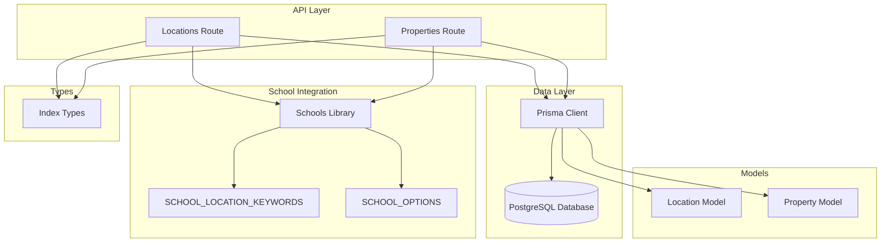
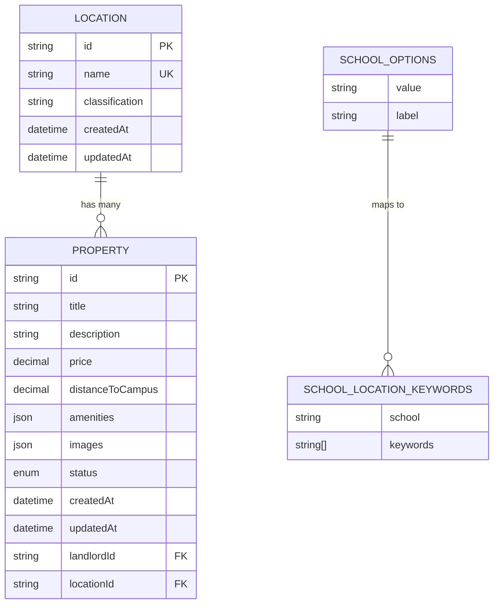
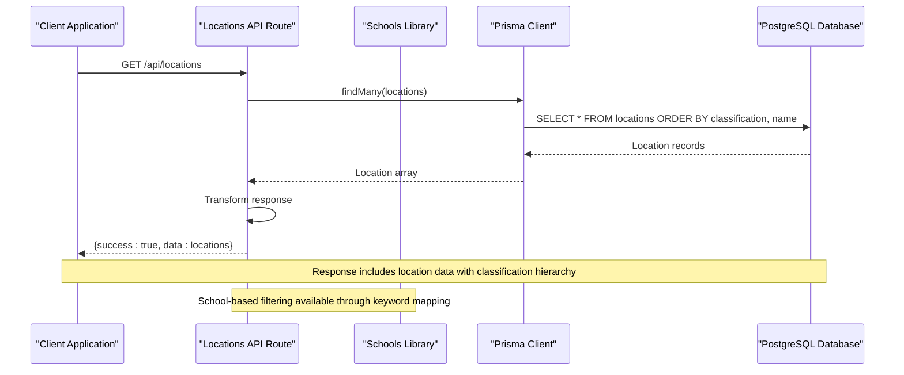
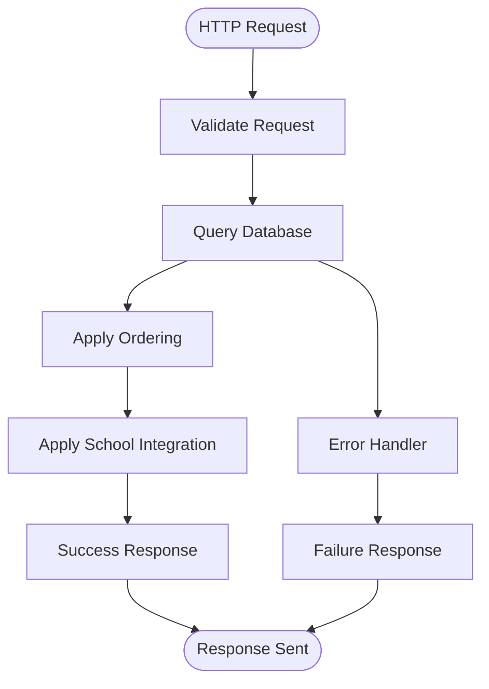
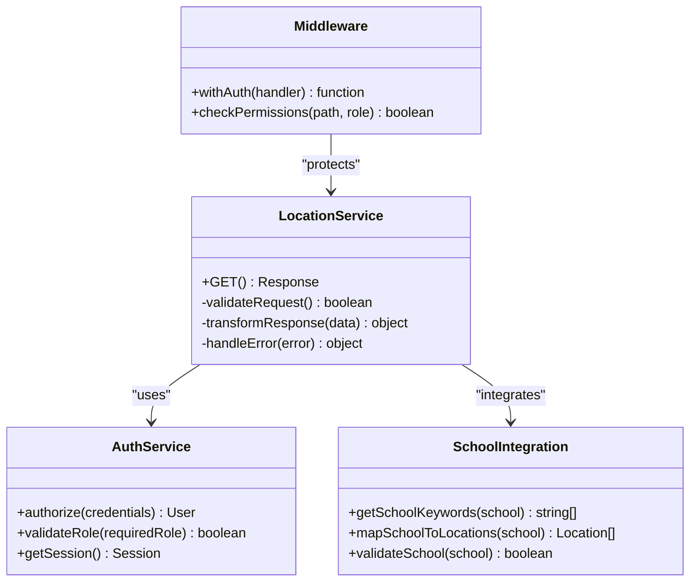
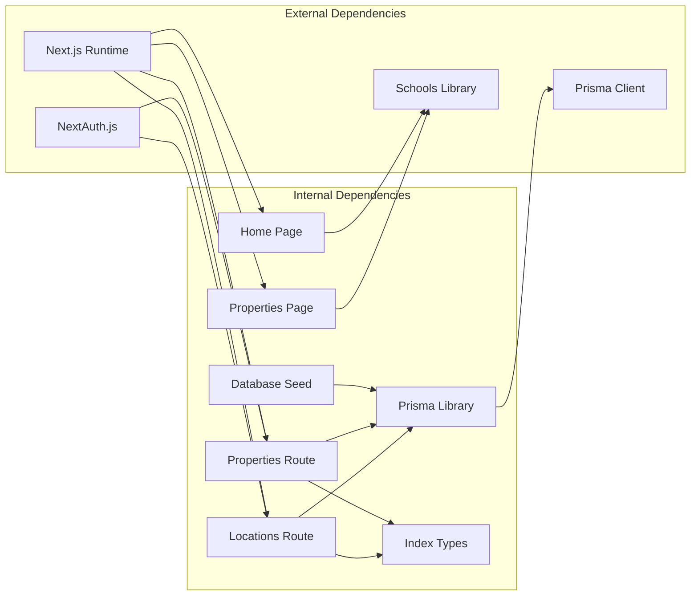

# Location Services API

<cite>
**Referenced Files in This Document**
- [route.ts](file://src/app/api/locations/route.ts)
- [schools.ts](file://src/lib/schools.ts)
- [schema.prisma](file://prisma/schema.prisma)
- [prisma.ts](file://src/lib/prisma.ts)
- [index.ts](file://src/types/index.ts)
- [route.ts](file://src/app/api/properties/route.ts)
- [seed.ts](file://prisma/seed.ts)
- [auth.ts](file://src/lib/auth.ts)
- [middleware.ts](file://src/middleware.ts)
- [page.tsx](file://src/app/(public)/page.tsx)
- [page.tsx](file://src/app/(public)/properties/page.tsx)
</cite>

## Update Summary
**Changes Made**
- Added comprehensive school information integration with geographic data mapping
- Enhanced location services API with school-based geographic filtering capabilities
- Integrated SCHOOL_LOCATION_KEYWORDS for intelligent property search by university proximity
- Updated property search functionality to support both location-based and school-based filtering
- Added new SCHOOL_OPTIONS interface and constants for educational institution data
- Enhanced geographic filtering with proximity-based search algorithms

## Table of Contents
1. [Introduction](#introduction)
2. [Project Structure](#project-structure)
3. [Core Components](#core-components)
4. [Architecture Overview](#architecture-overview)
5. [Detailed Component Analysis](#detailed-component-analysis)
6. [School Information Integration](#school-information-integration)
7. [Geographic Filtering Capabilities](#geographic-filtering-capabilities)
8. [Dependency Analysis](#dependency-analysis)
9. [Performance Considerations](#performance-considerations)
10. [Troubleshooting Guide](#troubleshooting-guide)
11. [Conclusion](#conclusion)

## Introduction
The Location Services API provides comprehensive geographic location management capabilities for the RentalHub BOUESTI platform. The system has been enhanced with sophisticated school information integration, enabling intelligent property search based on proximity to educational institutions. This enhancement transforms the API from a simple location retrieval service into a comprehensive geographic data platform serving the unique needs of students seeking off-campus accommodation near universities and colleges.

The platform now manages geographical areas with classification categories including Core Quarter, Residential Estate, Neighbourhood, and Ward, while simultaneously providing school-based geographic filtering through intelligent keyword mapping. This dual approach enables users to search for properties either by traditional geographic location or by proximity to specific educational institutions.

## Project Structure
The Location Services API has evolved into a sophisticated system with integrated school information and geographic data management:



**Diagram sources**
- [route.ts:1-29](file://src/app/api/locations/route.ts#L1-L29)
- [schools.ts:1-31](file://src/lib/schools.ts#L1-L31)
- [schema.prisma:64-77](file://prisma/schema.prisma#L64-L77)
- [prisma.ts:1-27](file://src/lib/prisma.ts#L1-L27)

**Section sources**
- [route.ts:1-29](file://src/app/api/locations/route.ts#L1-L29)
- [schools.ts:1-31](file://src/lib/schools.ts#L1-L31)
- [schema.prisma:64-77](file://prisma/schema.prisma#L64-L77)

## Core Components

### Enhanced Location Management Endpoint
The primary endpoint now provides comprehensive location data retrieval with integrated school information for enhanced geographic filtering capabilities.

**Endpoint**: `GET /api/locations`

**Purpose**: Returns all geographical locations ordered by classification and name, supporting both standalone location retrieval and school-based geographic filtering integration.

**Response Format**: Standard API response structure with location data array, enabling seamless integration with school information systems.

**Section sources**
- [route.ts:1-29](file://src/app/api/locations/route.ts#L1-L29)

### Location Data Schema
The Location model defines the core geographic entity structure with enhanced support for school-based geographic integration:



**Diagram sources**
- [schema.prisma:64-108](file://prisma/schema.prisma#L64-L108)
- [schools.ts:1-31](file://src/lib/schools.ts#L1-L31)

**Key Schema Elements**:
- **Primary Identifier**: Unique location ID using cuid format
- **Area Name**: Unique string identifier for geographic areas
- **Classification**: Area categorization (Core Quarter, Residential Estate, Neighbourhood, Ward)
- **Timestamps**: Creation and modification tracking
- **Relationships**: Bidirectional association with property listings
- **School Integration**: Direct mapping between educational institutions and geographic keywords

**Section sources**
- [schema.prisma:64-77](file://prisma/schema.prisma#L64-L77)
- [schools.ts:19-30](file://src/lib/schools.ts#L19-L30)

### Property Integration with School Information
Enhanced location data seamlessly integrates with property listings and school information through sophisticated keyword mapping:

**Integration Points**:
- Property creation validates location ID against school-based geographic keywords
- Property search filters support both traditional location-based queries and school proximity searches
- Location classification influences property categorization within school geographic contexts
- Administrative boundaries define area limits with school-specific geographic constraints

**Section sources**
- [route.ts:90-93](file://src/app/api/properties/route.ts#L90-L93)
- [schema.prisma:94-100](file://prisma/schema.prisma#L94-L100)
- [page.tsx:19-22](file://src/app/(public)/properties/page.tsx#L19-L22)

## Architecture Overview



**Diagram sources**
- [route.ts:11-20](file://src/app/api/locations/route.ts#L11-L20)
- [prisma.ts:13-24](file://src/lib/prisma.ts#L13-L24)
- [schools.ts:19-30](file://src/lib/schools.ts#L19-L30)

The enhanced architecture follows a clean separation of concerns with:
- **API Layer**: Handles HTTP requests and response formatting with school integration
- **Data Access Layer**: Manages database operations through Prisma with geographic data
- **School Integration Layer**: Provides intelligent geographic filtering through keyword mapping
- **Model Layer**: Defines data structures and relationships with educational institution data
- **Type Safety**: Comprehensive TypeScript interfaces for runtime validation and school information

## Detailed Component Analysis

### Enhanced Location Retrieval Service
The location retrieval service now provides ordered geographic data with integrated school information for UI integration:



**Diagram sources**
- [route.ts:11-28](file://src/app/api/locations/route.ts#L11-L28)

**Processing Logic**:
1. **Request Validation**: Validates incoming HTTP request
2. **Database Query**: Executes location retrieval with classification ordering
3. **School Integration**: Applies school-based geographic filtering when requested
4. **Response Formatting**: Wraps data in standardized API response structure
5. **Error Handling**: Implements comprehensive error logging and response

**Section sources**
- [route.ts:11-28](file://src/app/api/locations/route.ts#L11-L28)

### Advanced Property Location Filtering
The property service now integrates location data and school information for sophisticated property search capabilities:

**Enhanced Filter Parameters**:
- **Location-based Search**: Case-insensitive substring matching on location names
- **School-based Search**: Intelligent keyword mapping for university proximity
- **Classification Grouping**: Properties organized by area classification categories
- **Proximity Filtering**: Distance-based geographic constraints
- **Administrative Boundaries**: Geographic limits defined by area boundaries and school proximity

**Section sources**
- [route.ts:18-33](file://src/app/api/properties/route.ts#L18-L33)
- [index.ts:61-71](file://src/types/index.ts#L61-L71)
- [page.tsx:19-22](file://src/app/(public)/properties/page.tsx#L19-L22)

### Authentication and Authorization
Location services operate within the broader authentication framework with enhanced school information access:



**Diagram sources**
- [auth.ts:14-90](file://src/lib/auth.ts#L14-L90)
- [middleware.ts:11-38](file://src/middleware.ts#L11-L38)
- [schools.ts:19-30](file://src/lib/schools.ts#L19-L30)

**Section sources**
- [auth.ts:14-90](file://src/lib/auth.ts#L14-L90)
- [middleware.ts:11-38](file://src/middleware.ts#L11-L38)

## School Information Integration

### School Options Management
The system maintains a comprehensive catalog of educational institutions with standardized naming conventions and geographic mapping:

**School Catalog Structure**:
- **BOUESTI - Ikere-Ekiti**: Primary campus location with extensive geographic coverage
- **University of Lagos (UNILAG)**: Major metropolitan university with multiple campuses
- **Obafemi Awolowo University (OAU)**: Historical institution with regional significance
- **University of Ibadan (UI)**: Leading research university with established student housing market
- **University of Benin (UNIBEN)**: Coastal university with distinct geographic characteristics
- **Federal University of Technology Akure (FUTA)**: Technical institution with specialized geographic needs
- **University of Ilorin (UNILORIN)**: Central Nigerian university with unique location dynamics
- **Ahmadu Bello University (ABU)**: Northern university with distinct cultural and geographic considerations
- **University of Nigeria Nsukka (UNN)**: Historic university with established student community
- **Covenant University**: Private institution with modern facilities and geographic positioning

**Section sources**
- [schools.ts:6-17](file://src/lib/schools.ts#L6-L17)

### Geographic Keyword Mapping
Each educational institution is mapped to specific geographic keywords representing nearby neighborhoods, landmarks, and areas:

**Keyword Mapping Strategy**:
- **BOUESTI - Ikere-Ekiti**: ["Ikere", "Uro", "Odo Oja", "Afao", "Olumilua", "Ajebandele", "Ikoyi Estate", "Amoye", "Oke 'Kere"]
- **University of Lagos (UNILAG)**: ["Akoka", "Yaba", "Bariga", "Surulere"] - Major commercial and residential areas
- **Obafemi Awolowo University (OAU)**: ["Ile-Ife", "Modakeke"] - Historical city and surrounding areas
- **University of Ibadan (UI)**: ["Ibadan", "Bodija", "Agbowo", "Sango"] - Central business district and residential areas
- **University of Benin (UNIBEN)**: ["Benin", "Ugbowo", "Ekosodin"] - Coastal city and academic quarter
- **Federal University of Technology Akure (FUTA)**: ["Akure", "Oba-Ile", "Aule"] - Regional hub and surrounding communities
- **University of Ilorin (UNILORIN)**: ["Ilorin", "Tanke", "Oke-Odo"] - Central Nigerian city and suburbs
- **Ahmadu Bello University (ABU)**: ["Zaria", "Samaru", "Kongo"] - Northern cultural center and satellite towns
- **University of Nigeria Nsukka (UNN)**: ["Nsukka", "Odenigwe"] - Enugu state university town
- **Covenant University**: ["Ota", "Canaanland", "Iyana-Iyesi"] - Modern university town and surrounding developments

**Section sources**
- [schools.ts:19-30](file://src/lib/schools.ts#L19-L30)

### School-Based Property Search Integration
The property search system intelligently maps school selections to geographic keywords for comprehensive property discovery:

**Search Algorithm**:
1. **School Selection Processing**: Validates selected school against SCHOOL_OPTIONS
2. **Keyword Extraction**: Retrieves corresponding geographic keywords from SCHOOL_LOCATION_KEYWORDS
3. **Fallback Mechanism**: Uses direct location name if school keyword mapping unavailable
4. **Multi-Keyword Support**: Handles multiple geographic keywords for comprehensive coverage
5. **Case-Insensitive Matching**: Ensures robust search across different input formats

**Section sources**
- [page.tsx:16-22](file://src/app/(public)/properties/page.tsx#L16-L22)
- [route.ts:25-29](file://src/app/api/properties/route.ts#L25-L29)

## Geographic Filtering Capabilities

### Proximity-Based Search Enhancement
The system now supports sophisticated geographic filtering beyond traditional location-based searches:

**Enhanced Filtering Features**:
- **School Proximity**: Intelligent keyword-based filtering for university proximity
- **Multi-Criteria Search**: Combination of location, school, and price filters
- **Distance Calculation**: Integration with distance-to-campus metrics for precise proximity
- **Geographic Boundaries**: Administrative area limits with school-specific constraints
- **Real-Time Updates**: Dynamic keyword mapping for emerging geographic trends

**Section sources**
- [page.tsx:24-37](file://src/app/(public)/properties/page.tsx#L24-L37)
- [route.ts:48-61](file://src/app/api/properties/route.ts#L48-L61)

### Location Classification Integration
The geographic filtering system respects the hierarchical classification of locations while integrating school information:

**Classification Hierarchy**:
- **Core Quarter**: High-density areas near university campuses
- **Residential Estate**: Established residential communities with good infrastructure
- **Neighbourhood**: Mixed-use areas with diverse amenities and accessibility
- **Ward**: Administrative boundaries with specific geographic characteristics

**Section sources**
- [schema.prisma:68-69](file://prisma/schema.prisma#L68-L69)
- [seed.ts:24-57](file://prisma/seed.ts#L24-L57)

### Administrative Boundary Management
The system maintains precise administrative boundaries that align with both geographic classifications and school proximity:

**Boundary Definition**:
- **School Zones**: Geographic areas surrounding educational institutions
- **Administrative Limits**: Official boundaries for property registration and management
- **Proximity Thresholds**: Distance-based constraints for property availability
- **Geographic Accuracy**: Verified location data with school-specific geographic precision

**Section sources**
- [seed.ts:17-57](file://prisma/seed.ts#L17-L57)
- [route.ts:50-57](file://src/app/api/properties/route.ts#L50-L57)

## Dependency Analysis



**Diagram sources**
- [route.ts:8-9](file://src/app/api/locations/route.ts#L8-L9)
- [prisma.ts:9-10](file://src/lib/prisma.ts#L9-L10)
- [schools.ts:1-31](file://src/lib/schools.ts#L1-L31)

**Key Dependencies**:
- **Next.js**: Server-side routing and API endpoint management with enhanced page routing
- **Prisma**: Database abstraction and type-safe queries with geographic data modeling
- **NextAuth.js**: Authentication and authorization framework with school information access
- **Schools Library**: Dedicated module for educational institution data and geographic mapping
- **TypeScript**: Compile-time type safety and validation with enhanced interface definitions

**Section sources**
- [route.ts:8-9](file://src/app/api/locations/route.ts#L8-L9)
- [prisma.ts:9-10](file://src/lib/prisma.ts#L9-L10)
- [schools.ts:1-31](file://src/lib/schools.ts#L1-L31)

## Performance Considerations

### Database Optimization
The location retrieval service implements several performance optimizations with enhanced school information integration:

**Indexing Strategy**:
- Location classification indexed for efficient grouping
- Unique constraint on location names prevents duplicates
- Composite ordering ensures predictable query performance
- School keyword indexing for rapid geographic filtering

**Query Optimization**:
- Single database query retrieves all necessary location data
- Minimal field selection reduces network overhead
- Efficient ordering prevents memory-intensive client-side sorting
- School keyword caching for frequently accessed geographic mappings

### Caching Strategy
The Prisma client implements intelligent caching mechanisms with enhanced geographic data management:

**Development Environment**:
- Global singleton pattern prevents connection pool exhaustion
- Query logging enabled for development debugging
- Hot reload friendly connection management
- School keyword caching for development performance

**Production Considerations**:
- Connection pooling managed by Prisma client
- Automatic connection cleanup and reuse
- Environment-specific logging configuration
- Geographic data caching for improved response times
- School information caching for reduced database load

**Section sources**
- [prisma.ts:13-24](file://src/lib/prisma.ts#L13-L24)
- [schema.prisma:75-76](file://prisma/schema.prisma#L75-L76)

## Troubleshooting Guide

### Common Issues and Solutions

**Location Retrieval Failures**:
- **Symptom**: Empty location arrays or database errors
- **Cause**: Database connectivity issues or schema mismatches
- **Solution**: Verify database connection string and run migrations

**School-Based Search Errors**:
- **Symptom**: "Invalid school" errors or empty results for school-based searches
- **Cause**: Non-existent school values or missing keyword mappings
- **Solution**: Ensure school exists in SCHOOL_OPTIONS and verify corresponding keywords in SCHOOL_LOCATION_KEYWORDS

**Property Location Validation Errors**:
- **Symptom**: "Invalid location" errors during property creation
- **Cause**: Non-existent location IDs or missing location associations
- **Solution**: Ensure location exists before property creation and verify foreign key relationships

**Authentication-Related Issues**:
- **Symptom**: Unauthorized access to protected endpoints
- **Cause**: Missing or invalid authentication tokens
- **Solution**: Implement proper authentication flow and token refresh mechanisms

### Error Response Patterns
The API follows consistent error handling patterns with enhanced school information support:

**Standard Error Response**:
```json
{
  "success": false,
  "error": "Error message",
  "message": "Additional context"
}
```

**School-Specific Error Scenarios**:
- Missing or invalid school parameters
- Unmapped school geographic keywords
- School-based search parameter conflicts
- Geographic boundary violations for school proximity

**Section sources**
- [route.ts:21-27](file://src/app/api/locations/route.ts#L21-L27)
- [route.ts:83-88](file://src/app/api/properties/route.ts#L83-L88)

## Conclusion

The Location Services API has evolved into a comprehensive geographic data platform that seamlessly integrates school information with traditional location management. This enhancement provides significant business value by enabling intelligent property search based on proximity to educational institutions.

**Technical Strengths**:
- Clean separation of concerns with dedicated API routes and school integration modules
- Comprehensive type safety through TypeScript interfaces with enhanced school information
- Efficient database operations with proper indexing and school keyword optimization
- Integration with authentication and authorization frameworks with school-specific access controls
- Scalable architecture supporting future geographic expansion and educational institution additions

**Business Value**:
- Intelligent geographic filtering enabling targeted property discovery near universities
- School-based search capabilities supporting student housing market dynamics
- Enhanced user experience through multiple search criteria and geographic precision
- Comprehensive geographic organization enabling intuitive property search and discovery
- Extensible design accommodating additional educational institutions and geographic features

The API's modular architecture, comprehensive error handling, and sophisticated school information integration ensure reliable operation while maintaining flexibility for future enhancements such as advanced proximity calculations, administrative boundary mapping, and expanded geographic filtering capabilities.