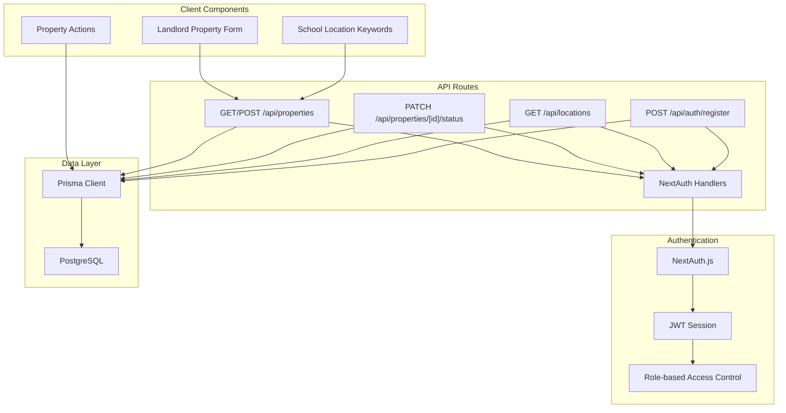
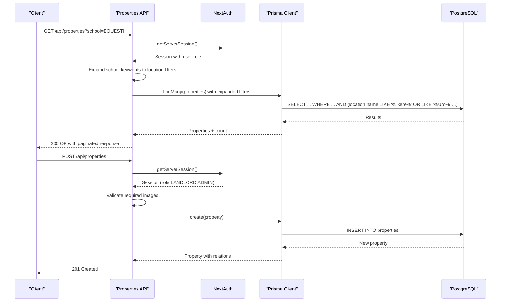
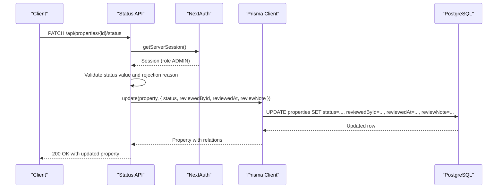
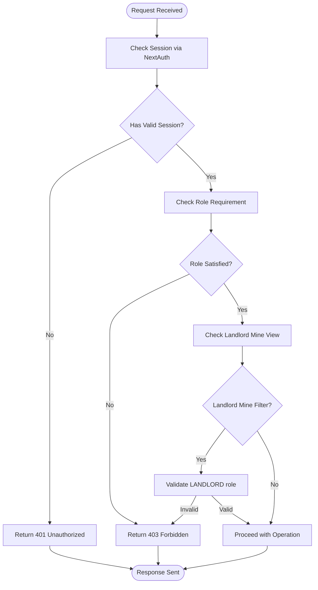
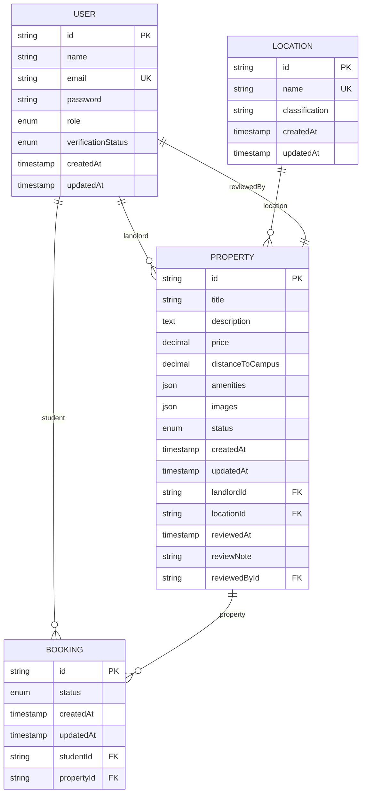
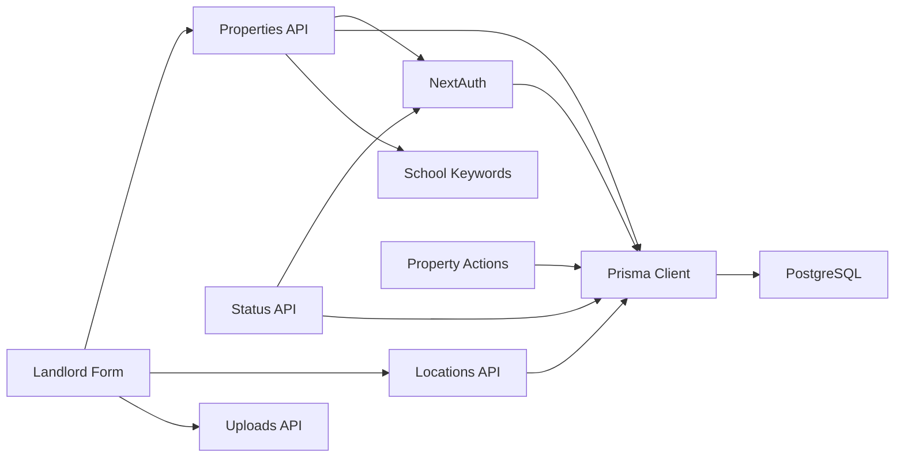

# Property Management API

<cite>
**Referenced Files in This Document**
- [src/app/api/properties/route.ts](file://src/app/api/properties/route.ts)
- [src/app/api/properties/[id]/status/route.ts](file://src/app/api/properties/[id]/status/route.ts)
- [src/lib/auth.ts](file://src/lib/auth.ts)
- [src/types/index.ts](file://src/types/index.ts)
- [prisma/schema.prisma](file://prisma/schema.prisma)
- [src/middleware.ts](file://src/middleware.ts)
- [src/app/api/locations/route.ts](file://src/app/api/locations/route.ts)
- [src/lib/utils.ts](file://src/lib/utils.ts)
- [src/app/api/auth/[...nextauth]/route.ts](file://src/app/api/auth/[...nextauth]/route.ts)
- [src/app/api/auth/register/route.ts](file://src/app/api/auth/register/route.ts)
- [src/actions/property.actions.ts](file://src/actions/property.actions.ts)
- [src/app/(dashboards)/landlord/add-property/AddPropertyForm.tsx](file://src/app/(dashboards)/landlord/add-property/AddPropertyForm.tsx)
- [src/app/(dashboards)/landlord/add-property/page.tsx](file://src/app/(dashboards)/landlord/add-property/page.tsx)
- [src/lib/schools.ts](file://src/lib/schools.ts)
</cite>

## Update Summary
**Changes Made**
- Updated property listing endpoint to support school-based filtering with location keyword expansion
- Enhanced property creation validation with required image requirement
- Added comprehensive property status management with rejection reasons
- Expanded property search capabilities with mine view for landlords
- Improved pagination and sorting options
- Added property actions for server-side operations
- Integrated landlord dashboard property submission form

## Table of Contents
1. [Introduction](#introduction)
2. [Project Structure](#project-structure)
3. [Core Components](#core-components)
4. [Architecture Overview](#architecture-overview)
5. [Detailed Component Analysis](#detailed-component-analysis)
6. [Dependency Analysis](#dependency-analysis)
7. [Performance Considerations](#performance-considerations)
8. [Troubleshooting Guide](#troubleshooting-guide)
9. [Conclusion](#conclusion)

## Introduction
This document provides comprehensive API documentation for the Property Management endpoints in the RentalHub BOUESTI platform. It covers property listing and creation, property status management, request/response schemas, validation rules, role-based access controls, property image handling, geographic data requirements, search functionality, pagination, sorting, and integration with location services. The system now includes enhanced filtering capabilities with school-based location keywords and comprehensive property management workflows.

## Project Structure
The Property Management API is implemented as Next.js App Router API routes under `src/app/api/`. Authentication is handled via NextAuth.js with JWT sessions, and data persistence uses Prisma ORM against a PostgreSQL database. The system includes both server-side API routes and client-side property submission forms.

**Diagram sources**
- [src/app/api/properties/route.ts:1-162](file://src/app/api/properties/route.ts#L1-L162)
- [src/app/api/properties/[id]/status/route.ts:1-69](file://src/app/api/properties/[id]/status/route.ts#L1-L69)
- [src/app/api/locations/route.ts:1-29](file://src/app/api/locations/route.ts#L1-L29)
- [src/lib/auth.ts:1-119](file://src/lib/auth.ts#L1-L119)
- [prisma/schema.prisma:1-136](file://prisma/schema.prisma#L1-L136)
- [src/app/(dashboards)/landlord/add-property/AddPropertyForm.tsx:1-876](file://src/app/(dashboards)/landlord/add-property/AddPropertyForm.tsx#L1-L876)
- [src/actions/property.actions.ts:1-270](file://src/actions/property.actions.ts#L1-L270)
- [src/lib/schools.ts:1-31](file://src/lib/schools.ts#L1-L31)

**Section sources**
- [src/app/api/properties/route.ts:1-162](file://src/app/api/properties/route.ts#L1-L162)
- [src/app/api/properties/[id]/status/route.ts:1-69](file://src/app/api/properties/[id]/status/route.ts#L1-L69)
- [src/lib/auth.ts:1-119](file://src/lib/auth.ts#L1-L119)
- [prisma/schema.prisma:1-136](file://prisma/schema.prisma#L1-L136)

## Core Components
- Property Listing and Creation API: Handles property browsing with advanced filtering (including school-based location keywords), pagination, and property creation by landlords with mandatory image requirements.
- Property Status Management API: Allows administrators to approve or reject property listings with detailed rejection reasons and review tracking.
- Authentication and Authorization: NextAuth.js-based session management with role-based access control and middleware protection.
- Location Services: Provides location data for property listings and form population with school-specific location keyword expansion.
- Data Model: Prisma schema defines Property, Location, User, and related enums and relations with comprehensive indexing.
- Property Actions: Server-side utilities for property management operations with automatic page revalidation.
- Landlord Dashboard: Interactive property submission form with multi-step validation and media upload integration.

**Section sources**
- [src/app/api/properties/route.ts:1-162](file://src/app/api/properties/route.ts#L1-L162)
- [src/app/api/properties/[id]/status/route.ts:1-69](file://src/app/api/properties/[id]/status/route.ts#L1-L69)
- [src/lib/auth.ts:1-119](file://src/lib/auth.ts#L1-L119)
- [prisma/schema.prisma:79-108](file://prisma/schema.prisma#L79-L108)
- [src/actions/property.actions.ts:1-270](file://src/actions/property.actions.ts#L1-L270)
- [src/app/(dashboards)/landlord/add-property/AddPropertyForm.tsx:1-876](file://src/app/(dashboards)/landlord/add-property/AddPropertyForm.tsx#L1-L876)

## Architecture Overview
The Property Management API follows a layered architecture with enhanced filtering capabilities and comprehensive property management workflows:
- Presentation Layer: Next.js App Router API routes handle HTTP requests and responses with advanced filtering.
- Application Layer: Business logic for property listing, creation, status updates, and server-side actions.
- Domain Layer: Prisma models and enums define the data structures and constraints with comprehensive indexing.
- Infrastructure Layer: NextAuth.js manages authentication and authorization, while Prisma connects to PostgreSQL.
- Client Integration: Landlord dashboard provides interactive property submission with real-time validation.

**Diagram sources**
- [src/app/api/properties/route.ts:15-93](file://src/app/api/properties/route.ts#L15-L93)
- [src/lib/auth.ts:14-90](file://src/lib/auth.ts#L14-L90)
- [prisma/schema.prisma:79-108](file://prisma/schema.prisma#L79-L108)
- [src/lib/schools.ts:19-30](file://src/lib/schools.ts#L19-L30)

## Detailed Component Analysis

### Property Listing and Creation Endpoint
- Endpoint: `/api/properties`
- Methods:
  - GET: List and search properties with advanced filtering, pagination, and sorting.
  - POST: Create a new property listing (landlords only) with mandatory image requirements.

#### GET /api/properties
- Purpose: Retrieve properties with advanced filtering capabilities including school-based location expansion.
- Query Parameters:
  - `location`: Text filter for property location name (case-insensitive substring match).
  - `school`: University/college name for location keyword expansion (e.g., "BOUESTI").
  - `mine`: Boolean flag to filter landlord's own properties (requires LANDLORD role).
  - `status`: Property status filter (default: APPROVED, ADMIN can filter by any status).
  - `minPrice`: Minimum monthly rent filter.
  - `maxPrice`: Maximum monthly rent filter.
  - `page`: Page number (minimum 1).
  - `pageSize`: Items per page (bounded between 1 and 50).
  - `sortBy`: Sort field (price, createdAt, distanceToCampus).
  - `sortOrder`: Sort direction (asc, desc).
- Advanced Filtering Features:
  - School-based location expansion using predefined keywords for each institution.
  - Landlord-specific filtering with `mine=true` parameter.
  - Combined location filters supporting both direct location names and school keywords.
- Response:
  - `success`: Boolean indicating operation outcome.
  - `data.items`: Array of properties with included relations (landlord, location, booking count).
  - `data.total`: Total number of matching properties.
  - `data.page`: Current page.
  - `data.pageSize`: Items per page.
  - `data.totalPages`: Total pages computed from total and pageSize.
- Validation Rules:
  - Filters are sanitized and bounded (e.g., pageSize clamped to 1–50).
  - Default status is APPROVED for public browsing, ADMIN can override.
  - School parameter expands to multiple location keywords automatically.
- Error Handling:
  - Returns 500 on internal errors with a generic failure message.

#### POST /api/properties
- Purpose: Create a new property listing with mandatory image requirements.
- Authentication:
  - Requires a valid session.
  - Only users with role LANDLORD or ADMIN can create properties.
- Request Body Fields:
  - `title`: Required string (trimmed).
  - `description`: Required string (trimmed).
  - `price`: Required numeric value (monthly rent).
  - `locationId`: Required unique identifier of a Location.
  - `distanceToCampus`: Optional numeric value (kilometres).
  - `amenities`: Optional array of strings (JSON array).
  - `images`: Required array of at least one image URL (JSON array).
- Validation Rules:
  - Required fields must be present and non-empty.
  - At least one image is mandatory for property submission.
  - Location must exist in the database.
  - Price must be a positive number.
  - Distance to campus is optional and stored as nullable decimal.
  - Amenities and images are stored as JSON arrays.
- Behavior:
  - Creates property with status set to PENDING.
  - Returns 201 Created with the created property and success message.
- Error Handling:
  - Returns 400 for invalid inputs, missing required fields, or missing images.
  - Returns 401 if not authenticated.
  - Returns 403 if user role is not LANDLORD or ADMIN.
  - Returns 500 on internal errors.

**Section sources**
- [src/app/api/properties/route.ts:15-93](file://src/app/api/properties/route.ts#L15-L93)
- [src/app/api/properties/route.ts:97-161](file://src/app/api/properties/route.ts#L97-L161)
- [prisma/schema.prisma:79-108](file://prisma/schema.prisma#L79-L108)
- [src/types/index.ts:60-71](file://src/types/index.ts#L60-L71)
- [src/types/index.ts:96-104](file://src/types/index.ts#L96-L104)

### Property Status Management Endpoint
- Endpoint: `/api/properties/[id]/status`
- Method: PATCH
- Purpose: Update property status (APPROVED, REJECTED, PENDING) with detailed review tracking.
- Authentication:
  - Requires a valid session.
  - Only users with role ADMIN can update property status.
- Path Parameter:
  - `id`: Unique identifier of the property to update.
- Request Body:
  - `status`: Must be one of APPROVED, REJECTED, or PENDING.
  - `reason`: Optional rejection reason (required when status is REJECTED).
- Enhanced Features:
  - Automatic reviewer tracking (reviewedById, reviewedAt).
  - Detailed review notes storage (reviewNote).
  - Comprehensive status validation with rejection reason enforcement.
- Behavior:
  - Updates the property status and returns the updated property with included relations (landlord contact, reviewer, location).
  - Returns 200 OK with success message reflecting the action performed.
- Error Handling:
  - Returns 400 for invalid status values or missing rejection reasons.
  - Returns 401 if not authenticated.
  - Returns 403 if user role is not ADMIN.
  - Returns 500 on internal errors.

**Diagram sources**
- [src/app/api/properties/[id]/status/route.ts:17-68](file://src/app/api/properties/[id]/status/route.ts#L17-L68)
- [src/lib/auth.ts:14-90](file://src/lib/auth.ts#L14-L90)
- [prisma/schema.prisma:79-108](file://prisma/schema.prisma#L79-L108)

**Section sources**
- [src/app/api/properties/[id]/status/route.ts:17-68](file://src/app/api/properties/[id]/status/route.ts#L17-L68)
- [prisma/schema.prisma:29-33](file://prisma/schema.prisma#L29-L33)

### Property Actions and Server-Side Operations
- Purpose: Provide server-side utilities for property management with automatic page revalidation.
- Functions:
  - `getApprovedProperties`: Fetch approved properties with location and landlord data.
  - `createProperty`: Create new property listings with comprehensive validation.
  - `updatePropertyStatus`: Update property status with admin verification.
  - `getLandlordProperties`: Fetch properties owned by specific landlord.
  - `getPendingProperties`: Fetch all pending properties for admin review.
- Enhanced Features:
  - Automatic Next.js cache revalidation for relevant pages.
  - Comprehensive error handling and validation.
  - Support for complex property data structures with relations.
- Integration:
  - Used by both API routes and client-side components.
  - Provides consistent data access patterns across the application.

**Section sources**
- [src/actions/property.actions.ts:39-74](file://src/actions/property.actions.ts#L39-L74)
- [src/actions/property.actions.ts:82-147](file://src/actions/property.actions.ts#L82-L147)
- [src/actions/property.actions.ts:155-198](file://src/actions/property.actions.ts#L155-L198)
- [src/actions/property.actions.ts:205-231](file://src/actions/property.actions.ts#L205-L231)
- [src/actions/property.actions.ts:237-269](file://src/actions/property.actions.ts#L237-L269)

### Landlord Dashboard Property Submission
- Purpose: Provide interactive property submission form with multi-step validation.
- Features:
  - Multi-step wizard with progress indicators.
  - Real-time form validation using Zod schema.
  - Media upload integration with automatic file processing.
  - Comprehensive property details collection (core info, location, finances, media).
  - Automatic property creation through API integration.
- Form Sections:
  - Step 1: Core Details (title, type, units, gender preference).
  - Step 2: Location & Amenities (university targeting, environment, distance, amenities).
  - Step 3: Financials (rent, fees, charges).
  - Step 4: Media & Verification (photos, video, documents).
- Integration:
  - Connects to `/api/locations` for location data.
  - Uses `/api/uploads` for media processing.
  - Submits to `/api/properties` for property creation.
  - Provides real-time feedback and error handling.

**Section sources**
- [src/app/(dashboards)/landlord/add-property/AddPropertyForm.tsx:129-342](file://src/app/(dashboards)/landlord/add-property/AddPropertyForm.tsx#L129-L342)
- [src/app/(dashboards)/landlord/add-property/page.tsx:1-6](file://src/app/(dashboards)/landlord/add-property/page.tsx#L1-L6)

### Authentication and Authorization
- NextAuth.js Configuration:
  - Credentials provider with bcrypt password hashing.
  - JWT-based session strategy with 30-day max age and 24-hour update age.
  - Session augmentation includes user id, role, and verification status.
- Role-Based Access Control:
  - Middleware enforces role-based routing for admin, landlord, and student dashboards.
  - Property APIs enforce role checks for creation and status updates.
  - Enhanced access control for landlord-specific property filtering.
- User Registration:
  - Supports registration for STUDENT and LANDLORD roles.
  - Passwords are hashed using bcrypt.
  - Email uniqueness is enforced.

**Diagram sources**
- [src/lib/auth.ts:14-90](file://src/lib/auth.ts#L14-L90)
- [src/middleware.ts:11-38](file://src/middleware.ts#L11-L38)
- [src/app/api/properties/route.ts:17-20](file://src/app/api/properties/route.ts#L17-L20)
- [src/app/api/properties/route.ts:105-107](file://src/app/api/properties/route.ts#L105-L107)
- [src/app/api/properties/[id]/status/route.ts:22-28](file://src/app/api/properties/[id]/status/route.ts#L22-L28)

**Section sources**
- [src/lib/auth.ts:14-90](file://src/lib/auth.ts#L14-L90)
- [src/middleware.ts:11-38](file://src/middleware.ts#L11-L38)
- [src/app/api/auth/register/route.ts:20-90](file://src/app/api/auth/register/route.ts#L20-L90)

### Location Services and School Integration
- Endpoint: `/api/locations`
- Purpose: Retrieve all locations ordered by classification and name.
- Enhanced Features:
  - School-based location keyword expansion for improved search.
  - Comprehensive location data for property form population.
  - Support for university-specific location targeting.
- Usage: Populates dropdowns in the property listing form and supports school-based filtering.
- Response: Array of locations with id, name, and classification.
- School Integration:
  - Predefined location keywords for major Nigerian universities.
  - Automatic location expansion when school parameter is used in property searches.

**Section sources**
- [src/app/api/locations/route.ts:11-28](file://src/app/api/locations/route.ts#L11-L28)
- [prisma/schema.prisma:64-77](file://prisma/schema.prisma#L64-L77)
- [src/lib/schools.ts:19-30](file://src/lib/schools.ts#L19-L30)

### Data Models and Schemas
- Property Model:
  - Fields: id, title, description, price, distanceToCampus, amenities (JSON), images (JSON), status, timestamps.
  - Relations: belongs to User (landlord) and Location.
  - Enhanced Fields: reviewedAt, reviewNote, reviewedById for status management tracking.
  - Indexes: on landlordId, locationId, status, price, reviewedById.
- Location Model:
  - Fields: id, name (unique), classification, timestamps.
  - Relations: has many Properties.
- Enums:
  - Role: STUDENT, LANDLORD, ADMIN.
  - VerificationStatus: UNVERIFIED, VERIFIED, SUSPENDED.
  - PropertyStatus: PENDING, APPROVED, REJECTED.
  - BookingStatus: PENDING, CONFIRMED, CANCELLED.

**Diagram sources**
- [prisma/schema.prisma:44-108](file://prisma/schema.prisma#L44-L108)

**Section sources**
- [prisma/schema.prisma:44-108](file://prisma/schema.prisma#L44-L108)

## Dependency Analysis
- API Dependencies:
  - Properties API depends on NextAuth for session management, Prisma for data access, and school keyword expansion.
  - Status API depends on NextAuth for admin validation and Prisma for updates.
  - Locations API depends on Prisma for listing locations.
  - Property Actions depend on Prisma for comprehensive property operations.
- Authentication Dependencies:
  - NextAuth.js integrates with Prisma for user lookup and bcrypt for password comparison.
  - Middleware enforces role-based routing for protected paths.
- Data Dependencies:
  - Property model references User (landlord) and Location with enhanced review tracking.
  - Property status influences visibility and booking eligibility.
  - School keyword expansion enhances location-based property discovery.

**Diagram sources**
- [src/app/api/properties/route.ts:6-11](file://src/app/api/properties/route.ts#L6-L11)
- [src/app/api/properties/[id]/status/route.ts:7-11](file://src/app/api/properties/[id]/status/route.ts#L7-L11)
- [src/app/api/locations/route.ts:8-9](file://src/app/api/locations/route.ts#L8-L9)
- [src/lib/auth.ts:14-53](file://src/lib/auth.ts#L14-L53)
- [src/actions/property.actions.ts:1-6](file://src/actions/property.actions.ts#L1-L6)
- [src/lib/schools.ts:19-30](file://src/lib/schools.ts#L19-L30)

**Section sources**
- [src/app/api/properties/route.ts:6-11](file://src/app/api/properties/route.ts#L6-L11)
- [src/app/api/properties/[id]/status/route.ts:7-11](file://src/app/api/properties/[id]/status/route.ts#L7-L11)
- [src/app/api/locations/route.ts:8-9](file://src/app/api/locations/route.ts#L8-L9)
- [src/lib/auth.ts:14-53](file://src/lib/auth.ts#L14-L53)
- [src/actions/property.actions.ts:1-6](file://src/actions/property.actions.ts#L1-L6)

## Performance Considerations
- Pagination Limits:
  - pageSize is bounded between 1 and 50 to prevent excessive load.
- Database Indexes:
  - Property indexes on status, price, landlordId, locationId, and reviewedById optimize filtering and sorting.
- Query Efficiency:
  - Combined findMany/count queries ensure efficient pagination.
  - School keyword expansion uses optimized LIKE queries with multiple conditions.
- Sorting Options:
  - Sorting by price, createdAt, and distanceToCampus is supported with configurable order.
- Image and Amenity Storage:
  - JSON fields for images and amenities enable flexible storage but require parsing on the client side.
- Cache Integration:
  - Property Actions include automatic Next.js cache revalidation for improved performance.
- Enhanced Filtering:
  - School-based location expansion optimizes property discovery without additional database queries.

## Troubleshooting Guide
- Authentication Issues:
  - Ensure a valid JWT session exists; otherwise, endpoints return 401 Unauthorized.
  - Verify user role matches required access level (LANDLORD for property creation, ADMIN for status updates).
  - Check landlord mine view requires LANDLORD role and proper session handling.
- Validation Errors:
  - Missing or invalid fields trigger 400 Bad Request with specific error messages.
  - Missing images in property creation triggers specific validation error.
  - Invalid locationId or invalid status values are rejected.
  - Rejection status requires reason parameter.
- Database Errors:
  - Internal server errors return 500 with a generic failure message.
  - Check Prisma logs and database connectivity for persistent failures.
- School-Based Filtering:
  - Ensure school parameter matches predefined values in SCHOOL_OPTIONS.
  - Verify location keyword expansion is working correctly.
- Property Actions:
  - Check server-side error handling and cache revalidation.
  - Verify property data structure compatibility with frontend components.

**Section sources**
- [src/app/api/properties/route.ts:105-107](file://src/app/api/properties/route.ts#L105-L107)
- [src/app/api/properties/route.ts:119-124](file://src/app/api/properties/route.ts#L119-L124)
- [src/app/api/properties/[id]/status/route.ts:33-42](file://src/app/api/properties/[id]/status/route.ts#L33-L42)
- [src/lib/auth.ts:22-42](file://src/lib/auth.ts#L22-L42)
- [src/lib/schools.ts:6-17](file://src/lib/schools.ts#L6-L17)

## Conclusion
The Property Management API provides robust functionality for property listing, creation, and status management with strong role-based access control and integrated authentication. The API supports advanced search and filtering including school-based location keywords, comprehensive pagination, and sorting options. Enhanced property status management includes detailed review tracking and rejection reason requirements. The system leverages Prisma for efficient data operations, NextAuth for secure session management, and includes comprehensive property actions for server-side operations. The modular design with landlord dashboard integration and multi-step property submission form facilitates maintainability, extensibility, and excellent user experience.