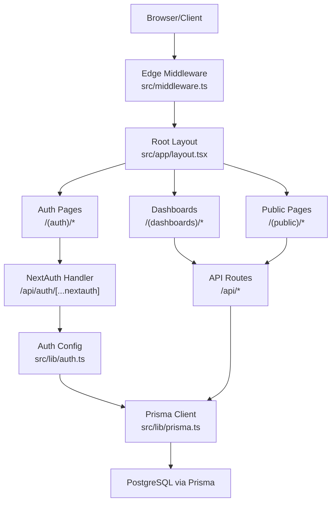
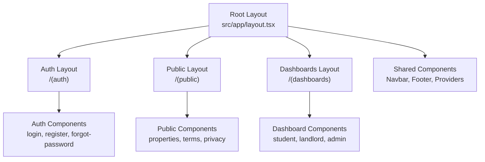
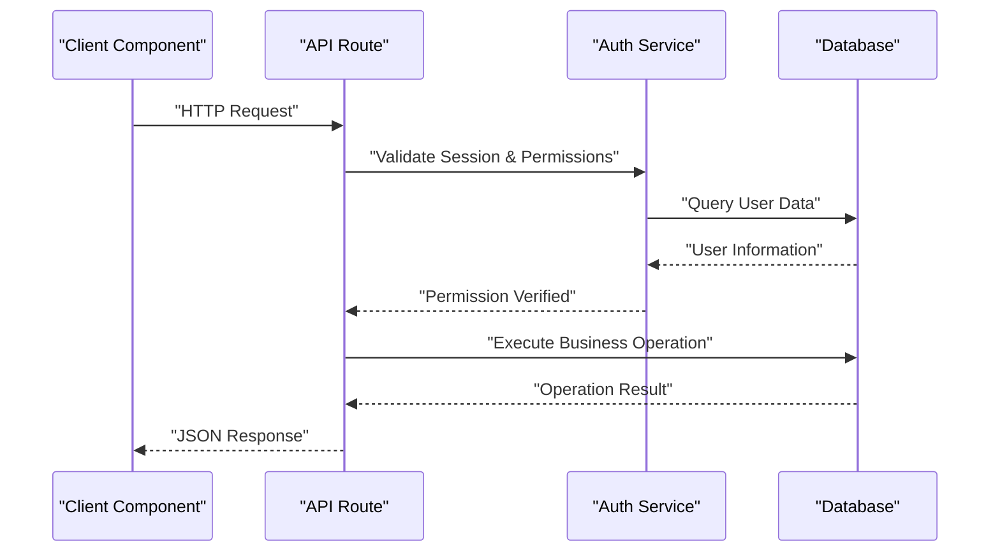
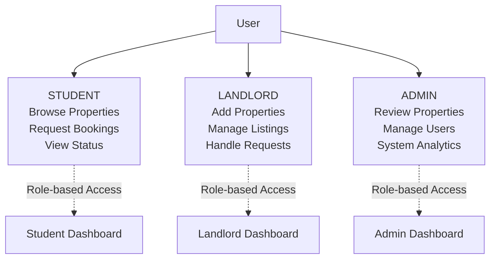
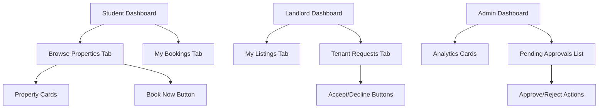
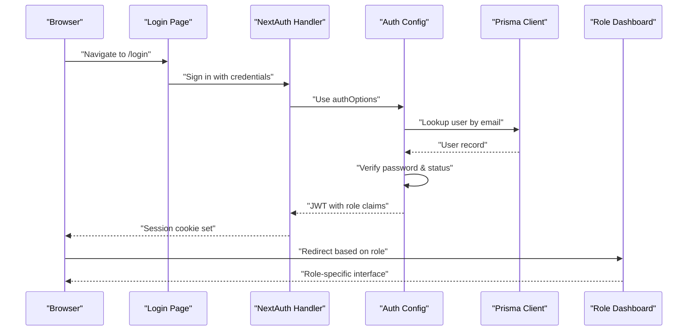
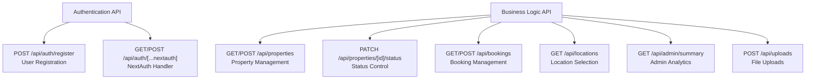
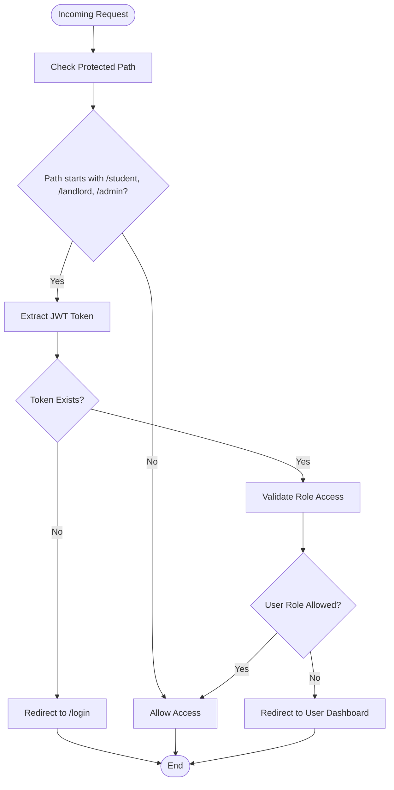
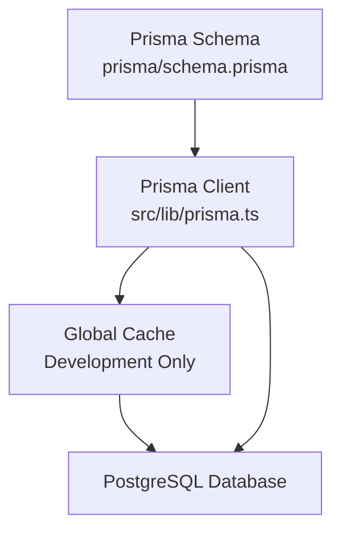

# Architecture Overview

<cite>
**Referenced Files in This Document**
- [package.json](file://package.json)
- [src/middleware.ts](file://src/middleware.ts)
- [src/lib/prisma.ts](file://src/lib/prisma.ts)
- [src/lib/auth.ts](file://src/lib/auth.ts)
- [src/app/layout.tsx](file://src/app/layout.tsx)
- [src/app/(auth)/login/page.tsx](file://src/app/(auth)/login/page.tsx)
- [src/app/(auth)/register/page.tsx](file://src/app/(auth)/register/page.tsx)
- [src/app/(dashboards)/admin/page.tsx](file://src/app/(dashboards)/admin/page.tsx)
- [src/app/(dashboards)/landlord/page.tsx](file://src/app/(dashboards)/landlord/page.tsx)
- [src/app/(dashboards)/student/page.tsx](file://src/app/(dashboards)/student/page.tsx)
- [src/app/api/admin/summary/route.ts](file://src/app/api/admin/summary/route.ts)
- [src/app/api/auth/[...nextauth]/route.ts](file://src/app/api/auth/[...nextauth]/route.ts)
- [src/app/api/auth/register/route.ts](file://src/app/api/auth/register/route.ts)
- [src/app/api/bookings/route.ts](file://src/app/api/bookings/route.ts)
- [src/app/api/locations/route.ts](file://src/app/api/locations/route.ts)
- [src/app/api/properties/route.ts](file://src/app/api/properties/route.ts)
- [src/app/api/properties/[id]/status/route.ts](file://src/app/api/properties/[id]/status/route.ts)
- [src/app/api/uploads/route.ts](file://src/app/api/uploads/route.ts)
- [src/types/index.ts](file://src/types/index.ts)
- [prisma/schema.prisma](file://prisma/schema.prisma)
</cite>

## Update Summary
**Changes Made**
- Updated to reflect the new Next.js App Router architecture with file-based routing structure
- Added comprehensive multi-role system documentation (STUDENT, LANDLORD, ADMIN)
- Documented the new dashboard-based routing system with protected routes
- Enhanced authentication flow with role-based redirection
- Updated API route structure and middleware configuration
- Added new dashboard components and their interactions

## Table of Contents
1. [Introduction](#introduction)
2. [Project Structure](#project-structure)
3. [Core Components](#core-components)
4. [Architecture Overview](#architecture-overview)
5. [Detailed Component Analysis](#detailed-component-analysis)
6. [Multi-Role System](#multi-role-system)
7. [Dashboard Architecture](#dashboard-architecture)
8. [Authentication and Authorization Flow](#authentication-and-authorization-flow)
9. [API Route Structure](#api-route-structure)
10. [Middleware Implementation](#middleware-implementation)
11. [Data Access Layer](#data-access-layer)
12. [Security Considerations](#security-considerations)
13. [Performance Considerations](#performance-considerations)
14. [Troubleshooting Guide](#troubleshooting-guide)
15. [Conclusion](#conclusion)
16. [Appendices](#appendices)

## Introduction
This document describes the architecture of RentalHub-BOUESTI, a Next.js application implementing a modern layered architecture with presentation, business logic, data access, and infrastructure layers. The application follows the Next.js App Router pattern with file-based routing, implements a comprehensive multi-role system (STUDENT, LANDLORD, ADMIN), and utilizes edge runtime middleware for enhanced security and performance.

The system emphasizes role-based access control, JWT-based authentication, and a clean separation of concerns through dedicated dashboard components, API routes, and shared utilities.

## Project Structure
The project follows Next.js App Router conventions with a sophisticated file-based routing system organized by feature and role:

```mermaid
graph TB
subgraph "App Router Structure"
AUTH_LAYOUT["/(auth) Layout"]
PUBLIC_LAYOUT["/(public) Layout"]
DASHBOARDS_LAYOUT["/(dashboards) Layout"]
end
subgraph "Authentication Routes"
LOGIN_PAGE["/(auth)/login/page.tsx"]
REGISTER_PAGE["/(auth)/register/page.tsx"]
FORGOT_PASSWORD["/(auth)/forgot-password/page.tsx"]
end
subgraph "Public Routes"
PRIVACY_PAGE["/(public)/privacy/page.tsx"]
TERMS_PAGE["/(public)/terms/page.tsx"]
PROPERTIES_PAGE["/(public)/properties/page.tsx"]
PROPERTY_DETAIL["/(public)/properties/[id]/page.tsx"]
end
subgraph "Dashboard Routes"
STUDENT_DASHBOARD["/(dashboards)/student/page.tsx"]
LANDLORD_DASHBOARD["/(dashboards)/landlord/page.tsx"]
ADMIN_DASHBOARD["/(dashboards)/admin/page.tsx"]
ADD_PROPERTY["/(dashboards)/landlord/add-property/page.tsx"]
PROPERTY_REVIEW["/(dashboards)/admin/properties/[id]/page.tsx"]
end
subgraph "API Routes"
AUTH_API["/api/auth/*"]
ADMIN_API["/api/admin/*"]
BOOKINGS_API["/api/bookings"]
LOCATIONS_API["/api/locations"]
PROPERTIES_API["/api/properties/*"]
UPLOADS_API["/api/uploads"]
end
subgraph "Shared Infrastructure"
ROOT_LAYOUT["app/layout.tsx"]
MIDDLEWARE["middleware.ts"]
PRISMA_LIB["lib/prisma.ts"]
AUTH_CONFIG["lib/auth.ts"]
TYPES["types/index.ts"]
end
AUTH_LAYOUT --> LOGIN_PAGE
AUTH_LAYOUT --> REGISTER_PAGE
PUBLIC_LAYOUT --> PRIVACY_PAGE
PUBLIC_LAYOUT --> TERMS_PAGE
PUBLIC_LAYOUT --> PROPERTIES_PAGE
PUBLIC_LAYOUT --> PROPERTY_DETAIL
DASHBOARDS_LAYOUT --> STUDENT_DASHBOARD
DASHBOARDS_LAYOUT --> LANDLORD_DASHBOARD
DASHBOARDS_LAYOUT --> ADMIN_DASHBOARD
DASHBOARDS_LAYOUT --> ADD_PROPERTY
DASHBOARDS_LAYOUT --> PROPERTY_REVIEW
LOGIN_PAGE --> AUTH_API
REGISTER_PAGE --> AUTH_API
STUDENT_DASHBOARD --> BOOKINGS_API
STUDENT_DASHBOARD --> PROPERTIES_API
LANDLORD_DASHBOARD --> PROPERTIES_API
LANDLORD_DASHBOARD --> BOOKINGS_API
ADMIN_DASHBOARD --> ADMIN_API
ADMIN_DASHBOARD --> PROPERTIES_API
AUTH_API --> AUTH_CONFIG
AUTH_API --> PRISMA_LIB
PROPERTIES_API --> PRISMA_LIB
BOOKINGS_API --> PRISMA_LIB
LOCATIONS_API --> PRISMA_LIB
UPLOADS_API --> PRISMA_LIB
ROOT_LAYOUT --> DASHBOARDS_LAYOUT
ROOT_LAYOUT --> PUBLIC_LAYOUT
ROOT_LAYOUT --> AUTH_LAYOUT
```

**Diagram sources**
- [src/app/layout.tsx:1-28](file://src/app/layout.tsx#L1-L28)
- [src/app/(auth)/login/page.tsx:1-206](file://src/app/(auth)/login/page.tsx#L1-L206)
- [src/app/(auth)/register/page.tsx:1-244](file://src/app/(auth)/register/page.tsx#L1-L244)
- [src/app/(dashboards)/admin/page.tsx:1-247](file://src/app/(dashboards)/admin/page.tsx#L1-L247)
- [src/app/(dashboards)/landlord/page.tsx:1-296](file://src/app/(dashboards)/landlord/page.tsx#L1-L296)
- [src/app/(dashboards)/student/page.tsx:1-303](file://src/app/(dashboards)/student/page.tsx#L1-L303)

**Section sources**
- [src/app/layout.tsx:1-28](file://src/app/layout.tsx#L1-L28)
- [src/middleware.ts:1-76](file://src/middleware.ts#L1-L76)
- [src/lib/prisma.ts:1-27](file://src/lib/prisma.ts#L1-L27)
- [src/lib/auth.ts:1-119](file://src/lib/auth.ts#L1-L119)

## Core Components
The system consists of several interconnected components working together to provide a comprehensive rental management solution:

- **Multi-Role Authentication System**: Implements STUDENT, LANDLORD, and ADMIN roles with JWT-based sessions
- **Edge Runtime Middleware**: Enforces authentication and role-based access control at the edge
- **Dashboard Architecture**: Role-specific interfaces with dedicated components and workflows
- **File-Based Routing**: Next.js App Router with structured folder organization by feature and role
- **Singleton Prisma Client**: Optimized database access with development caching
- **Comprehensive API Layer**: RESTful endpoints for all business operations
- **Protected Route System**: Automatic redirection based on user roles and permissions

**Section sources**
- [src/middleware.ts:1-76](file://src/middleware.ts#L1-L76)
- [src/lib/auth.ts:1-119](file://src/lib/auth.ts#L1-L119)
- [src/lib/prisma.ts:1-27](file://src/lib/prisma.ts#L1-L27)
- [src/app/(auth)/login/page.tsx:1-206](file://src/app/(auth)/login/page.tsx#L1-L206)
- [src/app/(dashboards)/admin/page.tsx:1-247](file://src/app/(dashboards)/admin/page.tsx#L1-L247)

## Architecture Overview
RentalHub-BOUESTI employs a modern layered architecture with clear separation of concerns:

**Diagram sources**
- [src/middleware.ts:1-76](file://src/middleware.ts#L1-L76)
- [src/app/layout.tsx:1-28](file://src/app/layout.tsx#L1-L28)
- [src/app/(auth)/login/page.tsx:1-206](file://src/app/(auth)/login/page.tsx#L1-L206)
- [src/app/(dashboards)/student/page.tsx:1-303](file://src/app/(dashboards)/student/page.tsx#L1-L303)
- [src/app/api/auth/[...nextauth]/route.ts:1-7](file://src/app/api/auth/[...nextauth]/route.ts#L1-L7)
- [src/lib/auth.ts:1-119](file://src/lib/auth.ts#L1-L119)
- [src/lib/prisma.ts:1-27](file://src/lib/prisma.ts#L1-L27)

## Detailed Component Analysis

### Presentation Layer Architecture
The presentation layer follows Next.js App Router conventions with role-based routing and component composition:

**Diagram sources**
- [src/app/layout.tsx:1-28](file://src/app/layout.tsx#L1-L28)
- [src/app/(auth)/login/page.tsx:1-206](file://src/app/(auth)/login/page.tsx#L1-L206)
- [src/app/(dashboards)/admin/page.tsx:1-247](file://src/app/(dashboards)/admin/page.tsx#L1-L247)

**Section sources**
- [src/app/layout.tsx:1-28](file://src/app/layout.tsx#L1-L28)
- [src/app/(auth)/login/page.tsx:1-206](file://src/app/(auth)/login/page.tsx#L1-L206)
- [src/app/(dashboards)/landlord/page.tsx:1-296](file://src/app/(dashboards)/landlord/page.tsx#L1-L296)

### Business Logic Layer
The business logic is encapsulated in API routes that handle all domain operations:

**Diagram sources**
- [src/app/api/auth/register/route.ts:1-90](file://src/app/api/auth/register/route.ts#L1-L90)
- [src/app/api/bookings/route.ts:1-109](file://src/app/api/bookings/route.ts#L1-L109)
- [src/app/api/properties/route.ts:1-119](file://src/app/api/properties/route.ts#L1-L119)

**Section sources**
- [src/app/api/auth/register/route.ts:1-90](file://src/app/api/auth/register/route.ts#L1-L90)
- [src/app/api/bookings/route.ts:1-109](file://src/app/api/bookings/route.ts#L1-L109)
- [src/app/api/properties/route.ts:1-119](file://src/app/api/properties/route.ts#L1-L119)

## Multi-Role System
The application implements a comprehensive three-tier role system with distinct permissions and workflows:

**Diagram sources**
- [src/middleware.ts:5-10](file://src/middleware.ts#L5-L10)
- [src/app/(dashboards)/student/page.tsx:1-303](file://src/app/(dashboards)/student/page.tsx#L1-L303)
- [src/app/(dashboards)/landlord/page.tsx:1-296](file://src/app/(dashboards)/landlord/page.tsx#L1-L296)
- [src/app/(dashboards)/admin/page.tsx:1-247](file://src/app/(dashboards)/admin/page.tsx#L1-L247)

**Section sources**
- [src/middleware.ts:1-76](file://src/middleware.ts#L1-L76)
- [src/lib/auth.ts:1-119](file://src/lib/auth.ts#L1-L119)
- [src/app/(dashboards)/student/page.tsx:1-303](file://src/app/(dashboards)/student/page.tsx#L1-L303)

## Dashboard Architecture
Each role has a dedicated dashboard with specific functionality and data visualization:

**Diagram sources**
- [src/app/(dashboards)/student/page.tsx:156-302](file://src/app/(dashboards)/student/page.tsx#L156-L302)
- [src/app/(dashboards)/landlord/page.tsx:126-295](file://src/app/(dashboards)/landlord/page.tsx#L126-L295)
- [src/app/(dashboards)/admin/page.tsx:135-246](file://src/app/(dashboards)/admin/page.tsx#L135-L246)

**Section sources**
- [src/app/(dashboards)/student/page.tsx:1-303](file://src/app/(dashboards)/student/page.tsx#L1-L303)
- [src/app/(dashboards)/landlord/page.tsx:1-296](file://src/app/(dashboards)/landlord/page.tsx#L1-L296)
- [src/app/(dashboards)/admin/page.tsx:1-247](file://src/app/(dashboards)/admin/page.tsx#L1-L247)

## Authentication and Authorization Flow
The system implements a sophisticated authentication flow with role-based redirection and JWT-based sessions:

**Diagram sources**
- [src/app/(auth)/login/page.tsx:19-77](file://src/app/(auth)/login/page.tsx#L19-L77)
- [src/app/api/auth/[...nextauth]/route.ts:1-7](file://src/app/api/auth/[...nextauth]/route.ts#L1-L7)
- [src/lib/auth.ts:53-92](file://src/lib/auth.ts#L53-L92)
- [src/middleware.ts:44-62](file://src/middleware.ts#L44-L62)

**Section sources**
- [src/app/(auth)/login/page.tsx:1-206](file://src/app/(auth)/login/page.tsx#L1-L206)
- [src/app/api/auth/[...nextauth]/route.ts:1-7](file://src/app/api/auth/[...nextauth]/route.ts#L1-L7)
- [src/lib/auth.ts:1-119](file://src/lib/auth.ts#L1-L119)
- [src/middleware.ts:1-76](file://src/middleware.ts#L1-L76)

## API Route Structure
The API layer provides comprehensive endpoints for all business operations with proper authorization:

**Diagram sources**
- [src/app/api/auth/register/route.ts:1-90](file://src/app/api/auth/register/route.ts#L1-L90)
- [src/app/api/auth/[...nextauth]/route.ts:1-7](file://src/app/api/auth/[...nextauth]/route.ts#L1-L7)
- [src/app/api/properties/route.ts:1-119](file://src/app/api/properties/route.ts#L1-L119)
- [src/app/api/properties/[id]/status/route.ts:1-52](file://src/app/api/properties/[id]/status/route.ts#L1-L52)
- [src/app/api/bookings/route.ts:1-109](file://src/app/api/bookings/route.ts#L1-L109)
- [src/app/api/locations/route.ts:1-29](file://src/app/api/locations/route.ts#L1-L29)
- [src/app/api/admin/summary/route.ts](file://src/app/api/admin/summary/route.ts)

**Section sources**
- [src/app/api/auth/register/route.ts:1-90](file://src/app/api/auth/register/route.ts#L1-L90)
- [src/app/api/properties/route.ts:1-119](file://src/app/api/properties/route.ts#L1-L119)
- [src/app/api/bookings/route.ts:1-109](file://src/app/api/bookings/route.ts#L1-L109)

## Middleware Implementation
The edge runtime middleware provides comprehensive route protection and role-based access control:

**Diagram sources**
- [src/middleware.ts:15-66](file://src/middleware.ts#L15-L66)

**Section sources**
- [src/middleware.ts:1-76](file://src/middleware.ts#L1-L76)

## Data Access Layer
The data access layer uses a singleton Prisma client pattern optimized for development and production environments:

**Diagram sources**
- [src/lib/prisma.ts:13-24](file://src/lib/prisma.ts#L13-L24)
- [prisma/schema.prisma:1-130](file://prisma/schema.prisma#L1-L130)

**Section sources**
- [src/lib/prisma.ts:1-27](file://src/lib/prisma.ts#L1-L27)
- [prisma/schema.prisma:1-130](file://prisma/schema.prisma#L1-L130)

## Security Considerations
The system implements multiple layers of security:

- **Edge Runtime Protection**: Middleware runs at the edge for fast authentication checks
- **JWT-Based Sessions**: Stateless authentication with role claims embedded in tokens
- **Role-Based Access Control**: Automatic redirection based on user roles
- **Input Validation**: Comprehensive validation in API routes and client components
- **Password Security**: Bcrypt hashing with salt rounds of 12
- **Session Management**: 30-day JWT session lifetime with automatic expiration

**Section sources**
- [src/middleware.ts:1-76](file://src/middleware.ts#L1-L76)
- [src/lib/auth.ts:1-119](file://src/lib/auth.ts#L1-L119)
- [src/app/api/auth/register/route.ts:25-45](file://src/app/api/auth/register/route.ts#L25-L45)

## Performance Considerations
The architecture includes several performance optimizations:

- **Edge Middleware**: Runs closer to users for faster authentication
- **Singleton Prisma Client**: Prevents connection pool exhaustion during development
- **Cache Control**: Strategic use of cache headers for dashboard data
- **Parallel API Calls**: Concurrent data fetching in dashboard components
- **Pagination**: Efficient property listing with configurable page sizes
- **Conditional Rendering**: Optimized dashboard layouts with tab switching

**Section sources**
- [src/lib/prisma.ts:17-24](file://src/lib/prisma.ts#L17-L24)
- [src/app/(dashboards)/admin/page.tsx:62-65](file://src/app/(dashboards)/admin/page.tsx#L62-L65)
- [src/app/(dashboards)/landlord/page.tsx:59-62](file://src/app/(dashboards)/landlord/page.tsx#L59-L62)

## Troubleshooting Guide
Common issues and their solutions:

- **Authentication Failures**: Verify NEXTAUTH_SECRET environment variable and bcrypt password validation
- **Role-Based Redirect Loops**: Check middleware matcher configuration and token role claims
- **Dashboard Loading Issues**: Ensure API endpoints are accessible and return proper JSON responses
- **Property Status Updates**: Verify admin permissions and property ownership validation
- **Booking Conflicts**: Check for existing active bookings before creating new requests
- **Database Connection Problems**: Monitor Prisma client initialization and connection pooling

**Section sources**
- [src/lib/auth.ts:53-92](file://src/lib/auth.ts#L53-L92)
- [src/middleware.ts:44-62](file://src/middleware.ts#L44-L62)
- [src/app/(dashboards)/admin/page.tsx:107-133](file://src/app/(dashboards)/admin/page.tsx#L107-L133)

## Conclusion
RentalHub-BOUESTI demonstrates a mature Next.js application architecture with comprehensive role-based access control, modern file-based routing, and robust security measures. The multi-layered approach with clear separation of concerns, combined with edge runtime optimization and JWT-based authentication, creates a scalable and maintainable foundation for the rental management platform.

The implementation successfully balances developer experience with production readiness, providing both rapid iteration capabilities and reliable performance through edge computing and optimized database access patterns.

## Appendices

### API Route Reference
- **Authentication**
  - POST /api/auth/register: User registration with STUDENT or LANDLORD roles
  - GET/POST /api/auth/[...nextauth]: NextAuth handler for sign-in/out
- **Properties**
  - GET /api/properties: List/search properties with pagination and filters
  - POST /api/properties: Create property listings (landlords only)
  - PATCH /api/properties/[id]/status: Update property approval status (admin only)
- **Bookings**
  - GET /api/bookings: List user's bookings with role-aware filtering
  - POST /api/bookings: Create booking requests (students only)
  - PATCH /api/bookings: Update booking status (landlords/admins)
- **Locations**
  - GET /api/locations: Fetch location options for property listings
- **Admin**
  - GET /api/admin/summary: Platform analytics and statistics
- **Uploads**
  - POST /api/uploads: File upload handling for property images

**Section sources**
- [src/app/api/auth/register/route.ts:1-90](file://src/app/api/auth/register/route.ts#L1-L90)
- [src/app/api/properties/route.ts:1-119](file://src/app/api/properties/route.ts#L1-L119)
- [src/app/api/bookings/route.ts:1-109](file://src/app/api/bookings/route.ts#L1-L109)
- [src/app/api/locations/route.ts:1-29](file://src/app/api/locations/route.ts#L1-L29)
- [src/app/api/admin/summary/route.ts](file://src/app/api/admin/summary/route.ts)
- [src/app/api/uploads/route.ts](file://src/app/api/uploads/route.ts)

### Role-Based Access Matrix
- **STUDENT**: Browse properties, request bookings, view booking status
- **LANDLORD**: Add properties, manage listings, handle tenant requests
- **ADMIN**: Review properties, manage users, access analytics dashboards

**Section sources**
- [src/middleware.ts:5-10](file://src/middleware.ts#L5-L10)
- [src/app/(dashboards)/student/page.tsx:1-303](file://src/app/(dashboards)/student/page.tsx#L1-L303)
- [src/app/(dashboards)/landlord/page.tsx:1-296](file://src/app/(dashboards)/landlord/page.tsx#L1-L296)
- [src/app/(dashboards)/admin/page.tsx:1-247](file://src/app/(dashboards)/admin/page.tsx#L1-L247)