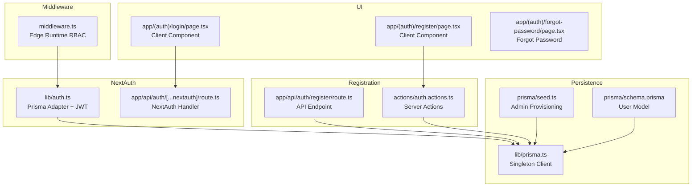
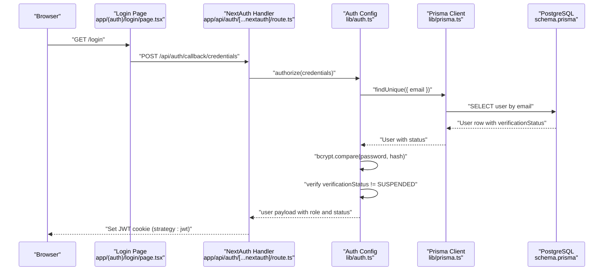
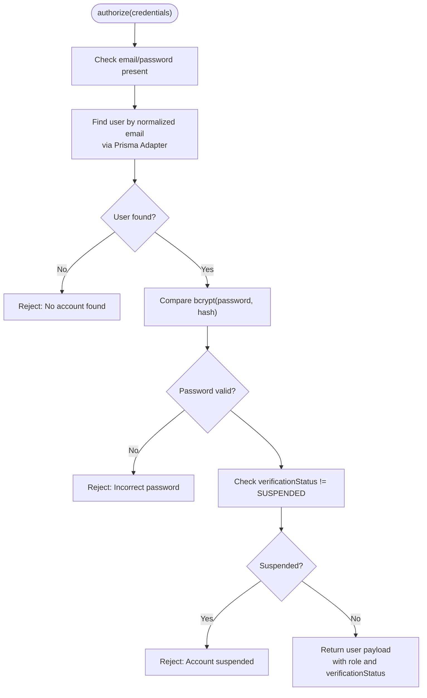
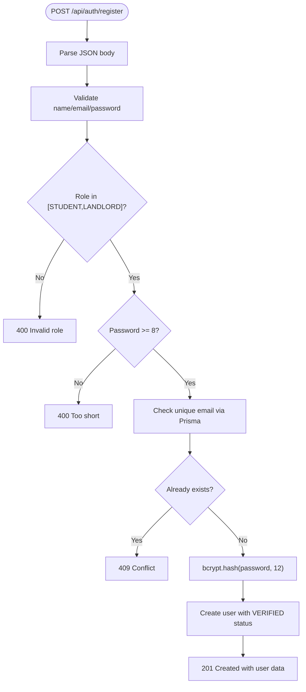
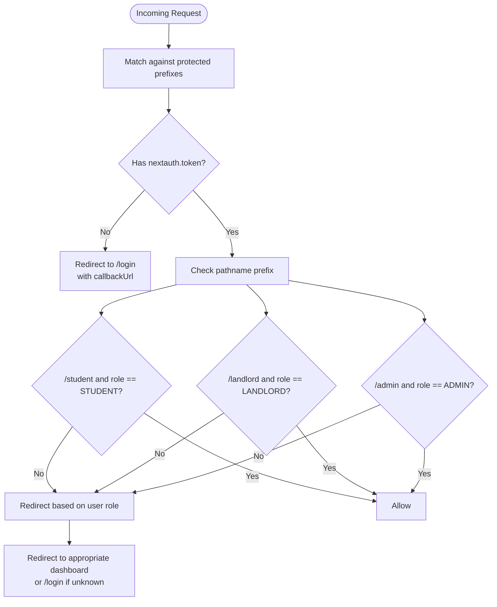
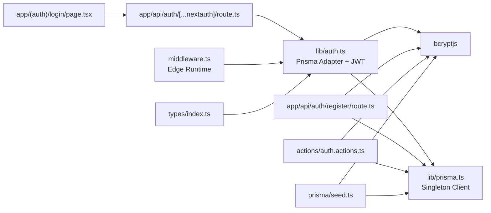

# Authentication & Authorization

<cite>
**Referenced Files in This Document**
- [src/lib/auth.ts](file://src/lib/auth.ts)
- [src/app/api/auth/[...nextauth]/route.ts](file://src/app/api/auth/[...nextauth]/route.ts)
- [src/app/api/auth/register/route.ts](file://src/app/api/auth/register/route.ts)
- [src/middleware.ts](file://src/middleware.ts)
- [src/app/(auth)/login/page.tsx](file://src/app/(auth)/login/page.tsx)
- [src/app/(auth)/register/page.tsx](file://src/app/(auth)/register/page.tsx)
- [src/app/(auth)/forgot-password/page.tsx](file://src/app/(auth)/forgot-password/page.tsx)
- [src/lib/prisma.ts](file://src/lib/prisma.ts)
- [prisma/schema.prisma](file://prisma/schema.prisma)
- [package.json](file://package.json)
- [prisma/seed.ts](file://prisma/seed.ts)
- [src/actions/auth.actions.ts](file://src/actions/auth.actions.ts)
- [src/types/index.ts](file://src/types/index.ts)
</cite>

## Update Summary
**Changes Made**
- Updated NextAuth.js configuration to use Prisma adapter instead of default MongoDB
- Enhanced JWT token management with comprehensive user verification states
- Improved middleware implementation with dynamic role-based access control
- Added server action integration for authentication flows
- Updated registration process with verification status handling
- Enhanced type safety with proper TypeScript module augmentation

## Table of Contents
1. [Introduction](#introduction)
2. [Project Structure](#project-structure)
3. [Core Components](#core-components)
4. [Architecture Overview](#architecture-overview)
5. [Detailed Component Analysis](#detailed-component-analysis)
6. [Dependency Analysis](#dependency-analysis)
7. [Performance Considerations](#performance-considerations)
8. [Troubleshooting Guide](#troubleshooting-guide)
9. [Conclusion](#conclusion)

## Introduction
This document explains the authentication and authorization system for RentalHub-BOUESTI. It covers the NextAuth.js configuration with Prisma adapter, custom credentials provider, JWT token management, session handling, user registration, login/logout flows, role-based access control (RBAC), middleware route protection, and integration with API routes. It also documents security considerations, token lifecycle, and password hashing with bcryptjs.

## Project Structure
Authentication and authorization are implemented across a small set of focused modules:
- NextAuth configuration with Prisma adapter and credentials provider
- API routes for authentication and registration
- Edge middleware for route protection
- UI pages for login and registration with server actions
- Prisma schema and client for user storage
- Seed script for initial admin provisioning
- Server actions for enhanced security and type safety

**Diagram sources**
- [src/lib/auth.ts:36-94](file://src/lib/auth.ts#L36-L94)
- [src/app/api/auth/[...nextauth]/route.ts:1-7](file://src/app/api/auth/[...nextauth]/route.ts#L1-L7)
- [src/app/api/auth/register/route.ts:20-89](file://src/app/api/auth/register/route.ts#L20-L89)
- [src/actions/auth.actions.ts:24-93](file://src/actions/auth.actions.ts#L24-L93)
- [src/middleware.ts:15-66](file://src/middleware.ts#L15-L66)
- [src/app/(auth)/login/page.tsx:8-77](file://src/app/(auth)/login/page.tsx#L8-L77)
- [src/app/(auth)/register/page.tsx:8-70](file://src/app/(auth)/register/page.tsx#L8-L70)
- [src/app/(auth)/forgot-password/page.tsx:3-24](file://src/app/(auth)/forgot-password/page.tsx#L3-L24)
- [src/lib/prisma.ts:13-24](file://src/lib/prisma.ts#L13-L24)
- [prisma/schema.prisma:44-62](file://prisma/schema.prisma#L44-L62)
- [prisma/seed.ts:92-122](file://prisma/seed.ts#L92-L122)

**Section sources**
- [src/lib/auth.ts:36-119](file://src/lib/auth.ts#L36-L119)
- [src/app/api/auth/[...nextauth]/route.ts:1-7](file://src/app/api/auth/[...nextauth]/route.ts#L1-L7)
- [src/app/api/auth/register/route.ts:20-89](file://src/app/api/auth/register/route.ts#L20-L89)
- [src/actions/auth.actions.ts:24-93](file://src/actions/auth.actions.ts#L24-L93)
- [src/middleware.ts:15-76](file://src/middleware.ts#L15-L76)
- [src/app/(auth)/login/page.tsx:8-206](file://src/app/(auth)/login/page.tsx#L8-L206)
- [src/app/(auth)/register/page.tsx:8-244](file://src/app/(auth)/register/page.tsx#L8-L244)
- [src/app/(auth)/forgot-password/page.tsx:3-24](file://src/app/(auth)/forgot-password/page.tsx#L3-L24)
- [src/lib/prisma.ts:13-27](file://src/lib/prisma.ts#L13-L27)
- [prisma/schema.prisma:44-62](file://prisma/schema.prisma#L44-L62)
- [prisma/seed.ts:92-122](file://prisma/seed.ts#L92-L122)

## Core Components
- NextAuth configuration with Prisma adapter, credentials provider, JWT callbacks, and session strategy
- Registration endpoint with validation and bcrypt hashing using server actions
- Edge middleware enforcing RBAC per route prefix with dynamic role checking
- UI forms with enhanced client-side validation and server action integration
- Prisma-backed user model with comprehensive verification states
- Seed script to provision an initial admin user with proper hashing
- TypeScript module augmentation for enhanced type safety

Key implementation references:
- NextAuth options with Prisma adapter: [src/lib/auth.ts:36-94](file://src/lib/auth.ts#L36-L94)
- Credentials provider authorize flow: [src/lib/auth.ts:53-92](file://src/lib/auth.ts#L53-L92)
- JWT/session callbacks: [src/lib/auth.ts:95-112](file://src/lib/auth.ts#L95-L112)
- Server actions for registration: [src/actions/auth.actions.ts:24-93](file://src/actions/auth.actions.ts#L24-L93)
- Middleware RBAC implementation: [src/middleware.ts:15-66](file://src/middleware.ts#L15-L66)
- Protected route matchers: [src/middleware.ts:69-75](file://src/middleware.ts#L69-L75)
- Prisma user model with verification states: [prisma/schema.prisma:44-62](file://prisma/schema.prisma#L44-L62)
- Prisma client singleton: [src/lib/prisma.ts:13-27](file://src/lib/prisma.ts#L13-L27)
- Admin seed with bcrypt hashing: [prisma/seed.ts:92-122](file://prisma/seed.ts#L92-L122)

**Section sources**
- [src/lib/auth.ts:36-119](file://src/lib/auth.ts#L36-L119)
- [src/actions/auth.actions.ts:24-93](file://src/actions/auth.actions.ts#L24-L93)
- [src/middleware.ts:15-76](file://src/middleware.ts#L15-L76)
- [prisma/schema.prisma:44-62](file://prisma/schema.prisma#L44-L62)
- [src/lib/prisma.ts:13-27](file://src/lib/prisma.ts#L13-L27)
- [prisma/seed.ts:92-122](file://prisma/seed.ts#L92-L122)

## Architecture Overview
The authentication system uses NextAuth.js with a Prisma adapter and custom credentials provider. Users submit credentials to the NextAuth callback endpoint, which validates against the database using bcrypt. On successful authentication, a signed JWT is issued and stored in the browser cookie. Subsequent requests include the token, which the middleware reads to enforce RBAC and redirect unauthorized users. The system now includes comprehensive verification states and enhanced type safety.

**Diagram sources**
- [src/app/(auth)/login/page.tsx:19-77](file://src/app/(auth)/login/page.tsx#L19-L77)
- [src/app/api/auth/[...nextauth]/route.ts:1-7](file://src/app/api/auth/[...nextauth]/route.ts#L1-L7)
- [src/lib/auth.ts:53-92](file://src/lib/auth.ts#L53-L92)
- [src/lib/prisma.ts:13-27](file://src/lib/prisma.ts#L13-L27)
- [prisma/schema.prisma:44-62](file://prisma/schema.prisma#L44-L62)

## Detailed Component Analysis

### NextAuth.js Configuration and Prisma Adapter
- **Prisma Adapter**: Uses `@auth/prisma-adapter` for seamless database integration
- **Provider**: Credentials provider with email and password fields
- **authorize**: Validates credentials, fetches user by normalized email, compares bcrypt hashes, rejects suspended accounts, and returns user fields for token population
- **callbacks.jwt**: Populates token with id, role, and verificationStatus when user logs in
- **callbacks.session**: Injects id, role, and verificationStatus into session.user
- **pages.signIn/signOut/error**: Redirects to /login for sign-in/out and error handling
- **session.strategy**: jwt with maxAge 30 days and updateAge 24 hours
- **Type Safety**: Enhanced with TypeScript module augmentation for User, Session, and JWT interfaces

**Diagram sources**
- [src/lib/auth.ts:53-92](file://src/lib/auth.ts#L53-L92)

**Section sources**
- [src/lib/auth.ts:36-119](file://src/lib/auth.ts#L36-L119)

### Session Handling and Token Lifecycle
- **Strategy**: JWT stored in a secure cookie via Prisma adapter
- **Expiry**: maxAge 30 days; updateAge 24 hours refreshes the cookie
- **Pages**: signIn, signOut, error mapped to /login
- **Debugging**: enabled in development
- **Type Safety**: Enhanced with module augmentation for proper typing

Implications:
- Long-lived sessions with periodic renewal
- Stateless JWTs with Prisma adapter for user data
- Token rotation occurs automatically on activity within the updateAge window
- Comprehensive verification state tracking in tokens

**Section sources**
- [src/lib/auth.ts:38-45](file://src/lib/auth.ts#L38-L45)
- [src/lib/auth.ts:95-112](file://src/lib/auth.ts#L95-L112)

### Enhanced User Registration Flow with Server Actions
- **Endpoint**: POST /api/auth/register (API route) and server actions (client-side)
- **Accepts**: name, email, password, optional role (defaults to STUDENT; LANDLORD allowed)
- **Validation**: Required fields, role whitelist, password length >= 8
- **Uniqueness**: Checks email uniqueness via Prisma
- **Persistence**: Hashes password with bcrypt at cost 12, creates user with VERIFIED status
- **Response**: JSON with success flag, created user data, and message; handles 400/409/500 appropriately
- **Server Actions**: Enhanced security with server-side validation and type safety

**Diagram sources**
- [src/app/api/auth/register/route.ts:20-89](file://src/app/api/auth/register/route.ts#L20-L89)
- [src/actions/auth.actions.ts:24-93](file://src/actions/auth.actions.ts#L24-L93)

**Section sources**
- [src/app/api/auth/register/route.ts:20-89](file://src/app/api/auth/register/route.ts#L20-L89)
- [src/actions/auth.actions.ts:24-93](file://src/actions/auth.actions.ts#L24-L93)

### Enhanced Login and Logout UI Integration
- **Login form**: Posts to NextAuth credentials provider callback endpoint with enhanced client-side validation
- **Role Selection**: Allows users to specify their role during login
- **Session Verification**: Fetches current session to verify role matches selection
- **Logout**: Redirects to NextAuth signOut page, which redirects to /login
- **Error Handling**: Comprehensive error messages for invalid credentials and role mismatches

**Section sources**
- [src/app/(auth)/login/page.tsx:19-77](file://src/app/(auth)/login/page.tsx#L19-L77)
- [src/app/api/auth/[...nextauth]/route.ts:1-7](file://src/app/api/auth/[...nextauth]/route.ts#L1-L7)

### Enhanced Role-Based Access Control (RBAC) with Middleware
- **Protected prefixes**: /student, /landlord, /admin enforced by Edge middleware
- **Dynamic Role Checking**: Route-specific role requirements with fallback redirects
- **Token-based Authorization**: Uses next-auth/jwt getToken for edge runtime
- **Protected Path Matching**: Configured with matcher for efficient routing
- **Role-based Redirection**: Redirects unauthorized users to appropriate dashboards

**Diagram sources**
- [src/middleware.ts:15-66](file://src/middleware.ts#L15-L66)

**Section sources**
- [src/middleware.ts:15-76](file://src/middleware.ts#L15-L76)

### Enhanced Password Hashing with bcryptjs
- **Registration endpoint**: Hashes passwords with bcrypt at cost 12
- **NextAuth authorize flow**: Compares submitted password against stored hash
- **Server actions**: Provides additional security layer with server-side validation
- **Seed script**: Demonstrates bcrypt hashing for the admin user with proper cost
- **Type Safety**: Enhanced with proper TypeScript interfaces

**Section sources**
- [src/app/api/auth/register/route.ts:58](file://src/app/api/auth/register/route.ts#L58)
- [src/lib/auth.ts:70-73](file://src/lib/auth.ts#L70-L73)
- [src/actions/auth.actions.ts:55](file://src/actions/auth.actions.ts#L55)
- [prisma/seed.ts:104](file://prisma/seed.ts#L104)

### Integration with API Routes and Server Actions
- **API routes**: Can access current session via getServerSession with authOptions
- **Server Actions**: Provide enhanced security with server-side validation and type safety
- **Client-side Integration**: Forms use server actions for better error handling
- **Type Safety**: Comprehensive TypeScript interfaces for all authentication operations

**Section sources**
- [src/app/api/auth/register/route.ts:20-89](file://src/app/api/auth/register/route.ts#L20-L89)
- [src/actions/auth.actions.ts:24-93](file://src/actions/auth.actions.ts#L24-L93)

### Enhanced Data Model and Types
- **User model**: Includes id, name, email, password (hashed), role, verificationStatus, timestamps
- **Roles**: STUDENT, LANDLORD, ADMIN with comprehensive enum support
- **VerificationStatus**: UNVERIFIED, VERIFIED, SUSPENDED with proper enum mapping
- **Type Safety**: Enhanced module augmentation for User, Session, and JWT interfaces
- **Safe User Types**: Omit password field for client-side usage
- **API Response Types**: Comprehensive interfaces for consistent API responses

**Section sources**
- [prisma/schema.prisma:44-62](file://prisma/schema.prisma#L44-L62)
- [prisma/schema.prisma:17-27](file://prisma/schema.prisma#L17-L27)
- [src/lib/auth.ts:9-34](file://src/lib/auth.ts#L9-L34)
- [src/types/index.ts:23-80](file://src/types/index.ts#L23-L80)

## Dependency Analysis
- NextAuth depends on:
  - Prisma adapter for database integration
  - bcryptjs for password comparison
  - Prisma client for user lookup
  - TypeScript module augmentation for type safety
- Middleware depends on NextAuth token injection and edge runtime
- Registration endpoint depends on Prisma and bcryptjs
- Server actions provide additional security layer
- UI pages depend on NextAuth callback URLs and registration endpoint
- Client components use server actions for enhanced security

**Diagram sources**
- [src/lib/auth.ts:2-6](file://src/lib/auth.ts#L2-L6)
- [src/app/api/auth/[...nextauth]/route.ts:1-2](file://src/app/api/auth/[...nextauth]/route.ts#L1-L2)
- [src/app/api/auth/register/route.ts:8-11](file://src/app/api/auth/register/route.ts#L8-L11)
- [src/actions/auth.actions.ts:3-5](file://src/actions/auth.actions.ts#L3-L5)
- [src/middleware.ts:3](file://src/middleware.ts#L3)
- [prisma/seed.ts:12-13](file://prisma/seed.ts#L12-L13)
- [src/types/index.ts:9-18](file://src/types/index.ts#L9-L18)

**Section sources**
- [package.json:20-31](file://package.json#L20-L31)
- [src/lib/auth.ts:2-6](file://src/lib/auth.ts#L2-L6)
- [src/app/api/auth/[...nextauth]/route.ts:1-2](file://src/app/api/auth/[...nextauth]/route.ts#L1-L2)
- [src/app/api/auth/register/route.ts:8-11](file://src/app/api/auth/register/route.ts#L8-L11)
- [src/actions/auth.actions.ts:3-5](file://src/actions/auth.actions.ts#L3-L5)
- [src/middleware.ts:3](file://src/middleware.ts#L3)
- [prisma/seed.ts:12-13](file://prisma/seed.ts#L12-L13)
- [src/types/index.ts:9-18](file://src/types/index.ts#L9-L18)

## Performance Considerations
- **Prisma Adapter**: Efficient database integration with proper connection pooling
- **JWT Strategy**: Stateless approach eliminates server-side session storage overhead
- **Edge Runtime**: Middleware runs efficiently on edge runtime for faster response times
- **bcrypt Cost**: Cost 12 provides balanced security and performance during registration
- **Connection Management**: Prisma client singleton prevents connection pool exhaustion
- **Type Safety**: Reduces runtime errors and improves development experience
- **Token Size**: Compact JWT with essential user data minimizes bandwidth usage

## Troubleshooting Guide
Common issues and resolutions:
- **Login fails with "incorrect password" or "no account found"**: Verify email normalization and that user exists with valid hash
- **Account suspended**: Ensure verificationStatus is not SUSPENDED in database
- **403/Access Denied**: Confirm user role matches the required prefix; check middleware matchers and token presence
- **Registration conflicts**: Duplicate email detected; ensure uniqueness before attempting registration
- **Role mismatch errors**: User role doesn't match selected role during login; adjust selection or check database
- **Server Action failures**: Check server action permissions and Prisma client configuration
- **Middleware issues**: Verify NEXTAUTH_SECRET environment variable and token configuration
- **Internal errors**: Inspect server logs for stack traces; confirm NEXTAUTH_SECRET and database connectivity

**Section sources**
- [src/lib/auth.ts:65-82](file://src/lib/auth.ts#L65-L82)
- [src/middleware.ts:34-39](file://src/middleware.ts#L34-L39)
- [src/app/api/auth/register/route.ts:50-56](file://src/app/api/auth/register/route.ts#L50-L56)
- [src/app/(auth)/login/page.tsx:31-52](file://src/app/(auth)/login/page.tsx#L31-L52)

## Conclusion
RentalHub-BOUESTI implements a robust, stateless authentication system using NextAuth.js with Prisma adapter, custom credentials provider, bcrypt hashing, and JWT-based sessions. The enhanced middleware enforces role-based access control across protected routes with comprehensive verification states, while the registration endpoint ensures secure user onboarding through server actions. The system now includes improved type safety, enhanced security through server actions, and comprehensive user verification states. Together, these components provide a secure, maintainable, and scalable foundation for user management and access control.