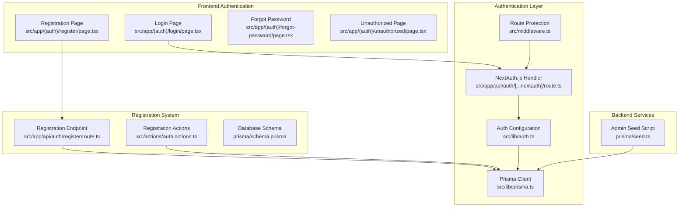
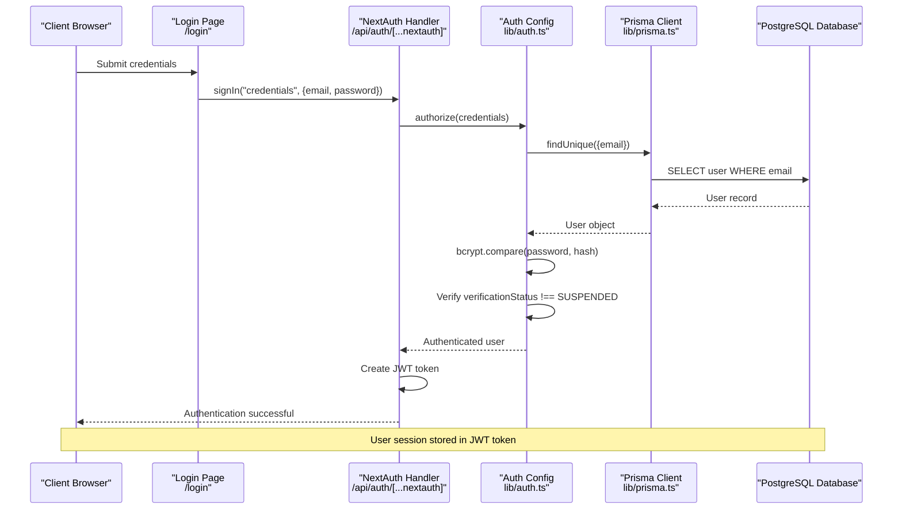
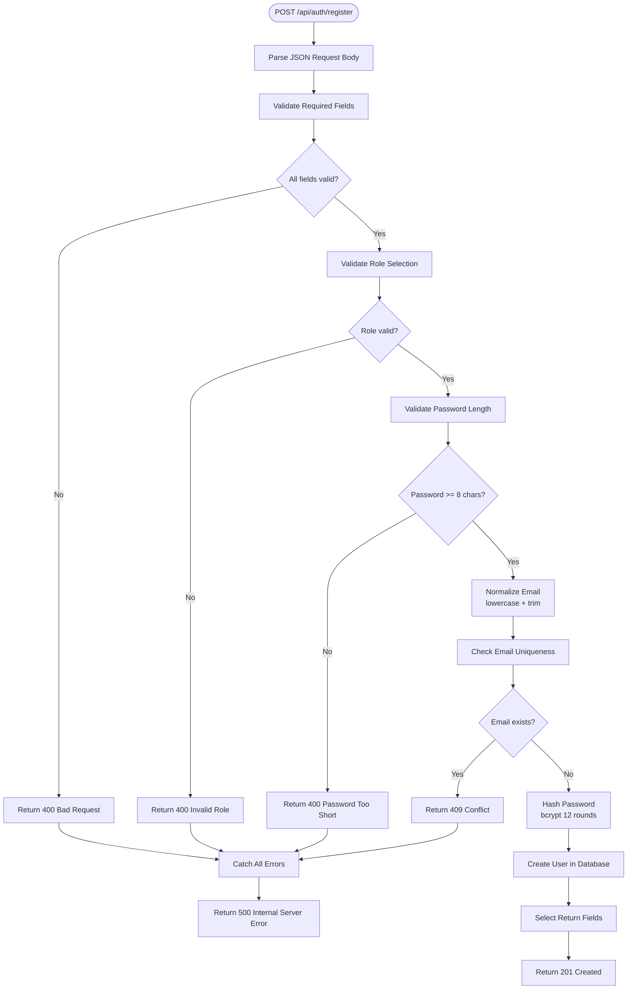
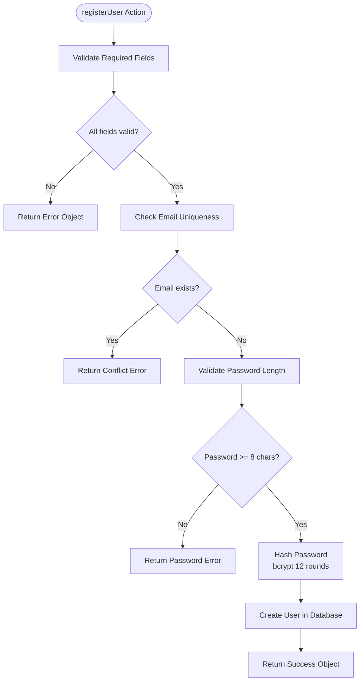
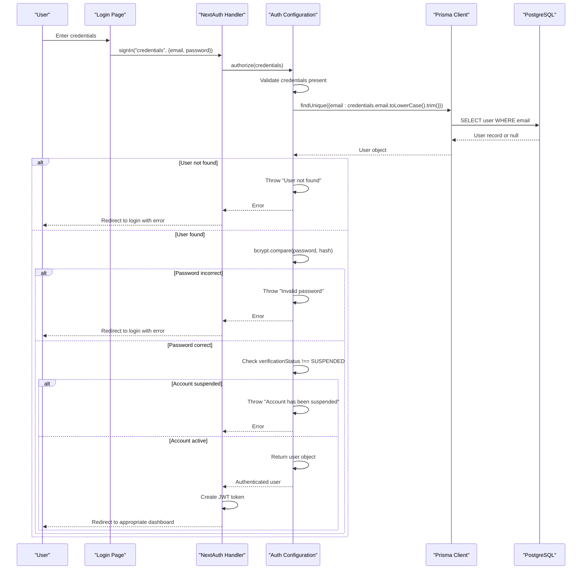
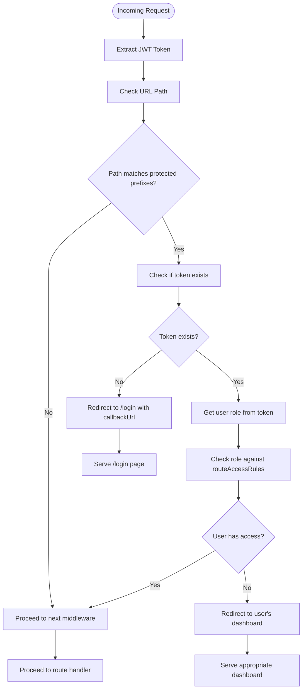

# Authentication Flow & User Registration

<cite>
**Referenced Files in This Document**
- [route.ts](file://src/app/api/auth/[...nextauth]/route.ts)
- [route.ts](file://src/app/api/auth/register/route.ts)
- [auth.ts](file://src/lib/auth.ts)
- [prisma.ts](file://src/lib/prisma.ts)
- [schema.prisma](file://prisma/schema.prisma)
- [page.tsx](file://src/app/(auth)/login/page.tsx)
- [page.tsx](file://src/app/(auth)/register/page.tsx)
- [page.tsx](file://src/app/(auth)/forgot-password/page.tsx)
- [middleware.ts](file://src/middleware.ts)
- [auth.actions.ts](file://src/actions/auth.actions.ts)
- [seed.ts](file://prisma/seed.ts)
- [page.tsx](file://src/app/(auth)/unauthorized/page.tsx)
- [package.json](file://package.json)
</cite>

## Update Summary
**Changes Made**
- Added comprehensive documentation for the new authentication flow including registration, login, forgot password, and user verification processes
- Updated registration API endpoint implementation with improved validation and user creation logic
- Enhanced login/logout flow documentation with client-side NextAuth.js integration
- Added detailed middleware-based route protection system
- Updated database schema documentation with verification status enum
- Integrated frontend authentication pages and actions documentation

## Table of Contents
1. [Introduction](#introduction)
2. [Project Structure](#project-structure)
3. [Core Components](#core-components)
4. [Architecture Overview](#architecture-overview)
5. [Detailed Component Analysis](#detailed-component-analysis)
6. [Dependency Analysis](#dependency-analysis)
7. [Performance Considerations](#performance-considerations)
8. [Troubleshooting Guide](#troubleshooting-guide)
9. [Conclusion](#conclusion)

## Introduction
This document provides comprehensive documentation for the authentication flow and user registration process in RentalHub-BOUESTI. The system implements a modern authentication architecture featuring secure user registration with bcrypt password hashing, role-based access control through NextAuth.js, and comprehensive frontend integration with React components. The authentication system supports three distinct user roles (STUDENT, LANDLORD, ADMIN) with sophisticated verification status management and middleware-based route protection.

## Project Structure
The authentication system is organized across multiple layers with clear separation of concerns:



**Diagram sources**
- [route.ts:1-7](file://src/app/api/auth/[...nextauth]/route.ts#L1-L7)
- [auth.ts:1-119](file://src/lib/auth.ts#L1-L119)
- [prisma.ts:1-27](file://src/lib/prisma.ts#L1-L27)
- [route.ts:1-90](file://src/app/api/auth/register/route.ts#L1-L90)
- [auth.actions.ts:1-208](file://src/actions/auth.actions.ts#L1-L208)
- [schema.prisma:1-136](file://prisma/schema.prisma#L1-L136)
- [page.tsx:1-206](file://src/app/(auth)/login/page.tsx#L1-L206)
- [page.tsx:1-244](file://src/app/(auth)/register/page.tsx#L1-L244)
- [page.tsx:1-25](file://src/app/(auth)/forgot-password/page.tsx#L1-L25)
- [middleware.ts:1-76](file://src/middleware.ts#L1-L76)
- [seed.ts:1-143](file://prisma/seed.ts#L1-L143)

**Section sources**
- [route.ts:1-7](file://src/app/api/auth/[...nextauth]/route.ts#L1-L7)
- [auth.ts:1-119](file://src/lib/auth.ts#L1-L119)
- [prisma.ts:1-27](file://src/lib/prisma.ts#L1-L27)
- [route.ts:1-90](file://src/app/api/auth/register/route.ts#L1-L90)
- [auth.actions.ts:1-208](file://src/actions/auth.actions.ts#L1-L208)
- [schema.prisma:1-136](file://prisma/schema.prisma#L1-L136)
- [page.tsx:1-206](file://src/app/(auth)/login/page.tsx#L1-L206)
- [page.tsx:1-244](file://src/app/(auth)/register/page.tsx#L1-L244)
- [page.tsx:1-25](file://src/app/(auth)/forgot-password/page.tsx#L1-L25)
- [middleware.ts:1-76](file://src/middleware.ts#L1-L76)
- [seed.ts:1-143](file://prisma/seed.ts#L1-L143)

## Core Components
The authentication system consists of five integrated components working together:

### 1. NextAuth.js Configuration
Central authentication configuration defining the Credentials provider, session strategy, and comprehensive security policies with JWT-based session management.

### 2. Registration API and Actions
Dual implementation supporting both REST API endpoints and server actions with comprehensive input validation, password hashing, and database persistence.

### 3. Frontend Authentication Pages
Complete client-side authentication interface with React components for login, registration, and password recovery workflows.

### 4. Login/Logout Flow
Advanced authentication flow through NextAuth.js endpoints with role validation, session management, and error handling strategies.

### 5. Route Protection Middleware
Sophisticated middleware enforcing role-based access control with dynamic route matching and automatic redirection.

**Section sources**
- [auth.ts:36-119](file://src/lib/auth.ts#L36-L119)
- [route.ts:20-90](file://src/app/api/auth/register/route.ts#L20-L90)
- [auth.actions.ts:24-93](file://src/actions/auth.actions.ts#L24-L93)
- [page.tsx:19-77](file://src/app/(auth)/login/page.tsx#L19-L77)
- [middleware.ts:15-66](file://src/middleware.ts#L15-L66)

## Architecture Overview
The authentication architecture implements a comprehensive multi-layered approach with clear separation of concerns:



**Diagram sources**
- [page.tsx:19-38](file://src/app/(auth)/login/page.tsx#L19-L38)
- [route.ts:1-7](file://src/app/api/auth/[...nextauth]/route.ts#L1-L7)
- [auth.ts:53-92](file://src/lib/auth.ts#L53-L92)
- [prisma.ts:13-27](file://src/lib/prisma.ts#L13-L27)

The system implements comprehensive authentication with advanced security measures:

1. **Enhanced Password Security**: bcrypt hashing with 12 rounds of salt generation
2. **Multi-Layer Validation**: Frontend and backend validation with comprehensive error handling
3. **Role-Based Access Control**: Dynamic routing with role-specific dashboard access
4. **Verification Status Management**: Account lifecycle management with UNVERIFIED, VERIFIED, SUSPENDED states
5. **JWT Session Management**: 30-day max age with automatic token refresh
6. **Client-Side Integration**: React components with real-time validation and feedback

**Section sources**
- [auth.ts:38-41](file://src/lib/auth.ts#L38-L41)
- [auth.ts:79-82](file://src/lib/auth.ts#L79-L82)
- [auth.ts:36-119](file://src/lib/auth.ts#L36-L119)

## Detailed Component Analysis

### Registration API Endpoint Implementation

The registration system provides dual interfaces for user creation with comprehensive validation and security measures:



**Diagram sources**
- [route.ts:20-90](file://src/app/api/auth/register/route.ts#L20-L90)

Key implementation details:

#### Input Validation
- **Required Fields**: Validates presence of name, email, and password
- **Role Validation**: Restricts roles to STUDENT or LANDLORD (ADMIN via seed only)
- **Password Validation**: Enforces minimum 8-character requirement
- **Email Normalization**: Converts to lowercase and trims whitespace

#### Security Measures
- **Password Hashing**: Uses bcrypt with 12 rounds for secure password storage
- **Database Constraints**: Email uniqueness enforced at database level
- **Input Sanitization**: Automatic trimming and normalization of inputs

#### User Creation Defaults
- **Default Role**: STUDENT if not specified
- **Verification Status**: VERIFIED for new accounts (no email verification required)
- **Password Storage**: Never stores plain text passwords

**Section sources**
- [route.ts:25-58](file://src/app/api/auth/register/route.ts#L25-L58)
- [route.ts:60-76](file://src/app/api/auth/register/route.ts#L60-L76)
- [schema.prisma:44-61](file://prisma/schema.prisma#L44-L61)

### Registration Actions Implementation

The server actions provide an alternative registration pathway with enhanced validation:



**Diagram sources**
- [auth.actions.ts:24-93](file://src/actions/auth.actions.ts#L24-L93)

#### Enhanced Features
- **Server Action Integration**: Native Next.js server action support
- **FormData Support**: Alternative form data processing method
- **Consistent Validation**: Mirrors API endpoint validation logic
- **Error Handling**: Structured error responses for frontend consumption

**Section sources**
- [auth.actions.ts:24-93](file://src/actions/auth.actions.ts#L24-L93)
- [auth.actions.ts:100-107](file://src/actions/auth.actions.ts#L100-L107)

### Login/Logout Flow Through NextAuth.js

The login/logout flow implements advanced client-side authentication with comprehensive validation:



**Diagram sources**
- [page.tsx:19-77](file://src/app/(auth)/login/page.tsx#L19-L77)
- [auth.ts:53-92](file://src/lib/auth.ts#L53-L92)
- [prisma.ts:13-27](file://src/lib/prisma.ts#L13-L27)

#### Advanced Client-Side Features
- **Role Validation**: Post-login role verification against user selection
- **Dynamic Redirection**: Automatic navigation based on user role
- **Real-time Feedback**: Immediate error messaging and loading states
- **Session Management**: Integration with NextAuth.js session APIs

**Section sources**
- [page.tsx:19-77](file://src/app/(auth)/login/page.tsx#L19-L77)
- [auth.ts:53-92](file://src/lib/auth.ts#L53-L92)
- [auth.ts:95-112](file://src/lib/auth.ts#L95-L112)

### Authorization Function Logic

The authorization function implements sophisticated validation with comprehensive error handling:

```mermaid
flowchart TD
Start([authorize(credentials)]) --> CheckInputs["Check email and password present"]
CheckInputs --> InputsValid{"Credentials valid?"}
InputsValid --> |No| ThrowMissing["Throw 'Invalid credentials'"]
InputsValid --> |Yes| FindUser["Find user by normalized email"]
FindUser --> UserFound{"User found?"}
UserFound --> |No| ThrowNotFound["Throw 'User not found'"]
UserFound --> |Yes| ComparePassword["Compare password with bcrypt hash"]
ComparePassword --> PasswordValid{"Password valid?"}
PasswordValid --> |No| ThrowInvalid["Throw 'Invalid password'"]
PasswordValid --> |Yes| CheckStatus["Check verificationStatus !== SUSPENDED"]
CheckStatus --> StatusValid{"Account active?"}
StatusValid --> |No| ThrowSuspended["Throw 'Account has been suspended'"]
StatusValid --> |Yes| ReturnUser["Return user object with id, name, email, role, verificationStatus"]
ThrowMissing --> End([End])
ThrowNotFound --> End
ThrowInvalid --> End
ThrowSuspended --> End
ReturnUser --> End
```

**Diagram sources**
- [auth.ts:53-92](file://src/lib/auth.ts#L53-L92)

#### Enhanced Security Features
- **Input Validation**: Comprehensive validation before database queries
- **Password Security**: Secure bcrypt comparison with timing attack resistance
- **Account Status Checking**: Prevention of access to suspended accounts
- **Type Safety**: Full TypeScript integration with Prisma client

**Section sources**
- [auth.ts:53-92](file://src/lib/auth.ts#L53-L92)
- [auth.ts:28-34](file://src/lib/auth.ts#L28-L34)

### Route Protection Middleware

The middleware implements sophisticated role-based access control with dynamic route matching:



**Diagram sources**
- [middleware.ts:15-66](file://src/middleware.ts#L15-L66)

#### Advanced Access Control
- **Dynamic Route Matching**: Flexible pattern-based route protection
- **Role-Based Redirection**: Automatic redirection based on user role
- **Callback URL Preservation**: Maintains navigation context after login
- **Fallback Handling**: Graceful handling of unknown roles and access violations

**Section sources**
- [middleware.ts:15-66](file://src/middleware.ts#L15-L66)
- [middleware.ts:68-76](file://src/middleware.ts#L68-L76)

### Database Schema and Verification System

The database schema supports comprehensive user lifecycle management:

```mermaid
erDiagram
USER {
String id PK
String name
String email UK
String password
Role role
VerificationStatus verificationStatus
DateTime createdAt
DateTime updatedAt
}
ROLE {
STUDENT
LANDLORD
ADMIN
}
VERIFICATION_STATUS {
UNVERIFIED
VERIFIED
SUSPENDED
}
USER ||--o{ PROPERTY : "owns"
USER ||--o{ BOOKING : "creates"
```

**Diagram sources**
- [schema.prisma:44-62](file://prisma/schema.prisma#L44-L62)
- [schema.prisma:17-27](file://prisma/schema.prisma#L17-L27)

#### Verification Status Management
- **Account States**: UNVERIFIED, VERIFIED, SUSPENDED lifecycle management
- **Role Assignment**: Default STUDENT role with ADMIN reserved for seed script
- **Index Optimization**: Email and role indexing for efficient queries
- **Cascade Relationships**: Proper foreign key relationships with cascade deletes

**Section sources**
- [schema.prisma:17-27](file://prisma/schema.prisma#L17-L27)
- [schema.prisma:44-62](file://prisma/schema.prisma#L44-L62)

## Dependency Analysis

The authentication system maintains well-structured dependencies across multiple layers:

```mermaid
graph TB
subgraph "External Dependencies"
NEXTAUTH["next-auth v4.24.11"]
BCRYPT["bcryptjs v2.4.3"]
PRISMA["@prisma/client v5.22.0"]
REACT["react v18.2.0"]
NEXT["next v14.0.0"]
END
subgraph "Application Modules"
AUTHCONFIG["lib/auth.ts"]
REGAPI["api/auth/register/route.ts"]
REGACTIONS["actions/auth.actions.ts"]
NEXTAUTHROUTE["api/auth/[...nextauth]/route.ts"]
PRISMA["lib/prisma.ts"]
LOGINPAGE["app/(auth)/login/page.tsx"]
REGISTERPAGE["app/(auth)/register/page.tsx"]
FORGOTPAGE["app/(auth)/forgot-password/page.tsx"]
MIDDLEWARE["middleware.ts"]
SCHEMA["prisma/schema.prisma"]
SEED["prisma/seed.ts"]
END
subgraph "Database Schema"
USERS["User Model"]
ENUMS["Role & VerificationStatus Enums"]
RELATIONS["User Relationships"]
END
NEXTAUTH --> AUTHCONFIG
AUTHCONFIG --> PRISMA
REGAPI --> PRISMA
REGACTIONS --> PRISMA
NEXTAUTHROUTE --> AUTHCONFIG
LOGINPAGE --> NEXTAUTHROUTE
REGISTERPAGE --> REGAPI
REGISTERPAGE --> REGACTIONS
FORGOTPAGE --> NEXTAUTHROUTE
MIDDLEWARE --> NEXTAUTH
AUTHCONFIG --> USERS
REGAPI --> USERS
REGACTIONS --> USERS
PRISMA --> USERS
USERS --> ENUMS
USERS --> RELATIONS
```

**Diagram sources**
- [package.json:19-26](file://package.json#L19-L26)
- [auth.ts:1-119](file://src/lib/auth.ts#L1-L119)
- [route.ts:1-90](file://src/app/api/auth/register/route.ts#L1-L90)
- [auth.actions.ts:1-208](file://src/actions/auth.actions.ts#L1-L208)
- [prisma.ts:1-27](file://src/lib/prisma.ts#L1-L27)
- [schema.prisma:1-136](file://prisma/schema.prisma#L1-L136)

### Core Dependencies
- **bcryptjs**: Secure password hashing with configurable cost factor
- **next-auth**: Comprehensive authentication framework with JWT support
- **Prisma Client**: Type-safe database operations with built-in validation
- **React**: Client-side component framework with hooks and state management

### Internal Dependencies
- **lib/auth.ts**: Central authentication configuration and provider setup
- **lib/prisma.ts**: Singleton Prisma client with development optimizations
- **middleware.ts**: Route protection layer with dynamic access control
- **actions/auth.actions.ts**: Server actions for enhanced Next.js integration

**Section sources**
- [package.json:19-26](file://package.json#L19-L26)
- [auth.ts:1-119](file://src/lib/auth.ts#L1-L119)
- [prisma.ts:1-27](file://src/lib/prisma.ts#L1-L27)

## Performance Considerations

The authentication system implements multiple optimization strategies:

### Database Optimization
- **Index Usage**: Email and role indexes for efficient user lookups
- **Connection Pooling**: Prisma client manages database connections efficiently
- **Query Optimization**: Single query lookups for user authentication and validation
- **Selective Field Loading**: Minimal field selection to reduce payload size

### Memory Management
- **Singleton Pattern**: Prisma client instantiated once per process
- **Development Caching**: Global caching prevents connection pool exhaustion during hot reload
- **JWT Size**: Compact token payload minimizes bandwidth usage
- **Component Caching**: React component memoization reduces re-renders

### Security vs Performance Balance
- **Bcrypt Cost Factor**: 12 rounds provide strong security while maintaining reasonable performance
- **Session Duration**: 30-day max age balances security with user experience
- **Refresh Strategy**: 24-hour refresh cycle optimizes performance for long-lived sessions
- **Input Validation**: Early validation prevents unnecessary database queries

## Troubleshooting Guide

### Common Authentication Issues

#### Registration Failures
- **Email Already Exists**: Check for duplicate email addresses in the database
- **Password Too Short**: Ensure password meets minimum 8-character requirement
- **Invalid Role**: Verify role is either STUDENT or LANDLORD (ADMIN via seed only)
- **Database Connection**: Confirm Prisma client connection is established
- **Server Action Errors**: Check for proper error handling in auth.actions.ts

#### Login Problems
- **Account Not Found**: Verify user exists with normalized email
- **Incorrect Password**: Check bcrypt hash compatibility
- **Account Suspended**: Confirm verificationStatus is not SUSPENDED
- **Session Issues**: Validate NEXTAUTH_SECRET environment variable
- **Role Mismatch**: Check client-side role validation logic

#### Middleware Access Denied
- **Role Mismatch**: Verify user role matches required access level
- **Token Issues**: Check JWT token validity and expiration
- **Route Configuration**: Ensure middleware matcher patterns match intended routes
- **Callback URL Issues**: Verify callback URL preservation in redirects

#### Frontend Integration Issues
- **NextAuth Integration**: Check signIn function usage and error handling
- **Form Validation**: Verify client-side validation matches server-side logic
- **State Management**: Ensure proper loading states and error handling
- **Navigation Issues**: Check redirect logic and callback URL handling

### Debugging Strategies
- **Development Logging**: Enable Prisma logging in development mode
- **Error Messages**: Utilize specific error messages for quick diagnosis
- **Database Queries**: Monitor Prisma-generated SQL queries
- **Network Inspection**: Use browser developer tools to inspect authentication requests
- **Console Logging**: Leverage NextAuth event logging for authentication flow debugging

**Section sources**
- [auth.ts:113-118](file://src/lib/auth.ts#L113-L118)
- [prisma.ts:16-20](file://src/lib/prisma.ts#L16-L20)
- [middleware.ts:34-39](file://src/middleware.ts#L34-L39)
- [page.tsx:31-35](file://src/app/(auth)/login/page.tsx#L31-L35)

## Conclusion

RentalHub-BOUESTI implements a comprehensive and secure authentication system that effectively balances security, usability, and maintainability. The system provides:

### Security Strengths
- **Advanced Password Protection**: bcrypt hashing with 12 rounds ensures password security
- **Multi-Layer Validation**: Frontend and backend validation prevents common attacks
- **Role-Based Access Control**: Sophisticated middleware-based permissions
- **JWT Session Management**: Secure token-based authentication with proper lifecycle
- **Verification Status Management**: Complete account lifecycle control

### Implementation Excellence
- **Modern Architecture**: Clean separation of concerns across authentication layers
- **Type Safety**: Full TypeScript integration ensures compile-time error detection
- **Database Integration**: Prisma provides type-safe database operations
- **Frontend Integration**: Seamless React components with real-time validation
- **Server Actions**: Enhanced Next.js integration with server-side processing

### Advanced Features
- **Dual Registration Paths**: REST API and server actions for flexible deployment
- **Client-Side Integration**: React components with comprehensive user feedback
- **Dynamic Routing**: Middleware-based route protection with automatic redirection
- **Verification System**: Complete account lifecycle management without email verification

### Future Enhancement Opportunities
- **Multi-Factor Authentication**: Consider adding 2FA for enhanced security
- **Rate Limiting**: Implement rate limiting for authentication endpoints
- **Audit Logging**: Add comprehensive logging for security events
- **Password Recovery**: Implement secure password reset functionality
- **Email Verification**: Add optional email verification for enhanced security

The authentication system successfully provides a robust foundation for secure user management while maintaining excellent user experience and developer productivity. The comprehensive documentation and implementation demonstrate best practices in modern web application authentication.