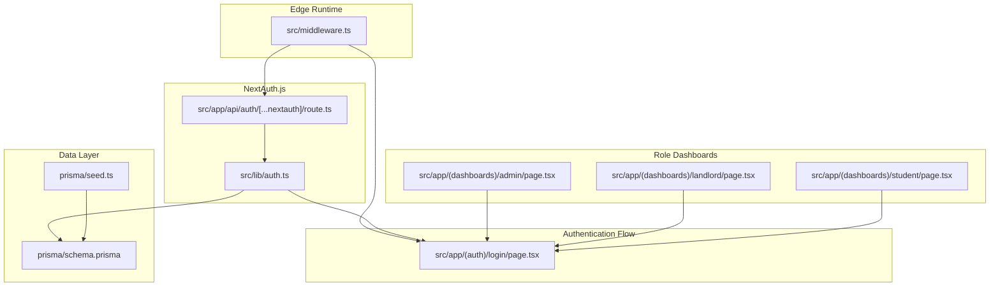
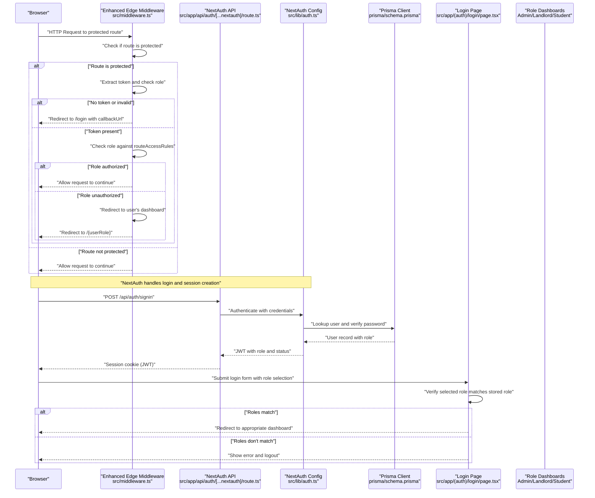
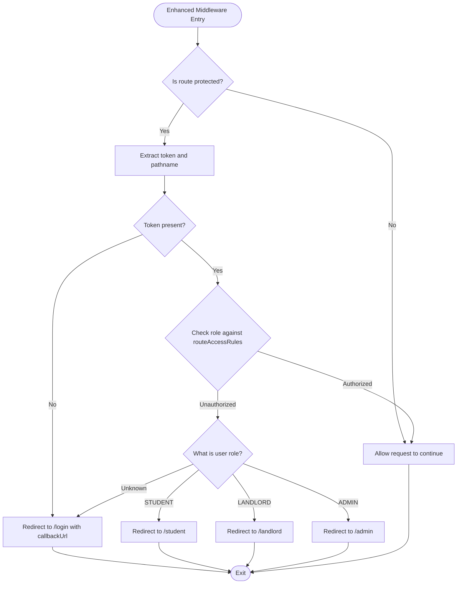
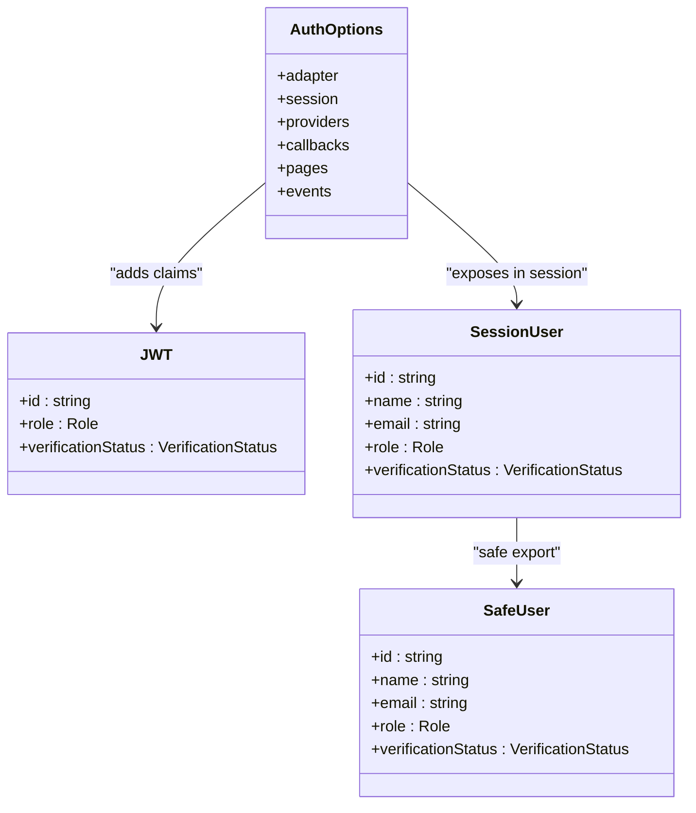
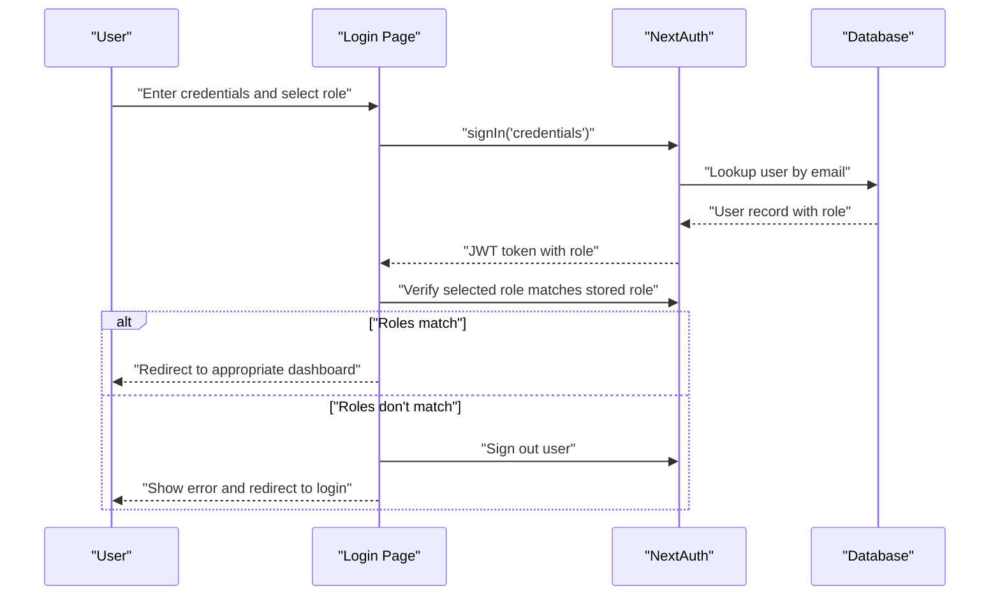
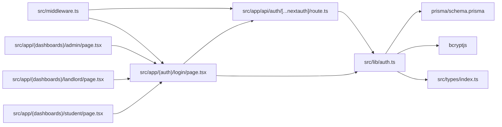

# Middleware & Route Protection

<cite>
**Referenced Files in This Document**
- [src/middleware.ts](file://src/middleware.ts)
- [src/lib/auth.ts](file://src/lib/auth.ts)
- [src/app/api/auth/[...nextauth]/route.ts](file://src/app/api/auth/[...nextauth]/route.ts)
- [src/app/(auth)/login/page.tsx](file://src/app/(auth)/login/page.tsx)
- [src/app/(dashboards)/admin/page.tsx](file://src/app/(dashboards)/admin/page.tsx)
- [src/app/(dashboards)/landlord/page.tsx](file://src/app/(dashboards)/landlord/page.tsx)
- [src/app/(dashboards)/student/page.tsx](file://src/app/(dashboards)/student/page.tsx)
- [src/types/index.ts](file://src/types/index.ts)
- [prisma/schema.prisma](file://prisma/schema.prisma)
- [prisma/seed.ts](file://prisma/seed.ts)
- [package.json](file://package.json)
- [next.config.mjs](file://next.config.mjs)
</cite>

## Update Summary
**Changes Made**
- Updated middleware implementation with new role-based access control system
- Enhanced route protection logic with dynamic route access rules
- Improved authentication flow with role verification during login
- Added comprehensive dashboard routing for different user roles
- Updated middleware matcher configuration for protected routes

## Table of Contents
1. [Introduction](#introduction)
2. [Project Structure](#project-structure)
3. [Core Components](#core-components)
4. [Architecture Overview](#architecture-overview)
5. [Detailed Component Analysis](#detailed-component-analysis)
6. [Dependency Analysis](#dependency-analysis)
7. [Performance Considerations](#performance-considerations)
8. [Troubleshooting Guide](#troubleshooting-guide)
9. [Conclusion](#conclusion)

## Introduction
This document explains the middleware and route protection system in RentalHub-BOUESTI. The system has been enhanced with a comprehensive role-based access control (RBAC) implementation that enforces authentication and authorization across different user roles. It covers the edge runtime middleware configuration, authentication enforcement via NextAuth.js, role-based access control, route matching patterns, and unauthorized access handling. The system now provides granular control over dashboard access based on user roles, with automatic redirection to appropriate dashboards when users attempt to access unauthorized routes.

## Project Structure
The middleware and authentication stack spans several focused files with enhanced role-based routing:
- Edge middleware with dynamic role-based access control
- NextAuth.js configuration with comprehensive session management
- Role-aware login flow with automatic dashboard redirection
- Multi-role dashboard pages for STUDENT, LANDLORD, and ADMIN
- Shared types for session and role definitions
- Prisma schema and seed for role management

**Diagram sources**
- [src/middleware.ts:1-76](file://src/middleware.ts#L1-L76)
- [src/lib/auth.ts:1-119](file://src/lib/auth.ts#L1-L119)
- [src/app/api/auth/[...nextauth]/route.ts:1-7](file://src/app/api/auth/[...nextauth]/route.ts#L1-L7)
- [src/app/(auth)/login/page.tsx:1-206](file://src/app/(auth)/login/page.tsx#L1-L206)
- [src/app/(dashboards)/admin/page.tsx:1-247](file://src/app/(dashboards)/admin/page.tsx#L1-L247)
- [src/app/(dashboards)/landlord/page.tsx:1-296](file://src/app/(dashboards)/landlord/page.tsx#L1-L296)
- [src/app/(dashboards)/student/page.tsx:1-303](file://src/app/(dashboards)/student/page.tsx#L1-L303)
- [prisma/schema.prisma:17-27](file://prisma/schema.prisma#L17-L27)
- [prisma/seed.ts:61-67](file://prisma/seed.ts#L61-L67)

**Section sources**
- [src/middleware.ts:1-76](file://src/middleware.ts#L1-L76)
- [src/lib/auth.ts:1-119](file://src/lib/auth.ts#L1-L119)
- [src/app/api/auth/[...nextauth]/route.ts:1-7](file://src/app/api/auth/[...nextauth]/route.ts#L1-L7)
- [src/app/(auth)/login/page.tsx:1-206](file://src/app/(auth)/login/page.tsx#L1-L206)
- [src/app/(dashboards)/admin/page.tsx:1-247](file://src/app/(dashboards)/admin/page.tsx#L1-L247)
- [src/app/(dashboards)/landlord/page.tsx:1-296](file://src/app/(dashboards)/landlord/page.tsx#L1-L296)
- [src/app/(dashboards)/student/page.tsx:1-303](file://src/app/(dashboards)/student/page.tsx#L1-L303)
- [prisma/schema.prisma:17-27](file://prisma/schema.prisma#L17-L27)
- [prisma/seed.ts:61-67](file://prisma/seed.ts#L61-L67)

## Core Components
- **Enhanced Edge Middleware with Dynamic RBAC**:
  - Implements dynamic route access rules using a routeAccessRules configuration
  - Supports STUDENT, LANDLORD, and ADMIN role-based access control
  - Provides automatic redirection to appropriate dashboards based on user roles
  - Uses a matcher to limit middleware execution to protected routes
- **NextAuth.js Integration with Comprehensive Session Management**:
  - Credentials provider with bcrypt and Prisma integration
  - JWT-based session strategy with role and verification status claims
  - Automatic role-based dashboard redirection during login
  - Enhanced error handling for suspended accounts
- **Role-Aware Authentication Flow**:
  - Login page allows users to select their role during authentication
  - Automatic verification of selected role against stored role
  - Redirect to appropriate dashboard based on actual user role
- **Multi-Roles Dashboard System**:
  - Separate dashboard pages for STUDENT, LANDLORD, and ADMIN roles
  - Role-specific functionality and navigation
  - Protected routes with automatic role verification
- **Shared Types and Data Model**:
  - Session and JWT augmentations for role and verification status
  - Prisma schema defining Role and VerificationStatus enums
  - Seed data creating initial ADMIN user

Key implementation references:
- **Dynamic RBAC middleware**: [src/middleware.ts:5-10](file://src/middleware.ts#L5-L10)
- **Protected route prefixes**: [src/middleware.ts:12-13](file://src/middleware.ts#L12-L13)
- **Middleware logic**: [src/middleware.ts:15-66](file://src/middleware.ts#L15-L66)
- **Matcher configuration**: [src/middleware.ts:69-75](file://src/middleware.ts#L69-L75)
- **NextAuth configuration**: [src/lib/auth.ts:36-119](file://src/lib/auth.ts#L36-L119)
- **Login role verification**: [src/app/(auth)/login/page.tsx:37-52](file://src/app/(auth)/login/page.tsx#L37-L52)
- **Role-based redirection**: [src/app/(auth)/login/page.tsx:54-69](file://src/app/(auth)/login/page.tsx#L54-L69)
- **Session/JWT augmentations**: [src/lib/auth.ts:9-34](file://src/lib/auth.ts#L9-L34)
- **Role enums**: [prisma/schema.prisma:17-21](file://prisma/schema.prisma#L17-L21)
- **Admin seed data**: [prisma/seed.ts:61-67](file://prisma/seed.ts#L61-L67)

**Section sources**
- [src/middleware.ts:5-75](file://src/middleware.ts#L5-L75)
- [src/lib/auth.ts:36-119](file://src/lib/auth.ts#L36-L119)
- [src/app/api/auth/[...nextauth]/route.ts:1-7](file://src/app/api/auth/[...nextauth]/route.ts#L1-L7)
- [src/app/(auth)/login/page.tsx:37-69](file://src/app/(auth)/login/page.tsx#L37-L69)
- [src/app/(dashboards)/admin/page.tsx:1-247](file://src/app/(dashboards)/admin/page.tsx#L1-L247)
- [src/app/(dashboards)/landlord/page.tsx:1-296](file://src/app/(dashboards)/landlord/page.tsx#L1-L296)
- [src/app/(dashboards)/student/page.tsx:1-303](file://src/app/(dashboards)/student/page.tsx#L1-L303)
- [src/lib/auth.ts:9-34](file://src/lib/auth.ts#L9-L34)
- [prisma/schema.prisma:17-21](file://prisma/schema.prisma#L17-L21)
- [prisma/seed.ts:61-67](file://prisma/seed.ts#L61-L67)

## Architecture Overview
The enhanced middleware system runs in the Next.js edge runtime and intercepts requests to protected routes. It leverages NextAuth.js to validate sessions and enrich the request with a JWT token containing role and verification status. The system now implements dynamic role-based access control with automatic redirection to appropriate dashboards based on user roles.

**Diagram sources**
- [src/middleware.ts:15-66](file://src/middleware.ts#L15-L66)
- [src/app/api/auth/[...nextauth]/route.ts:1-7](file://src/app/api/auth/[...nextauth]/route.ts#L1-L7)
- [src/lib/auth.ts:36-119](file://src/lib/auth.ts#L36-L119)
- [src/app/(auth)/login/page.tsx:37-69](file://src/app/(auth)/login/page.tsx#L37-L69)
- [prisma/schema.prisma:44-61](file://prisma/schema.prisma#L44-L61)

## Detailed Component Analysis

### Enhanced Edge Middleware: Dynamic Role-Based Access Control
- **Purpose**:
  - Enforce authentication for protected routes with dynamic role-based access control
  - Automatically redirect users to their appropriate dashboards based on roles
  - Provide granular access control for STUDENT, LANDLORD, and ADMIN roles
- **Execution Model**:
  - Runs in the edge runtime for low latency and global performance
  - Uses dynamic routeAccessRules configuration for flexible access control
  - Implements protectedPrefixes matcher to limit middleware invocation
- **Authorization Logic**:
  - **Route Access Rules**: `/student` (STUDENT), `/landlord` (LANDLORD), `/admin` (ADMIN)
  - **Protected Routes**: All routes under `/student/:path*`, `/landlord/:path*`, `/admin/:path*`
  - **Role Verification**: Compares requested route against user's role from JWT token
  - **Automatic Redirection**: Redirects unauthorized users to their dashboard or login
- **Redirection Behavior**:
  - Unauthorized access triggers automatic redirection to appropriate dashboard
  - Unknown roles trigger redirection to login page
  - Successful authentication allows access to requested route

**Diagram sources**
- [src/middleware.ts:15-66](file://src/middleware.ts#L15-L66)

**Section sources**
- [src/middleware.ts:5-10](file://src/middleware.ts#L5-L10)
- [src/middleware.ts:12-13](file://src/middleware.ts#L12-L13)
- [src/middleware.ts:15-66](file://src/middleware.ts#L15-L66)
- [src/middleware.ts:69-75](file://src/middleware.ts#L69-L75)

### NextAuth.js Integration: Enhanced Session Management and Role Verification
- **Provider and Authorization**:
  - Credentials provider validates email/password against Prisma-managed users
  - Password comparison uses bcrypt with secure hashing
  - Suspended accounts are rejected with appropriate error messages
  - User records include role and verification status from database
- **Token and Session Callbacks**:
  - JWT callback attaches role, verification status, and user ID to tokens
  - Session callback propagates token claims to session object for client-side access
  - Enhanced type safety with TypeScript module augmentation
- **Session Strategy**:
  - JWT-based sessions with 30-day max age for persistent access
  - No automatic session updates to reduce server load
  - Custom session events for logging user activity
- **Type Safety**:
  - Module augmentation for User, Session, and JWT interfaces
  - Strongly typed role and verification status properties
  - Safe user type exports without exposing passwords

**Diagram sources**
- [src/lib/auth.ts:36-119](file://src/lib/auth.ts#L36-L119)
- [src/lib/auth.ts:9-34](file://src/lib/auth.ts#L9-L34)
- [src/types/index.ts:74-80](file://src/types/index.ts#L74-L80)

**Section sources**
- [src/lib/auth.ts:36-119](file://src/lib/auth.ts#L36-L119)
- [src/lib/auth.ts:9-34](file://src/lib/auth.ts#L9-L34)
- [src/types/index.ts:74-80](file://src/types/index.ts#L74-L80)

### Role-Based Authentication Flow: Enhanced Login Experience
- **Role Selection During Login**:
  - Users can select their role (STUDENT, LANDLORD, ADMIN) during authentication
  - Automatic verification of selected role against stored role in database
  - Error handling for role mismatches with automatic logout
- **Automatic Dashboard Redirection**:
  - Successful authentication redirects to appropriate dashboard based on actual role
  - STUDENT -> /student, LANDLORD -> /landlord, ADMIN -> /admin
  - Default redirect to home page for unknown roles
- **Enhanced Error Handling**:
  - Clear error messages for invalid credentials
  - Role mismatch errors with specific role information
  - Graceful error recovery with automatic sign-out
- **Session Verification**:
  - Post-login session verification via /api/auth/session endpoint
  - Role consistency checking between frontend and backend
  - Secure handling of role verification failures

**Diagram sources**
- [src/app/(auth)/login/page.tsx:19-77](file://src/app/(auth)/login/page.tsx#L19-L77)
- [src/lib/auth.ts:53-92](file://src/lib/auth.ts#L53-L92)

**Section sources**
- [src/app/(auth)/login/page.tsx:19-77](file://src/app/(auth)/login/page.tsx#L19-L77)
- [src/lib/auth.ts:53-92](file://src/lib/auth.ts#L53-L92)

### Protected Route Patterns and Dynamic Access Control
- **Dynamic Route Access Rules**:
  - `/student` route accessible only by STUDENT role
  - `/landlord` route accessible only by LANDLORD role
  - `/admin` route accessible only by ADMIN role
- **Protected Route Prefixes**:
  - `/student/:path*` - All student dashboard routes
  - `/landlord/:path*` - All landlord dashboard routes
  - `/admin/:path*` - All admin dashboard routes
- **Effect**:
  - Middleware executes only for protected routes, minimizing overhead
  - Dynamic access control prevents cross-role access attempts
  - Automatic redirection to appropriate dashboards for unauthorized users
- **Customization**:
  - Add new role-accessible routes to routeAccessRules configuration
  - Extend protectedPrefixes array for additional route coverage
  - Modify access rules to implement more granular permissions

**Section sources**
- [src/middleware.ts:5-10](file://src/middleware.ts#L5-L10)
- [src/middleware.ts:12-13](file://src/middleware.ts#L12-L13)
- [src/middleware.ts:69-75](file://src/middleware.ts#L69-L75)

### Role-Based Dashboard System
- **Student Dashboard**:
  - Property browsing and booking management
  - View and manage personal bookings
  - Interactive property cards with booking controls
- **Landlord Dashboard**:
  - Property listing management
  - Tenant request handling and approval
  - Financial analytics and listing statistics
- **Admin Dashboard**:
  - Platform-wide property and user management
  - Pending property approvals
  - System analytics and reporting
- **Role-Specific Features**:
  - Each dashboard provides role-appropriate functionality
  - Protected routes prevent unauthorized access
  - Automatic redirection based on user roles

**Section sources**
- [src/app/(dashboards)/student/page.tsx:1-303](file://src/app/(dashboards)/student/page.tsx#L1-L303)
- [src/app/(dashboards)/landlord/page.tsx:1-296](file://src/app/(dashboards)/landlord/page.tsx#L1-L296)
- [src/app/(dashboards)/admin/page.tsx:1-247](file://src/app/(dashboards)/admin/page.tsx#L1-L247)

### Role-Based Access Control Implementation
- **Supported Roles**:
  - STUDENT: Property browsing and booking functionality
  - LANDLORD: Property management and tenant handling
  - ADMIN: Platform administration and oversight
- **Access Enforcement**:
  - Dynamic routeAccessRules configuration
  - JWT token role extraction and verification
  - Automatic redirection to appropriate dashboards
- **Data Model**:
  - Role enum defined in Prisma schema
  - VerificationStatus for account state management
  - Seed data creates initial ADMIN user
- **Security Measures**:
  - Role verification occurs in middleware
  - Automatic redirection prevents unauthorized access
  - Secure token-based authentication

**Section sources**
- [prisma/schema.prisma:17-27](file://prisma/schema.prisma#L17-L27)
- [prisma/seed.ts:61-67](file://prisma/seed.ts#L61-L67)
- [src/middleware.ts:45-62](file://src/middleware.ts#L45-L62)

### Middleware Execution Order and Edge Runtime Benefits
- **Execution Order**:
  - Enhanced middleware runs before page rendering for matched protected routes
  - Authentication and role verification occur prior to route handlers
  - Dynamic access control prevents unauthorized route access
- **Edge Runtime Advantages**:
  - Global edge deployment for minimal latency
  - Reduced cold start impact for protected routes
  - Efficient token validation and role verification
- **Performance Optimizations**:
  - Dynamic matcher limits middleware invocation
  - Role-based early exit for non-protected routes
  - Minimal synchronous processing in middleware

**Section sources**
- [src/middleware.ts:69-75](file://src/middleware.ts#L69-L75)
- [src/middleware.ts:15-26](file://src/middleware.ts#L15-L26)

## Dependency Analysis
The enhanced middleware system has expanded dependencies with improved role-based routing:
- **Middleware Dependencies**: Enhanced edge middleware with NextAuth.js integration
- **NextAuth Dependencies**: Prisma adapter, bcrypt, and comprehensive session management
- **Authentication Flow**: Login page with role verification and automatic redirection
- **Dashboard Dependencies**: Role-specific dashboard pages with protected routes
- **Data Layer**: Prisma schema with role and verification status enums

**Diagram sources**
- [src/middleware.ts:29-32](file://src/middleware.ts#L29-L32)
- [src/app/api/auth/[...nextauth]/route.ts:1-7](file://src/app/api/auth/[...nextauth]/route.ts#L1-L7)
- [src/lib/auth.ts:37-41](file://src/lib/auth.ts#L37-L41)
- [prisma/schema.prisma:44-61](file://prisma/schema.prisma#L44-L61)
- [src/app/(auth)/login/page.tsx:38-41](file://src/app/(auth)/login/page.tsx#L38-L41)
- [src/types/index.ts:74-80](file://src/types/index.ts#L74-L80)

**Section sources**
- [src/middleware.ts:29-32](file://src/middleware.ts#L29-L32)
- [src/app/api/auth/[...nextauth]/route.ts:1-7](file://src/app/api/auth/[...nextauth]/route.ts#L1-L7)
- [src/lib/auth.ts:37-41](file://src/lib/auth.ts#L37-L41)
- [prisma/schema.prisma:44-61](file://prisma/schema.prisma#L44-L61)
- [src/app/(auth)/login/page.tsx:38-41](file://src/app/(auth)/login/page.tsx#L38-L41)
- [src/types/index.ts:74-80](file://src/types/index.ts#L74-L80)

## Performance Considerations
- **Enhanced Edge Runtime Performance**:
  - Middleware executes close to edge locations for minimal latency
  - Dynamic matcher reduces unnecessary invocations to protected routes only
  - Role verification occurs in memory from JWT tokens
- **Optimized Session Strategy**:
  - JWT-based sessions avoid per-request database lookups
  - 30-day max age balances persistence with security
  - No automatic updates reduce server load
- **Role-Based Early Exits**:
  - Non-protected routes bypass middleware entirely
  - Failed authentication triggers immediate redirection
  - Unauthorized roles redirect to appropriate dashboards
- **Recommendations**:
  - Keep matcher narrow to protected routes only
  - Avoid heavy synchronous work in middleware
  - Use caching for static assets and leverage Next.js optimizations
  - Monitor edge runtime performance for global deployments

## Troubleshooting Guide
- **Enhanced Symptoms**:
  - Users redirected to login despite being signed in
  - Users redirected to wrong dashboard despite correct role
  - Role mismatch errors during login
  - Unexpected 401 or infinite redirect loops
- **Checks**:
  - Verify routeAccessRules configuration matches intended access patterns
  - Confirm matcher includes all protected routes
  - Ensure user role and verification status are correct in the database
  - Validate that role dashboards are accessible and functional
- **Debugging Steps**:
  - Enable NextAuth debug mode in development
  - Inspect browser cookies for the session JWT
  - Log token presence, role, and route access decisions in middleware
  - Verify Prisma user record and bcrypt hash correctness
  - Check role-based redirection logic in middleware
  - Test login flow with different role selections
- **Related References**:
  - Enhanced middleware logic: [src/middleware.ts:15-66](file://src/middleware.ts#L15-L66)
  - Route access rules: [src/middleware.ts:5-10](file://src/middleware.ts#L5-L10)
  - Login role verification: [src/app/(auth)/login/page.tsx:37-52](file://src/app/(auth)/login/page.tsx#L37-L52)
  - NextAuth debug configuration: [src/lib/auth.ts:118](file://src/lib/auth.ts#L118)

**Section sources**
- [src/middleware.ts:15-66](file://src/middleware.ts#L15-L66)
- [src/middleware.ts:5-10](file://src/middleware.ts#L5-L10)
- [src/app/(auth)/login/page.tsx:37-52](file://src/app/(auth)/login/page.tsx#L37-L52)
- [src/lib/auth.ts:118](file://src/lib/auth.ts#L118)

## Conclusion
RentalHub-BOUESTI's enhanced middleware and authentication system provides a comprehensive role-based access control solution built on Next.js edge runtime and NextAuth.js. The new implementation offers dynamic route access rules, automatic role-based redirection, and seamless integration between authentication and authorization flows. The system now provides granular control over dashboard access based on user roles, with automatic redirection to appropriate dashboards when users attempt to access unauthorized routes. The combination of edge runtime performance, JWT-based sessions, and dynamic RBAC creates a robust, scalable, and user-friendly protection mechanism that scales with the application's growing complexity.