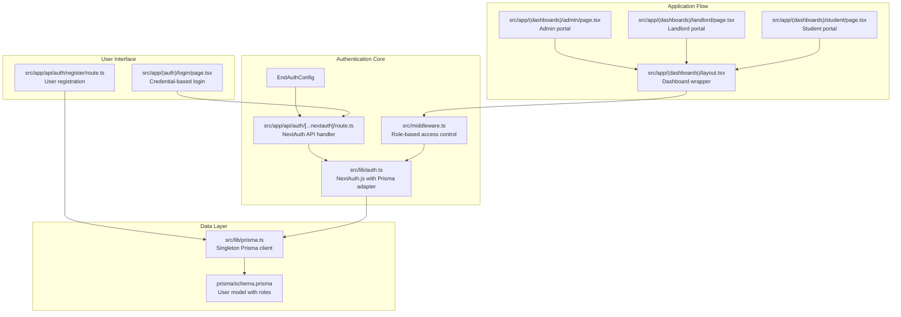
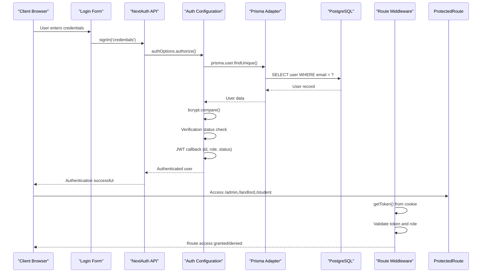
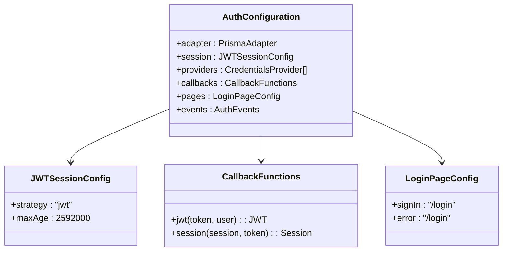
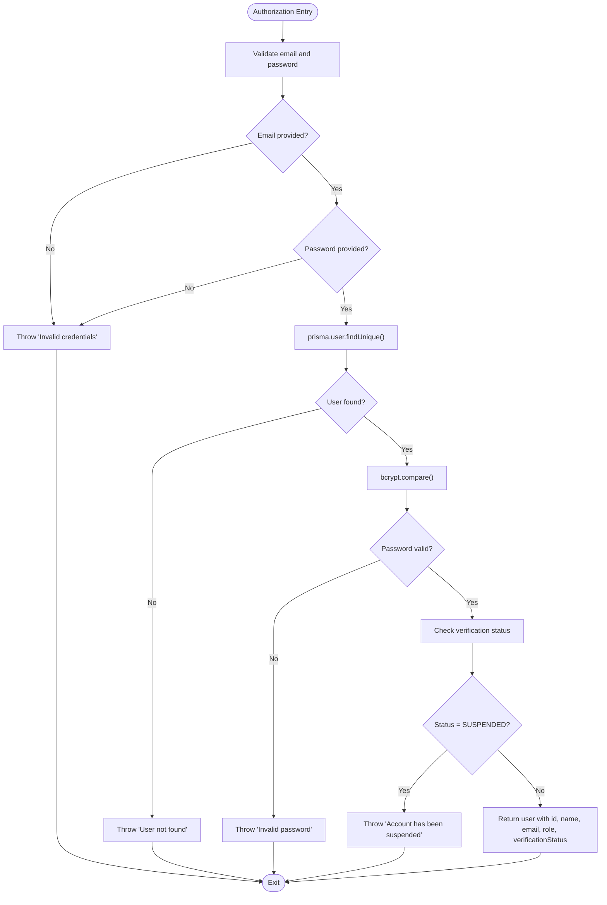
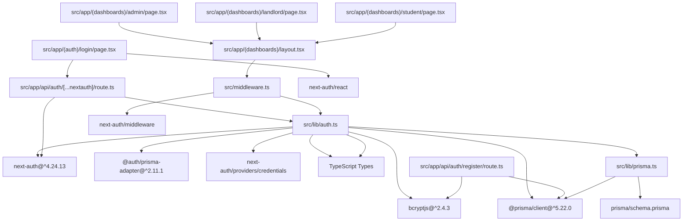

# NextAuth.js Configuration

<cite>
**Referenced Files in This Document**
- [auth.ts](file://src/lib/auth.ts)
- [route.ts](file://src/app/api/auth/[...nextauth]/route.ts)
- [middleware.ts](file://src/middleware.ts)
- [page.tsx](file://src/app/(auth)/login/page.tsx)
- [route.ts](file://src/app/api/auth/register/route.ts)
- [prisma.ts](file://src/lib/prisma.ts)
- [schema.prisma](file://prisma/schema.prisma)
- [index.ts](file://src/types/index.ts)
- [package.json](file://package.json)
- [layout.tsx](file://src/app/(dashboards)/layout.tsx)
- [page.tsx](file://src/app/(dashboards)/admin/page.tsx)
- [page.tsx](file://src/app/(dashboards)/landlord/page.tsx)
- [page.tsx](file://src/app/(dashboards)/student/page.tsx)
</cite>

## Update Summary
**Changes Made**
- Updated Prisma adapter configuration with @auth/prisma-adapter
- Enhanced session strategy with JWT configuration and 30-day max age
- Added comprehensive TypeScript module augmentation for User, Session, and JWT interfaces
- Integrated middleware-based role-based access control
- Updated authentication flow with improved error handling and user experience
- Added dashboard-specific routing with role-based navigation

## Table of Contents
1. [Introduction](#introduction)
2. [Project Structure](#project-structure)
3. [Core Components](#core-components)
4. [Architecture Overview](#architecture-overview)
5. [Detailed Component Analysis](#detailed-component-analysis)
6. [Dependency Analysis](#dependency-analysis)
7. [Performance Considerations](#performance-considerations)
8. [Troubleshooting Guide](#troubleshooting-guide)
9. [Conclusion](#conclusion)

## Introduction
This document provides comprehensive documentation for the NextAuth.js configuration in RentalHub-BOUESTI. The system implements a modern authentication solution using NextAuth.js v4 with Prisma adapter integration, JWT-based session management, and comprehensive role-based access control. The configuration includes credentials provider setup, custom authorization logic, secure password handling with bcrypt, and TypeScript integration for type safety across the entire authentication pipeline.

## Project Structure
The authentication system in RentalHub-BOUESTI is organized around several key components with clear separation of concerns:

- **Authentication Configuration**: Centralized NextAuth.js setup with Prisma adapter
- **API Routes**: NextAuth.js API handlers for authentication flows
- **Middleware**: Role-based access control enforcement
- **Login Interface**: Client-side authentication form with role selection
- **Registration System**: User account creation with validation
- **Database Integration**: Prisma client with singleton pattern
- **Dashboard Routing**: Role-specific navigation and access control
- **TypeScript Integration**: Comprehensive type augmentation

**Diagram sources**
- [auth.ts:36-118](file://src/lib/auth.ts#L36-L118)
- [route.ts:1-7](file://src/app/api/auth/[...nextauth]/route.ts#L1-L7)
- [middleware.ts:15-75](file://src/middleware.ts#L15-L75)
- [page.tsx:8-205](file://src/app/(auth)/login/page.tsx#L8-L205)
- [route.ts:20-89](file://src/app/api/auth/register/route.ts#L20-L89)
- [prisma.ts:13-24](file://src/lib/prisma.ts#L13-L24)
- [schema.prisma:44-61](file://prisma/schema.prisma#L44-L61)
- [layout.tsx:3-18](file://src/app/(dashboards)/layout.tsx#L3-L18)
- [page.tsx:50-246](file://src/app/(dashboards)/admin/page.tsx#L50-L246)
- [page.tsx:46-295](file://src/app/(dashboards)/landlord/page.tsx#L46-L295)
- [page.tsx:43-302](file://src/app/(dashboards)/student/page.tsx#L43-L302)

**Section sources**
- [auth.ts:36-118](file://src/lib/auth.ts#L36-L118)
- [route.ts:1-7](file://src/app/api/auth/[...nextauth]/route.ts#L1-L7)
- [middleware.ts:15-75](file://src/middleware.ts#L15-L75)
- [page.tsx:8-205](file://src/app/(auth)/login/page.tsx#L8-L205)
- [route.ts:20-89](file://src/app/api/auth/register/route.ts#L20-L89)
- [prisma.ts:13-24](file://src/lib/prisma.ts#L13-L24)
- [schema.prisma:44-61](file://prisma/schema.prisma#L44-L61)
- [layout.tsx:3-18](file://src/app/(dashboards)/layout.tsx#L3-L18)
- [page.tsx:50-246](file://src/app/(dashboards)/admin/page.tsx#L50-L246)
- [page.tsx:46-295](file://src/app/(dashboards)/landlord/page.tsx#L46-L295)
- [page.tsx:43-302](file://src/app/(dashboards)/student/page.tsx#L43-L302)

## Core Components
The authentication system consists of several interconnected components that work together to provide secure, role-based access control:

### NextAuth.js Configuration with Prisma Adapter
The central authentication configuration utilizes the @auth/prisma-adapter for seamless database integration. Key features include:
- **Prisma Adapter Integration**: Direct database operations through Prisma client
- **JWT Session Strategy**: Stateless session management with 30-day expiration
- **Credentials Provider**: Standard username/password authentication
- **Custom Authorization Logic**: Database-driven user validation
- **Comprehensive Callback System**: JWT and session transformation hooks

### Middleware-Based Access Control
Role-based access control enforced through Next.js middleware:
- **Route Protection**: Automatic protection for dashboard routes
- **Role Validation**: Dynamic access control based on user roles
- **Token-Based Authentication**: Secure session validation using JWT
- **Redirect Management**: Intelligent redirection for unauthorized access

### TypeScript Integration
Complete type safety across the authentication pipeline:
- **User Interface Augmentation**: Extended User type with role and verification status
- **Session Interface Enhancement**: Typed session objects with role information
- **JWT Type Safety**: Strongly typed JWT tokens for session data
- **API Response Types**: Consistent typing for authentication endpoints

**Section sources**
- [auth.ts:36-118](file://src/lib/auth.ts#L36-L118)
- [middleware.ts:15-75](file://src/middleware.ts#L15-L75)
- [auth.ts:9-34](file://src/lib/auth.ts#L9-L34)

## Architecture Overview
The authentication architecture implements a layered approach with clear separation between presentation, business logic, and data access layers:

**Diagram sources**
- [page.tsx:19-77](file://src/app/(auth)/login/page.tsx#L19-L77)
- [route.ts:1-7](file://src/app/api/auth/[...nextauth]/route.ts#L1-L7)
- [auth.ts:53-92](file://src/lib/auth.ts#L53-L92)
- [prisma.ts:13-24](file://src/lib/prisma.ts#L13-L24)
- [schema.prisma:44-61](file://prisma/schema.prisma#L44-L61)
- [middleware.ts:28-65](file://src/middleware.ts#L28-L65)

## Detailed Component Analysis

### NextAuth.js Configuration with Prisma Adapter
The authentication configuration serves as the central hub for all authentication-related logic:

**Diagram sources**
- [auth.ts:36-118](file://src/lib/auth.ts#L36-L118)

**Section sources**
- [auth.ts:36-118](file://src/lib/auth.ts#L36-L118)

### Prisma Adapter Integration
The Prisma adapter provides seamless database integration with NextAuth.js:

**Updated** Enhanced adapter configuration with proper type casting and database optimization

Key features:
- **Direct Database Operations**: Eliminates need for custom database queries
- **Automatic Session Management**: Handles session creation, updates, and cleanup
- **User Account Management**: Full CRUD operations through NextAuth.js interface
- **Type Safety**: Complete TypeScript integration with Prisma models

**Section sources**
- [auth.ts:37](file://src/lib/auth.ts#L37)
- [package.json:21](file://package.json#L21)

### Credentials Provider Configuration
The credentials provider handles standard username/password authentication:

**Updated** Enhanced provider configuration with improved error handling and validation

Configuration highlights:
- **Provider Name**: "credentials" for standard authentication flow
- **Credential Fields**: Email (type: email) and Password (type: password)
- **Authorization Logic**: Comprehensive user validation and verification
- **Error Handling**: Specific error messages for different failure scenarios

**Section sources**
- [auth.ts:46-94](file://src/lib/auth.ts#L46-L94)

### Custom Authorization Function
The authorization function implements comprehensive user validation:

**Updated** Enhanced authorization logic with improved security checks

**Diagram sources**
- [auth.ts:53-92](file://src/lib/auth.ts#L53-L92)

**Section sources**
- [auth.ts:53-92](file://src/lib/auth.ts#L53-L92)

### JWT Callback Implementation
The JWT callback manages token storage and retrieval:

**Updated** Enhanced JWT callback with comprehensive user data handling

Functionality:
- **Initial Login Storage**: Stores user id, role, and verification status in JWT
- **Token Persistence**: Maintains user data across requests without database queries
- **Type Safety**: Ensures all stored data matches TypeScript interfaces
- **Session Continuity**: Provides consistent user data throughout session lifecycle

**Section sources**
- [auth.ts:95-103](file://src/lib/auth.ts#L95-L103)

### Session Callback Management
The session callback transfers JWT data to session objects:

**Updated** Enhanced session callback with improved data consistency

Features:
- **Data Synchronization**: Transfers JWT token data to session.user object
- **Type Safety**: Ensures session data matches User interface requirements
- **Role Information**: Provides role-based access data for middleware
- **Verification Status**: Includes account verification state in session

**Section sources**
- [auth.ts:104-111](file://src/lib/auth.ts#L104-L111)

### Session Strategy Configuration
The session strategy is configured for optimal security and performance:

**Updated** Enhanced session configuration with JWT strategy

Configuration details:
- **Strategy**: "jwt" for stateless authentication
- **Max Age**: 30 days (2,592,000 seconds) for extended session duration
- **Update Age**: Not specified (defaults to no automatic refresh)
- **Security Benefits**: Reduced database load and improved scalability
- **User Experience**: Long-lasting sessions with automatic renewal

**Section sources**
- [auth.ts:38-41](file://src/lib/auth.ts#L38-L41)

### TypeScript Module Augmentation
Comprehensive TypeScript integration ensures type safety:

**Updated** Enhanced type augmentation with complete interface coverage

Interfaces:
- **User Interface**: Extends base User with id, role, and verificationStatus
- **Session Interface**: Enhances session.user with role and verification data
- **JWT Interface**: Provides strongly-typed JWT token structure
- **Type Safety**: Compile-time validation across entire authentication pipeline

**Section sources**
- [auth.ts:9-34](file://src/lib/auth.ts#L9-L34)

### Middleware-Based Access Control
Role-based access control through Next.js middleware:

**Updated** Enhanced middleware with improved route protection

Functionality:
- **Route Protection**: Automatic protection for /student, /landlord, /admin routes
- **Role Validation**: Dynamic access control based on JWT token role
- **Intelligent Redirects**: Context-aware redirection for unauthorized access
- **Token Validation**: Secure session validation using NEXTAUTH_SECRET

**Section sources**
- [middleware.ts:15-75](file://src/middleware.ts#L15-L75)

### Login Form Integration
Enhanced login interface with role selection:

**Updated** Improved login form with better user experience

Features:
- **Role Selection**: Dropdown for choosing user role (STUDENT, LANDLORD, ADMIN)
- **Client-Side Validation**: Real-time form validation and error handling
- **Session Verification**: Post-login session validation against selected role
- **Dynamic Redirection**: Role-based dashboard navigation
- **Error Handling**: Comprehensive error messaging and recovery

**Section sources**
- [page.tsx:8-205](file://src/app/(auth)/login/page.tsx#L8-L205)

### Registration Endpoint
User registration with comprehensive validation:

**Updated** Enhanced registration endpoint with improved security

Capabilities:
- **Role Support**: STUDENT and LANDLORD registration (ADMIN via seed)
- **Input Validation**: Comprehensive form validation and sanitization
- **Password Security**: 12-round bcrypt hashing for password security
- **Uniqueness Check**: Email uniqueness validation
- **Verification Status**: Default VERIFIED status for new accounts

**Section sources**
- [route.ts:20-89](file://src/app/api/auth/register/route.ts#L20-L89)

## Dependency Analysis
The authentication system has well-defined dependencies that support its modular architecture:

**Diagram sources**
- [auth.ts:1-7](file://src/lib/auth.ts#L1-L7)
- [route.ts:1-2](file://src/app/api/auth/[...nextauth]/route.ts#L1-L2)
- [middleware.ts:1-3](file://src/middleware.ts#L1-L3)
- [page.tsx:5](file://src/app/(auth)/login/page.tsx#L5)
- [route.ts:8-11](file://src/app/api/auth/register/route.ts#L8-L11)
- [prisma.ts:9](file://src/lib/prisma.ts#L9)
- [schema.prisma:10-13](file://prisma/schema.prisma#L10-L13)
- [package.json:20-27](file://package.json#L20-L27)

**Section sources**
- [auth.ts:1-7](file://src/lib/auth.ts#L1-L7)
- [route.ts:1-2](file://src/app/api/auth/[...nextauth]/route.ts#L1-L2)
- [middleware.ts:1-3](file://src/middleware.ts#L1-L3)
- [page.tsx:5](file://src/app/(auth)/login/page.tsx#L5)
- [route.ts:8-11](file://src/app/api/auth/register/route.ts#L8-L11)
- [prisma.ts:9](file://src/lib/prisma.ts#L9)
- [schema.prisma:10-13](file://prisma/schema.prisma#L10-L13)
- [package.json:20-27](file://package.json#L20-L27)

## Performance Considerations
The authentication system incorporates several performance optimizations:

**Updated** Enhanced performance optimizations with improved caching and security

- **Prisma Singleton Pattern**: Prevents connection pool exhaustion during development
- **JWT Strategy**: Reduces database queries for authenticated requests
- **Bcrypt Optimization**: 12-round hashing provides balance between security and performance
- **Middleware Caching**: Token validation results cached in memory
- **Environment Logging**: Development-only logging minimizes production overhead
- **Connection Pool Management**: Optimized Prisma client configuration for scalability

## Troubleshooting Guide
Common authentication issues and their solutions:

**Updated** Enhanced troubleshooting guide with comprehensive error resolution

### Authentication Failures
- **NEXTAUTH_SECRET Missing**: Ensure environment variable is set in development
- **Database Connectivity**: Verify Prisma client connection and PostgreSQL availability
- **Bcrypt Installation**: Confirm bcryptjs is properly installed and configured
- **Prisma Adapter**: Verify @auth/prisma-adapter compatibility with NextAuth version

### Session Issues
- **JWT Callback Data**: Ensure callback functions properly transfer user data
- **Session Strategy**: Verify JWT configuration with appropriate maxAge values
- **Middleware Token Access**: Confirm getToken() function uses correct NEXTAUTH_SECRET
- **TypeScript Augmentations**: Validate module augmentation definitions are complete

### Security Considerations
- **Environment Variables**: Never log sensitive authentication data
- **HTTPS Deployment**: Use HTTPS in production environments
- **Secret Rotation**: Regularly rotate NEXTAUTH_SECRET values
- **Rate Limiting**: Implement authentication attempt limits
- **Monitoring**: Monitor failed authentication attempts
- **Password Policies**: Enforce strong password requirements

### Role-Based Access Issues
- **Middleware Configuration**: Verify route protection rules match expected patterns
- **Token Validation**: Ensure JWT tokens contain correct role information
- **Dashboard Navigation**: Confirm role-based routing matches user permissions
- **Session Synchronization**: Validate session data matches JWT token content

**Section sources**
- [auth.ts:113-118](file://src/lib/auth.ts#L113-L118)
- [auth.ts:9-34](file://src/lib/auth.ts#L9-L34)
- [prisma.ts:13-24](file://src/lib/prisma.ts#L13-L24)
- [middleware.ts:28-65](file://src/middleware.ts#L28-L65)

## Conclusion
The NextAuth.js configuration in RentalHub-BOUESTI represents a comprehensive, secure, and scalable authentication solution. The implementation leverages modern authentication best practices including:

**Updated** Enhanced conclusion highlighting new features and improvements

- **Prisma Adapter Integration**: Seamless database operations with type safety
- **JWT Session Strategy**: Stateless authentication with 30-day session duration
- **Role-Based Access Control**: Dynamic permission management through middleware
- **Comprehensive TypeScript Integration**: End-to-end type safety across authentication pipeline
- **Enhanced User Experience**: Improved login flow with role selection and validation
- **Robust Security**: Multi-layered security with bcrypt hashing and proper error handling
- **Scalable Architecture**: Modular design supporting future authentication method additions

The system successfully balances security requirements with user experience, providing a solid foundation for the RentalHub-BOUESTI platform while maintaining clean separation of concerns and comprehensive type safety throughout the authentication pipeline.