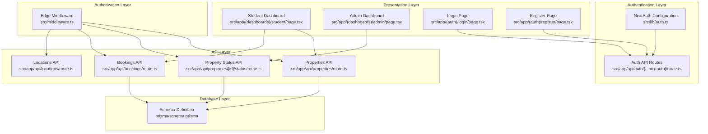
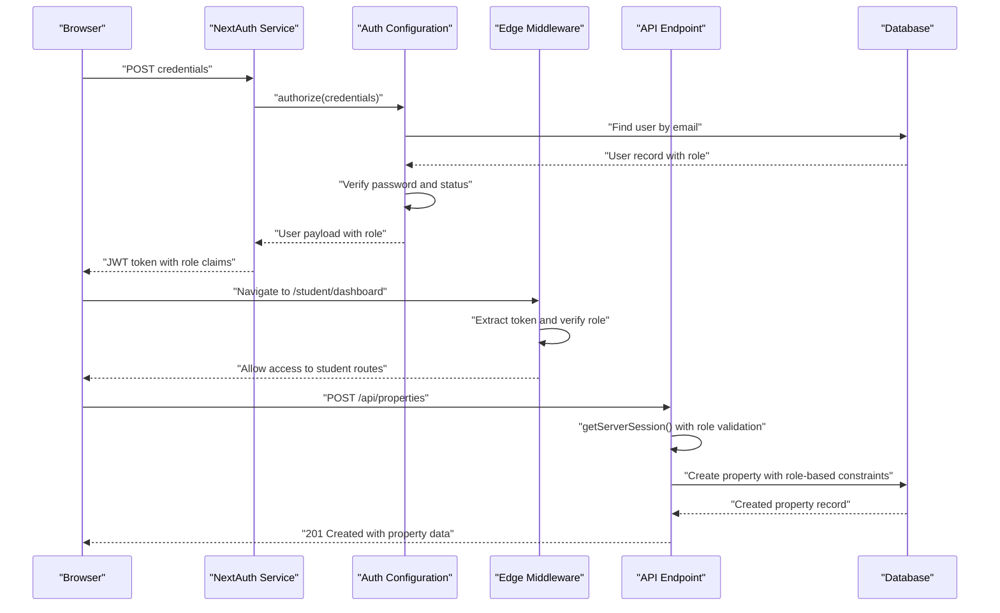
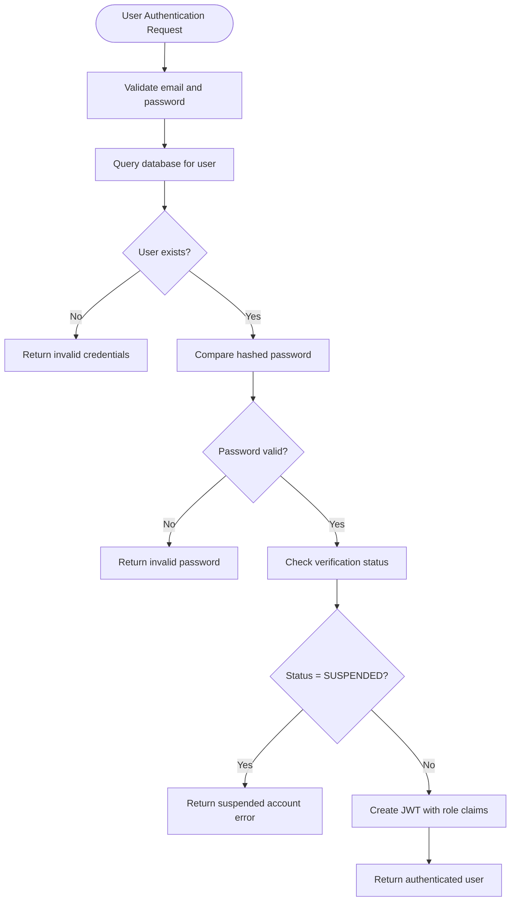
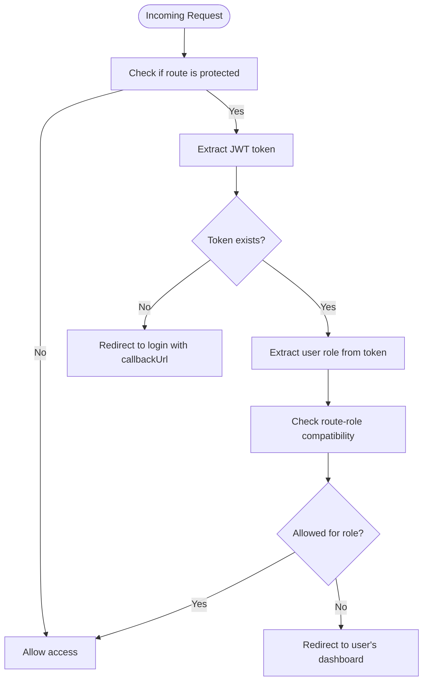
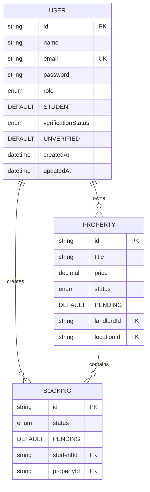
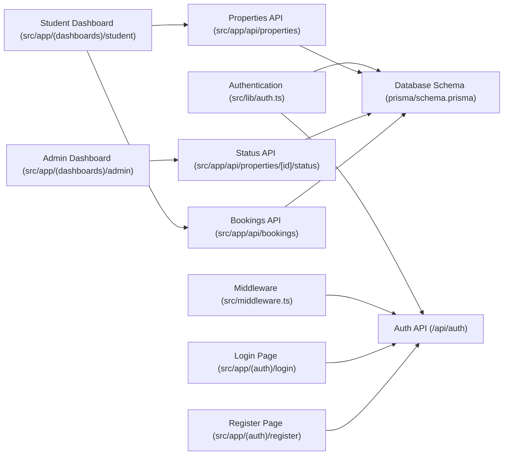

# Role-Based Access Control (RBAC)

<cite>
**Referenced Files in This Document**
- [src/lib/auth.ts](file://src/lib/auth.ts)
- [src/app/api/auth/[...nextauth]/route.ts](file://src/app/api/auth/[...nextauth]/route.ts)
- [src/middleware.ts](file://src/middleware.ts)
- [prisma/schema.prisma](file://prisma/schema.prisma)
- [src/types/index.ts](file://src/types/index.ts)
- [src/app/api/properties/route.ts](file://src/app/api/properties/route.ts)
- [src/app/api/properties/[id]/status/route.ts](file://src/app/api/properties/[id]/status/route.ts)
- [src/app/api/bookings/route.ts](file://src/app/api/bookings/route.ts)
- [src/app/api/locations/route.ts](file://src/app/api/locations/route.ts)
- [src/app/(auth)/login/page.tsx](file://src/app/(auth)/login/page.tsx)
- [src/app/(auth)/register/page.tsx](file://src/app/(auth)/register/page.tsx)
- [src/app/(dashboards)/student/page.tsx](file://src/app/(dashboards)/student/page.tsx)
- [src/app/(dashboards)/admin/page.tsx](file://src/app/(dashboards)/admin/page.tsx)
- [src/lib/prisma.ts](file://src/lib/prisma.ts)
</cite>

## Update Summary
**Changes Made**
- Updated authentication flow to use JWT strategy with role and verification status propagation
- Enhanced middleware with comprehensive route protection logic for STUDENT, LANDLORD, and ADMIN roles
- Implemented role-specific API endpoint permissions and business rule enforcement
- Added comprehensive dashboard implementations for each role type
- Updated database schema with proper enum definitions and default values
- Enhanced frontend integration with role-aware navigation and conditional rendering

## Table of Contents
1. [Introduction](#introduction)
2. [Project Structure](#project-structure)
3. [Core Components](#core-components)
4. [Architecture Overview](#architecture-overview)
5. [Detailed Component Analysis](#detailed-component-analysis)
6. [Dependency Analysis](#dependency-analysis)
7. [Performance Considerations](#performance-considerations)
8. [Troubleshooting Guide](#troubleshooting-guide)
9. [Conclusion](#conclusion)

## Introduction
This document describes the Role-Based Access Control (RBAC) system in RentalHub-BOUESTI. The system implements a comprehensive three-tier role structure with STUDENT, LANDLORD, and ADMIN roles, each with distinct permissions and access levels. The RBAC system is built on JWT authentication with NextAuth.js, ensuring secure session management and role-based authorization across all application layers.

The system defines roles in the database schema, propagates them through JWT tokens, and enforces access control in middleware and API routes. It includes a verification status system (UNVERIFIED, VERIFIED, SUSPENDED) that affects user access permissions. The implementation supports role-specific conditional rendering, route protection logic, and permission-checking patterns throughout the frontend and backend.

## Project Structure
The RBAC implementation spans multiple application layers with clear separation of concerns:

**Diagram sources**
- [src/lib/auth.ts:36-118](file://src/lib/auth.ts#L36-L118)
- [src/middleware.ts:5-75](file://src/middleware.ts#L5-L75)
- [prisma/schema.prisma:17-62](file://prisma/schema.prisma#L17-L62)
- [src/app/(dashboards)/student/page.tsx:43-302](file://src/app/(dashboards)/student/page.tsx#L43-L302)
- [src/app/(dashboards)/admin/page.tsx:50-246](file://src/app/(dashboards)/admin/page.tsx#L50-L246)

**Section sources**
- [src/lib/auth.ts:36-118](file://src/lib/auth.ts#L36-L118)
- [src/middleware.ts:5-75](file://src/middleware.ts#L5-L75)
- [prisma/schema.prisma:17-62](file://prisma/schema.prisma#L17-L62)

## Core Components

### Role Definitions and Database Schema
The RBAC system defines three core roles with specific permissions and database persistence:

- **STUDENT**: Primary users who can browse properties, create bookings, and manage their booking requests
- **LANDLORD**: Property owners who can list properties, view their property analytics, and manage bookings for their listings
- **ADMIN**: System administrators with full platform management capabilities including property approval, user management, and system oversight

Roles are defined as enums in the Prisma schema with default values and proper indexing for optimal performance.

**Section sources**
- [prisma/schema.prisma:17-21](file://prisma/schema.prisma#L17-L21)
- [prisma/schema.prisma:44-61](file://prisma/schema.prisma#L44-L61)

### Authentication and Session Management
NextAuth.js handles credential-based authentication with comprehensive role propagation:

- JWT strategy with 30-day expiration for secure session management
- Automatic role and verification status inclusion in JWT tokens
- Type-safe session augmentation for compile-time role checking
- Credential validation with bcrypt password comparison
- Verification status enforcement preventing access for suspended accounts

**Section sources**
- [src/lib/auth.ts:36-118](file://src/lib/auth.ts#L36-L118)
- [src/app/api/auth/[...nextauth]/route.ts:1-7](file://src/app/api/auth/[...nextauth]/route.ts#L1-L7)

### Middleware Route Protection
Edge middleware enforces comprehensive route-level access control:

- Protected route prefixes for each role type (/student, /landlord, /admin)
- Token-based authentication verification
- Role-specific access validation with intelligent redirect logic
- Matcher configuration targeting only authenticated routes
- Graceful handling of unauthorized access attempts

**Section sources**
- [src/middleware.ts:5-75](file://src/middleware.ts#L5-L75)

### API-Level Permissions and Business Rules
Each API endpoint implements role-specific authorization with business logic enforcement:

- Properties API: Landlord/Admin-only property creation with validation
- Property status API: Admin-only approval/rejection with mandatory rejection reasons
- Bookings API: Student-only booking creation with property availability checks
- Comprehensive error handling with appropriate HTTP status codes

**Section sources**
- [src/app/api/properties/route.ts:97-161](file://src/app/api/properties/route.ts#L97-L161)
- [src/app/api/properties/[id]/status/route.ts:17-68](file://src/app/api/properties/[id]/status/route.ts#L17-L68)
- [src/app/api/bookings/route.ts:47-181](file://src/app/api/bookings/route.ts#L47-L181)

## Architecture Overview
The RBAC system follows a layered architecture ensuring security at every level:

**Diagram sources**
- [src/lib/auth.ts:53-92](file://src/lib/auth.ts#L53-L92)
- [src/middleware.ts:15-66](file://src/middleware.ts#L15-L66)
- [src/app/api/properties/route.ts:97-161](file://src/app/api/properties/route.ts#L97-L161)

## Detailed Component Analysis

### Authentication Flow and Role Propagation
The authentication system implements a secure credential validation process with comprehensive role assignment:

1. **Credential Validation**: Email and password presence verification
2. **User Lookup**: Database query by email with proper error handling
3. **Password Verification**: Bcrypt comparison for security
4. **Status Check**: Verification status validation preventing suspended access
5. **Token Generation**: Role and verification status inclusion in JWT claims
6. **Session Creation**: Type-safe session with role information

**Diagram sources**
- [src/lib/auth.ts:53-92](file://src/lib/auth.ts#L53-L92)

**Section sources**
- [src/lib/auth.ts:53-92](file://src/lib/auth.ts#L53-L92)
- [src/lib/auth.ts:95-111](file://src/lib/auth.ts#L95-L111)

### Middleware Authorization Logic
The edge middleware implements sophisticated route protection with intelligent role validation:

- **Route Matching**: Pattern-based route detection for protected paths
- **Token Extraction**: Secure JWT extraction using NextAuth JWT utilities
- **Role Validation**: Direct role comparison against configured access rules
- **Intelligent Redirection**: Context-aware redirects based on user's actual role
- **Fallback Handling**: Graceful fallback to login for unknown roles

**Diagram sources**
- [src/middleware.ts:15-66](file://src/middleware.ts#L15-L66)

**Section sources**
- [src/middleware.ts:15-66](file://src/middleware.ts#L15-L66)
- [src/middleware.ts:68-75](file://src/middleware.ts#L68-L75)

### Role-Specific API Endpoint Implementation
Each API endpoint implements comprehensive role-based authorization with business logic enforcement:

#### Properties API
- **Creation Endpoint**: Landlord/Admin-only with comprehensive validation
- **Listing Endpoint**: Role-aware filtering with different visibility rules
- **Search Functionality**: Advanced filtering with role-based access controls

#### Property Status API
- **Approval/Rejection**: Admin-only operations with mandatory rejection reasons
- **Review Tracking**: Complete audit trail with reviewer identification
- **Status Validation**: Strict status value validation

#### Bookings API
- **Student Booking**: Exclusive student functionality with property availability checks
- **Landlord Management**: Property owner booking management capabilities
- **Admin Oversight**: Comprehensive booking monitoring for administrative purposes

**Section sources**
- [src/app/api/properties/route.ts:97-161](file://src/app/api/properties/route.ts#L97-L161)
- [src/app/api/properties/[id]/status/route.ts:17-68](file://src/app/api/properties/[id]/status/route.ts#L17-L68)
- [src/app/api/bookings/route.ts:47-181](file://src/app/api/bookings/route.ts#L47-L181)

### Database Schema and Data Model
The database schema defines comprehensive role and status management:

**Diagram sources**
- [prisma/schema.prisma:44-61](file://prisma/schema.prisma#L44-L61)
- [prisma/schema.prisma:81-114](file://prisma/schema.prisma#L81-L114)
- [prisma/schema.prisma:117-135](file://prisma/schema.prisma#L117-L135)

**Section sources**
- [prisma/schema.prisma:17-62](file://prisma/schema.prisma#L17-L62)
- [prisma/schema.prisma:44-135](file://prisma/schema.prisma#L44-L135)

### Frontend Integration and Role-Aware Navigation
The frontend implements comprehensive role-aware navigation and conditional rendering:

#### Student Dashboard
- Property browsing with availability indicators
- Booking management with real-time status updates
- Responsive design with role-appropriate UI elements
- Integration with API endpoints for seamless functionality

#### Admin Dashboard
- Property approval workflows
- Platform analytics and reporting
- User management capabilities
- Comprehensive administrative tools

#### Authentication Pages
- Role selection during login process
- Dynamic routing based on actual user roles
- Error handling for role mismatches
- Seamless navigation after authentication

**Section sources**
- [src/app/(dashboards)/student/page.tsx:43-302](file://src/app/(dashboards)/student/page.tsx#L43-L302)
- [src/app/(dashboards)/admin/page.tsx:50-246](file://src/app/(dashboards)/admin/page.tsx#L50-L246)
- [src/app/(auth)/login/page.tsx:8-205](file://src/app/(auth)/login/page.tsx#L8-L205)

## Dependency Analysis
The RBAC system maintains clear dependency relationships across all layers:

**Diagram sources**
- [src/lib/auth.ts:1-119](file://src/lib/auth.ts#L1-L119)
- [src/middleware.ts:1-76](file://src/middleware.ts#L1-L76)
- [prisma/schema.prisma:1-136](file://prisma/schema.prisma#L1-L136)

**Section sources**
- [src/lib/auth.ts:1-119](file://src/lib/auth.ts#L1-L119)
- [src/middleware.ts:1-76](file://src/middleware.ts#L1-L76)
- [prisma/schema.prisma:1-136](file://prisma/schema.prisma#L1-L136)

## Performance Considerations
The RBAC system implements several performance optimization strategies:

- **JWT Strategy**: Eliminates frequent database reads for session validation
- **Edge Middleware**: Lightweight role checks using token parsing
- **Selective Matching**: Middleware targets only protected routes to minimize overhead
- **Database Indexing**: Strategic indexes on email, role, and status fields
- **Efficient Queries**: Optimized Prisma queries with selective field loading
- **Caching Strategy**: No-store directives for fresh data in dashboards

## Troubleshooting Guide

### Common Authentication Issues
- **Invalid Credentials**: Ensure email and password are provided and correct
- **Account Suspended**: Verify user verification status is not SUSPENDED
- **Role Mismatch**: Login page validates selected role against actual user role
- **Token Expiration**: JWT tokens expire after 30 days, requiring re-authentication

### Middleware Access Problems
- **Route Not Found**: Verify route follows the pattern /{role}/{path}
- **Permission Denied**: Check user role matches the required access level
- **Redirect Loops**: Ensure proper role assignment in user records
- **Matcher Issues**: Verify middleware matcher configuration includes all protected routes

### API Permission Errors
- **Properties Creation**: Only LANDLORD or ADMIN can create properties
- **Status Updates**: Only ADMIN can approve/reject properties
- **Booking Creation**: Only STUDENT can create bookings
- **Business Rule Violations**: Check property status and availability constraints

### Frontend Navigation Issues
- **Dashboard Access**: Students redirected to /student, landlords to /landlord, admins to /admin
- **Conditional Rendering**: Role-aware UI elements based on session data
- **Form Validation**: Proper role-based form field visibility and validation

**Section sources**
- [src/lib/auth.ts:53-92](file://src/lib/auth.ts#L53-L92)
- [src/middleware.ts:15-66](file://src/middleware.ts#L15-L66)
- [src/app/api/properties/route.ts:105-107](file://src/app/api/properties/route.ts#L105-L107)
- [src/app/api/properties/[id]/status/route.ts:26-28](file://src/app/api/properties/[id]/status/route.ts#L26-L28)
- [src/app/api/bookings/route.ts:55-57](file://src/app/api/bookings/route.ts#L55-L57)

## Conclusion
RentalHub-BOUESTI implements a robust, comprehensive Role-Based Access Control system that provides:

- **Secure Authentication**: JWT-based authentication with role and verification status propagation
- **Comprehensive Authorization**: Three-tier role structure with specific permissions for STUDENT, LANDLORD, and ADMIN
- **Layered Security**: Multi-layered protection from authentication through API endpoints
- **Role-Aware Frontend**: Intelligent navigation and conditional rendering based on user roles
- **Business Logic Integration**: Role-specific business rules embedded in API endpoints
- **Database Integrity**: Proper schema design with role and status enumerations

The system ensures secure, predictable access control across all application layers while maintaining excellent user experience through role-appropriate interfaces and seamless navigation patterns.