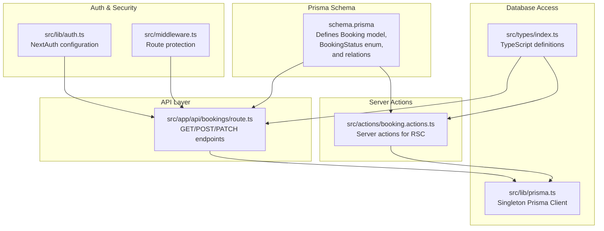
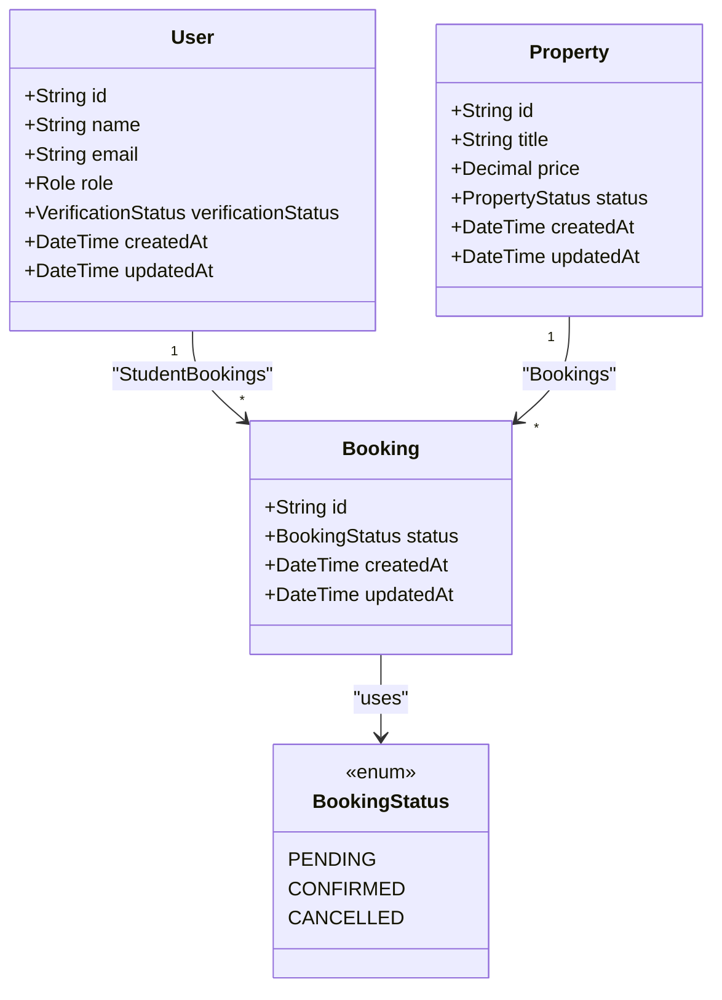
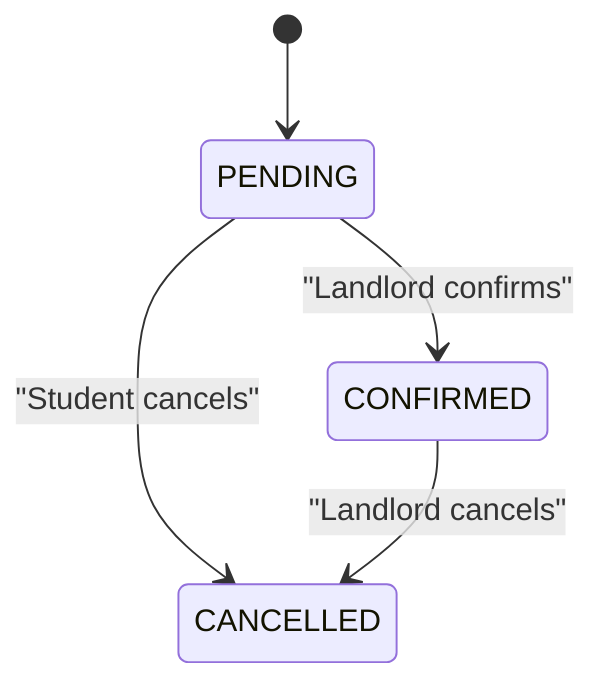
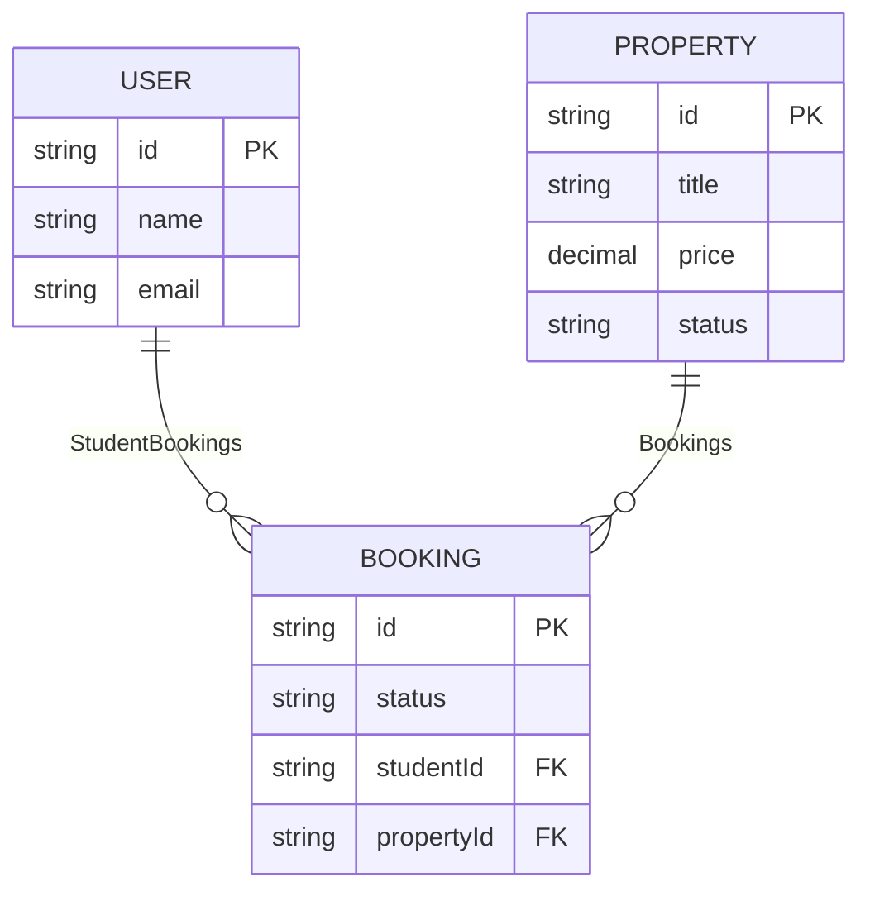
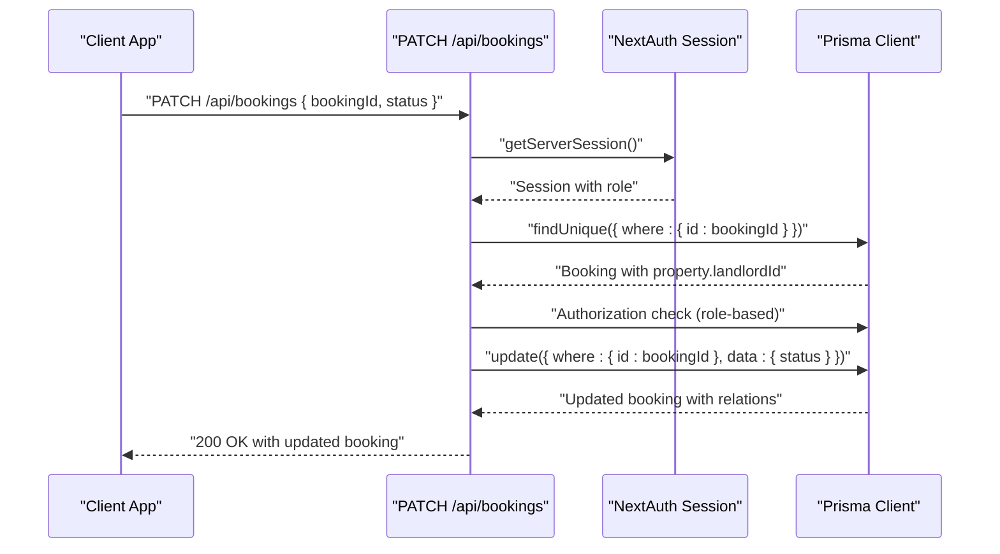
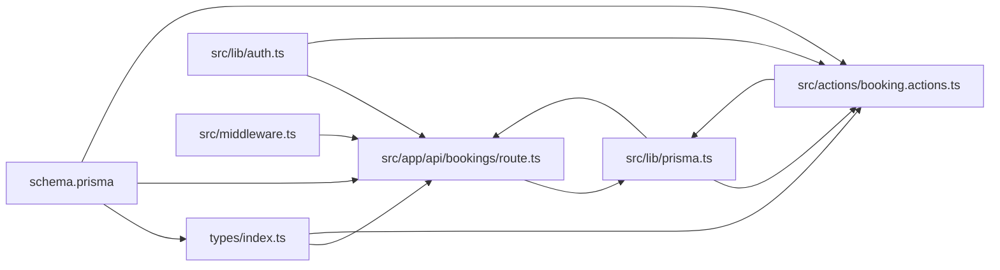

# Booking Entity

<cite>
**Referenced Files in This Document**
- [schema.prisma](file://prisma/schema.prisma)
- [route.ts](file://src/app/api/bookings/route.ts)
- [booking.actions.ts](file://src/actions/booking.actions.ts)
- [prisma.ts](file://src/lib/prisma.ts)
- [auth.ts](file://src/lib/auth.ts)
- [middleware.ts](file://src/middleware.ts)
- [index.ts](file://src/types/index.ts)
</cite>

## Update Summary
**Changes Made**
- Updated API endpoints section to reflect the complete implementation including PATCH endpoint for status updates
- Enhanced BookingStatus enum workflow documentation with detailed state transitions
- Added comprehensive coverage of both server-side actions and API routes
- Expanded relationship management section with bidirectional cascade behavior
- Updated field constraints and data types with complete Prisma schema integration
- Enhanced security considerations with role-based access control documentation

## Table of Contents
1. [Introduction](#introduction)
2. [Project Structure](#project-structure)
3. [Core Components](#core-components)
4. [Architecture Overview](#architecture-overview)
5. [Detailed Component Analysis](#detailed-component-analysis)
6. [Dependency Analysis](#dependency-analysis)
7. [Performance Considerations](#performance-considerations)
8. [Troubleshooting Guide](#troubleshooting-guide)
9. [Conclusion](#conclusion)

## Introduction
This document provides comprehensive documentation for the Booking entity in RentalHub-BOUESTI. The Booking entity represents student requests to book rental properties and is central to the platform's core functionality. It includes a complete booking management system with status tracking, role-based access control, and comprehensive API endpoints for creating, listing, and updating bookings.

## Project Structure
The Booking entity is defined in the Prisma schema and exposed through multiple entry points: dedicated API routes, server actions, and TypeScript type definitions. The system implements both server-side actions for React Server Components and traditional API endpoints for client applications.

**Diagram sources**
- [schema.prisma:116-135](file://prisma/schema.prisma#L116-L135)
- [route.ts:1-182](file://src/app/api/bookings/route.ts#L1-L182)
- [booking.actions.ts:1-264](file://src/actions/booking.actions.ts#L1-L264)
- [auth.ts:1-119](file://src/lib/auth.ts#L1-L119)
- [middleware.ts:1-76](file://src/middleware.ts#L1-L76)
- [prisma.ts:1-27](file://src/lib/prisma.ts#L1-L27)
- [index.ts:1-109](file://src/types/index.ts#L1-L109)

**Section sources**
- [schema.prisma:116-135](file://prisma/schema.prisma#L116-L135)
- [route.ts:1-182](file://src/app/api/bookings/route.ts#L1-L182)
- [booking.actions.ts:1-264](file://src/actions/booking.actions.ts#L1-L264)
- [prisma.ts:1-27](file://src/lib/prisma.ts#L1-L27)
- [auth.ts:1-119](file://src/lib/auth.ts#L1-L119)
- [middleware.ts:1-76](file://src/middleware.ts#L1-L76)
- [index.ts:1-109](file://src/types/index.ts#L1-L109)

## Core Components
- **Booking model**: Represents a student's request to book a property with comprehensive status tracking
- **BookingStatus enum**: Defines lifecycle states (PENDING, CONFIRMED, CANCELLED) with complete workflow
- **Bidirectional relationships**: With User (student) and Property entities with cascading deletes
- **Multiple access patterns**: Both API endpoints and server actions for different use cases
- **Role-based access control**: Different permissions for STUDENT, LANDLORD, and ADMIN users
- **Index optimization**: Strategic indexes for efficient querying on studentId, propertyId, and status

Key attributes and defaults:
- **id**: String, auto-generated unique identifier using cuid()
- **status**: BookingStatus enum, default PENDING
- **createdAt/updatedAt**: Timestamps with automatic management
- **studentId/propertyId**: Required foreign keys with cascade delete behavior

Constraints and defaults:
- Default status is PENDING for new bookings
- createdAt defaults to current timestamp
- updatedAt updates automatically on record modification
- Status can only transition through defined enum values

**Section sources**
- [schema.prisma:116-135](file://prisma/schema.prisma#L116-L135)
- [route.ts:89-98](file://src/app/api/bookings/route.ts#L89-L98)
- [booking.actions.ts:37-116](file://src/actions/booking.actions.ts#L37-L116)

## Architecture Overview
The Booking entity participates in a three-model ecosystem: User, Property, and Booking. The system provides dual access patterns - traditional API endpoints for client applications and server actions for React Server Components. Authentication is handled centrally through NextAuth.js with comprehensive role-based access control.

**Diagram sources**
- [schema.prisma:44-62](file://prisma/schema.prisma#L44-L62)
- [schema.prisma:81-114](file://prisma/schema.prisma#L81-L114)
- [schema.prisma:116-135](file://prisma/schema.prisma#L116-L135)
- [schema.prisma:35-39](file://prisma/schema.prisma#L35-L39)

**Section sources**
- [schema.prisma:44-62](file://prisma/schema.prisma#L44-L62)
- [schema.prisma:81-114](file://prisma/schema.prisma#L81-L114)
- [schema.prisma:116-135](file://prisma/schema.prisma#L116-L135)
- [schema.prisma:35-39](file://prisma/schema.prisma#L35-L39)

## Detailed Component Analysis

### Booking Model Definition
The Booking model is defined in the Prisma schema with comprehensive field definitions and relationships:

- **Fields**:
  - `id`: Unique identifier using cuid() generator
  - `status`: Enumerated state with default PENDING
  - `createdAt/updatedAt`: Automatic timestamp management
  - `studentId`: Foreign key to User with cascade delete
  - `propertyId`: Foreign key to Property with cascade delete

- **Defaults**:
  - status defaults to PENDING for new bookings
  - createdAt defaults to current timestamp
  - updatedAt updates automatically on record change

- **Relationships**:
  - student: Relation to User with onDelete: Cascade
  - property: Relation to Property with onDelete: Cascade

- **Indexes**:
  - Composite indexes on studentId, propertyId, and status for efficient filtering and joins

**Section sources**
- [schema.prisma:116-135](file://prisma/schema.prisma#L116-L135)

### BookingStatus Enum and Complete Workflow
The BookingStatus enum defines a comprehensive three-state lifecycle:

- **PENDING**: Initial state when a student submits a booking request
- **CONFIRMED**: State when a landlord approves the booking request
- **CANCELLED**: State when either party cancels the booking

Complete workflow with role-based transitions:
- **Creation**: Students submit PENDING requests
- **Approval**: Landlords can change PENDING to CONFIRMED
- **Cancellation**: Students can cancel PENDING bookings, landlords can cancel CONFIRMED bookings
- **State validation**: System prevents invalid state transitions

**Diagram sources**
- [schema.prisma:35-39](file://prisma/schema.prisma#L35-L39)
- [route.ts:124-126](file://src/app/api/bookings/route.ts#L124-L126)

**Section sources**
- [schema.prisma:35-39](file://prisma/schema.prisma#L35-L39)
- [route.ts:124-126](file://src/app/api/bookings/route.ts#L124-L126)

### Bidirectional Relationships and Cascading Deletes
The Booking entity maintains strong bidirectional relationships with both User and Property entities:

- **Student-to-Booking**: One-to-many relationship with cascade delete
  - Deleting a student automatically removes all their bookings
  - Prevents orphaned booking records

- **Property-to-Booking**: One-to-many relationship with cascade delete
  - Deleting a property automatically removes all its bookings
  - Maintains referential integrity

- **Cascade behavior**: Ensures data consistency and prevents orphaned records

**Diagram sources**
- [schema.prisma:44-62](file://prisma/schema.prisma#L44-L62)
- [schema.prisma:81-114](file://prisma/schema.prisma#L81-L114)
- [schema.prisma:116-135](file://prisma/schema.prisma#L116-L135)

**Section sources**
- [schema.prisma:44-62](file://prisma/schema.prisma#L44-L62)
- [schema.prisma:81-114](file://prisma/schema.prisma#L81-L114)
- [schema.prisma:116-135](file://prisma/schema.prisma#L116-L135)

### Field Constraints, Data Types, and Defaults
Complete field specification with Prisma schema integration:

- **id**: String, @id, @default(cuid()) ensures globally unique identifiers
- **status**: BookingStatus enum with @default(PENDING)
- **createdAt/updatedAt**: DateTime with @default(now()) and @updatedAt
- **Foreign keys**: studentId and propertyId are required strings
- **Indexes**: studentId, propertyId, and status indexed for performance

Additional constraints:
- Status field uses BookingStatus enum for type safety
- Cascade delete ensures referential integrity
- Automatic timestamp management reduces manual overhead

**Section sources**
- [schema.prisma:116-135](file://prisma/schema.prisma#L116-L135)

### Indexing Strategies for Query Performance
Strategic indexing for optimal query performance:

- **studentId index**: Efficiently filters bookings by student
- **propertyId index**: Efficiently filters bookings by property
- **status index**: Efficiently filters by booking state
- **Combined with relations**: Optimizes JOINs and WHERE clauses commonly used in listing and filtering

These indexes support the three primary query patterns:
- Student-specific booking lists
- Property-specific booking management
- Status-based filtering for reporting

**Section sources**
- [schema.prisma:131-133](file://prisma/schema.prisma#L131-L133)

### API Endpoints and Complete Business Logic
The system provides three comprehensive endpoints with role-based access control:

#### GET /api/bookings
**Purpose**: List bookings for the authenticated user
**Behavior**:
- Students: Only their own bookings
- Landlords: Bookings for properties they own
- Admins: All bookings
**Includes**: Related student and property details with location and landlord info

#### POST /api/bookings
**Purpose**: Create a booking request (students only)
**Validation**:
- Must be authenticated and have role STUDENT
- Property must exist and be APPROVED
- Prevents duplicate active bookings (PENDING or CONFIRMED) for the same student and property
**Outcome**: Creates a booking with status PENDING

#### PATCH /api/bookings
**Purpose**: Update booking status (approval/cancellation)
**Validation**:
- Requires authentication
- Students can only cancel bookings (change to CANCELLED)
- Landlords can approve (CONFIRMED) or cancel (CANCELLED) bookings
- Validates booking ownership and current state
**Outcome**: Updates booking status with proper authorization checks

**Diagram sources**
- [route.ts:110-181](file://src/app/api/bookings/route.ts#L110-L181)
- [auth.ts:95-118](file://src/lib/auth.ts#L95-L118)
- [prisma.ts:13-27](file://src/lib/prisma.ts#L13-L27)

**Section sources**
- [route.ts:11-45](file://src/app/api/bookings/route.ts#L11-L45)
- [route.ts:47-108](file://src/app/api/bookings/route.ts#L47-L108)
- [route.ts:110-181](file://src/app/api/bookings/route.ts#L110-L181)
- [auth.ts:95-118](file://src/lib/auth.ts#L95-L118)
- [prisma.ts:13-27](file://src/lib/prisma.ts#L13-L27)

### Server Actions Implementation
In addition to API endpoints, the system provides server actions for React Server Components:

#### createBookingRequest
- Validates property availability and student eligibility
- Prevents duplicate active bookings
- Creates booking with proper relations included
- Triggers cache revalidation for student and landlord dashboards

#### getStudentBookings
- Fetches all bookings for a specific student
- Includes student and property details
- Orders by creation date (newest first)

#### getLandlordBookings
- Fetches all bookings for properties owned by a landlord
- Includes comprehensive property and student information
- Supports landlord dashboard functionality

#### updateBookingStatus
- Handles status updates with proper authorization
- Supports both CONFIRMED and CANCELLED states
- Updates related cache for real-time UI updates

**Section sources**
- [booking.actions.ts:37-116](file://src/actions/booking.actions.ts#L37-L116)
- [booking.actions.ts:123-160](file://src/actions/booking.actions.ts#L123-L160)
- [booking.actions.ts:167-208](file://src/actions/booking.actions.ts#L167-L208)
- [booking.actions.ts:216-263](file://src/actions/booking.actions.ts#L216-L263)

### Relationship Management Between Students and Properties
The booking system manages complex relationships with comprehensive authorization:

- **Student permissions**: Can only view and cancel their own bookings
- **Landlord permissions**: Can view and manage bookings for their properties
- **Admin oversight**: Can view all bookings for system management
- **Property validation**: Ensures properties are APPROVED before accepting bookings
- **Duplicate prevention**: Blocks multiple active bookings for the same student-property combination

TypeScript integration:
- SafeUser excludes sensitive fields
- BookingWithRelations augments Booking with related student, property, location, and landlord
- Strong typing for all API responses and server actions

**Section sources**
- [index.ts:23-42](file://src/types/index.ts#L23-L42)
- [route.ts:19-24](file://src/app/api/bookings/route.ts#L19-L24)

## Dependency Analysis
The Booking entity integrates with multiple system components:

- **Prisma schema**: Defines model structure, relationships, and indexes
- **API routes**: Handle HTTP requests with comprehensive validation
- **Server actions**: Support React Server Components with cache management
- **Authentication**: NextAuth.js provides session management and role-based access
- **Middleware**: Enforces route protection for protected areas
- **Type definitions**: TypeScript types ensure type safety across the application

**Diagram sources**
- [schema.prisma:116-135](file://prisma/schema.prisma#L116-L135)
- [index.ts:9-18](file://src/types/index.ts#L9-L18)
- [route.ts:1-182](file://src/app/api/bookings/route.ts#L1-L182)
- [booking.actions.ts:1-264](file://src/actions/booking.actions.ts#L1-L264)
- [auth.ts:1-119](file://src/lib/auth.ts#L1-L119)
- [middleware.ts:1-76](file://src/middleware.ts#L1-L76)
- [prisma.ts:1-27](file://src/lib/prisma.ts#L1-L27)

**Section sources**
- [schema.prisma:116-135](file://prisma/schema.prisma#L116-L135)
- [route.ts:1-182](file://src/app/api/bookings/route.ts#L1-L182)
- [booking.actions.ts:1-264](file://src/actions/booking.actions.ts#L1-L264)
- [auth.ts:1-119](file://src/lib/auth.ts#L1-L119)
- [middleware.ts:1-76](file://src/middleware.ts#L1-L76)
- [prisma.ts:1-27](file://src/lib/prisma.ts#L1-L27)
- [index.ts:9-18](file://src/types/index.ts#L9-L18)

## Performance Considerations
The booking system implements several performance optimizations:

- **Strategic indexing**: studentId, propertyId, and status indexes enable fast filtering and JOINs
- **Query optimization**: Selective field inclusion reduces payload size
- **Cache management**: Server actions trigger cache revalidation for real-time updates
- **Singleton Prisma client**: Minimizes connection overhead across the application
- **Role-based filtering**: Reduces query complexity by limiting data scope per user role

Best practices:
- Use selective field inclusion in queries to minimize data transfer
- Leverage existing indexes for common filtering patterns
- Implement pagination for large booking lists
- Monitor query performance using Prisma client logging in development

## Troubleshooting Guide
Common issues and resolutions:

### Authentication and Authorization Issues
- **Authentication required**: Ensure a valid session exists; verify NextAuth configuration
- **Role restrictions**: Students cannot create bookings; only STUDENT role can make requests
- **Permission denied**: Landlords can only update bookings for their properties; admins have full access

### Booking Validation Errors
- **Property not found**: Validate property ID exists and belongs to the system
- **Property not approved**: Ensure property status is APPROVED before booking
- **Duplicate active booking**: Cannot create another PENDING or CONFIRMED booking for the same property and student
- **Invalid status update**: Only CONFIRMED and CANCELLED statuses are valid for updates

### API and Server Action Issues
- **Internal errors**: Check Prisma client logs and server-side error responses
- **Cache synchronization**: Server actions automatically trigger cache revalidation
- **Data consistency**: Cascade delete ensures referential integrity is maintained

**Section sources**
- [route.ts:15-17](file://src/app/api/bookings/route.ts#L15-L17)
- [route.ts:55-57](file://src/app/api/bookings/route.ts#L55-L57)
- [route.ts:66-72](file://src/app/api/bookings/route.ts#L66-L72)
- [route.ts:82-87](file://src/app/api/bookings/route.ts#L82-L87)
- [route.ts:143-149](file://src/app/api/bookings/route.ts#L143-L149)
- [prisma.ts:15-20](file://src/lib/prisma.ts#L15-L20)

## Conclusion
The Booking entity in RentalHub-BOUESTI represents a comprehensive and well-architected solution for property booking management. The system successfully implements:

- **Complete booking lifecycle**: From initial request to final confirmation or cancellation
- **Robust access control**: Role-based permissions ensure appropriate data access
- **Strong data integrity**: Cascade relationships and validation prevent inconsistent states
- **Flexible access patterns**: Both API endpoints and server actions support diverse use cases
- **Performance optimization**: Strategic indexing and query optimization ensure responsive user experience

The BookingStatus enum provides clear state management with logical transitions, while the bidirectional relationships with User and Property entities ensure comprehensive coverage of the booking ecosystem. The system is ready for production deployment with comprehensive error handling, validation, and security measures in place.