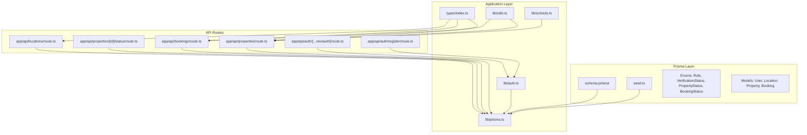
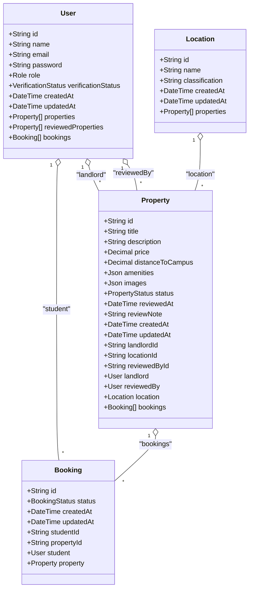
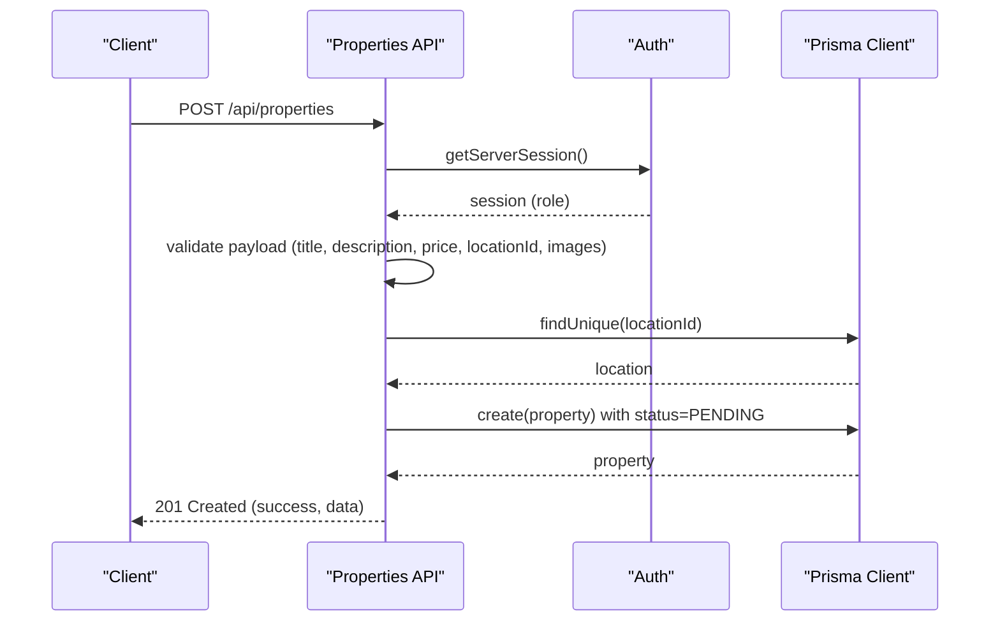
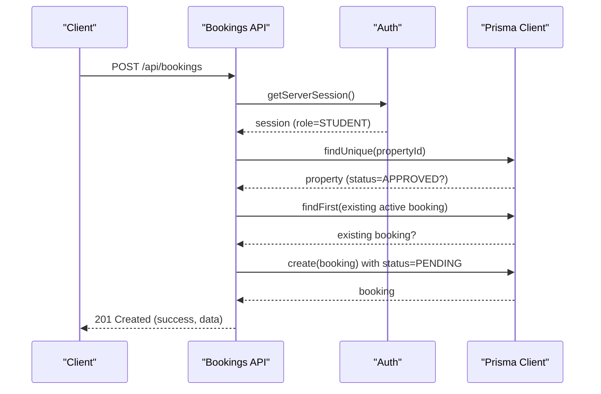
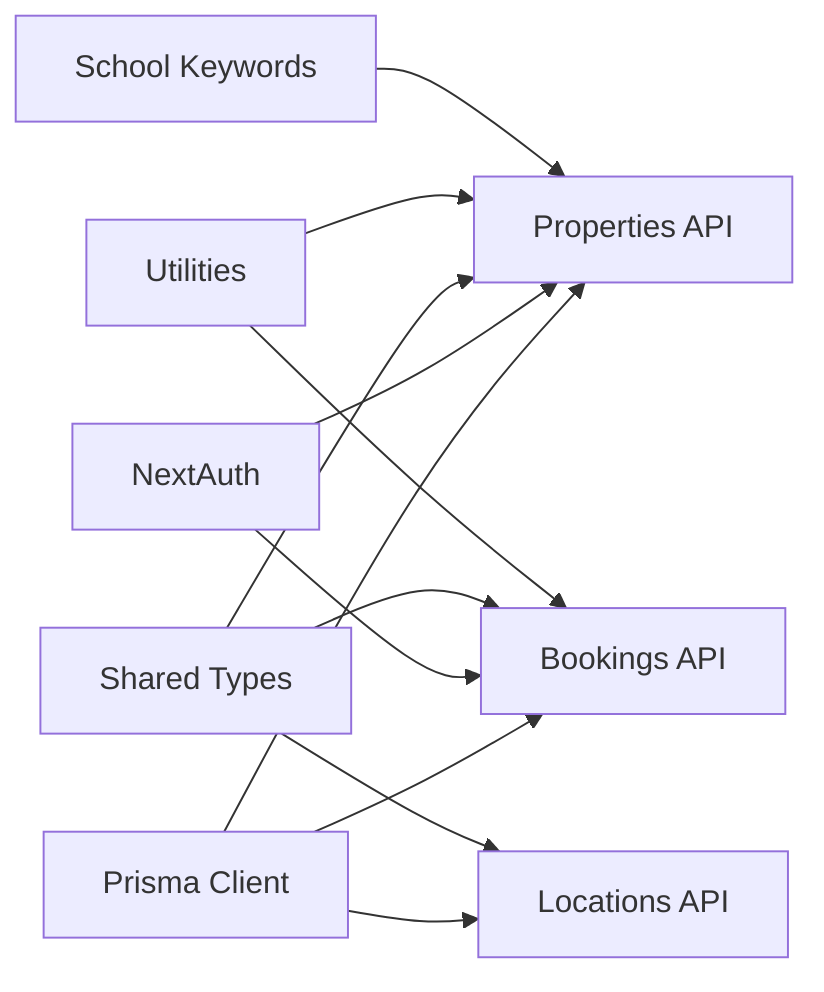
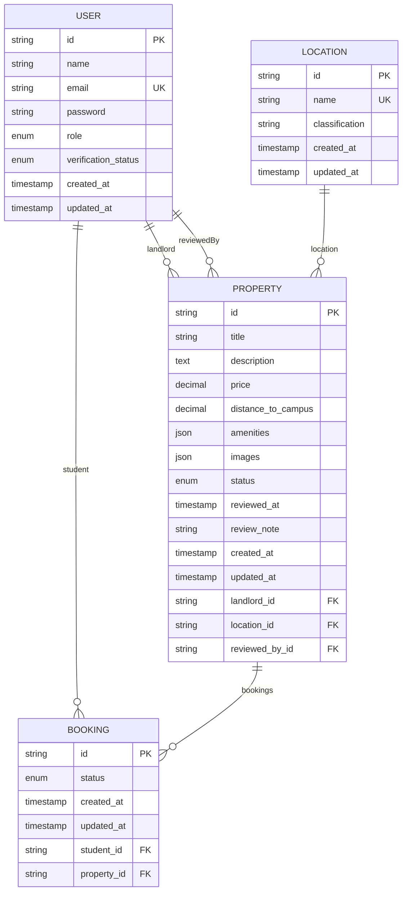

# Database Schema & Data Model

<cite>
**Referenced Files in This Document**
- [schema.prisma](file://prisma/schema.prisma)
- [seed.ts](file://prisma/seed.ts)
- [prisma.ts](file://src/lib/prisma.ts)
- [auth.ts](file://src/lib/auth.ts)
- [types/index.ts](file://src/types/index.ts)
- [properties/route.ts](file://src/app/api/properties/route.ts)
- [properties/[id]/status/route.ts](file://src/app/api/properties/[id]/status/route.ts)
- [bookings/route.ts](file://src/app/api/bookings/route.ts)
- [locations/route.ts](file://src/app/api/locations/route.ts)
- [utils.ts](file://src/lib/utils.ts)
- [schools.ts](file://src/lib/schools.ts)
- [package.json](file://package.json)
</cite>

## Update Summary
**Changes Made**
- Updated schema definition to reflect comprehensive Prisma ORM implementation
- Added detailed enum definitions and field specifications
- Enhanced property management with review tracking fields
- Expanded booking workflow with PATCH endpoint for status updates
- Updated location classification taxonomy with detailed categories
- Enhanced authentication integration with Prisma adapter
- Added comprehensive API route implementations and validation rules

## Table of Contents
1. [Introduction](#introduction)
2. [Project Structure](#project-structure)
3. [Core Components](#core-components)
4. [Architecture Overview](#architecture-overview)
5. [Detailed Component Analysis](#detailed-component-analysis)
6. [Dependency Analysis](#dependency-analysis)
7. [Performance Considerations](#performance-considerations)
8. [Troubleshooting Guide](#troubleshooting-guide)
9. [Conclusion](#conclusion)
10. [Appendices](#appendices)

## Introduction
This document describes the RentalHub-BOUESTI PostgreSQL database schema and data model implemented with Prisma ORM. It focuses on four core entities: User, Property, Booking, and Location with comprehensive enum definitions and advanced business logic. The schema supports a sophisticated role-based system (STUDENT, LANDLORD, ADMIN), property approval workflow with review tracking, booking management with status transitions, and location classification around BOUESTI campus. Entity relationship diagrams, sample data from the seed script, and comprehensive validation rules are included.

## Project Structure
The data model is defined in Prisma schema with PostgreSQL as the backend database. The Prisma client is configured as a singleton and integrated with NextAuth for authentication. API routes enforce business rules and provide comprehensive CRUD operations.

**Diagram sources**
- [schema.prisma](file://prisma/schema.prisma)
- [seed.ts](file://prisma/seed.ts)
- [prisma.ts](file://src/lib/prisma.ts)
- [auth.ts](file://src/lib/auth.ts)
- [types/index.ts](file://src/types/index.ts)
- [properties/route.ts](file://src/app/api/properties/route.ts)
- [properties/[id]/status/route.ts](file://src/app/api/properties/[id]/status/route.ts)
- [bookings/route.ts](file://src/app/api/bookings/route.ts)
- [locations/route.ts](file://src/app/api/locations/route.ts)
- [utils.ts](file://src/lib/utils.ts)
- [schools.ts](file://src/lib/schools.ts)

**Section sources**
- [schema.prisma](file://prisma/schema.prisma)
- [prisma.ts](file://src/lib/prisma.ts)

## Core Components
This section defines each entity with comprehensive field definitions, data types, constraints, and relationships.

### User Entity
- **Purpose**: Platform users with comprehensive role-based access control and verification status
- **Fields**:
  - `id`: String, primary key, cuid()
  - `name`: String
  - `email`: String, unique
  - `password`: String (bcrypt-hashed)
  - `role`: Enum Role (STUDENT, LANDLORD, ADMIN), default STUDENT
  - `verificationStatus`: Enum VerificationStatus (UNVERIFIED, VERIFIED, SUSPENDED), default UNVERIFIED
  - `createdAt`: DateTime, default now()
  - `updatedAt`: DateTime, default now() and updated on modification
- **Indexes**: email, role
- **Mapped name**: users
- **Relationships**: 
  - Owns many Property (LandlordProperties)
  - Reviews many Property (PropertyReviews)
  - Makes many Booking (StudentBookings)

### Location Entity
- **Purpose**: Geographical area classification around BOUESTI campus
- **Fields**:
  - `id`: String, primary key, cuid()
  - `name`: String, unique
  - `classification`: String, default "Neighbourhood"
  - `createdAt`: DateTime, default now()
  - `updatedAt`: DateTime, default now() and updated on modification
- **Indexes**: classification
- **Mapped name**: locations
- **Relationships**: Contains many Property

### Property Entity
- **Purpose**: Rental property listing with comprehensive review tracking
- **Fields**:
  - `id`: String, primary key, cuid()
  - `title`: String
  - `description`: String (Text)
  - `price`: Decimal (10,2), monthly rent in NGN
  - `distanceToCampus`: Decimal (5,2), kilometers to BOUESTI main gate (nullable)
  - `amenities`: Json, default "[]"
  - `images`: Json, default "[]"
  - `status`: Enum PropertyStatus (PENDING, APPROVED, REJECTED), default PENDING
  - `reviewedAt`: DateTime, nullable
  - `reviewNote`: String, nullable
  - `createdAt`: DateTime, default now()
  - `updatedAt`: DateTime, default now() and updated on modification
  - `landlordId`: String (foreign key)
  - `locationId`: String (foreign key)
  - `reviewedById`: String, nullable (foreign key)
- **Indexes**: landlordId, locationId, status, reviewedById, price
- **Mapped name**: properties
- **Relationships**:
  - Belongs to User (landlord) via landlordId
  - Belongs to Location via locationId
  - Belongs to User (reviewedBy) via reviewedById
  - Has many Booking

### Booking Entity
- **Purpose**: Student property booking requests with comprehensive status management
- **Fields**:
  - `id`: String, primary key, cuid()
  - `status`: Enum BookingStatus (PENDING, CONFIRMED, CANCELLED), default PENDING
  - `createdAt`: DateTime, default now()
  - `updatedAt`: DateTime, default now() and updated on modification
  - `studentId`: String (foreign key)
  - `propertyId`: String (foreign key)
- **Indexes**: studentId, propertyId, status
- **Mapped name**: bookings
- **Relationships**:
  - Belongs to User (student) via studentId
  - Belongs to Property via propertyId

### Enum Definitions
- **Role**: STUDENT, LANDLORD, ADMIN
- **VerificationStatus**: UNVERIFIED, VERIFIED, SUSPENDED
- **PropertyStatus**: PENDING, APPROVED, REJECTED
- **BookingStatus**: PENDING, CONFIRMED, CANCELLED

Constraints and defaults:
- Unique constraints: email on User, name on Location
- Default values: role, verificationStatus, status, classification, timestamps
- Cascading operations:
  - Property.landlordId references User.id with onDelete: Cascade
  - Property.reviewedById references User.id with onDelete: SetNull
  - Booking.studentId references User.id with onDelete: Cascade
  - Booking.propertyId references Property.id with onDelete: Cascade

**Section sources**
- [schema.prisma](file://prisma/schema.prisma)

## Architecture Overview
The application enforces data integrity via Prisma schema with PostgreSQL backend and validates business rules in API routes. Authentication integrates with Prisma adapter for seamless user management. The architecture supports comprehensive role-based access control, property approval workflows, and booking management.

**Diagram sources**
- [schema.prisma](file://prisma/schema.prisma)

## Detailed Component Analysis

### User Entity
- **Role-based access control**:
  - STUDENT: can create bookings, view own properties
  - LANDLORD: can create properties, view own listings, manage bookings for their properties
  - ADMIN: can manage property statuses, review properties, view all resources
- **Verification status affects login**:
  - SUSPENDED prevents login
  - UNVERIFIED requires admin verification
- **Password security**:
  - Stored as bcrypt hashes with salt rounds of 12
  - Never stored in plain text

**Section sources**
- [schema.prisma](file://prisma/schema.prisma)
- [auth.ts](file://src/lib/auth.ts)

### Location Entity
- **Classification taxonomy**:
  - Core Quarter: Primary campus areas (Uro, Odo Oja)
  - Ward: Administrative divisions (Afao)
  - Residential Estate: Formal residential developments (Olumilua Area, Ikoyi Estate)
  - Neighbourhood: Informal residential areas (Oke 'Kere, Ajebandele, Amoye Grammar School Area)
- **Purpose**:
  - Associate properties with nearby areas for search and filtering
  - Support school proximity searches
- **Indexing**:
  - classification indexed for efficient grouping and filtering

**Section sources**
- [schema.prisma](file://prisma/schema.prisma)
- [seed.ts](file://prisma/seed.ts)
- [locations/route.ts](file://src/app/api/locations/route.ts)
- [schools.ts](file://src/lib/schools.ts)

### Property Entity
- **Lifecycle management**:
  - Creation sets status to PENDING
  - Admin can set APPROVED or REJECTED
  - Approved properties appear in browse/search results
  - Review tracking includes reviewer, timestamp, and notes
- **Advanced validation**:
  - Requires title, description, price, locationId, and at least one image
  - Validates location existence before creation
  - Supports distance-to-campus calculations
- **Search and filtering capabilities**:
  - Filters by status (default APPROVED), location name, price range
  - Supports school proximity searches using keyword matching
  - Pagination with configurable page size (max 50)
  - Sorting by price, createdAt, or distanceToCampus

**Diagram sources**
- [properties/route.ts](file://src/app/api/properties/route.ts)
- [auth.ts](file://src/lib/auth.ts)
- [prisma.ts](file://src/lib/prisma.ts)

**Section sources**
- [properties/route.ts](file://src/app/api/properties/route.ts)
- [properties/[id]/status/route.ts](file://src/app/api/properties/[id]/status/route.ts)
- [schema.prisma](file://prisma/schema.prisma)

### Booking Entity
- **Enhanced workflow**:
  - Students submit PENDING requests for APPROVED properties
  - Duplicate active bookings prevented (PENDING or CONFIRMED)
  - PATCH endpoint allows status updates with role-based restrictions
  - Students can only cancel their own bookings
  - Landlords can only update requests for their own listings
  - Admin has full access to all bookings
- **Access control matrix**:
  - GET: All users see their own bookings; ADMIN sees all
  - POST: Restricted to STUDENT role
  - PATCH: STUDENT can only cancel; LANDLORD can only confirm/reject own listings; ADMIN can update any booking

**Diagram sources**
- [bookings/route.ts](file://src/app/api/bookings/route.ts)
- [auth.ts](file://src/lib/auth.ts)
- [prisma.ts](file://src/lib/prisma.ts)

**Section sources**
- [bookings/route.ts](file://src/app/api/bookings/route.ts)
- [schema.prisma](file://prisma/schema.prisma)

### Data Validation Rules
- **Properties**:
  - Required: title, description, price, locationId, images array with at least one item
  - Defaults: status=PENDING, amenities="[]", images="[]", classification="Neighbourhood"
  - Numeric conversions: distanceToCampus cast to number; null if absent
  - School proximity: supports keyword-based location matching
- **Bookings**:
  - Required: propertyId
  - Business rule: property.status must be APPROVED
  - Business rule: no duplicate active bookings (PENDING or CONFIRMED)
  - Status transitions: CONFIRMED/CANCELLED only via PATCH endpoint
- **Users**:
  - Authentication requires verified accounts; SUSPENDED accounts blocked
  - Passwords are hashed with bcrypt before storage
  - Email uniqueness enforced

**Section sources**
- [properties/route.ts](file://src/app/api/properties/route.ts)
- [bookings/route.ts](file://src/app/api/bookings/route.ts)
- [auth.ts](file://src/lib/auth.ts)
- [seed.ts](file://prisma/seed.ts)

### Sample Data from Seed Script
- **Locations**:
  - Uro (Core Quarter)
  - Odo Oja (Core Quarter)
  - Oke 'Kere (Neighbourhood)
  - Afao (Ward)
  - Olumilua Area (Residential Estate)
  - Ajebandele (Neighbourhood)
  - Ikoyi Estate (Residential Estate)
  - Amoye Grammar School Area (Neighbourhood)
- **Admin user**:
  - Name: BOUESTI Admin
  - Email: admin@bouesti.edu.ng
  - Role: ADMIN
  - Verification status: VERIFIED

**Section sources**
- [seed.ts](file://prisma/seed.ts)

## Dependency Analysis
- Prisma client is a singleton with development hot-reload optimization
- API routes depend on Prisma for reads/writes and on NextAuth for session-based authorization
- Types are shared across server and client to ensure consistency
- Authentication integrates with Prisma adapter for seamless user management

**Diagram sources**
- [prisma.ts](file://src/lib/prisma.ts)
- [auth.ts](file://src/lib/auth.ts)
- [types/index.ts](file://src/types/index.ts)
- [properties/route.ts](file://src/app/api/properties/route.ts)
- [bookings/route.ts](file://src/app/api/bookings/route.ts)
- [locations/route.ts](file://src/app/api/locations/route.ts)
- [utils.ts](file://src/lib/utils.ts)
- [schools.ts](file://src/lib/schools.ts)

**Section sources**
- [prisma.ts](file://src/lib/prisma.ts)
- [types/index.ts](file://src/types/index.ts)

## Performance Considerations
- **Indexing strategy**:
  - User: email, role
  - Location: classification
  - Property: landlordId, locationId, status, reviewedById, price
  - Booking: studentId, propertyId, status
- **Pagination and sorting**:
  - Properties API supports pagination with max 50 items per page
  - Sorting options: price, createdAt, distanceToCampus
  - School proximity searches use keyword-based filtering
- **Query optimization**:
  - Use selective includes (landlord, location, counts) to reduce round-trips
  - Leverage database indexes for efficient filtering
- **Development logging**:
  - Prisma client logs queries in development mode
  - Connection pooling optimized for hot-reload scenarios

## Troubleshooting Guide
- **Authentication failures**:
  - Ensure user verification status is not SUSPENDED
  - Confirm bcrypt-compare succeeds against stored hash
  - Verify NextAuth session contains role and verificationStatus
- **Authorization errors**:
  - Landlords can only create properties; students can only book
  - Admin-only endpoints require ADMIN role
  - PATCH operations have role-specific restrictions
- **Data integrity**:
  - Unique violations: email on User, name on Location
  - Cascading deletes: deleting a User or Property removes related records
  - Review tracking maintains audit trail
- **Validation errors**:
  - Missing required fields for property creation
  - Invalid propertyId or non-approved property for booking
  - Duplicate active booking detected
  - Invalid status values for property/status updates

**Section sources**
- [auth.ts](file://src/lib/auth.ts)
- [properties/route.ts](file://src/app/api/properties/route.ts)
- [bookings/route.ts](file://src/app/api/bookings/route.ts)
- [schema.prisma](file://prisma/schema.prisma)

## Conclusion
RentalHub-BOUESTI's PostgreSQL schema with Prisma ORM provides a robust foundation for property rental management. The comprehensive enum system, advanced role-based access control, property approval workflow with review tracking, and sophisticated booking management create a mature platform. The seed script initializes locations and a default admin, while the API routes implement strict business rules and validation. Proper indexing and pagination support efficient browsing and search capabilities around BOUESTI campus.

## Appendices

### Entity Relationship Diagram

**Diagram sources**
- [schema.prisma](file://prisma/schema.prisma)

### Data Lifecycle and Referential Integrity
- **Creation lifecycle**:
  - User: verified by admin; default STUDENT and UNVERIFIED
  - Property: created by LANDLORD with PENDING status and review tracking
  - Booking: created by STUDENT for APPROVED property
- **Update workflow**:
  - Property status managed by ADMIN (PENDING → APPROVED/REJECTED)
  - Review tracking includes reviewer, timestamp, and notes
  - Booking status transitions: PENDING → CONFIRMED/CANCELLED
- **Deletion behavior**:
  - CASCADE on User and Property deletes related records
  - SET NULL on review tracking when reviewer is deleted
- **Consistency guarantees**:
  - Unique indexes prevent duplicate emails and location names
  - Foreign keys enforce referential integrity
  - Review tracking maintains audit trail

**Section sources**
- [schema.prisma](file://prisma/schema.prisma)
- [properties/[id]/status/route.ts](file://src/app/api/properties/[id]/status/route.ts)
- [bookings/route.ts](file://src/app/api/bookings/route.ts)

### Display Labels and Amenities
- **Role labels**: STUDENT, LANDLORD, ADMIN
- **Property status labels**: Pending Review, Approved, Rejected
- **Booking status labels**: Pending, Confirmed, Cancelled
- **Available amenities**: WiFi, Electricity, Generator, Water, Security, Parking, Kitchen, Bathroom, Air Conditioning, Fans, Furnished, CCTV, Gated Community, Close to Market, Close to Main Road
- **Location classifications**: Core Quarter, Ward, Residential Estate, Neighbourhood

**Section sources**
- [utils.ts](file://src/lib/utils.ts)

### Database Configuration and Scripts
- **Database**: PostgreSQL (Railway)
- **Prisma client configuration**: Singleton with development optimizations
- **Available scripts**:
  - `npm run db:generate`: Generate Prisma client
  - `npm run db:seed`: Seed database with locations and admin user
  - `npm run db:studio`: Open Prisma Studio for database inspection
  - Development logging enabled for query monitoring

**Section sources**
- [package.json](file://package.json)
- [prisma.ts](file://src/lib/prisma.ts)