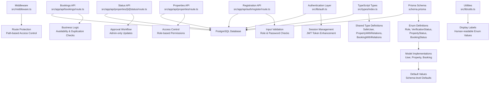
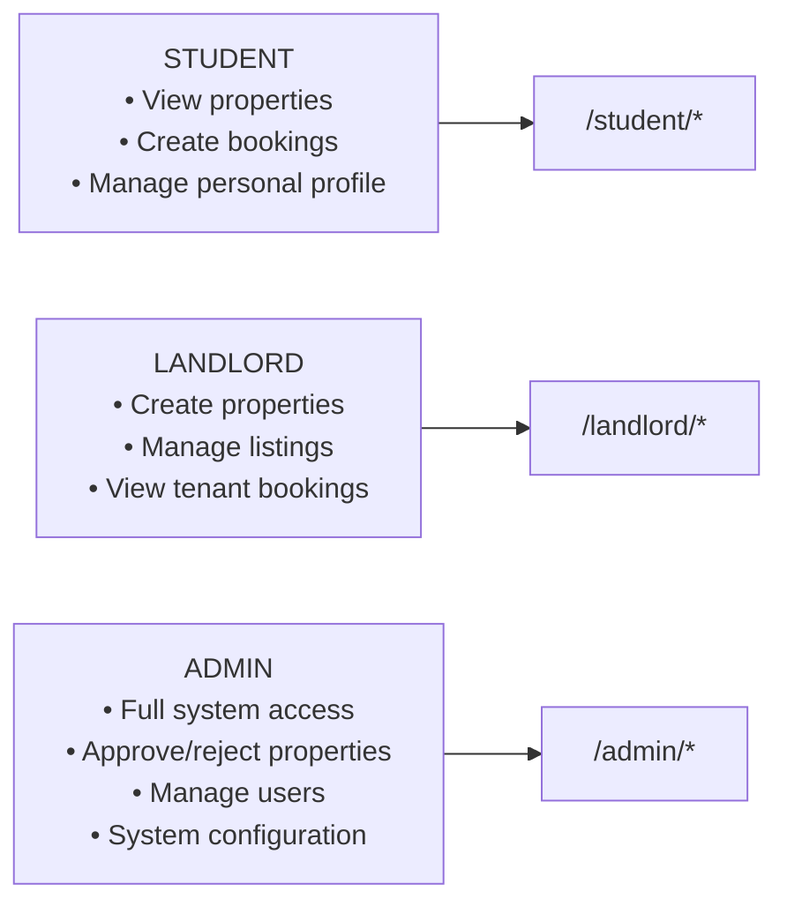
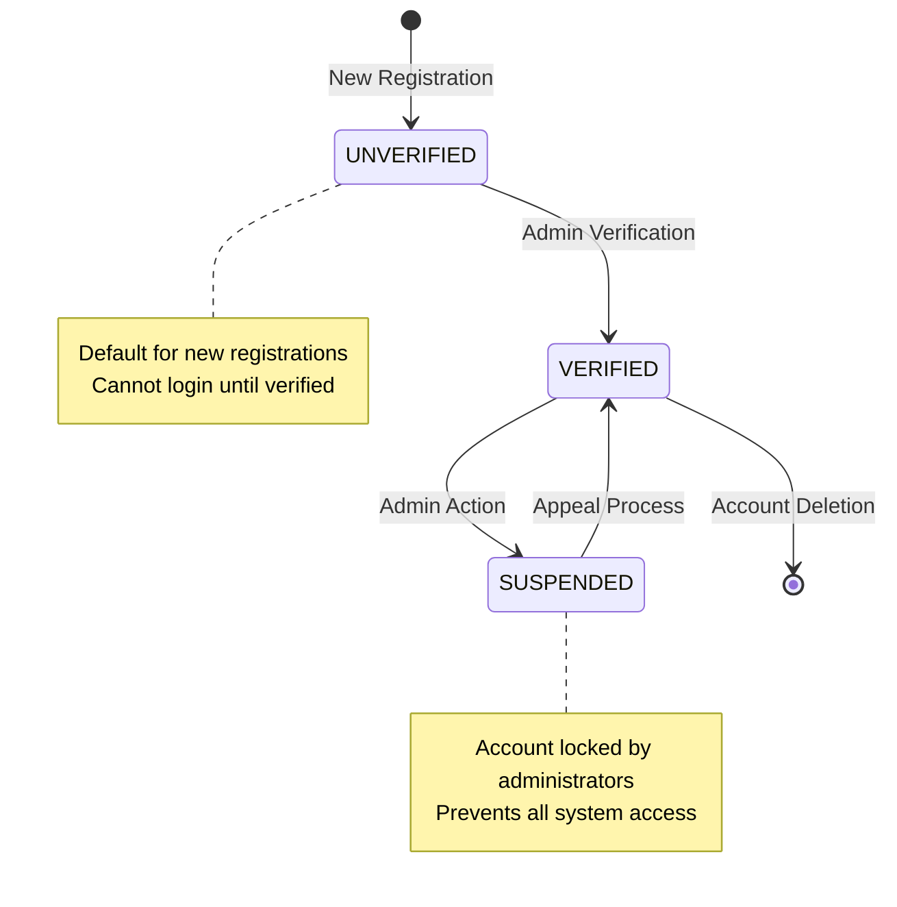
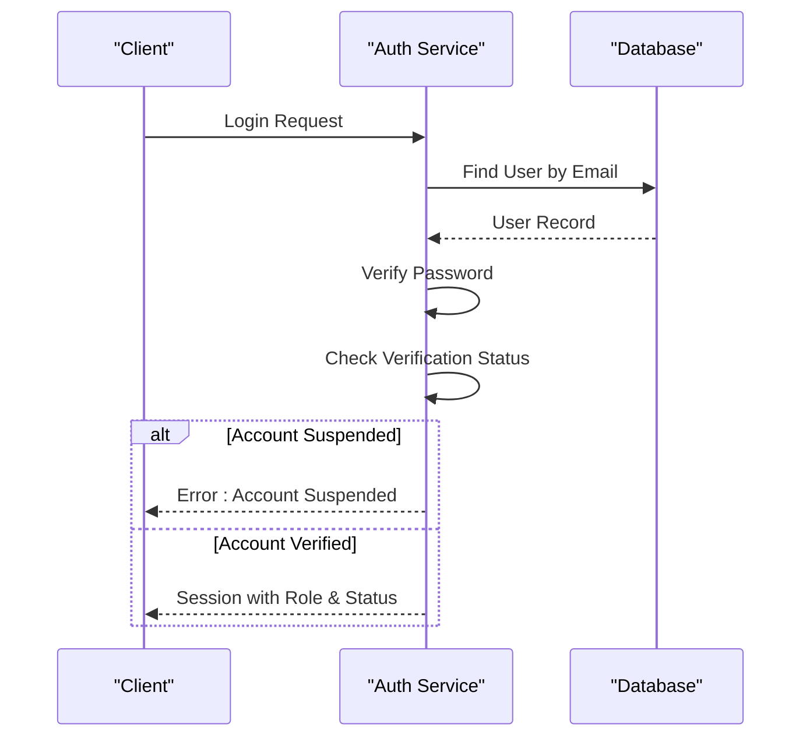
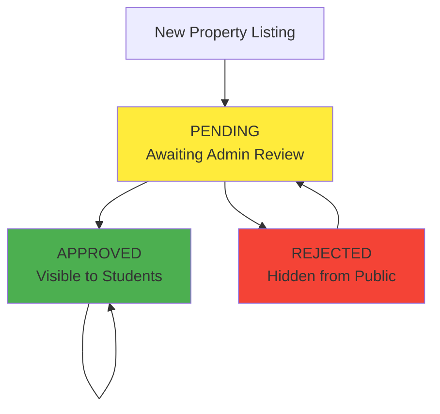
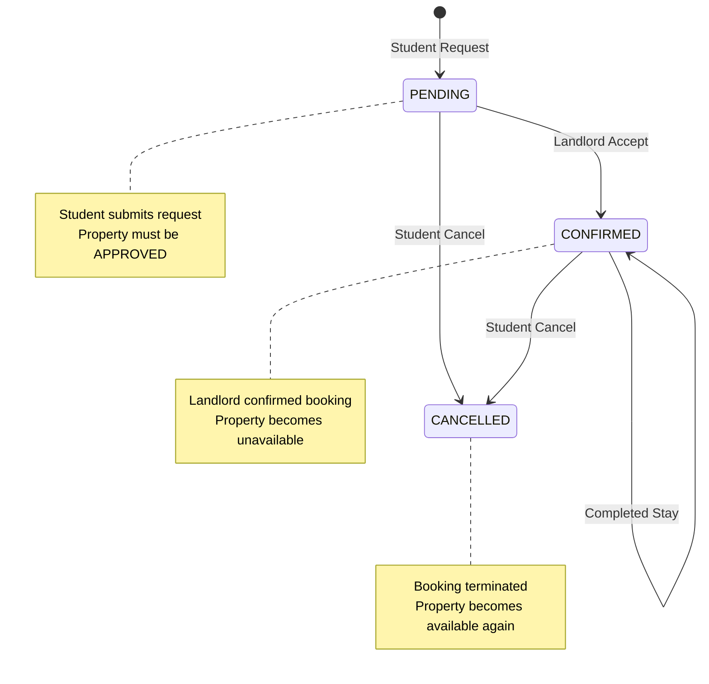

# Enums & Business Constraints

<cite>
**Referenced Files in This Document**
- [schema.prisma](file://prisma/schema.prisma)
- [types/index.ts](file://src/types/index.ts)
- [auth.ts](file://src/lib/auth.ts)
- [register/route.ts](file://src/app/api/auth/register/route.ts)
- [properties/route.ts](file://src/app/api/properties/route.ts)
- [properties/[id]/status/route.ts](file://src/app/api/properties/[id]/status/route.ts)
- [bookings/route.ts](file://src/app/api/bookings/route.ts)
- [middleware.ts](file://src/middleware.ts)
- [utils.ts](file://src/lib/utils.ts)
- [seed.ts](file://prisma/seed.ts)
</cite>

## Update Summary
**Changes Made**
- Comprehensive documentation of the newly implemented enum system
- Added detailed coverage of Role, VerificationStatus, PropertyStatus, and BookingStatus enums
- Enhanced business constraint explanations with concrete enforcement mechanisms
- Updated architecture diagrams to reflect the complete enum enforcement pipeline
- Added practical examples of enum usage in API responses and business logic

## Table of Contents
1. [Introduction](#introduction)
2. [Enum System Architecture](#enum-system-architecture)
3. [Role Enum](#role-enum)
4. [VerificationStatus Enum](#verificationstatus-enum)
5. [PropertyStatus Enum](#propertystatus-enum)
6. [BookingStatus Enum](#bookingstatus-enum)
7. [Business Constraint Enforcement](#business-constraint-enforcement)
8. [API Integration Patterns](#api-integration-patterns)
9. [Client-Side Enum Handling](#client-side-enum-handling)
10. [Database Implementation](#database-implementation)
11. [Performance Considerations](#performance-considerations)
12. [Troubleshooting Guide](#troubleshooting-guide)
13. [Conclusion](#conclusion)

## Introduction
This document provides comprehensive coverage of RentalHub-BOUESTI's enum system and business constraints that govern access control and operational workflows. The system implements four core enums defined in the Prisma schema and enforced across API endpoints, middleware, and authentication layers:

- **Role**: STUDENT, LANDLORD, ADMIN - defines user access tiers and permissions
- **VerificationStatus**: UNVERIFIED, VERIFIED, SUSPENDED - controls account lifecycle and login eligibility  
- **PropertyStatus**: PENDING, APPROVED, REJECTED - manages property listing lifecycle and visibility
- **BookingStatus**: PENDING, CONFIRMED, CANCELLED - tracks booking lifecycle and availability implications

These enums establish the foundation for secure access control, predictable business workflows, and clear system state management. The documentation explains constraint definitions, validation rules, enforcement mechanisms, and provides practical examples of enum usage in API responses, database queries, and business rule implementations.

## Enum System Architecture
The enum system follows a layered architecture with enforcement at multiple levels:



**Diagram sources**
- [schema.prisma:17-39](file://prisma/schema.prisma#L17-L39)
- [types/index.ts:9-21](file://src/types/index.ts#L9-L21)
- [auth.ts:36-94](file://src/lib/auth.ts#L36-L94)
- [register/route.ts:20-89](file://src/app/api/auth/register/route.ts#L20-L89)
- [properties/route.ts:15-161](file://src/app/api/properties/route.ts#L15-L161)
- [properties/[id]/status/route.ts:17-68](file://src/app/api/properties/[id]/status/route.ts#L17-L68)
- [bookings/route.ts:47-181](file://src/app/api/bookings/route.ts#L47-L181)
- [middleware.ts:15-75](file://src/middleware.ts#L15-L75)
- [utils.ts:119-138](file://src/lib/utils.ts#L119-L138)

## Role Enum
The Role enum defines the hierarchical access structure within RentalHub-BOUESTI:

### Enum Definition
```typescript
enum Role {
  STUDENT,    // Primary tenant seeking accommodation
  LANDLORD,   // Property owner/listing manager
  ADMIN       // System administrator with full privileges
}
```

### Default Behavior
- **New User Creation**: All new registrations default to STUDENT role
- **Admin Creation**: ADMIN role is exclusively created via seed script or direct database access
- **Schema Enforcement**: Prisma schema enforces Role as a required field with default value

### Access Control Matrix


**Diagram sources**
- [middleware.ts:6-10](file://src/middleware.ts#L6-L10)
- [properties/route.ts:105-107](file://src/app/api/properties/route.ts#L105-L107)
- [bookings/route.ts:55](file://src/app/api/bookings/route.ts#L55)
- [properties/[id]/status/route.ts:26](file://src/app/api/properties/[id]/status/route.ts#L26)

### API Enforcement Examples
- **Property Creation**: Only LANDLORD or ADMIN can create properties
- **Booking Requests**: Only STUDENT can submit booking requests  
- **Status Updates**: Only ADMIN can approve/reject property listings
- **Dashboard Access**: Path-based routing controlled by role

**Section sources**
- [schema.prisma:44-62](file://prisma/schema.prisma#L44-L62)
- [register/route.ts:23](file://src/app/api/auth/register/route.ts#L23)
- [middleware.ts:6-10](file://src/middleware.ts#L6-L10)
- [properties/route.ts:105-107](file://src/app/api/properties/route.ts#L105-L107)
- [bookings/route.ts:55](file://src/app/api/bookings/route.ts#L55)
- [properties/[id]/status/route.ts:26](file://src/app/api/properties/[id]/status/route.ts#L26)

## VerificationStatus Enum
The VerificationStatus enum manages user account lifecycle and authentication eligibility:

### Enum Definition
```typescript
enum VerificationStatus {
  UNVERIFIED,  // New account awaiting verification
  VERIFIED,    // Active account ready for use
  SUSPENDED    // Account temporarily blocked
}
```

### Lifecycle Management


**Diagram sources**
- [auth.ts:79-82](file://src/lib/auth.ts#L79-L82)
- [register/route.ts:66](file://src/app/api/auth/register/route.ts#L66)
- [seed.ts:106-121](file://prisma/seed.ts#L106-L121)

### Authentication Enforcement
The authentication system enforces VerificationStatus during login:



**Diagram sources**
- [auth.ts:53-92](file://src/lib/auth.ts#L53-L92)

### Registration Flow
- **New Registrations**: Automatically set to UNVERIFIED
- **Admin Accounts**: Directly created as VERIFIED via seed script
- **Duplicate Prevention**: Email uniqueness enforced at database level

**Section sources**
- [schema.prisma:23-27](file://prisma/schema.prisma#L23-L27)
- [auth.ts:79-82](file://src/lib/auth.ts#L79-L82)
- [register/route.ts:66](file://src/app/api/auth/register/route.ts#L66)
- [register/route.ts:50-56](file://src/app/api/auth/register/route.ts#L50-L56)
- [seed.ts:106-121](file://prisma/seed.ts#L106-L121)

## PropertyStatus Enum
The PropertyStatus enum controls property listing lifecycle and visibility:

### Enum Definition
```typescript
enum PropertyStatus {
  PENDING,    // Awaiting admin review
  APPROVED,   // Visible to students
  REJECTED    // Hidden from public view
}
```

### Status Management Workflow


**Diagram sources**
- [properties/route.ts:138-151](file://src/app/api/properties/route.ts#L138-L151)
- [properties/[id]/status/route.ts:44-57](file://src/app/api/properties/[id]/status/route.ts#L44-L57)

### Visibility Control
- **Default Status**: New properties automatically set to PENDING
- **Search Filtering**: By default, only APPROVED properties are returned
- **Admin Override**: Admins can view properties by status using query parameters
- **Landlord Access**: Landlords can view their own properties regardless of status

### Status Update Enforcement
- **Authorization**: Only ADMIN can update property status
- **Validation**: Status must be one of the three valid values
- **Required Fields**: REJECTED status requires a rejection reason
- **Audit Trail**: Admin who reviews property is recorded

**Section sources**
- [schema.prisma:29-33](file://prisma/schema.prisma#L29-L33)
- [schema.prisma:91](file://prisma/schema.prisma#L91)
- [properties/route.ts:138-151](file://src/app/api/properties/route.ts#L138-L151)
- [properties/route.ts:30-40](file://src/app/api/properties/route.ts#L30-L40)
- [properties/[id]/status/route.ts:33-42](file://src/app/api/properties/[id]/status/route.ts#L33-L42)

## BookingStatus Enum
The BookingStatus enum tracks booking lifecycle and availability management:

### Enum Definition
```typescript
enum BookingStatus {
  PENDING,     // Student submitted booking request
  CONFIRMED,   // Landlord accepted booking
  CANCELLED    // Booking terminated
}
```

### Booking Lifecycle Management


**Diagram sources**
- [bookings/route.ts:89-98](file://src/app/api/bookings/route.ts#L89-L98)
- [bookings/route.ts:158-170](file://src/app/api/bookings/route.ts#L158-L170)

### Availability Enforcement
- **Property Validation**: Only APPROVED properties can be booked
- **Duplicate Prevention**: Students cannot have multiple active bookings for the same property
- **Active Booking Definition**: PENDING or CONFIRMED bookings count as active
- **Cancellation Rules**: Students can only cancel their own bookings

### Role-Based Booking Operations
- **Student Operations**: Can only create and cancel bookings
- **Landlord Operations**: Can only confirm/reject booking requests for their properties
- **Admin Operations**: Full access to view and manage all bookings

**Section sources**
- [schema.prisma:35-39](file://prisma/schema.prisma#L35-L39)
- [schema.prisma:119](file://prisma/schema.prisma#L119)
- [bookings/route.ts:65-87](file://src/app/api/bookings/route.ts#L65-L87)
- [bookings/route.ts:143-156](file://src/app/api/bookings/route.ts#L143-L156)
- [bookings/route.ts:158-170](file://src/app/api/bookings/route.ts#L158-L170)

## Business Constraint Enforcement
The enum system enforces business constraints through multiple layers of validation and authorization:

### Data Model Constraints
- **Schema-Level Defaults**: Enums have default values defined in Prisma schema
- **Foreign Key Relationships**: Proper cascading deletes and referential integrity
- **Index Optimization**: Database indexes on enum fields for efficient querying

### Runtime Validation
- **Input Sanitization**: All API endpoints validate enum values against allowed sets
- **Authorization Checks**: Middleware and route handlers verify user roles
- **State Validation**: Business logic ensures valid state transitions

### Security Measures
- **Session-Based Authorization**: JWT tokens carry role and verification status
- **Path-Based Access Control**: Middleware protects dashboard routes
- **Operation-Level Permissions**: Fine-grained control over CRUD operations

**Section sources**
- [schema.prisma:44-135](file://prisma/schema.prisma#L44-L135)
- [auth.ts:36-118](file://src/lib/auth.ts#L36-L118)
- [middleware.ts:15-65](file://src/middleware.ts#L15-L65)

## API Integration Patterns
The enum system integrates seamlessly with API endpoints through consistent patterns:

### Standardized Response Format
All API endpoints return structured responses with enum values:

```typescript
interface ApiResponse<T = unknown> {
  success: boolean;
  data?: T;
  error?: string;
  message?: string;
}
```

### Enum-Specific Validation
Each endpoint validates enum values before processing:

```typescript
// Property status validation example
if (!['APPROVED', 'REJECTED', 'PENDING'].includes(status)) {
  return NextResponse.json({ 
    success: false, 
    error: 'Invalid status value.' 
  }, { status: 400 });
}
```

### Role-Based Endpoint Protection
Endpoints enforce role-based access control:

```typescript
// Example: Property creation requires LANDLORD or ADMIN
if (session.user.role !== 'LANDLORD' && session.user.role !== 'ADMIN') {
  return NextResponse.json({ 
    success: false, 
    error: 'Only landlords can list properties.' 
  }, { status: 403 });
}
```

**Section sources**
- [types/index.ts:44-58](file://src/types/index.ts#L44-L58)
- [properties/[id]/status/route.ts:33-35](file://src/app/api/properties/[id]/status/route.ts#L33-L35)
- [properties/route.ts:105-107](file://src/app/api/properties/route.ts#L105-L107)

## Client-Side Enum Handling
Client applications receive and display enum values through utility functions:

### Human-Readable Labels
Utility functions provide user-friendly representations:

```typescript
export const ROLE_LABELS: Record<string, string> = {
  STUDENT:  'Student',
  LANDLORD: 'Landlord', 
  ADMIN:    'Admin',
};

export const PROPERTY_STATUS_LABELS: Record<string, string> = {
  PENDING:  'Pending Review',
  APPROVED: 'Approved',
  REJECTED: 'Rejected',
};
```

### Conditional Styling
Client-side components use enum values for dynamic styling:

```typescript
<span
  className={`px-3 py-1 rounded-full text-sm font-medium ${
    booking.status === "CONFIRMED"
      ? "bg-green-100 text-green-800"
      : booking.status === "PENDING"
      ? "bg-yellow-100 text-yellow-800"
      : "bg-red-100 text-red-800"
  }`}
>
  {booking.status}
</span>
```

**Section sources**
- [utils.ts:119-138](file://src/lib/utils.ts#L119-L138)
- [bookings/route.ts:274-283](file://src/app/api/bookings/route.ts#L274-L283)

## Database Implementation
The enum system is implemented at the database level with comprehensive indexing:

### Schema-Level Implementation
```sql
-- Role enum with default
role               Role               @default(STUDENT)

-- VerificationStatus enum with default  
verificationStatus VerificationStatus @default(UNVERIFIED)

-- PropertyStatus enum with default
status           PropertyStatus @default(PENDING)

-- BookingStatus enum with default
status           BookingStatus @default(PENDING)
```

### Database Indexes
Optimized indexes for efficient querying:
- `@@index([role])` - User role filtering
- `@@index([verificationStatus])` - Status-based queries
- `@@index([status])` - Property and booking status filtering
- `@@index([landlordId])` - Property ownership queries
- `@@index([studentId])` - Booking history queries

### Relationship Integrity
- **Cascade Deletes**: Proper cleanup when users or properties are removed
- **Referential Integrity**: Foreign key constraints maintain data consistency
- **Audit Fields**: Timestamps and reviewer information tracking

**Section sources**
- [schema.prisma:44-135](file://prisma/schema.prisma#L44-L135)

## Performance Considerations
The enum system is designed for optimal performance through strategic optimizations:

### Query Optimization
- **Indexed Enum Fields**: All enum columns are indexed for fast filtering
- **Selective Queries**: API endpoints use targeted field selection to minimize payload
- **Pagination**: Efficient pagination with total count calculation

### Memory Efficiency
- **Minimal Payloads**: API responses include only necessary enum values
- **Client-Side Caching**: Utility functions cache label mappings
- **TypeScript Types**: Compile-time validation reduces runtime checks

### Scalability Features
- **Database Indexes**: Proper indexing supports growth
- **Connection Pooling**: Prisma client connection management
- **Error Handling**: Comprehensive error handling prevents cascading failures

## Troubleshooting Guide
Common issues and their solutions:

### Authentication Issues
- **Suspended Account Login**: Accounts with SUSPENDED status are rejected during authentication
  - **Solution**: Contact administrator for account restoration
  - **Reference**: [auth.ts:80-82](file://src/lib/auth.ts#L80-L82)

### Registration Conflicts
- **Duplicate Email**: Attempting to register with existing email triggers conflict error
  - **Solution**: Use different email address or reset password
  - **Reference**: [register/route.ts:50-56](file://src/app/api/auth/register/route.ts#L50-L56)

### Role-Based Access Denied
- **Non-Admin Admin Access**: Users without ADMIN role accessing admin routes are redirected
  - **Solution**: Log in with appropriate credentials
  - **Reference**: [middleware.ts:47-60](file://src/middleware.ts#L47-L60)

### Property Status Errors
- **Invalid Status Update**: Attempting to set property to non-existent status fails validation
  - **Solution**: Use only APPROVED, REJECTED, or PENDING values
  - **Reference**: [properties/[id]/status/route.ts:33-35](file://src/app/api/properties/[id]/status/route.ts#L33-L35)

### Booking Conflicts
- **Duplicate Active Bookings**: Students cannot have multiple active bookings for same property
  - **Solution**: Cancel existing booking or choose different property
  - **Reference**: [bookings/route.ts:82-86](file://src/app/api/bookings/route.ts#L82-L86)

**Section sources**
- [auth.ts:80-82](file://src/lib/auth.ts#L80-L82)
- [register/route.ts:50-56](file://src/app/api/auth/register/route.ts#L50-L56)
- [middleware.ts:47-60](file://src/middleware.ts#L47-L60)
- [properties/[id]/status/route.ts:33-35](file://src/app/api/properties/[id]/status/route.ts#L33-L35)
- [bookings/route.ts:82-86](file://src/app/api/bookings/route.ts#L82-L86)

## Conclusion
RentalHub-BOUESTI's enum system provides a robust foundation for access control and business workflow management. The four core enums—Role, VerificationStatus, PropertyStatus, and BookingStatus—work together to create a secure, predictable, and scalable platform. Through comprehensive enforcement at the database, API, authentication, and middleware layers, the system ensures data integrity, prevents unauthorized access, and maintains clear business state transitions.

The implementation demonstrates best practices in enum usage, including schema-level defaults, comprehensive validation, role-based access control, and user-friendly client-side presentation. This foundation enables developers to build new features confidently while maintaining system consistency and preventing regressions.

Key benefits of the current implementation:
- **Security**: Multi-layered authorization prevents unauthorized access
- **Scalability**: Indexed enum fields support growing user base
- **Maintainability**: Clear separation of concerns across layers
- **User Experience**: Consistent status indicators and meaningful error messages
- **Data Integrity**: Proper foreign key relationships and cascade operations

Future enhancements could include additional enum values for expanded functionality, more granular permission levels, or advanced audit logging capabilities. However, the current system provides a solid foundation for all RentalHub-BOUESTI operations.