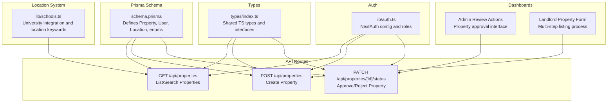
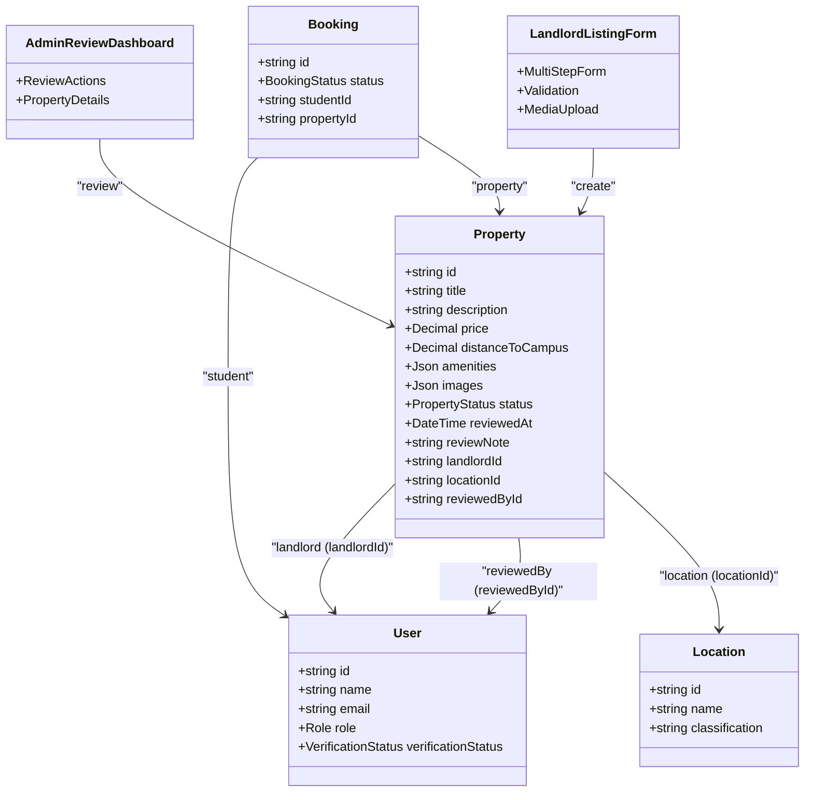
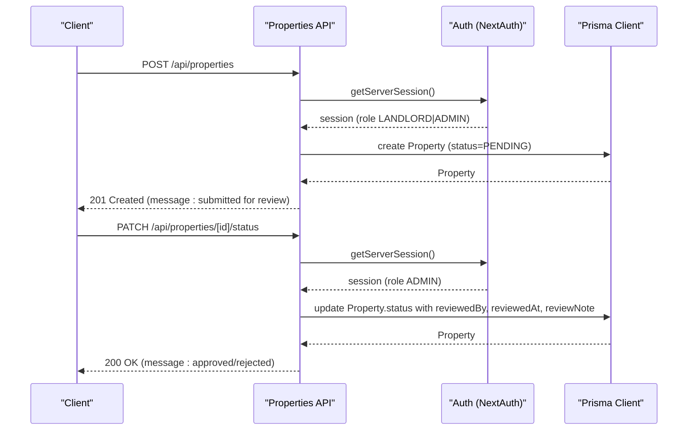
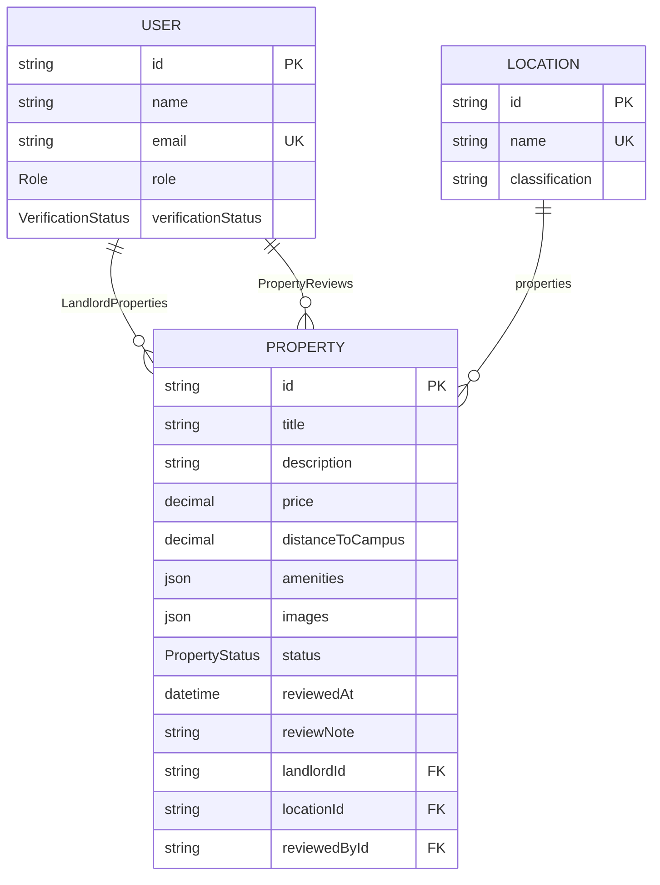
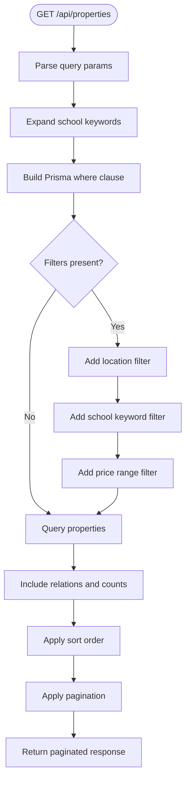
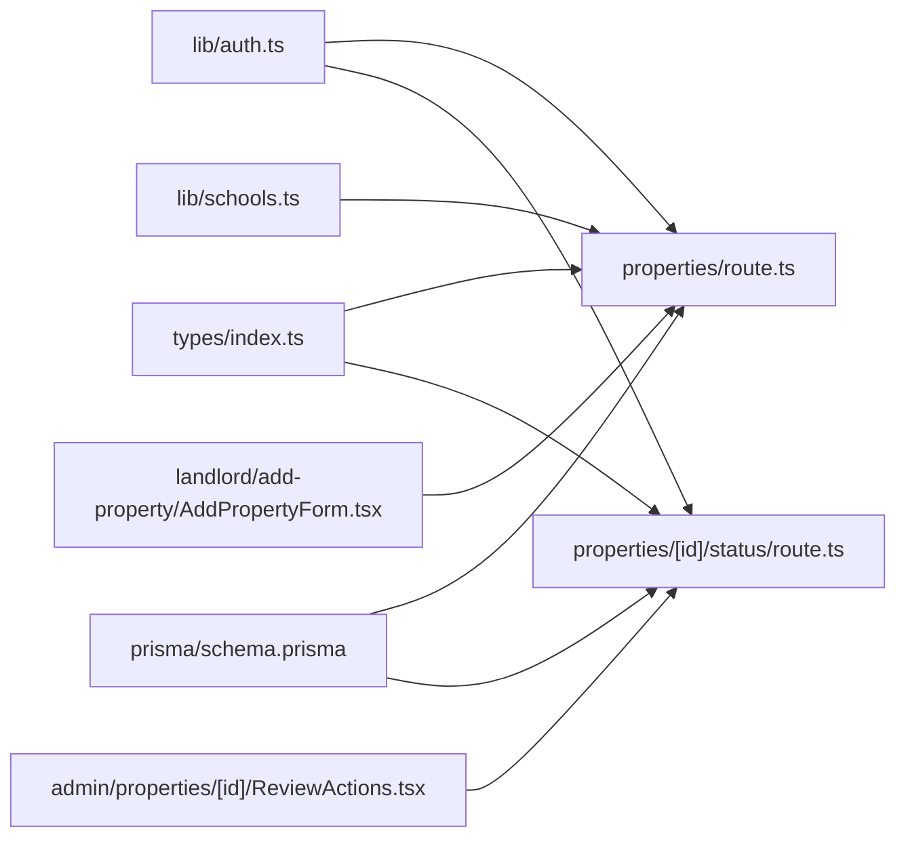

# Property Entity

<cite>
**Referenced Files in This Document**
- [schema.prisma](file://prisma/schema.prisma)
- [route.ts](file://src/app/api/properties/route.ts)
- [route.ts](file://src/app/api/properties/[id]/status/route.ts)
- [index.ts](file://src/types/index.ts)
- [auth.ts](file://src/lib/auth.ts)
- [seed.ts](file://prisma/seed.ts)
- [schools.ts](file://src/lib/schools.ts)
- [ReviewActions.tsx](file://src/app/(dashboards)/admin/properties/[id]/ReviewActions.tsx)
- [AddPropertyForm.tsx](file://src/app/(dashboards)/landlord/add-property/AddPropertyForm.tsx)
</cite>

## Update Summary
**Changes Made**
- Enhanced PropertyStatus enum documentation with comprehensive approval workflow
- Added detailed location filtering system with university integration
- Documented multi-step property listing form with validation
- Updated property creation process with enhanced validation and media handling
- Added admin review dashboard components
- Expanded property search and filtering capabilities

## Table of Contents
1. [Introduction](#introduction)
2. [Project Structure](#project-structure)
3. [Core Components](#core-components)
4. [Architecture Overview](#architecture-overview)
5. [Detailed Component Analysis](#detailed-component-analysis)
6. [Dependency Analysis](#dependency-analysis)
7. [Performance Considerations](#performance-considerations)
8. [Troubleshooting Guide](#troubleshooting-guide)
9. [Conclusion](#conclusion)

## Introduction
This document provides comprehensive documentation for the Property entity in RentalHub-BOUESTI. It covers the Property model definition, the PropertyStatus enum and its approval workflow, foreign key relationships with User (landlord) and Location, field constraints and data types, JSON field structures for amenities and images, indexing strategies for performance, and practical examples for creation, approval, and search filtering. The system now includes advanced location filtering with university integration and a sophisticated multi-step property listing process.

## Project Structure
The Property entity is defined in the Prisma schema and exposed via Next.js API routes. Type definitions and shared interfaces are centralized in a dedicated types module. Authentication and role-based access control are configured in the auth module. The system includes comprehensive admin review dashboards and landlord property listing forms.

**Diagram sources**
- [schema.prisma:79-108](file://prisma/schema.prisma#L79-L108)
- [route.ts:14-64](file://src/app/api/properties/route.ts#L14-L64)
- [route.ts:68-118](file://src/app/api/properties/route.ts#L68-L118)
- [route.ts:17-51](file://src/app/api/properties/[id]/status/route.ts#L17-L51)
- [index.ts:26-42](file://src/types/index.ts#L26-L42)
- [auth.ts:14-90](file://src/lib/auth.ts#L14-L90)
- [schools.ts:19-30](file://src/lib/schools.ts#L19-L30)
- [ReviewActions.tsx:10-79](file://src/app/(dashboards)/admin/properties/[id]/ReviewActions.tsx#L10-L79)
- [AddPropertyForm.tsx:26-64](file://src/app/(dashboards)/landlord/add-property/AddPropertyForm.tsx#L26-L64)

**Section sources**
- [schema.prisma:79-108](file://prisma/schema.prisma#L79-L108)
- [route.ts:14-64](file://src/app/api/properties/route.ts#L14-L64)
- [route.ts:68-118](file://src/app/api/properties/route.ts#L68-L118)
- [route.ts:17-51](file://src/app/api/properties/[id]/status/route.ts#L17-L51)
- [index.ts:26-42](file://src/types/index.ts#L26-L42)
- [auth.ts:14-90](file://src/lib/auth.ts#L14-L90)
- [schools.ts:19-30](file://src/lib/schools.ts#L19-L30)
- [ReviewActions.tsx:10-79](file://src/app/(dashboards)/admin/properties/[id]/ReviewActions.tsx#L10-L79)
- [AddPropertyForm.tsx:26-64](file://src/app/(dashboards)/landlord/add-property/AddPropertyForm.tsx#L26-L64)

## Core Components
- Property model: Core entity representing rental listings with metadata, pricing, location, and status.
- PropertyStatus enum: Lifecycle states for property listings (PENDING, APPROVED, REJECTED).
- Foreign keys: landlordId (User), locationId (Location), reviewedById (User).
- JSON fields: amenities (JSON array of strings), images (JSON array of URLs).
- Indexes: Optimized for landlord queries, location queries, status filtering, and price-based sorting.
- Advanced location filtering: Integration with university locations and keyword-based searches.
- Multi-step property listing: Comprehensive form with validation and media upload.

**Section sources**
- [schema.prisma:79-108](file://prisma/schema.prisma#L79-L108)
- [schema.prisma:29-33](file://prisma/schema.prisma#L29-L33)
- [schools.ts:19-30](file://src/lib/schools.ts#L19-L30)
- [AddPropertyForm.tsx:26-64](file://src/app/(dashboards)/landlord/add-property/AddPropertyForm.tsx#L26-L64)

## Architecture Overview
The Property entity integrates with User and Location through foreign keys. API routes enforce role-based access control and implement listing, creation, and approval workflows. Types define safe user exposure and response shapes. The system includes advanced location filtering with university integration and comprehensive admin review capabilities.

**Diagram sources**
- [schema.prisma:44-61](file://prisma/schema.prisma#L44-L61)
- [schema.prisma:64-77](file://prisma/schema.prisma#L64-L77)
- [schema.prisma:79-108](file://prisma/schema.prisma#L79-L108)
- [schema.prisma:111-129](file://prisma/schema.prisma#L111-L129)
- [ReviewActions.tsx:10-79](file://src/app/(dashboards)/admin/properties/[id]/ReviewActions.tsx#L10-L79)
- [AddPropertyForm.tsx:26-64](file://src/app/(dashboards)/landlord/add-property/AddPropertyForm.tsx#L26-L64)

## Detailed Component Analysis

### Property Model Definition
- Identity and metadata
  - id: String, auto-generated unique identifier.
  - title: String, required.
  - description: String (Text), required.
  - createdAt/updatedAt: Timestamps managed automatically.
- Pricing and proximity
  - price: Decimal (precision 10, scale 2), required monthly rent in NGN.
  - distanceToCampus: Decimal (precision 5, scale 2), optional distance in km to campus.
- Content and media
  - amenities: Json, default empty array of strings (e.g., ["WiFi", "Water"]).
  - images: Json, default empty array of URLs.
- Status and lifecycle
  - status: PropertyStatus enum, default PENDING.
  - reviewedAt: DateTime, timestamp when property was reviewed.
  - reviewNote: String, optional note explaining rejection or approval.
- Foreign keys
  - landlordId: String, required (User).
  - locationId: String, required (Location).
  - reviewedById: String, optional (User) - admin who reviewed the property.
- Relations
  - landlord: User (relation "LandlordProperties").
  - reviewedBy: User (relation "PropertyReviews").
  - location: Location.
  - bookings: Booking[].
- Indexes
  - @@index([landlordId])
  - @@index([locationId])
  - @@index([status])
  - @@index([reviewedById])
  - @@index([price])

**Section sources**
- [schema.prisma:79-108](file://prisma/schema.prisma#L79-L108)

### PropertyStatus Enum and Approval Workflow
- Enum values: PENDING, APPROVED, REJECTED.
- Default status: PENDING upon creation.
- Approval workflow
  - Creation: POST /api/properties sets status to PENDING.
  - Review: PATCH /api/properties/[id]/status updates status to APPROVED or REJECTED.
  - Access control: Only ADMIN can modify status.
  - Review tracking: Stores reviewer, review timestamp, and optional reason.
  - Response includes landlord contact and location for notifications.

**Diagram sources**
- [route.ts:68-118](file://src/app/api/properties/route.ts#L68-L118)
- [route.ts:17-51](file://src/app/api/properties/[id]/status/route.ts#L17-L51)
- [auth.ts:14-90](file://src/lib/auth.ts#L14-L90)

**Section sources**
- [schema.prisma:29-33](file://prisma/schema.prisma#L29-L33)
- [route.ts:68-118](file://src/app/api/properties/route.ts#L68-L118)
- [route.ts:17-51](file://src/app/api/properties/[id]/status/route.ts#L17-L51)
- [auth.ts:14-90](file://src/lib/auth.ts#L14-L90)

### Enhanced Location Filtering and University Integration
- Location-based filtering
  - Standard location filtering by name substring.
  - University integration with keyword expansion.
  - Support for multiple location keywords per university.
- School location keywords
  - BOUESTI: ["Ikere", "Uro", "Odo Oja", "Afao", "Olumilua", "Ajebandele", "Ikoyi Estate", "Amoye", "Oke 'Kere"]
  - Other universities include UNILAG, OAU, UI, UNIBEN, FUTA, UNILORIN, ABU, UNN, Covenant University.
- Dynamic location filtering
  - Automatic keyword expansion based on selected university.
  - Case-insensitive location matching.
  - Multiple keyword support for comprehensive coverage.

**Section sources**
- [route.ts:22-29](file://src/app/api/properties/route.ts#L22-L29)
- [route.ts:51-57](file://src/app/api/properties/route.ts#L51-L57)
- [schools.ts:19-30](file://src/lib/schools.ts#L19-L30)

### Multi-Step Property Listing Form
- Comprehensive property creation process
  - Step 1: Core details (title, property type, vacant units, gender preference).
  - Step 2: Location and amenities (university selection, environment, distance, amenity categories).
  - Step 3: Financial information (annual rent, agency fee, caution fee, service charge).
  - Step 4: Media and verification (photos, video walkthrough, verification documents).
- Advanced validation
  - Zod schema validation for all form steps.
  - Real-time validation feedback.
  - Required field enforcement.
- Media handling
  - Photo upload with preview.
  - Video upload capability.
  - Verification document storage.
  - Automatic file categorization.

**Section sources**
- [AddPropertyForm.tsx:26-64](file://src/app/(dashboards)/landlord/add-property/AddPropertyForm.tsx#L26-L64)
- [AddPropertyForm.tsx:129-158](file://src/app/(dashboards)/landlord/add-property/AddPropertyForm.tsx#L129-L158)
- [AddPropertyForm.tsx:274-342](file://src/app/(dashboards)/landlord/add-property/AddPropertyForm.tsx#L274-L342)

### Admin Review Dashboard
- Interactive review interface
  - Approve or reject property listings.
  - Required rejection reason when rejecting.
  - Real-time loading states and error handling.
- Review actions
  - Simple button interface for quick approvals.
  - Textarea for rejection reasons.
  - Automatic navigation after successful review.
- Security and validation
  - Client-side validation before submission.
  - Server-side validation and error handling.
  - Role-based access control enforcement.

**Section sources**
- [ReviewActions.tsx:16-45](file://src/app/(dashboards)/admin/properties/[id]/ReviewActions.tsx#L16-L45)
- [route.ts:37-42](file://src/app/api/properties/[id]/status/route.ts#L37-L42)

### Foreign Key Relationships
- Landlord (User)
  - Property.landlordId references User.id.
  - onDelete: Cascade ensures cleanup when a user is removed.
- Reviewer (User)
  - Property.reviewedById references User.id.
  - Nullable relationship for unreviewed properties.
- Location
  - Property.locationId references Location.id.
- Reverse relations
  - User.properties (LandlordProperties).
  - User.reviewedProperties (PropertyReviews).
  - Location.properties.

**Diagram sources**
- [schema.prisma:44-61](file://prisma/schema.prisma#L44-L61)
- [schema.prisma:64-77](file://prisma/schema.prisma#L64-L77)
- [schema.prisma:79-108](file://prisma/schema.prisma#L79-L108)

**Section sources**
- [schema.prisma:94-101](file://prisma/schema.prisma#L94-L101)

### Field Constraints, Data Types, Defaults, and JSON Structures
- Data types and defaults
  - title: String, required.
  - description: String (Text), required.
  - price: Decimal(10,2), required.
  - distanceToCampus: Decimal(5,2), nullable.
  - amenities: Json, default "[]".
  - images: Json, default "[]".
  - status: PropertyStatus enum, default PENDING.
  - reviewedAt: DateTime, nullable.
  - reviewNote: String, nullable.
  - createdAt/updatedAt: DateTime defaults.
- JSON structures
  - amenities: Array of strings (e.g., ["WiFi", "Water"]).
  - images: Array of URLs (e.g., ["https://.../img1.jpg", "https://.../img2.png"]).
- Validation and sanitization
  - Creation endpoint trims title and description.
  - Requires locationId and validates existence.
  - Enforces numeric conversion for distanceToCampus.
  - Validates media presence and types.

**Section sources**
- [schema.prisma:82-89](file://prisma/schema.prisma#L82-L89)
- [route.ts:80-108](file://src/app/api/properties/route.ts#L80-L108)

### API Endpoints and Advanced Filtering
- GET /api/properties
  - Filters: location (substring), school (keyword expansion), minPrice, maxPrice, status (default APPROVED).
  - Pagination: page, pageSize (bounded).
  - Sorting: price, createdAt, distanceToCampus (asc/desc).
  - Includes: landlord (safe profile), location, booking count.
  - Advanced filtering: mine parameter for landlord-specific views.
- POST /api/properties
  - Requires authenticated LANDLORD or ADMIN.
  - Creates with status=PENDING.
  - Enhanced validation: media requirements, amenity validation.
- PATCH /api/properties/[id]/status
  - Requires ADMIN.
  - Updates status to APPROVED or REJECTED.
  - Stores reviewer, timestamp, and optional reason.

**Diagram sources**
- [route.ts:14-64](file://src/app/api/properties/route.ts#L14-L64)
- [schools.ts:19-30](file://src/lib/schools.ts#L19-L30)

**Section sources**
- [route.ts:14-64](file://src/app/api/properties/route.ts#L14-L64)
- [route.ts:68-118](file://src/app/api/properties/route.ts#L68-L118)
- [route.ts:17-51](file://src/app/api/properties/[id]/status/route.ts#L17-L51)

### Types and Interfaces
- SafeUser excludes sensitive fields (e.g., password).
- PropertyWithRelations augments Property with landlord, location, and booking count.
- ApiResponse and PaginatedResponse standardize API responses.
- PropertySearchParams defines query parameters for listing.
- PropertyFormData defines request payload for creation.
- Enhanced form types for multi-step property listing.

**Section sources**
- [index.ts:24-58](file://src/types/index.ts#L24-L58)
- [index.ts:96-104](file://src/types/index.ts#L96-L104)
- [AddPropertyForm.tsx:66-67](file://src/app/(dashboards)/landlord/add-property/AddPropertyForm.tsx#L66-L67)

### Authentication and Authorization
- NextAuth configuration supports role-based access control.
- Property creation requires LANDLORD or ADMIN.
- Status updates require ADMIN.
- Session includes role and verification status for runtime checks.
- Enhanced security with review tracking and audit trails.

**Section sources**
- [auth.ts:14-90](file://src/lib/auth.ts#L14-L90)
- [route.ts:68-78](file://src/app/api/properties/route.ts#L68-L78)
- [route.ts:25-27](file://src/app/api/properties/[id]/status/route.ts#L25-L27)

## Dependency Analysis
- Internal dependencies
  - API routes depend on Prisma client and NextAuth session.
  - Types module centralizes shared types used across routes.
  - Location system depends on school keyword configuration.
  - Admin dashboard depends on property status endpoints.
  - Landlord form depends on upload and location APIs.
- External dependencies
  - Prisma client for database operations.
  - NextAuth for authentication and role enforcement.
  - Zod for form validation.
  - React Hook Form for form state management.
- Coupling and cohesion
  - Property API routes encapsulate creation, listing, and approval logic.
  - Types module reduces duplication and improves type safety.
  - Location filtering system is decoupled from core property logic.
  - Admin and landlord interfaces are separate but coordinated.

**Diagram sources**
- [auth.ts:14-90](file://src/lib/auth.ts#L14-L90)
- [route.ts:14-64](file://src/app/api/properties/route.ts#L14-L64)
- [route.ts:17-51](file://src/app/api/properties/[id]/status/route.ts#L17-L51)
- [index.ts:26-42](file://src/types/index.ts#L26-L42)
- [schema.prisma:79-108](file://prisma/schema.prisma#L79-L108)
- [schools.ts:19-30](file://src/lib/schools.ts#L19-L30)
- [ReviewActions.tsx:10-79](file://src/app/(dashboards)/admin/properties/[id]/ReviewActions.tsx#L10-L79)
- [AddPropertyForm.tsx:26-64](file://src/app/(dashboards)/landlord/add-property/AddPropertyForm.tsx#L26-L64)

**Section sources**
- [auth.ts:14-90](file://src/lib/auth.ts#L14-L90)
- [route.ts:14-64](file://src/app/api/properties/route.ts#L14-L64)
- [route.ts:17-51](file://src/app/api/properties/[id]/status/route.ts#L17-L51)
- [index.ts:26-42](file://src/types/index.ts#L26-L42)
- [schema.prisma:79-108](file://prisma/schema.prisma#L79-L108)
- [schools.ts:19-30](file://src/lib/schools.ts#L19-L30)
- [ReviewActions.tsx:10-79](file://src/app/(dashboards)/admin/properties/[id]/ReviewActions.tsx#L10-L79)
- [AddPropertyForm.tsx:26-64](file://src/app/(dashboards)/landlord/add-property/AddPropertyForm.tsx#L26-L64)

## Performance Considerations
- Indexes
  - @@index([landlordId]): Efficiently fetch a landlord's properties.
  - @@index([locationId]): Efficiently filter by location.
  - @@index([status]): Efficiently filter approved listings for browsing.
  - @@index([reviewedById]): Efficiently track admin reviews.
  - @@index([price]): Supports price-based sorting and range queries.
- Query patterns
  - Listing endpoint applies filters and pagination to limit result set.
  - Includes relations selectively to avoid N+1 issues.
  - School keyword expansion uses efficient LIKE operations.
- JSON fields
  - Amenities and images are stored as JSON arrays; consider normalization if frequent structured queries are needed.
- Recommendations
  - Add composite indexes for frequently combined filters (e.g., status + locationId).
  - Consider adding indexes on JSON fields if querying JSON content becomes common.
  - Implement caching for popular location queries.
  - Add database connection pooling for high-traffic scenarios.

**Section sources**
- [schema.prisma:103-107](file://prisma/schema.prisma#L103-L107)
- [route.ts:27-48](file://src/app/api/properties/route.ts#L27-L48)

## Troubleshooting Guide
- Authentication errors
  - 401 Unauthorized: Ensure a valid session exists.
  - 403 Forbidden: Verify user role is LANDLORD or ADMIN for creation; ADMIN for status updates.
- Validation errors
  - 400 Bad Request: Missing required fields (title, description, price, locationId) or invalid locationId.
  - Invalid status value: Only PENDING, APPROVED, REJECTED are accepted for status updates.
  - Missing media: At least one uploaded property image is required.
  - Invalid amenities: Must be provided as an array.
- Database errors
  - Location not found: Confirm locationId exists in the database.
  - Prisma errors: Check logs for detailed messages and adjust queries accordingly.
- Response shape
  - Use ApiResponse and PaginatedResponse interfaces to parse standardized responses.
- Form validation errors
  - Multi-step form validation: Check specific step validation errors.
  - Media upload failures: Verify file types and sizes.
  - School keyword expansion: Ensure correct university selection.

**Section sources**
- [route.ts:72-78](file://src/app/api/properties/route.ts#L72-L78)
- [route.ts:90-93](file://src/app/api/properties/route.ts#L90-L93)
- [route.ts:32-34](file://src/app/api/properties/[id]/status/route.ts#L32-L34)
- [index.ts:45-58](file://src/types/index.ts#L45-L58)
- [AddPropertyForm.tsx:277-283](file://src/app/(dashboards)/landlord/add-property/AddPropertyForm.tsx#L277-L283)

## Conclusion
The Property entity in RentalHub-BOUESTI is designed with clear constraints, robust relationships, and efficient indexing for common queries. The comprehensive approval workflow ensures controlled listing publication, while role-based access control protects administrative functions. The system now includes advanced location filtering with university integration, a sophisticated multi-step property listing process, and interactive admin review capabilities. The API routes provide a consistent interface for creation, listing, and approval, backed by shared types and authentication configuration. The enhanced system supports complex real-world property management scenarios while maintaining excellent performance and user experience.