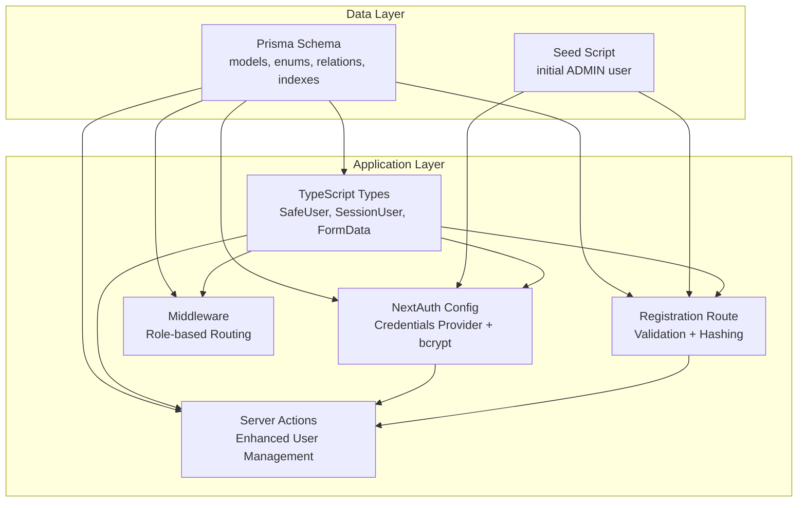
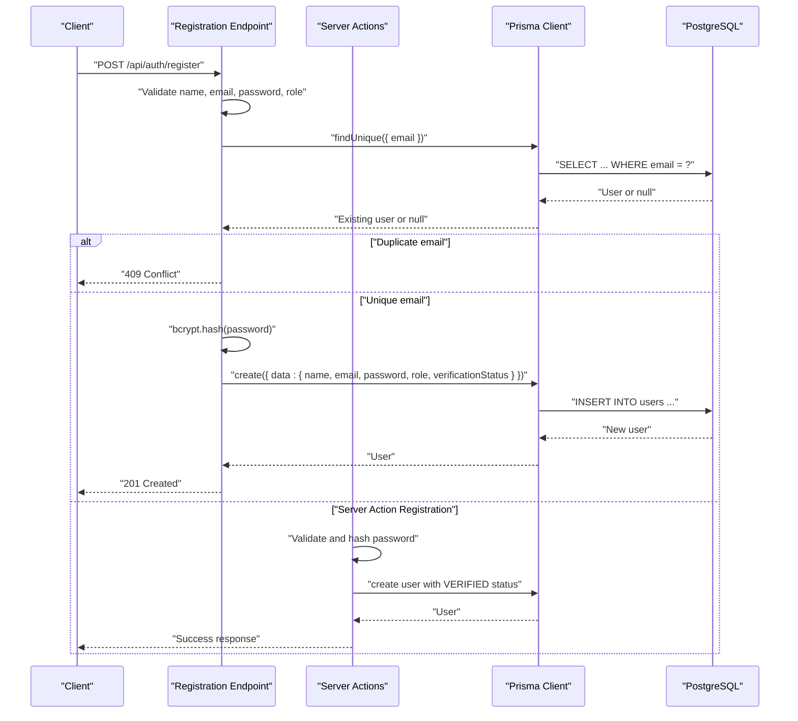
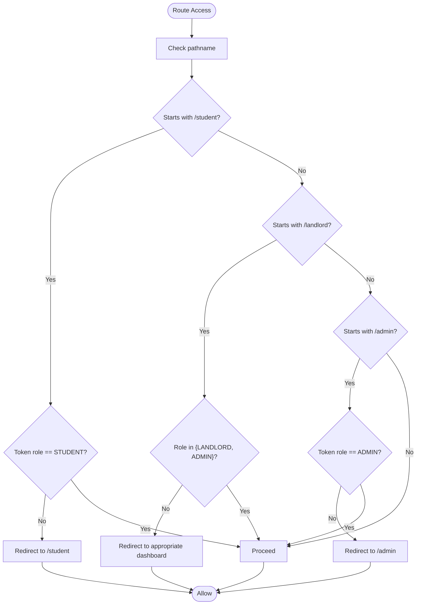
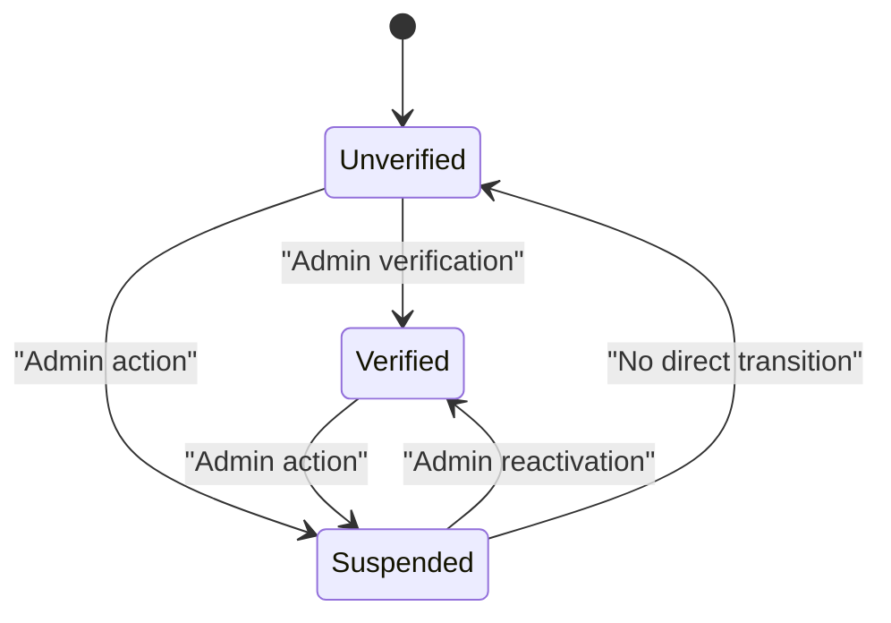
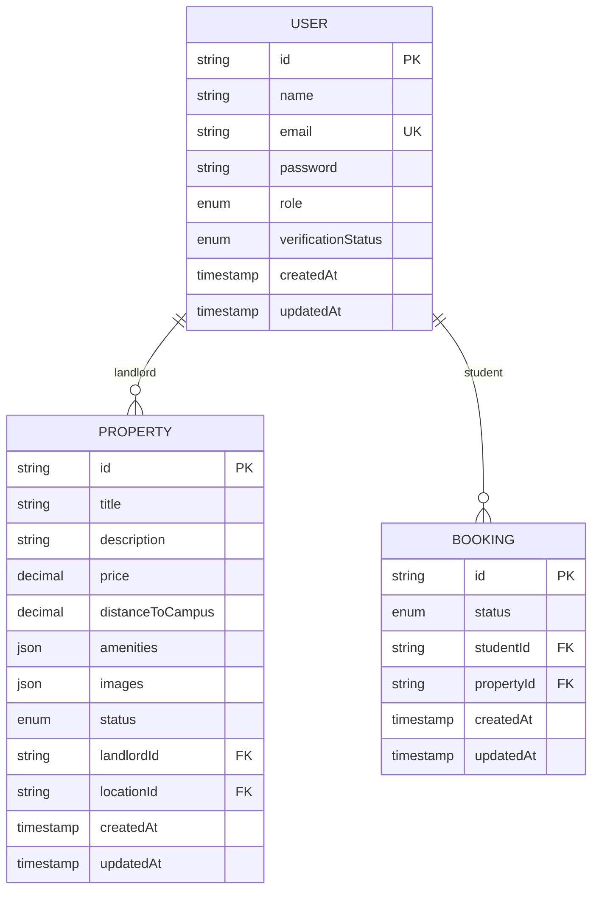
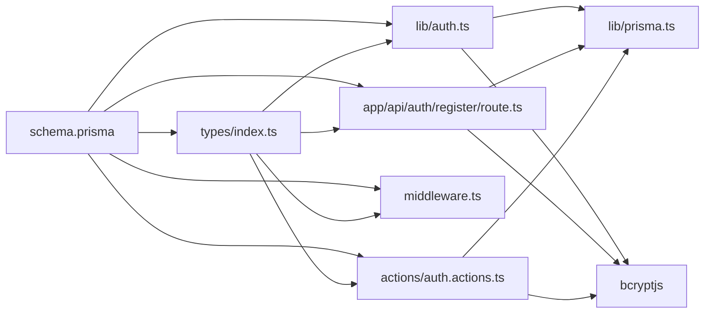

# User Entity

<cite>
**Referenced Files in This Document**
- [schema.prisma](file://prisma/schema.prisma)
- [seed.ts](file://prisma/seed.ts)
- [index.ts](file://src/types/index.ts)
- [prisma.ts](file://src/lib/prisma.ts)
- [auth.ts](file://src/lib/auth.ts)
- [register.route.ts](file://src/app/api/auth/register/route.ts)
- [middleware.ts](file://src/middleware.ts)
- [auth.actions.ts](file://src/actions/auth.actions.ts)
</cite>

## Update Summary
**Changes Made**
- Updated Role enum documentation to include all three values: STUDENT, LANDLORD, ADMIN
- Enhanced VerificationStatus enum documentation with UNVERIFIED, VERIFIED, SUSPENDED states
- Added comprehensive role-based access control (RBAC) system documentation
- Updated middleware enforcement rules for all three user roles
- Enhanced security considerations for password storage and verification status handling
- Added practical examples for role assignment and verification workflows
- Updated relationship documentation with Property and Booking entities

## Table of Contents
1. [Introduction](#introduction)
2. [Project Structure](#project-structure)
3. [Core Components](#core-components)
4. [Architecture Overview](#architecture-overview)
5. [Detailed Component Analysis](#detailed-component-analysis)
6. [Dependency Analysis](#dependency-analysis)
7. [Performance Considerations](#performance-considerations)
8. [Troubleshooting Guide](#troubleshooting-guide)
9. [Conclusion](#conclusion)

## Introduction
This document provides comprehensive documentation for the User entity in RentalHub-BOUESTI. The User model has been enhanced with a robust role-based access control (RBAC) system featuring three distinct roles (STUDENT, LANDLORD, ADMIN) and a verification status lifecycle (UNVERIFIED, VERIFIED, SUSPENDED). The documentation covers the User model structure, role-based access control, verification status management, field constraints, data types, defaults, validation rules, relationships with Property and Booking entities, indexing strategies, security considerations for password storage, and cascading operations. It also includes practical examples for user creation, role assignment, and verification workflows.

## Project Structure
The User entity is defined in the Prisma schema and is used across the application for authentication, authorization, and data modeling. Supporting files include:
- Prisma schema defining models, enums, relations, and indexes
- Seed script for creating an initial ADMIN user with VERIFIED status
- Type definitions for safe user exposure and API shapes
- Authentication configuration using NextAuth.js with bcrypt
- Registration endpoints enforcing validation and password hashing
- Middleware enforcing role-based routing restrictions
- Server actions for enhanced user management capabilities

**Diagram sources**
- [schema.prisma:44-61](file://prisma/schema.prisma#L44-L61)
- [seed.ts:61-122](file://prisma/seed.ts#L61-L122)
- [index.ts:23-80](file://src/types/index.ts#L23-L80)
- [auth.ts:14-90](file://src/lib/auth.ts#L14-L90)
- [register.route.ts:20-89](file://src/app/api/auth/register/route.ts#L20-L89)
- [middleware.ts:11-38](file://src/middleware.ts#L11-L38)
- [auth.actions.ts:1-208](file://src/actions/auth.actions.ts#L1-L208)

**Section sources**
- [schema.prisma:1-136](file://prisma/schema.prisma#L1-L136)
- [seed.ts:1-143](file://prisma/seed.ts#L1-L143)
- [index.ts:1-109](file://src/types/index.ts#L1-L109)
- [prisma.ts:1-27](file://src/lib/prisma.ts#L1-L27)
- [auth.ts:1-119](file://src/lib/auth.ts#L1-L119)
- [register.route.ts:1-90](file://src/app/api/auth/register/route.ts#L1-L90)
- [middleware.ts:1-76](file://src/middleware.ts#L1-L76)
- [auth.actions.ts:1-208](file://src/actions/auth.actions.ts#L1-L208)

## Core Components
- **User model fields and defaults**:
  - id: String, unique identifier
  - name: String
  - email: String, unique
  - password: String (bcrypt-hashed)
  - role: Role enum with default STUDENT
  - verificationStatus: VerificationStatus enum with default UNVERIFIED
  - createdAt: DateTime, default now
  - updatedAt: DateTime, auto-updated
- **Enums**:
  - Role: STUDENT, LANDLORD, ADMIN
  - VerificationStatus: UNVERIFIED, VERIFIED, SUSPENDED
- **Relationships**:
  - User has many Property (as landlord)
  - User has many Booking (as student)
- **Indexes**:
  - email
  - role
- **Security**:
  - Passwords are hashed with bcrypt before storage
  - NextAuth.js handles session tokens and JWT claims
  - Verification status prevents access for SUSPENDED users
- **Cascading**:
  - Property.landlordId references User.id with onDelete: Cascade
  - Booking.studentId references User.id with onDelete: Cascade

**Section sources**
- [schema.prisma:44-61](file://prisma/schema.prisma#L44-L61)
- [schema.prisma:17-27](file://prisma/schema.prisma#L17-L27)
- [schema.prisma:99-101](file://prisma/schema.prisma#L99-L101)
- [schema.prisma:122-123](file://prisma/schema.prisma#L122-L123)

## Architecture Overview
The User entity participates in a layered architecture with enhanced role-based access control:
- **Data layer**: Prisma schema defines the User model with comprehensive enums and relations
- **Application layer**: NextAuth.js authenticates users, manages sessions, and handles verification status
- **API layer**: Multiple registration endpoints validate inputs, check uniqueness, hash passwords, and persist Users
- **Access control**: Middleware enforces role-based routing restrictions with three distinct role tiers
- **Enhanced management**: Server actions provide additional user management capabilities beyond basic registration

**Diagram sources**
- [register.route.ts:20-89](file://src/app/api/auth/register/route.ts#L20-L89)
- [auth.actions.ts:24-93](file://src/actions/auth.actions.ts#L24-L93)
- [prisma.ts:13-24](file://src/lib/prisma.ts#L13-L24)
- [schema.prisma:44-61](file://prisma/schema.prisma#L44-L61)

## Detailed Component Analysis

### User Model Definition and Constraints
- **Fields and types**:
  - id: String, @id, @default(cuid())
  - name: String
  - email: String, @unique
  - password: String (bcrypt-hashed)
  - role: Role, @default(STUDENT)
  - verificationStatus: VerificationStatus, @default(UNVERIFIED)
  - createdAt: DateTime, @default(now())
  - updatedAt: DateTime, @updatedAt
- **Defaults**:
  - role defaults to STUDENT for standard registrations
  - verificationStatus defaults to UNVERIFIED for new users
- **Constraints**:
  - email uniqueness enforced by @unique
  - password must be stored hashed (never plain text)
  - Role enum restricted to predefined values
  - VerificationStatus enum restricted to predefined values
- **Validation rules**:
  - Registration endpoint requires name, email, password, and a valid role
  - Password length minimum is 8 characters
  - Email is normalized to lowercase and trimmed
  - Role validation ensures only STUDENT or LANDLORD can be selected via API

**Section sources**
- [schema.prisma:44-61](file://prisma/schema.prisma#L44-L61)
- [register.route.ts:25-45](file://src/app/api/auth/register/route.ts#L25-L45)
- [auth.actions.ts:26-52](file://src/actions/auth.actions.ts#L26-L52)

### Role-Based Access Control (RBAC)
- **Role hierarchy**:
  - STUDENT: can access student dashboard routes and make bookings
  - LANDLORD: can access landlord dashboard routes and manage properties
  - ADMIN: can access admin routes, has elevated privileges, and can manage users
- **Middleware enforcement**:
  - Routes under `/student` require STUDENT role
  - Routes under `/landlord` require LANDLORD or ADMIN roles
  - Routes under `/admin` require ADMIN role exclusively
  - Middleware redirects unauthorized users to appropriate dashboards
- **Session and JWT**:
  - NextAuth stores role and verificationStatus in JWT claims
  - Session user object includes role and verificationStatus for frontend access
- **Route protection**:
  - Protected route prefixes: `/student`, `/landlord`, `/admin`
  - Token-based authentication with role validation
  - Automatic redirection based on user's actual role

**Diagram sources**
- [middleware.ts:15-66](file://src/middleware.ts#L15-L66)
- [auth.ts:55-72](file://src/lib/auth.ts#L55-L72)

**Section sources**
- [middleware.ts:16-29](file://src/middleware.ts#L16-L29)
- [auth.ts:55-72](file://src/lib/auth.ts#L55-L72)

### Verification Status Lifecycle
- **Enum values**:
  - UNVERIFIED: default upon registration, awaiting verification
  - VERIFIED: verified user (e.g., ADMIN created via seed)
  - SUSPENDED: account temporarily blocked by administrators
- **Impact on permissions**:
  - Authentication rejects SUSPENDED users immediately
  - Middleware does not restrict by verificationStatus; RBAC is role-based
  - VERIFICATION_STATUS affects login attempts but not route access
- **Typical workflow**:
  - New registrations default to UNVERIFIED
  - ADMIN can verify accounts during user management
  - If verification is required for certain actions, implement additional checks
  - Server actions provide `updateUserVerificationStatus` for admin operations

**Diagram sources**
- [schema.prisma:23-27](file://prisma/schema.prisma#L23-L27)
- [auth.ts:40-42](file://src/lib/auth.ts#L40-L42)
- [seed.ts:61-67](file://prisma/seed.ts#L61-L67)
- [auth.actions.ts:185-207](file://src/actions/auth.actions.ts#L185-L207)

**Section sources**
- [schema.prisma:23-27](file://prisma/schema.prisma#L23-L27)
- [auth.ts:40-42](file://src/lib/auth.ts#L40-L42)
- [seed.ts:61-67](file://prisma/seed.ts#L61-L67)
- [auth.actions.ts:185-207](file://src/actions/auth.actions.ts#L185-L207)

### Relationships with Property and Booking
- **User -> Property (landlord)**:
  - Relation name: "LandlordProperties"
  - Foreign key: Property.landlordId
  - onDelete: Cascade
  - Enables landlords to manage multiple properties
- **User -> Booking (student)**:
  - Relation name: "StudentBookings"
  - Foreign key: Booking.studentId
  - onDelete: Cascade
  - Enables students to track their booking history
- **Implications**:
  - Deleting a User cascades to associated Properties and Bookings
  - Queries can fetch related entities via relations
  - Bidirectional relationships enable rich data access patterns

**Diagram sources**
- [schema.prisma:44-61](file://prisma/schema.prisma#L44-L61)
- [schema.prisma:80-108](file://prisma/schema.prisma#L80-L108)
- [schema.prisma:111-129](file://prisma/schema.prisma#L111-L129)

**Section sources**
- [schema.prisma:54-56](file://prisma/schema.prisma#L54-L56)
- [schema.prisma:99](file://prisma/schema.prisma#L99)
- [schema.prisma:122](file://prisma/schema.prisma#L122)

### Indexing Strategies
- **User indexes**:
  - email: unique index for fast authentication and uniqueness checks
  - role: index for efficient role-based filtering and access control
- **Property indexes**:
  - landlordId, locationId, status, price
- **Booking indexes**:
  - studentId, propertyId, status
- **Purpose**:
  - Optimize lookups for authentication, role filtering, and relation queries
  - Support efficient access control enforcement
  - Enable fast property and booking searches

**Section sources**
- [schema.prisma:58-59](file://prisma/schema.prisma#L58-L59)
- [schema.prisma:103-107](file://prisma/schema.prisma#L103-L107)
- [schema.prisma:125-127](file://prisma/schema.prisma#L125-L127)

### Security Considerations for Password Storage
- **Password hashing**:
  - bcrypt is used to hash passwords during registration and authentication
  - Passwords are never stored in plain text
  - bcrypt cost factor set to 12 for balanced security/performance
- **Token-based session**:
  - NextAuth.js uses JWT strategy with configurable secret
  - Session and JWT carry role and verificationStatus for downstream checks
  - Token expiration set to 30 days for security
- **Additional security measures**:
  - Email normalization and trimming prevent common injection attacks
  - Role validation prevents privilege escalation
  - Verification status blocks access for suspended users
  - Comprehensive input validation at multiple layers

**Section sources**
- [register.route.ts:58](file://src/app/api/auth/register/route.ts#L58)
- [auth.ts:35](file://src/lib/auth.ts#L35)
- [auth.ts:81-85](file://src/lib/auth.ts#L81-L85)
- [auth.actions.ts:54-55](file://src/actions/auth.actions.ts#L54-L55)

### Cascading Operations
- **Property.landlordId** references User.id with onDelete: Cascade
- **Booking.studentId** references User.id with onDelete: Cascade
- **Behavior**:
  - Deleting a User deletes all associated Properties and Bookings
  - Maintains referential integrity across the application
- **Impact**:
  - Prevents orphaned records in the database
  - Requires careful consideration when deleting users
  - Ensures clean data cleanup during user deletion

**Section sources**
- [schema.prisma:99](file://prisma/schema.prisma#L99)
- [schema.prisma:122](file://prisma/schema.prisma#L122)

### Examples

#### Example 1: User Creation and Role Assignment
- **Steps**:
  - Client sends POST to `/api/auth/register` with name, email, password, and role
  - Server validates inputs, normalizes email, checks uniqueness, hashes password, and creates User
  - Default role is STUDENT, verificationStatus is VERIFIED for new users
  - Response returns the created user without sensitive fields
- **Notes**:
  - ADMIN role is not selectable via the registration endpoint; it is reserved for seeding or direct DB access
  - Server actions provide enhanced registration capabilities with additional validation

**Section sources**
- [register.route.ts:20-89](file://src/app/api/auth/register/route.ts#L20-L89)
- [auth.actions.ts:24-93](file://src/actions/auth.actions.ts#L24-L93)
- [schema.prisma:49-50](file://prisma/schema.prisma#L49-L50)

#### Example 2: Role Assignment Workflow
- **STUDENT**:
  - Accesses `/student` routes and makes property bookings
  - Limited to student-specific functionality
- **LANDLORD**:
  - Accesses `/landlord` routes and manages properties
  - Can approve/reject bookings and manage property listings
- **ADMIN**:
  - Accesses `/admin` routes and has full system administration
  - Can manage users, properties, and system settings
- **Enforcement**:
  - Middleware redirects unauthorized users to appropriate dashboards
  - Token-based role validation ensures proper access control

**Section sources**
- [middleware.ts:16-29](file://src/middleware.ts#L16-L29)
- [auth.ts:55-72](file://src/lib/auth.ts#L55-L72)

#### Example 3: Verification Workflow
- **Default state**:
  - Newly registered users have verificationStatus UNVERIFIED
  - Students and landlords can access basic functionality
- **Verification**:
  - ADMIN can mark users as VERIFIED through user management
  - Seed script demonstrates VERIFIED for the default admin
- **Suspension**:
  - Authentication rejects SUSPENDED users during login
  - Server actions provide `updateUserVerificationStatus` for admin operations
- **Recommendation**:
  - Implement admin endpoints to update verificationStatus for STUDENT and LANDLORD users

**Section sources**
- [schema.prisma:66](file://prisma/schema.prisma#L66)
- [auth.ts:40-42](file://src/lib/auth.ts#L40-L42)
- [seed.ts:106-121](file://prisma/seed.ts#L106-L121)
- [auth.actions.ts:185-207](file://src/actions/auth.actions.ts#L185-L207)

## Dependency Analysis
- **Internal dependencies**:
  - Prisma schema defines User, enums, relations, and indexes
  - Types expose SafeUser and SessionUser for secure data transfer
  - NextAuth.js integrates with Prisma and bcrypt for authentication
  - Registration route depends on Prisma client and bcrypt
  - Middleware depends on NextAuth tokens for role checks
  - Server actions provide enhanced user management capabilities
- **External dependencies**:
  - bcryptjs for password hashing
  - NextAuth.js for session management and JWT
  - Prisma Client for database operations
  - @auth/prisma-adapter for NextAuth integration

**Diagram sources**
- [schema.prisma:44-61](file://prisma/schema.prisma#L44-L61)
- [index.ts:9-18](file://src/types/index.ts#L9-L18)
- [auth.ts:10-11](file://src/lib/auth.ts#L10-L11)
- [register.route.ts:9-10](file://src/app/api/auth/register/route.ts#L9-L10)
- [prisma.ts:9](file://src/lib/prisma.ts#L9)
- [auth.actions.ts:3](file://src/actions/auth.actions.ts#L3)

**Section sources**
- [index.ts:9-18](file://src/types/index.ts#L9-L18)
- [auth.ts:10-11](file://src/lib/auth.ts#L10-L11)
- [register.route.ts:9-10](file://src/app/api/auth/register/route.ts#L9-L10)
- [prisma.ts:9](file://src/lib/prisma.ts#L9)
- [auth.actions.ts:3](file://src/actions/auth.actions.ts#L3)

## Performance Considerations
- **Index usage**:
  - email and role indexes optimize authentication and role-based queries
  - Property and Booking indexes support efficient filtering and joins
- **Password hashing cost**:
  - bcrypt cost factor is set to 12 to balance security and performance
- **Session strategy**:
  - JWT-based sessions reduce database round-trips for authenticated requests
  - 30-day session lifetime balances security and user experience
- **Recommendations**:
  - Monitor slow queries on email and role filters
  - Consider adding composite indexes if frequently querying role + verificationStatus combinations
  - Cache frequently accessed user data in memory for high-traffic scenarios

## Troubleshooting Guide
- **Authentication failures**:
  - Missing email or password triggers explicit errors
  - Nonexistent email or incorrect password are rejected
  - SUSPENDED users are rejected during login
- **Registration issues**:
  - Duplicate email returns 409 Conflict
  - Missing or invalid inputs return 400 Bad Request
  - Password shorter than 8 characters is rejected
  - Invalid role selection is rejected
- **Authorization issues**:
  - Middleware redirects unauthorized users to appropriate dashboards
  - Ensure NEXTAUTH_SECRET is configured for session signing
  - Verify role assignments match expected access patterns
- **Verification issues**:
  - Users with SUSPENDED status cannot authenticate
  - Server actions require proper admin privileges for verification updates

**Section sources**
- [auth.ts:22-50](file://src/lib/auth.ts#L22-L50)
- [register.route.ts:25-45](file://src/app/api/auth/register/route.ts#L25-L45)
- [register.route.ts:49-56](file://src/app/api/auth/register/route.ts#L49-L56)
- [middleware.ts:17-29](file://src/middleware.ts#L17-L29)
- [auth.actions.ts:185-207](file://src/actions/auth.actions.ts#L185-L207)

## Conclusion
The User entity in RentalHub-BOUESTI has been comprehensively enhanced with a robust role-based access control system featuring three distinct roles (STUDENT, LANDLORD, ADMIN) and a verification status lifecycle (UNVERIFIED, VERIFIED, SUSPENDED). The combination of Prisma schema, NextAuth.js, middleware, and server actions ensures secure, scalable user management with clear separation of concerns. The enhanced architecture supports complex multi-role applications while maintaining security best practices for password storage and access control. Administrators can leverage the seed script and server actions to provision initial users and manage verification workflows effectively.