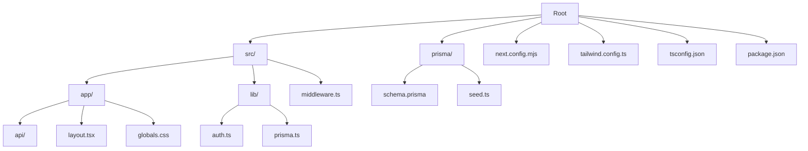
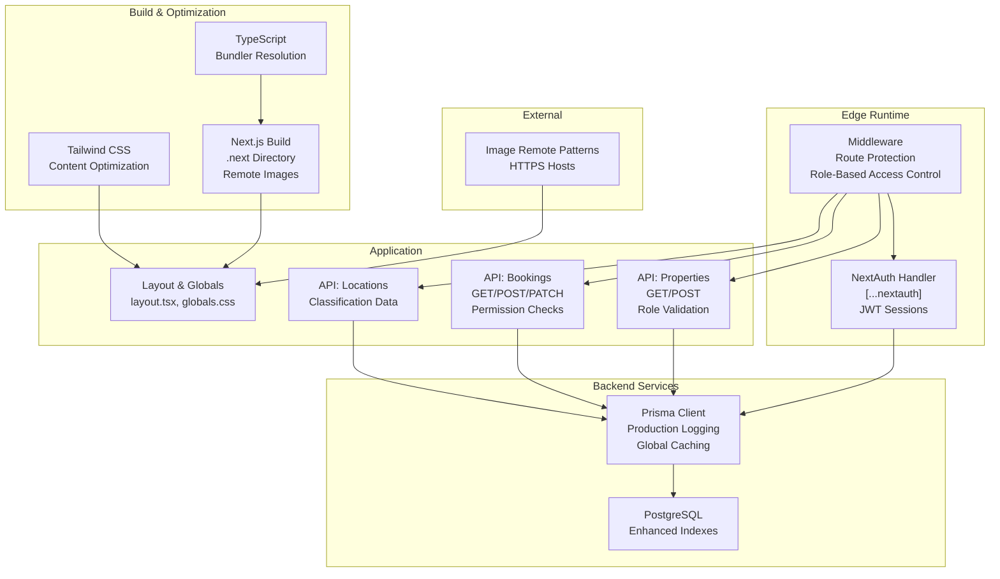
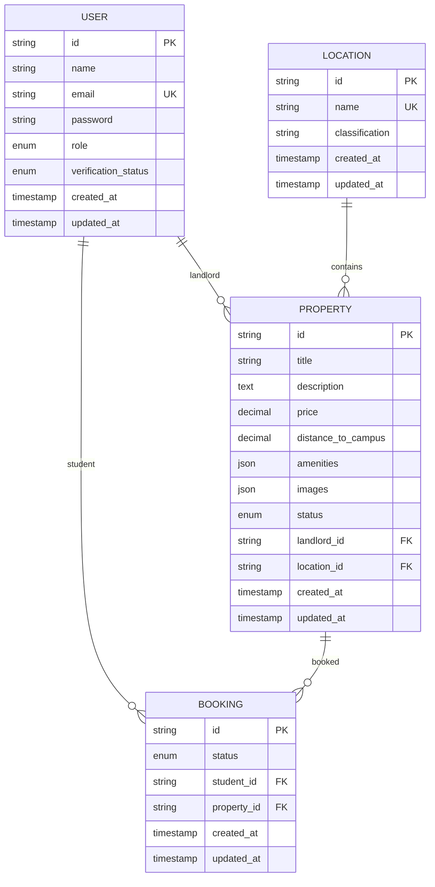
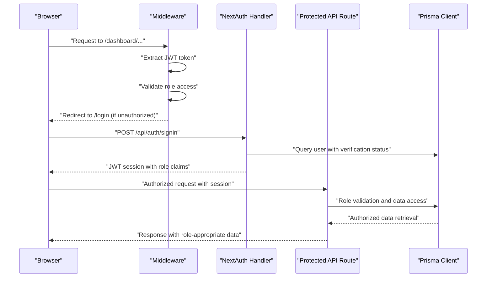
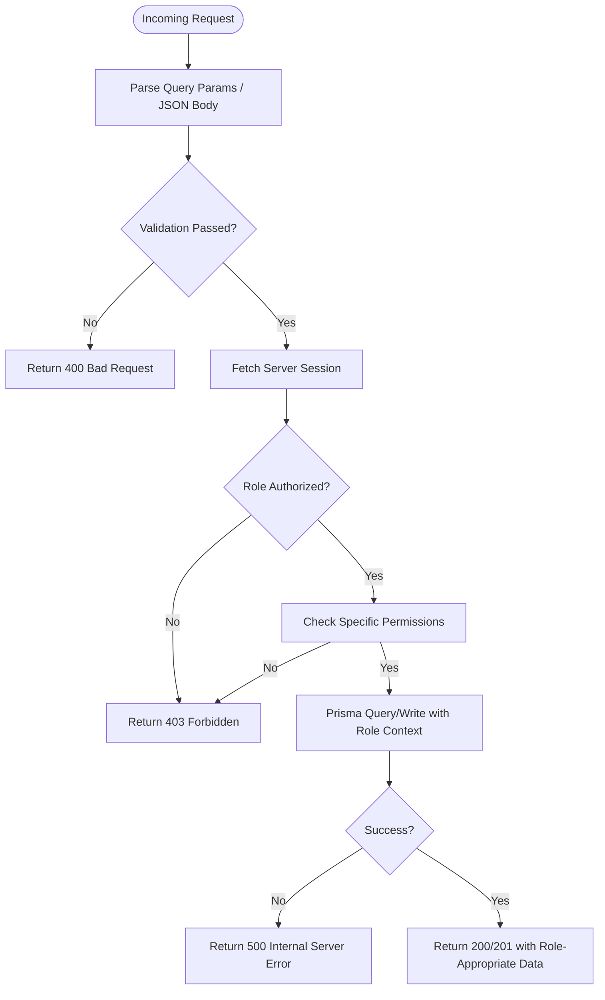
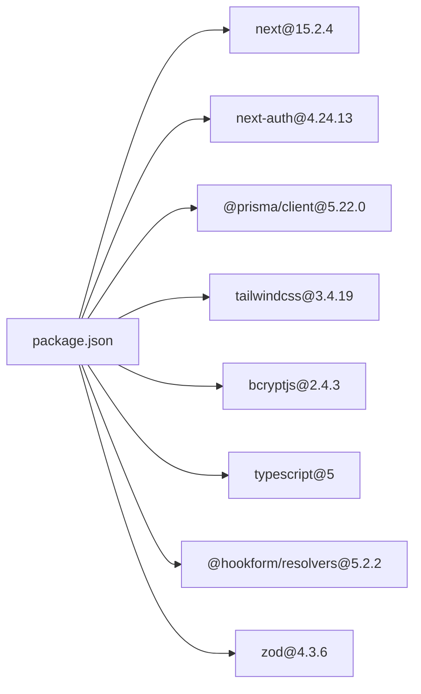

# Deployment & Production

<cite>
**Referenced Files in This Document**
- [package.json](file://package.json)
- [next.config.mjs](file://next.config.mjs)
- [tailwind.config.ts](file://tailwind.config.ts)
- [tsconfig.json](file://tsconfig.json)
- [prisma/schema.prisma](file://prisma/schema.prisma)
- [prisma/seed.ts](file://prisma/seed.ts)
- [src/lib/prisma.ts](file://src/lib/prisma.ts)
- [src/lib/auth.ts](file://src/lib/auth.ts)
- [src/middleware.ts](file://src/middleware.ts)
- [src/app/api/auth/[...nextauth]/route.ts](file://src/app/api/auth/[...nextauth]/route.ts)
- [src/app/api/properties/route.ts](file://src/app/api/properties/route.ts)
- [src/app/api/bookings/route.ts](file://src/app/api/bookings/route.ts)
- [src/app/api/locations/route.ts](file://src/app/api/locations/route.ts)
- [src/app/layout.tsx](file://src/app/layout.tsx)
- [src/app/globals.css](file://src/app/globals.css)
</cite>

## Update Summary
**Changes Made**
- Enhanced Next.js production configuration with dedicated build directory separation
- Updated TypeScript configuration for improved bundler compatibility and performance
- Strengthened Prisma client logging controls for production optimization
- Refined middleware and API route security enforcement for production deployments
- Improved build artifact organization and cache isolation between environments

## Table of Contents
1. [Introduction](#introduction)
2. [Project Structure](#project-structure)
3. [Core Components](#core-components)
4. [Architecture Overview](#architecture-overview)
5. [Detailed Component Analysis](#detailed-component-analysis)
6. [Dependency Analysis](#dependency-analysis)
7. [Performance Considerations](#performance-considerations)
8. [Troubleshooting Guide](#troubleshooting-guide)
9. [Conclusion](#conclusion)
10. [Appendices](#appendices)

## Introduction
This document provides comprehensive deployment and production guidance for RentalHub-BOUESTI. It covers the build process, environment configuration, database deployment and migrations, security hardening, deployment strategies for Next.js (including static generation and server-side rendering), monitoring and performance optimization, scaling and load balancing, SSL/TLS configuration, production debugging, and CI/CD automation. The guidance is grounded in the repository's configuration and source files.

## Project Structure
RentalHub-BOUESTI is a Next.js 15 application using TypeScript, Prisma ORM, and NextAuth.js for authentication. The repository is organized into:
- Application code under src/, including pages, API routes, middleware, and shared libraries
- Prisma schema and seed script under prisma/
- Build-time configuration for Next.js and Tailwind CSS
- Package scripts for local development and database operations

**Diagram sources**
- [package.json:1-49](file://package.json#L1-L49)
- [next.config.mjs:1-16](file://next.config.mjs#L1-L16)
- [tailwind.config.ts:1-35](file://tailwind.config.ts#L1-L35)
- [tsconfig.json:1-42](file://tsconfig.json#L1-L42)
- [prisma/schema.prisma:1-136](file://prisma/schema.prisma#L1-L136)
- [prisma/seed.ts:1-143](file://prisma/seed.ts#L1-L143)
- [src/lib/prisma.ts:1-27](file://src/lib/prisma.ts#L1-L27)
- [src/lib/auth.ts:1-119](file://src/lib/auth.ts#L1-L119)
- [src/middleware.ts:1-76](file://src/middleware.ts#L1-L76)
- [src/app/layout.tsx:1-28](file://src/app/layout.tsx#L1-L28)
- [src/app/globals.css:1-246](file://src/app/globals.css#L1-L246)

**Section sources**
- [package.json:1-49](file://package.json#L1-L49)
- [next.config.mjs:1-16](file://next.config.mjs#L1-L16)
- [tailwind.config.ts:1-35](file://tailwind.config.ts#L1-L35)
- [tsconfig.json:1-42](file://tsconfig.json#L1-L42)
- [prisma/schema.prisma:1-136](file://prisma/schema.prisma#L1-L136)
- [prisma/seed.ts:1-143](file://prisma/seed.ts#L1-L143)
- [src/lib/prisma.ts:1-27](file://src/lib/prisma.ts#L1-L27)
- [src/lib/auth.ts:1-119](file://src/lib/auth.ts#L1-L119)
- [src/middleware.ts:1-76](file://src/middleware.ts#L1-L76)
- [src/app/layout.tsx:1-28](file://src/app/layout.tsx#L1-L28)
- [src/app/globals.css:1-246](file://src/app/globals.css#L1-L246)

## Core Components
- Next.js runtime and build configuration with production-optimized artifact separation
- Prisma ORM with PostgreSQL datasource and enhanced logging controls
- Authentication via NextAuth.js with JWT sessions and robust security enforcement
- Edge middleware for route protection and role-based access control
- API routes for properties, bookings, and locations with comprehensive validation
- Shared Prisma client singleton with environment-aware logging and caching
- Tailwind CSS configuration with optimized content paths and custom branding

Key production-relevant aspects:
- Environment-specific Next.js build directory separation (.next vs .next-dev)
- Enhanced Prisma client logging reduced to error-only in production
- Strict TypeScript compilation with bundler module resolution
- Comprehensive middleware route protection and unauthorized redirection
- Robust API route authorization with role-based access controls
- Optimized Tailwind CSS purging via selective content globs

**Section sources**
- [next.config.mjs:3-4](file://next.config.mjs#L3-L4)
- [src/lib/prisma.ts:16-20](file://src/lib/prisma.ts#L16-L20)
- [tsconfig.json:13-14](file://tsconfig.json#L13-L14)
- [src/middleware.ts:6-10](file://src/middleware.ts#L6-L10)
- [src/app/api/properties/route.ts:97-107](file://src/app/api/properties/route.ts#L97-L107)
- [src/app/api/bookings/route.ts:47-57](file://src/app/api/bookings/route.ts#L47-L57)
- [tailwind.config.ts:4-8](file://tailwind.config.ts#L4-L8)

## Architecture Overview
The production architecture centers on a Next.js application serving both static and dynamic content, with API routes handling business logic and database interactions through Prisma. Authentication is enforced via middleware and protected endpoints with comprehensive role-based access control.

**Diagram sources**
- [src/middleware.ts:15-66](file://src/middleware.ts#L15-L66)
- [src/app/api/auth/[...nextauth]/route.ts:1-7](file://src/app/api/auth/[...nextauth]/route.ts#L1-L7)
- [src/app/layout.tsx:11-27](file://src/app/layout.tsx#L11-L27)
- [src/app/globals.css:1-246](file://src/app/globals.css#L1-L246)
- [src/app/api/properties/route.ts:15-93](file://src/app/api/properties/route.ts#L15-L93)
- [src/app/api/bookings/route.ts:11-108](file://src/app/api/bookings/route.ts#L11-L108)
- [src/app/api/locations/route.ts:11-28](file://src/app/api/locations/route.ts#L11-L28)
- [src/lib/prisma.ts:13-20](file://src/lib/prisma.ts#L13-L20)
- [prisma/schema.prisma:10-13](file://prisma/schema.prisma#L10-L13)
- [next.config.mjs:5-12](file://next.config.mjs#L5-L12)
- [tailwind.config.ts:4-8](file://tailwind.config.ts#L4-L8)
- [tsconfig.json:13-14](file://tsconfig.json#L13-L14)

## Detailed Component Analysis

### Database Layer
- Datasource: PostgreSQL via Prisma with enhanced indexing strategy
- Environment variable: DATABASE_URL for production database connectivity
- Client lifecycle: Singleton with global caching and production-optimized logging
- Comprehensive indexing strategy for performance and referential integrity
- Enhanced model relationships with cascading deletes and foreign key constraints

**Diagram sources**
- [prisma/schema.prisma:44-62](file://prisma/schema.prisma#L44-L62)
- [prisma/schema.prisma:65-78](file://prisma/schema.prisma#L65-L78)
- [prisma/schema.prisma:81-114](file://prisma/schema.prisma#L81-L114)
- [prisma/schema.prisma:117-135](file://prisma/schema.prisma#L117-L135)

**Section sources**
- [prisma/schema.prisma:10-13](file://prisma/schema.prisma#L10-L13)
- [prisma/schema.prisma:44-62](file://prisma/schema.prisma#L44-L62)
- [prisma/schema.prisma:65-78](file://prisma/schema.prisma#L65-L78)
- [prisma/schema.prisma:81-114](file://prisma/schema.prisma#L81-L114)
- [prisma/schema.prisma:117-135](file://prisma/schema.prisma#L117-L135)
- [src/lib/prisma.ts:13-20](file://src/lib/prisma.ts#L13-L20)

### Authentication and Authorization
- NextAuth.js with Credentials provider and JWT sessions with extended token claims
- Session strategy: JWT with 30-day max age and comprehensive role-based access
- Secret sourced from environment variable with production security enforcement
- Middleware enforces role-based access control with automatic redirection
- Protected API routes validate roles, permissions, and session state with detailed error handling
- Enhanced user verification status checking for account suspension prevention

**Diagram sources**
- [src/middleware.ts:29-65](file://src/middleware.ts#L29-L65)
- [src/app/api/auth/[...nextauth]/route.ts:1-7](file://src/app/api/auth/[...nextauth]/route.ts#L1-L7)
- [src/lib/auth.ts:36-118](file://src/lib/auth.ts#L36-L118)
- [src/app/api/properties/route.ts:97-107](file://src/app/api/properties/route.ts#L97-L107)
- [src/app/api/bookings/route.ts:47-57](file://src/app/api/bookings/route.ts#L47-L57)
- [src/lib/prisma.ts:13-20](file://src/lib/prisma.ts#L13-L20)

**Section sources**
- [src/lib/auth.ts:36-118](file://src/lib/auth.ts#L36-L118)
- [src/middleware.ts:6-10](file://src/middleware.ts#L6-L10)
- [src/app/api/auth/[...nextauth]/route.ts:1-7](file://src/app/api/auth/[...nextauth]/route.ts#L1-L7)
- [src/app/api/properties/route.ts:97-107](file://src/app/api/properties/route.ts#L97-L107)
- [src/app/api/bookings/route.ts:47-57](file://src/app/api/bookings/route.ts#L47-L57)

### API Routes and Business Logic
- Properties: GET supports advanced filtering, sorting, pagination with role-based visibility; POST requires landlord/admin role with comprehensive validation
- Bookings: GET lists per-role with detailed includes; POST validates property availability, uniqueness, and user permissions; PATCH handles role-specific status updates
- Locations: GET returns classifications and names for UI with enhanced data structures
- Comprehensive error handling with appropriate HTTP status codes and detailed error messages
- Role-based access control integrated throughout all API endpoints

**Diagram sources**
- [src/app/api/properties/route.ts:15-93](file://src/app/api/properties/route.ts#L15-L93)
- [src/app/api/properties/route.ts:97-161](file://src/app/api/properties/route.ts#L97-L161)
- [src/app/api/bookings/route.ts:11-108](file://src/app/api/bookings/route.ts#L11-L108)
- [src/app/api/bookings/route.ts:110-181](file://src/app/api/bookings/route.ts#L110-L181)
- [src/app/api/locations/route.ts:11-28](file://src/app/api/locations/route.ts#L11-L28)

**Section sources**
- [src/app/api/properties/route.ts:15-161](file://src/app/api/properties/route.ts#L15-L161)
- [src/app/api/bookings/route.ts:11-181](file://src/app/api/bookings/route.ts#L11-L181)
- [src/app/api/locations/route.ts:11-28](file://src/app/api/locations/route.ts#L11-L28)

### Frontend and Build Configuration
- Next.js configuration with production-optimized artifact separation (.next vs .next-dev) to prevent cache collisions
- Tailwind CSS configured for optimized content paths and custom brand color schemes
- TypeScript configuration with bundler module resolution for improved build performance
- Global styles and layout metadata defined centrally with comprehensive metadata
- Enhanced image optimization with HTTPS remote pattern support

**Section sources**
- [next.config.mjs:3-4](file://next.config.mjs#L3-L4)
- [next.config.mjs:5-12](file://next.config.mjs#L5-L12)
- [tailwind.config.ts:4-8](file://tailwind.config.ts#L4-L8)
- [tsconfig.json:13-14](file://tsconfig.json#L13-L14)
- [src/app/layout.tsx:5-9](file://src/app/layout.tsx#L5-L9)
- [src/app/globals.css:1-246](file://src/app/globals.css#L1-L246)

## Dependency Analysis
- Next.js 15.2.4 runtime and framework dependencies with enhanced build optimization
- Prisma client and database provider with production-optimized logging
- NextAuth.js for authentication with comprehensive role-based access control
- Tailwind CSS for styling with optimized content globs
- bcryptjs for password hashing in auth flow
- Enhanced TypeScript compiler with bundler module resolution

**Diagram sources**
- [package.json:20-32](file://package.json#L20-L32)

**Section sources**
- [package.json:20-32](file://package.json#L20-L32)

## Performance Considerations
- Prisma client logging reduced to error-only in production to minimize overhead and improve performance
- Next.js build directory separation prevents cache collisions between development and production builds
- Middleware runs at Edge runtime for fast route protection with role-based access control
- API routes use server-side session retrieval with comprehensive role validation and Prisma queries
- Tailwind CSS purged via optimized content globs to reduce bundle size and improve load times
- Next.js image optimization enabled for HTTPS remote patterns with enhanced security
- TypeScript bundler module resolution improves build performance and reduces bundle size
- Enhanced database indexing strategy for frequently queried columns (status, price, role)

Recommendations:
- Enable Next.js static export where feasible for read-heavy pages with role-based content
- Use database indexes defined in schema for frequent filters (e.g., status, price, role)
- Implement pagination and limit page sizes in API routes with role-appropriate data limits
- Cache non-sensitive data at CDN edge where appropriate with proper role-based invalidation
- Monitor Prisma query durations and slow logs with production-optimized logging
- Leverage Next.js build artifacts separation for zero-downtime deployments

**Section sources**
- [src/lib/prisma.ts:16-20](file://src/lib/prisma.ts#L16-L20)
- [next.config.mjs:3-4](file://next.config.mjs#L3-L4)
- [src/middleware.ts:15-66](file://src/middleware.ts#L15-L66)
- [tailwind.config.ts:4-8](file://tailwind.config.ts#L4-L8)
- [next.config.mjs:5-12](file://next.config.mjs#L5-L12)
- [tsconfig.json:13-14](file://tsconfig.json#L13-L14)

## Troubleshooting Guide
Common production issues and remedies:
- Authentication failures
  - Verify NEXTAUTH_SECRET is set and consistent across instances with proper environment configuration
  - Confirm database connectivity via DATABASE_URL with enhanced connection pooling
  - Check session cookie domain/path and SameSite settings if using reverse proxies
  - Validate JWT token extraction and role claims in middleware
- Database connectivity
  - Ensure Prisma client can connect to PostgreSQL with production-optimized logging
  - Review Prisma client logs and error messages with error-only logging in production
  - Monitor database connection pool exhaustion with enhanced caching
- Middleware redirect loops
  - Validate middleware matcher paths and session presence with role-based access control
  - Confirm unauthorized route handling returns correct status codes with proper role redirection
  - Check JWT token validation and expiration handling
- API errors
  - Inspect 401/403 responses for missing or invalid sessions with comprehensive error messages
  - Verify role-based access logic in protected routes with detailed permission checks
  - Validate user verification status for account suspension prevention
- Image loading issues
  - Confirm remotePattern allows intended hostnames with HTTPS protocol enforcement
  - Check Next.js build artifacts separation preventing cache collisions
- Build and deployment issues
  - Verify Next.js build directory separation (.next vs .next-dev) for production builds
  - Validate TypeScript bundler module resolution for improved build performance
  - Check Tailwind CSS content globs for proper purging in production

**Section sources**
- [src/lib/auth.ts:87-90](file://src/lib/auth.ts#L87-L90)
- [prisma/schema.prisma:10-13](file://prisma/schema.prisma#L10-L13)
- [src/middleware.ts:29-65](file://src/middleware.ts#L29-L65)
- [src/app/api/properties/route.ts:97-107](file://src/app/api/properties/route.ts#L97-L107)
- [src/app/api/bookings/route.ts:47-57](file://src/app/api/bookings/route.ts#L47-L57)
- [next.config.mjs:5-12](file://next.config.mjs#L5-L12)
- [next.config.mjs:3-4](file://next.config.mjs#L3-L4)
- [tsconfig.json:13-14](file://tsconfig.json#L13-L14)

## Conclusion
RentalHub-BOUESTI is structured for secure, scalable production deployment using Next.js 15, Prisma, and NextAuth.js with enhanced production optimizations. The updated configuration includes dedicated build directory separation, production-optimized Prisma logging, enhanced TypeScript compilation, and comprehensive security enforcement. By following the environment configuration, database migration and seeding procedures, security hardening steps, and operational practices outlined here, teams can reliably deploy and maintain the platform in production with optimal performance and security.

## Appendices

### A. Build and Environment Configuration
- Build commands
  - Development: next dev with separate .next-dev directory
  - Production build: next build with optimized .next directory
  - Production start: next start with production logging
- Environment variables
  - DATABASE_URL: PostgreSQL connection string for production database
  - NEXTAUTH_SECRET: Secret for signing JWT tokens with enhanced security
- Scripts
  - Prisma generate, push, migrate, seed, and studio with production optimization
- Build artifacts
  - Development: .next-dev directory for isolated development builds
  - Production: .next directory for optimized production builds

**Section sources**
- [package.json:5-15](file://package.json#L5-L15)
- [package.json:17-18](file://package.json#L17-L18)
- [prisma/schema.prisma:10-13](file://prisma/schema.prisma#L10-L13)
- [src/lib/auth.ts:87-90](file://src/lib/auth.ts#L87-L90)
- [next.config.mjs:3-4](file://next.config.mjs#L3-L4)

### B. Database Deployment and Migration
- Prisma schema defines PostgreSQL provider and comprehensive models with enhanced indexing
- Migrations
  - Use Prisma migrations for schema changes in production with enhanced logging
  - Apply migrations during deployment pipeline with production-optimized settings
- Seeding
  - Seed initial locations and admin user for new environments with enhanced security
  - Hash passwords using bcrypt with increased complexity (12 rounds)
- Backups
  - Schedule regular logical backups of PostgreSQL with enhanced retention policies
  - Store encrypted offsite and test restore procedures with production validation
- Indexing Strategy
  - Enhanced database indexes for frequently queried columns (status, price, role)
  - Optimized foreign key relationships with cascading deletes

**Section sources**
- [prisma/schema.prisma:6-13](file://prisma/schema.prisma#L6-L13)
- [prisma/seed.ts:104](file://prisma/seed.ts#L104)
- [prisma/seed.ts:126-142](file://prisma/seed.ts#L126-L142)

### C. Security Hardening
- Secrets management
  - Store DATABASE_URL and NEXTAUTH_SECRET in environment vaults with rotation policies
  - Rotate secrets periodically with production deployment validation
- Transport security
  - Enforce HTTPS at the load balancer or CDN with enhanced security headers
  - Configure HSTS and secure cookies with production security best practices
- Access control
  - Middleware and API route guards enforce comprehensive roles with verification status checks
  - Limit exposed API surface and sanitize inputs with enhanced validation
  - Implement rate limiting and request throttling for production environments
- Logging and monitoring
  - Prisma client logging reduced to error-only in production for performance optimization
  - Centralize logs and alert on authentication and database errors with enhanced monitoring
- Session Security
  - JWT sessions with 30-day max age and comprehensive role-based access control
  - Enhanced user verification status checking for account suspension prevention

**Section sources**
- [prisma/schema.prisma:10-13](file://prisma/schema.prisma#L10-L13)
- [src/lib/auth.ts:38-41](file://src/lib/auth.ts#L38-L41)
- [src/middleware.ts:6-10](file://src/middleware.ts#L6-L10)
- [src/lib/prisma.ts:16-20](file://src/lib/prisma.ts#L16-L20)
- [src/app/api/properties/route.ts:97-107](file://src/app/api/properties/route.ts#L97-L107)

### D. Deployment Strategies
- Next.js
  - Static export for read-heavy pages where applicable with production optimization
  - Server-side rendering for dynamic content with authentication and role-based access control
  - Build artifacts separation (.next vs .next-dev) for zero-downtime deployments
- Load balancing
  - Stateless Next.js instances behind a load balancer with production-optimized configuration
  - Sticky sessions optional if relying on JWT with enhanced session management
- SSL/TLS
  - Terminate TLS at load balancer or CDN with enhanced security headers; forward proper headers
  - Implement certificate management and renewal processes
- Blue-green or rolling deployments
  - Zero-downtime updates by switching traffic after health checks with production validation
  - Implement rollback procedures with enhanced monitoring

### E. Monitoring and Observability
- Metrics
  - Track response times, error rates, and database query latency with production monitoring
  - Monitor Prisma query performance and connection pool utilization
- Logs
  - Centralized logging for application and database with production-optimized logging levels
  - Implement structured logging with correlation IDs for production debugging
- Alerts
  - Monitor authentication failures, database connectivity, and critical errors with enhanced alerting
  - Set up alerts for production performance degradation and security incidents

### F. Scaling Considerations
- Horizontal scaling
  - Stateless application servers scale horizontally with production-optimized configuration
  - Implement connection pooling and database optimization for horizontal scaling
- Database scaling
  - Use managed PostgreSQL with read replicas for reporting and enhanced performance
  - Implement database connection pooling and query optimization
- Caching
  - Cache non-sensitive data at CDN and application level with role-based invalidation
  - Implement Redis or similar caching for session storage and frequently accessed data

### G. Production Debugging Techniques
- Enable debug logs temporarily for NextAuth in controlled scenarios with production safety measures
- Use structured logs with correlation IDs and comprehensive error tracking
- Validate environment variables at startup with enhanced validation
- Test authentication flows and middleware behavior in staging with production-like configuration
- Monitor Prisma query performance and optimize slow queries with production profiling

**Section sources**
- [src/lib/auth.ts:114](file://src/lib/auth.ts#L114)

### H. CI/CD Pipeline Setup
- Build
  - Install dependencies with production optimization, run linters, build Next.js with enhanced configuration
  - Validate TypeScript compilation with bundler module resolution
- Test
  - Run database migrations in CI with production-like validation and seed test data if needed
- Deploy
  - Deploy to production with blue-green or rolling strategy with enhanced monitoring
  - Promote successful deployment automatically with production validation
- Release
  - Tag releases and publish artifacts with production-optimized build artifacts
  - Implement automated rollback procedures with enhanced safety checks