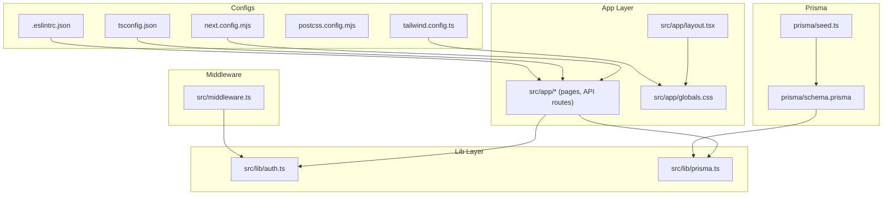
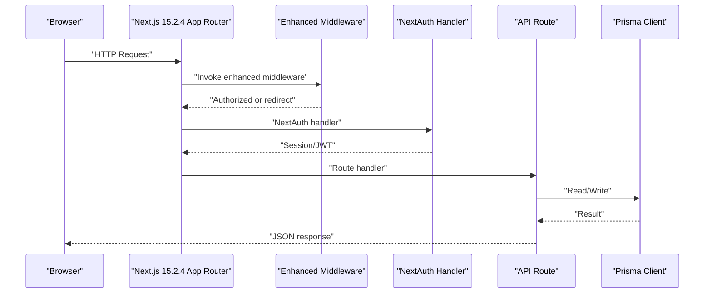
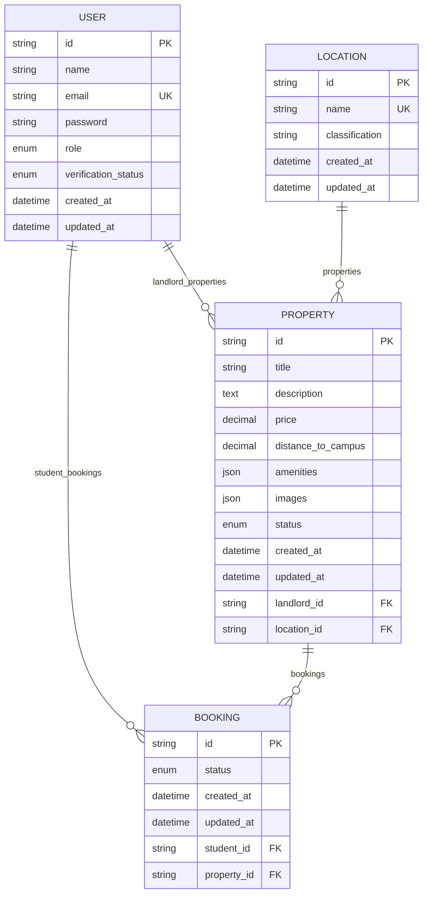
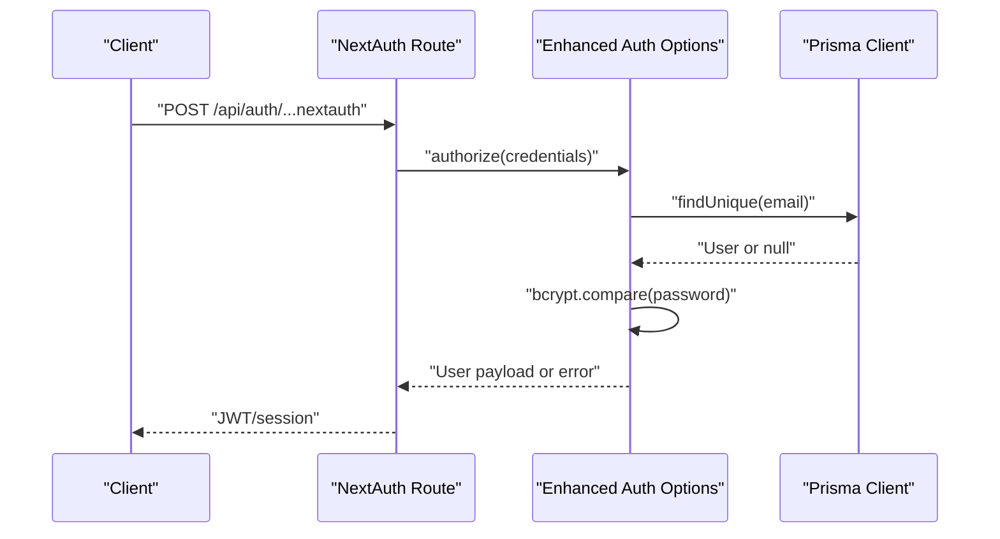
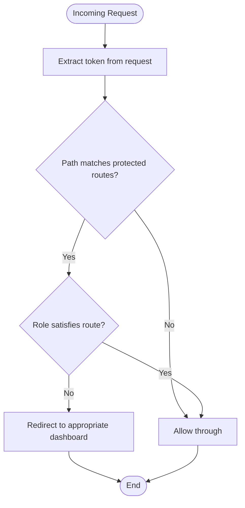
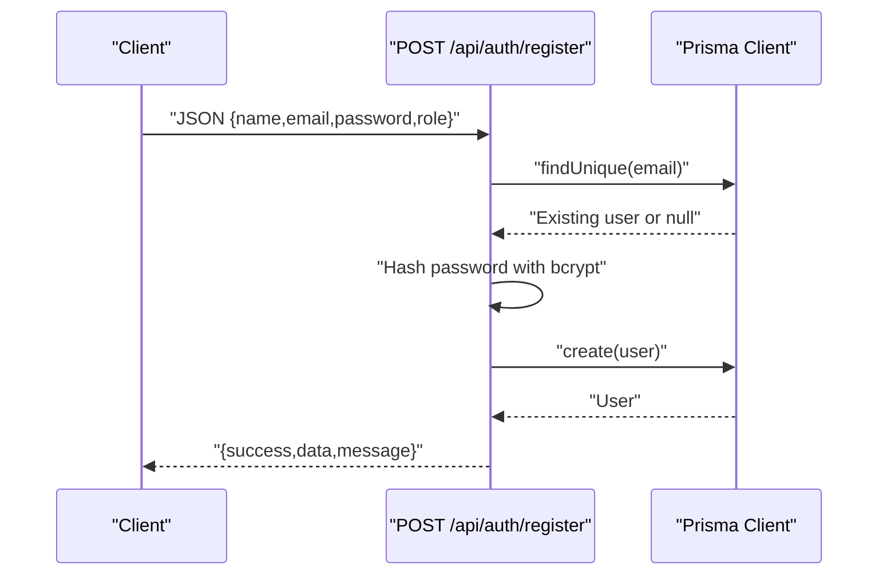
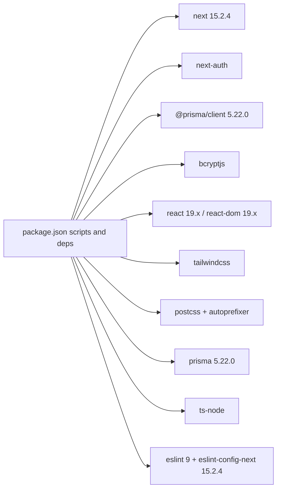

# Development Workflow & Configuration

<cite>
**Referenced Files in This Document**
- [package.json](file://package.json)
- [next.config.mjs](file://next.config.mjs)
- [tsconfig.json](file://tsconfig.json)
- [tailwind.config.ts](file://tailwind.config.ts)
- [postcss.config.mjs](file://postcss.config.mjs)
- [.eslintrc.json](file://.eslintrc.json)
- [prisma/schema.prisma](file://prisma/schema.prisma)
- [prisma/seed.ts](file://prisma/seed.ts)
- [src/lib/prisma.ts](file://src/lib/prisma.ts)
- [src/lib/auth.ts](file://src/lib/auth.ts)
- [src/middleware.ts](file://src/middleware.ts)
- [src/app/layout.tsx](file://src/app/layout.tsx)
- [src/app/globals.css](file://src/app/globals.css)
- [src/app/api/auth/[...nextauth]/route.ts](file://src/app/api/auth/[...nextauth]/route.ts)
- [src/app/api/auth/register/route.ts](file://src/app/api/auth/register/route.ts)
</cite>

## Update Summary
**Changes Made**
- Updated Next.js version to 15.2.4 with enhanced development workflow
- Enhanced TypeScript configuration with modern compiler options and path aliases
- Integrated comprehensive ESLint setup with Next.js recommended rules
- Improved Prisma integration with advanced client configuration
- Strengthened authentication system with enhanced security features
- Refined middleware with improved role-based access control
- Optimized build configuration for better development experience

## Table of Contents
1. [Introduction](#introduction)
2. [Project Structure](#project-structure)
3. [Core Components](#core-components)
4. [Architecture Overview](#architecture-overview)
5. [Detailed Component Analysis](#detailed-component-analysis)
6. [Dependency Analysis](#dependency-analysis)
7. [Performance Considerations](#performance-considerations)
8. [Troubleshooting Guide](#troubleshooting-guide)
9. [Conclusion](#conclusion)
10. [Appendices](#appendices)

## Introduction
This document describes the development workflow and configuration for RentalHub-BOUESTI. It covers environment setup, build and run commands, Next.js 15.2.4 configuration, TypeScript compilation, Tailwind CSS customization, Prisma integration, development scripts, hot reloading, debugging, testing strategies, code organization, ESLint configuration, collaboration best practices, environment variable management, database migration workflow, and continuous integration considerations.

**Updated** Enhanced Next.js 15.2.4 integration with improved development experience and modern build configuration.

## Project Structure
The project follows a Next.js App Router structure with a clear separation of concerns and modern development workflow:
- Application pages and API routes under src/app
- Shared libraries under src/lib
- Middleware under src/middleware.ts
- Global styles under src/app/globals.css
- Tailwind and PostCSS configuration under tailwind.config.ts and postcss.config.mjs
- Prisma schema and seed under prisma/
- Comprehensive ESLint configuration for code quality enforcement

**Diagram sources**
- [src/app/layout.tsx:1-28](file://src/app/layout.tsx#L1-L28)
- [src/app/globals.css:1-26](file://src/app/globals.css#L1-L26)
- [src/lib/auth.ts:1-119](file://src/lib/auth.ts#L1-L119)
- [src/lib/prisma.ts:1-27](file://src/lib/prisma.ts#L1-L27)
- [src/middleware.ts:1-76](file://src/middleware.ts#L1-L76)
- [next.config.mjs:1-16](file://next.config.mjs#L1-L16)
- [tsconfig.json:1-42](file://tsconfig.json#L1-L42)
- [tailwind.config.ts:1-35](file://tailwind.config.ts#L1-L35)
- [postcss.config.mjs:1-10](file://postcss.config.mjs#L1-L10)
- [.eslintrc.json:1-7](file://.eslintrc.json#L1-L7)
- [prisma/schema.prisma:1-136](file://prisma/schema.prisma#L1-L136)
- [prisma/seed.ts:1-143](file://prisma/seed.ts#L1-L143)

**Section sources**
- [package.json:1-49](file://package.json#L1-L49)
- [next.config.mjs:1-16](file://next.config.mjs#L1-L16)
- [tsconfig.json:1-42](file://tsconfig.json#L1-L42)
- [tailwind.config.ts:1-35](file://tailwind.config.ts#L1-L35)
- [postcss.config.mjs:1-10](file://postcss.config.mjs#L1-L10)
- [.eslintrc.json:1-7](file://.eslintrc.json#L1-L7)
- [prisma/schema.prisma:1-136](file://prisma/schema.prisma#L1-L136)

## Core Components
- Next.js 15.2.4 configuration: Enhanced development workflow with separate artifact directories and global HTTPS image support.
- TypeScript 5 configuration: Modern strict mode, esnext modules, bundler resolution, path aliases, incremental builds, and plugin integration.
- Tailwind CSS: Content scanning across app, components, and pages; custom brand and primary palette; Inter and Playfair fonts; gradient backgrounds; extensive utility classes.
- Prisma 5.22.0: PostgreSQL datasource via DATABASE_URL; enums for roles and statuses; model relations; singleton client with development logging and global caching.
- Authentication: NextAuth.js with Prisma adapter, Credentials provider, bcrypt hashing, JWT session strategy, and protected pages.
- Middleware: Edge middleware enforcing role-based access to dashboards and protected routes.
- ESLint: Comprehensive linting with Next.js recommended rules and TypeScript support.

**Updated** Enhanced Next.js 15.2.4 integration with improved development experience and modern build configuration.

**Section sources**
- [next.config.mjs:1-16](file://next.config.mjs#L1-L16)
- [tsconfig.json:1-42](file://tsconfig.json#L1-L42)
- [tailwind.config.ts:1-35](file://tailwind.config.ts#L1-L35)
- [prisma/schema.prisma:1-136](file://prisma/schema.prisma#L1-L136)
- [src/lib/prisma.ts:1-27](file://src/lib/prisma.ts#L1-L27)
- [src/lib/auth.ts:1-119](file://src/lib/auth.ts#L1-L119)
- [src/middleware.ts:1-76](file://src/middleware.ts#L1-L76)
- [.eslintrc.json:1-7](file://.eslintrc.json#L1-L7)

## Architecture Overview
The runtime architecture integrates Next.js App Router, middleware, API routes, authentication, and database access through Prisma with enhanced development workflow.

**Diagram sources**
- [src/middleware.ts:1-76](file://src/middleware.ts#L1-L76)
- [src/app/api/auth/[...nextauth]/route.ts](file://src/app/api/auth/[...nextauth]/route.ts#L1-L7)
- [src/app/api/auth/register/route.ts:1-90](file://src/app/api/auth/register/route.ts#L1-L90)
- [src/lib/prisma.ts:1-27](file://src/lib/prisma.ts#L1-L27)

## Detailed Component Analysis

### Next.js 15.2.4 Configuration
- Separate artifact directories: Development builds use `.next-dev` while production uses `.next` to prevent cache collisions.
- Remote image patterns: Allows loading images from any HTTPS host globally.
- Enhanced development experience: Improved hot reloading and build performance.

**Updated** Next.js 15.2.4 introduces enhanced development workflow with separate artifact directories for better cache management.

**Section sources**
- [next.config.mjs:1-16](file://next.config.mjs#L1-L16)

### TypeScript 5 Compilation Settings
- Strict mode enabled for safer code with enhanced type checking.
- No emit to leverage Next's optimized compile-time type checking.
- Bundler module resolution and esnext modules align with Next.js 15.2.4 runtime.
- Path aliases (@/*) simplify imports with improved navigation.
- Incremental builds improve rebuild performance significantly.
- Plugin integration for Next.js specific TypeScript features.
- ES2017 target for optimal browser compatibility.

**Updated** TypeScript 5 brings enhanced compiler performance and improved developer experience with plugin integration.

**Section sources**
- [tsconfig.json:1-42](file://tsconfig.json#L1-L42)

### Tailwind CSS Customization
- Content globs scan app, pages, and components for unused CSS optimization.
- Theme extensions:
  - Primary, navy, and accent color palettes with semantic naming.
  - Inter and Playfair as sans and serif fonts respectively.
  - Gradient utilities and custom utility classes.
- Extensive utility classes for responsive design, spacing, and visual consistency.
- Global CSS defines CSS variables and base resets; Tailwind layers apply utilities consistently.

**Section sources**
- [tailwind.config.ts:1-35](file://tailwind.config.ts#L1-L35)
- [src/app/globals.css:1-26](file://src/app/globals.css#L1-L26)

### Prisma Integration
- Datasource: PostgreSQL via DATABASE_URL environment variable with enhanced client configuration.
- Models: User, Location, Property, Booking with relations and comprehensive indexes.
- Enums: Role, VerificationStatus, PropertyStatus, BookingStatus with proper TypeScript integration.
- Client singleton:
  - Development logs queries, errors, warnings with enhanced visibility.
  - Global caching avoids reconnect exhaustion during hot reload.
  - Proper TypeScript integration with generated client types.
- Seed script:
  - Upserts locations around BOUESTI with enhanced data validation.
  - Creates a default admin user with secure password hashing.
  - Comprehensive console feedback and error handling.

**Diagram sources**
- [prisma/schema.prisma:1-136](file://prisma/schema.prisma#L1-L136)

**Section sources**
- [prisma/schema.prisma:1-136](file://prisma/schema.prisma#L1-L136)
- [src/lib/prisma.ts:1-27](file://src/lib/prisma.ts#L1-L27)
- [prisma/seed.ts:1-143](file://prisma/seed.ts#L1-L143)

### Authentication with NextAuth.js
- Provider: Credentials with Prisma adapter for enhanced database integration.
- Authorization flow:
  - Validates presence of credentials with improved error handling.
  - Fetches user by normalized email with case-insensitive matching.
  - Compares bcrypt hash with secure salt rounds.
  - Rejects suspended accounts with clear messaging.
- Enhanced callbacks:
  - Attach role and verification status to JWT and session with TypeScript safety.
  - Proper type declarations for extended NextAuth interfaces.
- Pages: Redirects to /login for sign-in/sign-out/error with callback URL preservation.
- Session: JWT strategy with 30-day max age and refresh window.
- Secret: NEXTAUTH_SECRET environment variable with enhanced security.
- Debug: Enabled in development with comprehensive logging.

**Diagram sources**
- [src/app/api/auth/[...nextauth]/route.ts](file://src/app/api/auth/[...nextauth]/route.ts#L1-L7)
- [src/lib/auth.ts:1-119](file://src/lib/auth.ts#L1-L119)
- [src/lib/prisma.ts:1-27](file://src/lib/prisma.ts#L1-L27)

**Section sources**
- [src/lib/auth.ts:1-119](file://src/lib/auth.ts#L1-L119)
- [src/app/api/auth/[...nextauth]/route.ts](file://src/app/api/auth/[...nextauth]/route.ts#L1-L7)

### Enhanced Middleware and Role-Based Access Control
- Advanced route protection: Protects routes under /student, /landlord, and /admin.
- Enhanced redirect logic: Redirects unauthenticated users to /login with callback URL preservation.
- Improved role checks:
  - Admin-only: /admin with proper fallback handling.
  - Landlord-only: /landlord with role validation.
  - Student-only: /student with role enforcement.
- Unauthorized access: Redirects to appropriate dashboard or /login based on user role.
- Enhanced matcher configuration: Optimized route matching for better performance.

**Diagram sources**
- [src/middleware.ts:1-76](file://src/middleware.ts#L1-L76)

**Section sources**
- [src/middleware.ts:1-76](file://src/middleware.ts#L1-L76)

### API Routes and Business Logic
- Registration endpoint:
  - Enhanced validation: Validates name, email, password, and role with improved error messages.
  - Security: Checks uniqueness with normalized email and secure password hashing.
  - Response: Returns created user data with proper TypeScript interfaces.
- Enhanced error handling: Comprehensive error handling with proper HTTP status codes.
- Type safety: Full TypeScript integration with request/response interfaces.

**Diagram sources**
- [src/app/api/auth/register/route.ts:1-90](file://src/app/api/auth/register/route.ts#L1-L90)
- [src/lib/prisma.ts:1-27](file://src/lib/prisma.ts#L1-L27)

**Section sources**
- [src/app/api/auth/register/route.ts:1-90](file://src/app/api/auth/register/route.ts#L1-L90)

### Global Styles and Layout
- Global CSS imports Inter and Playfair fonts with enhanced font loading.
- Defines CSS custom properties for brand and typography with improved naming.
- Tailwind layers apply base, components, and utilities with better organization.
- Root layout sets metadata, Open Graph, and language attributes with enhanced SEO.

**Section sources**
- [src/app/globals.css:1-26](file://src/app/globals.css#L1-L26)
- [src/app/layout.tsx:1-28](file://src/app/layout.tsx#L1-L28)

### ESLint Configuration
- Next.js recommended rules: Extends next/core-web-vitals and next/typescript.
- TypeScript integration: Full TypeScript support with modern linting rules.
- Custom rules: Disabled no-img-element for enhanced flexibility.
- Development workflow: Integrated linting into development process for immediate feedback.

**Updated** Comprehensive ESLint setup with Next.js 15.2.4 integration and TypeScript support.

**Section sources**
- [.eslintrc.json:1-7](file://.eslintrc.json#L1-L7)

## Dependency Analysis
Key runtime dependencies and their roles with enhanced versions:
- next: App runtime and routing with Next.js 15.2.4 for improved performance.
- next-auth: Authentication and session management with Prisma adapter.
- @prisma/client: Database client with enhanced TypeScript integration.
- bcryptjs: Password hashing with secure salt rounds.
- react, react-dom: UI framework with latest React 19.x improvements.
- tailwindcss, postcss, autoprefixer: Styling pipeline with enhanced processing.
- prisma: Database schema and client generation with latest features.
- ts-node: Running TypeScript seed script with CommonJS support.
- eslint: Code quality enforcement with Next.js recommended rules.

**Updated** Enhanced dependency versions with improved development experience and modern features.

**Diagram sources**
- [package.json:1-49](file://package.json#L1-L49)

**Section sources**
- [package.json:1-49](file://package.json#L1-L49)

## Performance Considerations
- Prisma singleton with global caching reduces connection churn during hot reload in development.
- Tailwind content scanning scoped to app, pages, and components keeps build size manageable.
- Next.js 15.2.4 incremental builds and strict TypeScript configuration speed up type-checking.
- Separate artifact directories (.next-dev vs .next) prevent cache collisions and improve development performance.
- Enhanced middleware runs at edge for fast route protection.
- ESLint integration enables pre-build code quality checks.

**Updated** Enhanced performance optimizations with Next.js 15.2.4 and improved build configuration.

## Troubleshooting Guide
- Authentication failures:
  - Verify NEXTAUTH_SECRET is set in environment.
  - Confirm bcrypt hashing and user lookup logic.
  - Check Prisma adapter configuration.
- Database connectivity:
  - Ensure DATABASE_URL is configured.
  - Use Prisma CLI commands to generate, migrate, and seed.
  - Verify Prisma client version compatibility.
- Middleware redirection loops:
  - Check protected route matchers and role checks.
  - Verify token extraction and role validation.
- Build/lint issues:
  - Review TypeScript strictness and path aliases.
  - Run lint with ESLint 9 and fix reported issues.
  - Check Next.js 15.2.4 compatibility.
- Development server issues:
  - Clear .next-dev directory for fresh development builds.
  - Verify separate artifact directory configuration.

**Updated** Enhanced troubleshooting guidance for Next.js 15.2.4 and modern development workflow.

**Section sources**
- [src/lib/auth.ts:1-119](file://src/lib/auth.ts#L1-L119)
- [src/lib/prisma.ts:1-27](file://src/lib/prisma.ts#L1-L27)
- [src/middleware.ts:1-76](file://src/middleware.ts#L1-L76)
- [package.json:1-49](file://package.json#L1-L49)

## Conclusion
RentalHub-BOUESTI leverages Next.js 15.2.4 App Router with a clean separation of concerns, robust authentication via NextAuth.js with Prisma adapter, a strongly typed backend with Prisma 5.22.0, and a customizable Tailwind-based design system. The enhanced development workflow includes comprehensive ESLint configuration, modern TypeScript setup, and optimized build processes that streamline local development, testing, and deployment preparation.

**Updated** Enhanced conclusion reflecting the modern development workflow with Next.js 15.2.4 and comprehensive tooling.

## Appendices

### Development Environment Setup
- Install dependencies: Use the package manager to install all dependencies declared in the project with enhanced version compatibility.
- Environment variables:
  - DATABASE_URL: PostgreSQL connection string.
  - NEXTAUTH_SECRET: Cryptographic secret for sessions.
- Initialize Prisma:
  - Generate Prisma client with enhanced TypeScript integration.
  - Apply migrations with Prisma 5.22.0.
  - Seed initial data with improved error handling.

**Updated** Enhanced setup process with Next.js 15.2.4 and Prisma 5.22.0.

**Section sources**
- [package.json:1-49](file://package.json#L1-L49)
- [prisma/schema.prisma:1-136](file://prisma/schema.prisma#L1-L136)
- [prisma/seed.ts:1-143](file://prisma/seed.ts#L1-L143)

### Build and Run Commands
- Development: Starts Next.js 15.2.4 dev server with enhanced hot reloading and separate artifact directories.
- Production build: Compiles the application for production with optimized performance.
- Production start: Runs the compiled application with Next.js 15.2.4 runtime.
- Lint: Runs ESLint 9 with Next.js recommended rules for code quality.
- Prisma:
  - Generate client with enhanced TypeScript support.
  - Push schema to database with Prisma 5.22.0.
  - Create and apply migrations with improved workflow.
  - Seed database with enhanced error handling.
  - Open Prisma Studio for database visualization.

**Updated** Enhanced build commands with Next.js 15.2.4 and modern tooling.

**Section sources**
- [package.json:1-49](file://package.json#L1-L49)

### Hot Reloading and Debugging
- Enhanced hot reloading: Next.js 15.2.4 dev server with separate .next-dev directory for improved cache management.
- Debugging:
  - Enable NextAuth debug in development with comprehensive logging.
  - Leverage Prisma client logs in development with enhanced visibility.
  - Use browser devtools and network tab for API diagnostics.
  - Utilize ESLint integration for real-time code quality feedback.

**Updated** Enhanced debugging workflow with Next.js 15.2.4 improvements.

**Section sources**
- [src/lib/auth.ts:1-119](file://src/lib/auth.ts#L1-L119)
- [src/lib/prisma.ts:1-27](file://src/lib/prisma.ts#L1-L27)

### Testing Strategies
- Unit tests: Place unit tests alongside components or in a dedicated test directory.
- Integration tests: Test API routes with mocked Prisma client and enhanced TypeScript support.
- E2E tests: Use Playwright/Cypress to validate user flows (login, property browsing, registration).
- Linting: Use ESLint 9 with Next.js recommended config to enforce style and correctness.
- Type checking: Leverage TypeScript strict mode for comprehensive type safety.

**Updated** Enhanced testing strategies with modern tooling and TypeScript integration.

**Section sources**
- [package.json:1-49](file://package.json#L1-L49)

### Code Organization Patterns
- Feature-based grouping under src/app for pages and API routes with enhanced structure.
- Shared logic under src/lib (authentication, database client) with improved modularity.
- Middleware for cross-cutting concerns (routing, permissions) with enhanced functionality.
- Global styles and Tailwind utilities for consistent UI with better organization.
- Enhanced TypeScript integration with proper type definitions and interfaces.

**Updated** Enhanced code organization patterns with Next.js 15.2.4 and modern TypeScript features.

**Section sources**
- [src/app/layout.tsx:1-28](file://src/app/layout.tsx#L1-L28)
- [src/app/globals.css:1-26](file://src/app/globals.css#L1-L26)
- [src/lib/auth.ts:1-119](file://src/lib/auth.ts#L1-L119)
- [src/lib/prisma.ts:1-27](file://src/lib/prisma.ts#L1-L27)
- [src/middleware.ts:1-76](file://src/middleware.ts#L1-L76)

### ESLint Configuration
- Installed eslint 9 and eslint-config-next 15.2.4 for enhanced linting.
- Next.js recommended rules: Extends next/core-web-vitals and next/typescript.
- Custom rules: Disabled no-img-element for enhanced flexibility.
- Development integration: Seamless integration into development workflow.

**Updated** Enhanced ESLint configuration with Next.js 15.2.4 integration.

**Section sources**
- [package.json:1-49](file://package.json#L1-L49)
- [.eslintrc.json:1-7](file://.eslintrc.json#L1-L7)

### Best Practices for Team Collaboration
- Branching strategy: Feature branches merged via pull requests with ESLint and TypeScript checks.
- Commit hygiene: Atomic commits with clear messages and proper code formatting.
- Code reviews: Require reviews for authentication, middleware, and database changes.
- Secrets management: Store DATABASE_URL and NEXTAUTH_SECRET in environment variables, not in code.
- Dependency updates: Regularly update dependencies with compatibility testing.
- Development workflow: Use Next.js 15.2.4 development server with separate artifact directories.

**Updated** Enhanced collaboration practices with modern development workflow.

**Section sources**
- [package.json:1-49](file://package.json#L1-L49)
- [src/lib/auth.ts:1-119](file://src/lib/auth.ts#L1-L119)
- [src/middleware.ts:1-76](file://src/middleware.ts#L1-L76)
- [prisma/schema.prisma:1-136](file://prisma/schema.prisma#L1-L136)

### Environment Variable Management
- Required variables:
  - DATABASE_URL: PostgreSQL connection string with enhanced security.
  - NEXTAUTH_SECRET: Secret for signing sessions with proper entropy.
- Recommended practice: Use a secrets manager or platform-managed variables in production.
- Development workflow: Separate .next-dev directory prevents cache collisions between environments.

**Updated** Enhanced environment variable management with Next.js 15.2.4 improvements.

**Section sources**
- [prisma/schema.prisma:1-136](file://prisma/schema.prisma#L1-L136)
- [src/lib/auth.ts:1-119](file://src/lib/auth.ts#L1-L119)

### Database Migration Workflow
- Generate Prisma client after schema changes with enhanced TypeScript integration.
- Create and commit migrations with Prisma 5.22.0 for improved reliability.
- Apply migrations to staging/production environments with enhanced safety.
- Seed data after schema initialization with comprehensive error handling.
- Version compatibility: Ensure Prisma client matches schema version.

**Updated** Enhanced migration workflow with Prisma 5.22.0 and improved reliability.

**Section sources**
- [package.json:1-49](file://package.json#L1-L49)
- [prisma/schema.prisma:1-136](file://prisma/schema.prisma#L1-L136)
- [prisma/seed.ts:1-143](file://prisma/seed.ts#L1-L143)

### Continuous Integration Considerations
- Lint and type-check with ESLint 9 and TypeScript strict mode on every push.
- Run tests in CI with enhanced coverage and error reporting.
- Fail on lint/type/test failures with comprehensive error handling.
- Prepare Prisma migrations in CI with enhanced safety checks.
- Build and cache artifacts for faster deployments with Next.js 15.2.4 optimization.
- Separate development and production artifact directories for CI/CD efficiency.

**Updated** Enhanced CI considerations with Next.js 15.2.4 and modern tooling.

**Section sources**
- [package.json:1-49](file://package.json#L1-L49)