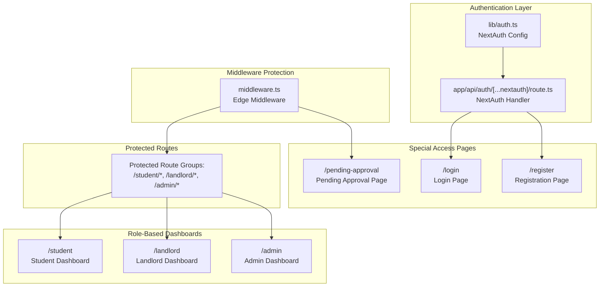
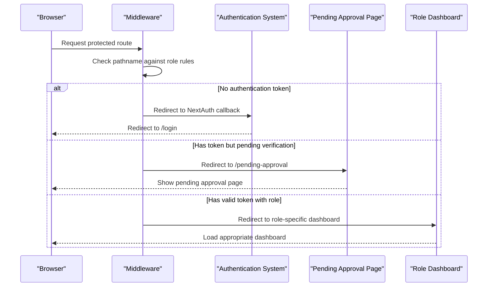
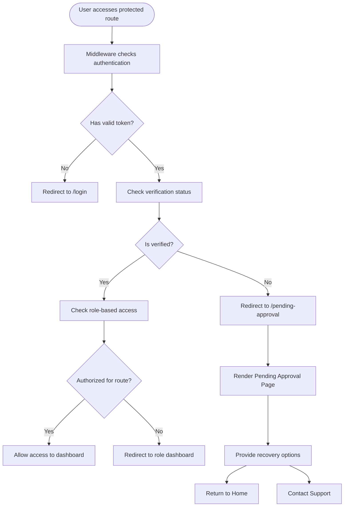
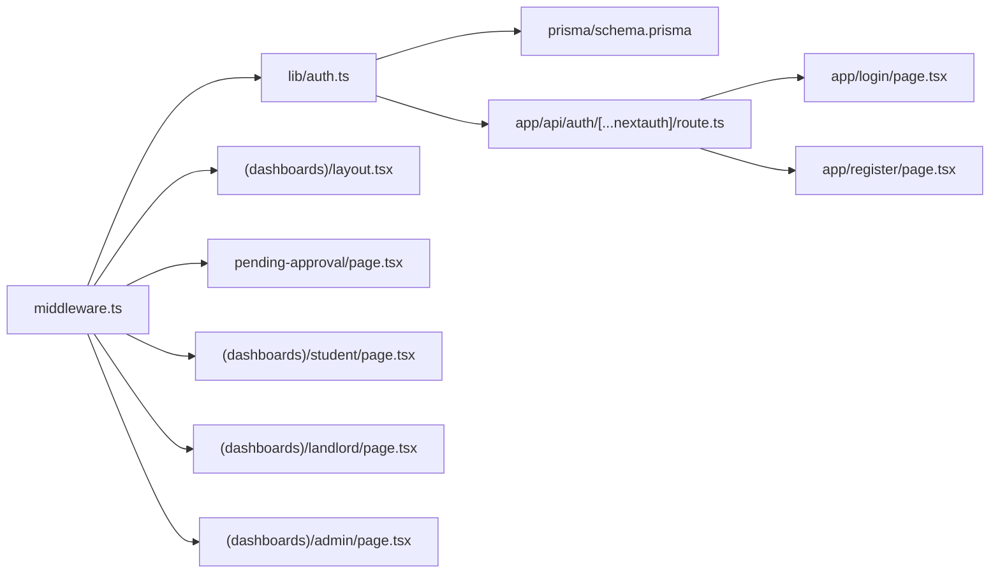

# Access Control & Special Pages

<cite>
**Referenced Files in This Document**
- [middleware.ts](file://src/middleware.ts)
- [page.tsx](file://src/app/pending-approval/page.tsx)
- [auth.ts](file://src/lib/auth.ts)
- [route.ts](file://src/app/api/auth/[...nextauth]/route.ts)
- [layout.tsx](file://src/app/layout.tsx)
- [page.tsx](file://src/app/login/page.tsx)
- [page.tsx](file://src/app/register/page.tsx)
- [route.ts](file://src/app/api/auth/register/route.ts)
- [schema.prisma](file://prisma/schema.prisma)
- [layout.tsx](file://src/app/(dashboards)/layout.tsx)
- [page.tsx](file://src/app/(dashboards)/student/page.tsx)
- [page.tsx](file://src/app/(dashboards)/landlord/page.tsx)
- [page.tsx](file://src/app/(dashboards)/admin/page.tsx)
</cite>

## Update Summary
**Changes Made**
- Added documentation for new pending approval page functionality
- Updated role-based dashboard architecture with three distinct role-specific dashboards
- Enhanced middleware access control patterns with role-based routing
- Expanded authentication integration with verification status handling
- Updated access control patterns to include pending approval workflows

## Table of Contents
1. [Introduction](#introduction)
2. [Project Structure](#project-structure)
3. [Core Components](#core-components)
4. [Architecture Overview](#architecture-overview)
5. [Detailed Component Analysis](#detailed-component-analysis)
6. [Dependency Analysis](#dependency-analysis)
7. [Performance Considerations](#performance-considerations)
8. [Troubleshooting Guide](#troubleshooting-guide)
9. [Conclusion](#conclusion)

## Introduction
This document explains the unauthorized access handling and special pages functionality in the RentalHub BOUESTI application. The system now includes comprehensive access control with role-based dashboards, pending approval workflows, and specialized pages for different user states. It covers how the system prevents unauthorized access to protected routes, handles pending approval scenarios, and provides role-specific user experiences through dedicated dashboards.

## Project Structure
The access control and special pages functionality spans several key areas with enhanced role-based architecture:
- Middleware that enforces authentication and role-based access to protected routes
- Pending approval page for users awaiting administrative review
- Three role-specific dashboards (student, landlord, admin) with distinct functionality
- Authentication configuration that manages sessions, roles, and verification statuses
- Login and registration pages integrated with the access control system
- Database schema defining user roles, verification statuses, and access hierarchies

**Diagram sources**
- [middleware.ts:1-76](file://src/middleware.ts#L1-L76)
- [auth.ts:1-119](file://src/lib/auth.ts#L1-L119)
- [route.ts:1-7](file://src/app/api/auth/[...nextauth]/route.ts#L1-L7)
- [page.tsx:1-82](file://src/app/pending-approval/page.tsx#L1-L82)
- [page.tsx:1-116](file://src/app/login/page.tsx#L1-L116)
- [page.tsx:1-128](file://src/app/register/page.tsx#L1-L128)
- [layout.tsx:1-19](file://src/app/(dashboards)/layout.tsx#L1-L19)
- [page.tsx:1-303](file://src/app/(dashboards)/student/page.tsx#L1-L303)
- [page.tsx:1-296](file://src/app/(dashboards)/landlord/page.tsx#L1-L296)
- [page.tsx:1-247](file://src/app/(dashboards)/admin/page.tsx#L1-L247)

**Section sources**
- [middleware.ts:1-76](file://src/middleware.ts#L1-L76)
- [auth.ts:1-119](file://src/lib/auth.ts#L1-L119)
- [page.tsx:1-82](file://src/app/pending-approval/page.tsx#L1-L82)
- [page.tsx:1-116](file://src/app/login/page.tsx#L1-L116)
- [page.tsx:1-128](file://src/app/register/page.tsx#L1-L128)
- [layout.tsx:1-19](file://src/app/(dashboards)/layout.tsx#L1-L19)
- [page.tsx:1-303](file://src/app/(dashboards)/student/page.tsx#L1-L303)
- [page.tsx:1-296](file://src/app/(dashboards)/landlord/page.tsx#L1-L296)
- [page.tsx:1-247](file://src/app/(dashboards)/admin/page.tsx#L1-L247)
- [route.ts:1-7](file://src/app/api/auth/[...nextauth]/route.ts#L1-L7)
- [layout.tsx:1-42](file://src/app/layout.tsx#L1-L42)

## Core Components
- **Enhanced Middleware Protection**: Enforces authentication and role-based access to protected routes with three distinct role categories (STUDENT, LANDLORD, ADMIN)
- **Pending Approval Page**: Dedicated page for users whose accounts are under administrative review, providing clear messaging and next steps
- **Role-Based Dashboard System**: Three specialized dashboards with distinct functionality for students, landlords, and administrators
- **Advanced Authentication Configuration**: Manages session creation, role propagation, verification status handling, and redirects on authentication errors
- **Comprehensive Access Control**: Integrates middleware protection with role-specific routing and verification workflows
- **Database Schema Integration**: Defines roles, verification statuses, and access hierarchies that drive the entire access control system

**Section sources**
- [middleware.ts:5-10](file://src/middleware.ts#L5-L10)
- [page.tsx:5-82](file://src/app/pending-approval/page.tsx#L5-L82)
- [layout.tsx:1-19](file://src/app/(dashboards)/layout.tsx#L1-L19)
- [auth.ts:36-45](file://src/lib/auth.ts#L36-L45)
- [auth.ts:79-82](file://src/lib/auth.ts#L79-L82)
- [schema.prisma:17-27](file://prisma/schema.prisma#L17-L27)

## Architecture Overview
The enhanced access control architecture combines middleware-based route protection with role-specific dashboards and pending approval workflows. When a user attempts to access protected content:
1. Middleware checks authentication and role requirements based on route prefixes
2. Users with pending verification are directed to the pending approval page
3. Authorized users are redirected to their role-specific dashboard
4. The system maintains clear separation between different user types and their access levels

**Diagram sources**
- [middleware.ts:15-66](file://src/middleware.ts#L15-L66)
- [auth.ts:95-112](file://src/lib/auth.ts#L95-L112)
- [page.tsx:5-82](file://src/app/pending-approval/page.tsx#L5-L82)

## Detailed Component Analysis

### Pending Approval Page Component
The pending approval page serves as the designated response for users whose accounts are under administrative review. This page provides clear communication about the review process and expected timelines:

- **Clear Status Communication**: Uses prominent orange and blue color scheme to indicate pending status
- **Process Explanation**: Provides step-by-step explanation of the review process with timeline expectations
- **Actionable Information**: Includes contact information for support inquiries
- **Navigation Options**: Offers immediate return to home page for non-logged-in users

**Diagram sources**
- [middleware.ts:28-42](file://src/middleware.ts#L28-L42)
- [page.tsx:5-82](file://src/app/pending-approval/page.tsx#L5-L82)
- [auth.ts:79-82](file://src/lib/auth.ts#L79-L82)

**Section sources**
- [page.tsx:6-82](file://src/app/pending-approval/page.tsx#L6-L82)

### Role-Based Dashboard Architecture
The system now provides three distinct dashboards, each tailored to the specific needs and permissions of different user roles:

#### Student Dashboard
- **Property Browsing**: Comprehensive property listings with filtering and search capabilities
- **Booking Management**: Complete booking lifecycle from request to cancellation
- **Profile Integration**: Direct connection between student profile and booking activities
- **Responsive Design**: Mobile-first approach optimized for student usage patterns

#### Landlord Dashboard  
- **Listing Management**: Full property listing lifecycle with status tracking
- **Tenant Request Handling**: Real-time management of booking requests with approval/rejection workflows
- **Analytics Overview**: Key metrics including total listings, approved properties, and pending requests
- **Add Property Functionality**: Streamlined property addition process with form validation

#### Admin Dashboard
- **Platform Overview**: High-level analytics including total properties, users, and bookings
- **Content Moderation**: Pending property approvals with detailed review capabilities
- **User Management**: Platform administration tools and oversight capabilities
- **System Analytics**: Comprehensive reporting and monitoring capabilities

**Section sources**
- [layout.tsx:1-19](file://src/app/(dashboards)/layout.tsx#L1-L19)
- [page.tsx:1-303](file://src/app/(dashboards)/student/page.tsx#L1-L303)
- [page.tsx:1-296](file://src/app/(dashboards)/landlord/page.tsx#L1-L296)
- [page.tsx:1-247](file://src/app/(dashboards)/admin/page.tsx#L1-L247)

### Enhanced Middleware Protection and Redirect Mechanisms
The middleware now implements sophisticated role-based routing with the following enhanced behaviors:

#### Role-Based Access Rules
- **STUDENT routes**: Restricted to STUDENT role users
- **LANDLORD routes**: Restricted to LANDLORD or ADMIN role users  
- **ADMIN routes**: Restricted to ADMIN role users only

#### Intelligent Redirection Logic
- **Insufficient Role**: Redirects users to their appropriate dashboard instead of generic unauthorized page
- **Pending Verification**: Redirects users with UNVERIFIED status to pending approval page
- **Unknown Roles**: Falls back to login page for malformed or invalid tokens

#### Route Matcher Configuration
Configured to monitor all protected route groups with precise path matching for optimal performance.

**Section sources**
- [middleware.ts:5-10](file://src/middleware.ts#L5-L10)
- [middleware.ts:15-66](file://src/middleware.ts#L15-L66)
- [middleware.ts:68-76](file://src/middleware.ts#L68-L76)

### Advanced Access Control Patterns and Role Hierarchies
The access control system now implements a comprehensive role hierarchy with the following patterns:

#### Hierarchical Role Precedence
- **ADMIN**: Highest privilege level with full system access
- **LANDLORD**: Property management capabilities with tenant interaction
- **STUDENT**: Limited access focused on property browsing and booking

#### Route Grouping Strategy
- **Prefix-based Routing**: `/student`, `/landlord`, `/admin` prefixes determine access levels
- **Nested Route Protection**: All sub-routes inherit parent route's access restrictions
- **Dynamic Role Resolution**: Real-time role checking prevents unauthorized access attempts

#### Verification Status Integration
- **UNVERIFIED**: Users are redirected to pending approval page
- **VERIFIED**: Standard role-based access applies
- **SUSPENDED**: Account suspension prevents all access attempts

**Section sources**
- [middleware.ts:5-10](file://src/middleware.ts#L5-L10)
- [middleware.ts:44-62](file://src/middleware.ts#L44-L62)
- [auth.ts:79-82](file://src/lib/auth.ts#L79-L82)
- [schema.prisma:17-27](file://prisma/schema.prisma#L17-L27)

### Authentication Integration and Verification Workflows
The authentication system now includes comprehensive verification status handling:

#### Enhanced JWT Token Structure
- **Extended Claims**: Includes role and verification status in JWT payload
- **Session Propagation**: Verification status maintained across all session operations
- **Real-time Updates**: Verification status changes immediately affect access permissions

#### Verification Status Handling
- **Account Creation**: New users automatically receive VERIFIED status
- **Suspension Handling**: SUSPENDED accounts are blocked from all access attempts
- **Review Process**: UNVERIFIED users are guided through pending approval workflow

#### Integration Points
- **Token Callbacks**: Custom JWT and session callbacks handle verification status propagation
- **Authorization Flow**: Verification status checked during user authorization process
- **Session Validation**: Verification status validated on every request requiring authentication

**Section sources**
- [auth.ts:95-112](file://src/lib/auth.ts#L95-L112)
- [auth.ts:79-82](file://src/lib/auth.ts#L79-L82)
- [auth.ts:36-45](file://src/lib/auth.ts#L36-L45)

### User Experience Considerations for Access-Controlled Scenarios
The enhanced system provides comprehensive user experience considerations:

#### Role-Based User Journeys
- **Students**: Seamless property browsing and booking with minimal friction
- **Landlords**: Streamlined property management with clear approval workflows
- **Administrators**: Comprehensive oversight tools with detailed analytics

#### Pending Approval Experience
- **Clear Communication**: Detailed explanation of review process and timeline
- **Support Integration**: Direct contact information for support inquiries
- **Progress Indication**: Visual indicators showing current stage in approval process

#### Recovery and Navigation Options
- **Intelligent Redirection**: Users always directed to most appropriate page based on their state
- **Consistent Branding**: Unified design language across all access-controlled pages
- **Immediate Action**: Clear calls-to-action for next steps in user journey

**Section sources**
- [page.tsx:27-36](file://src/app/pending-approval/page.tsx#L27-L36)
- [page.tsx:40-61](file://src/app/pending-approval/page.tsx#L40-L61)
- [page.tsx:64-69](file://src/app/pending-approval/page.tsx#L64-L69)

### Enhanced Authentication Integration and Recovery Options
The authentication system now supports comprehensive recovery from access-controlled scenarios:

#### Multi-Level Recovery Paths
- **Authentication Failures**: Redirect to login page with callback URL preservation
- **Role Insufficiency**: Redirect to appropriate dashboard for role escalation
- **Verification Pending**: Redirect to pending approval page with clear messaging
- **Account Suspension**: Clear messaging about suspension status and appeal process

#### Registration and Onboarding Integration
- **Role-Specific Registration**: Separate flows for STUDENT and LANDLORD registration
- **Verification Workflow**: Automated verification status assignment for new accounts
- **Onboarding Guidance**: Contextual help and guidance throughout registration process

#### Session Management Enhancements
- **Token Expiration Handling**: Graceful handling of expired authentication sessions
- **Cross-Device Synchronization**: Verification status synchronized across all devices
- **Security Integration**: Integration with security policies and access logging

**Section sources**
- [auth.ts:36-45](file://src/lib/auth.ts#L36-L45)
- [auth.ts:95-112](file://src/lib/auth.ts#L95-L112)
- [route.ts:1-90](file://src/app/api/auth/register/route.ts#L1-L90)
- [page.tsx:1-116](file://src/app/login/page.tsx#L1-L116)
- [page.tsx:1-128](file://src/app/register/page.tsx#L1-L128)

## Dependency Analysis
The enhanced access control system exhibits sophisticated dependency relationships:

**Diagram sources**
- [middleware.ts:1-76](file://src/middleware.ts#L1-L76)
- [auth.ts:1-119](file://src/lib/auth.ts#L1-L119)
- [schema.prisma:1-136](file://prisma/schema.prisma#L1-L136)
- [page.tsx:1-82](file://src/app/pending-approval/page.tsx#L1-L82)
- [route.ts:1-7](file://src/app/api/auth/[...nextauth]/route.ts#L1-L7)
- [page.tsx:1-116](file://src/app/login/page.tsx#L1-L116)
- [page.tsx:1-128](file://src/app/register/page.tsx#L1-L128)
- [layout.tsx:1-19](file://src/app/(dashboards)/layout.tsx#L1-L19)
- [page.tsx:1-303](file://src/app/(dashboards)/student/page.tsx#L1-L303)
- [page.tsx:1-296](file://src/app/(dashboards)/landlord/page.tsx#L1-L296)
- [page.tsx:1-247](file://src/app/(dashboards)/admin/page.tsx#L1-L247)

**Section sources**
- [middleware.ts:1-76](file://src/middleware.ts#L1-L76)
- [auth.ts:1-119](file://src/lib/auth.ts#L1-L119)
- [schema.prisma:1-136](file://prisma/schema.prisma#L1-L136)

## Performance Considerations
The enhanced system maintains optimal performance through several optimizations:

- **Middleware Efficiency**: Lightweight role checking with minimal computational overhead
- **Role-Based Caching**: Token-based role resolution avoids repeated database queries
- **Dashboard Optimization**: Each dashboard optimized for its specific user type and data requirements
- **Pending Approval Minimization**: Streamlined approval process reduces user wait times
- **Session Management**: Efficient JWT token handling with automatic expiration and renewal

## Troubleshooting Guide
Enhanced troubleshooting procedures for the expanded access control system:

### Common Issues and Resolutions
- **Users stuck on pending approval page**: Verify user verification status in database and ensure middleware correctly identifies UNVERIFIED status
- **Role-based access failures**: Check middleware route access rules and ensure user role matches required permissions
- **Dashboard redirection loops**: Verify role-specific dashboard routes and ensure proper authentication state
- **Verification status synchronization**: Confirm JWT callbacks are properly propagating verification status across sessions
- **Registration workflow issues**: Check registration API endpoint for proper role assignment and verification status handling

### Debugging Access Control Issues
- **Middleware Logs**: Monitor middleware execution for role checking and redirection logic
- **Authentication Callbacks**: Verify JWT and session callbacks are properly handling verification status
- **Database Consistency**: Ensure user roles and verification statuses are consistent across database and session storage
- **Route Configuration**: Verify middleware matchers align with actual route structure and access rules

**Section sources**
- [middleware.ts:44-62](file://src/middleware.ts#L44-L62)
- [auth.ts:95-112](file://src/lib/auth.ts#L95-L112)
- [route.ts:20-89](file://src/app/api/auth/register/route.ts#L20-L89)

## Conclusion
The enhanced unauthorized access handling and special pages functionality in RentalHub BOUESTI provides a comprehensive, user-friendly system for managing complex role-based access control. The addition of pending approval workflows, three distinct role-specific dashboards, and sophisticated middleware protection creates a robust ecosystem where users receive appropriate guidance and access based on their verification status and role assignments.

The system balances security with usability by providing clear communication about access limitations, intuitive recovery options, and role-appropriate user experiences. Users benefit from streamlined workflows that guide them through the approval process, while administrators gain powerful tools for managing platform access and content moderation.

This enhanced architecture ensures that the platform can scale effectively while maintaining excellent user experience across all user types and access scenarios.