# Application Layout & Structure

<cite>
**Referenced Files in This Document**
- [layout.tsx](file://src/app/layout.tsx)
- [globals.css](file://src/app/globals.css)
- [Providers.tsx](file://src/components/Providers.tsx)
- [PublicNavbar.tsx](file://src/components/PublicNavbar.tsx)
- [PublicLayout.tsx](file://src/app/(public)/layout.tsx)
- [AuthLayout.tsx](file://src/app/(auth)/layout.tsx)
- [DashboardLayout.tsx](file://src/app/(dashboards)/layout.tsx)
- [page.tsx](file://src/app/(public)/page.tsx)
- [login/page.tsx](file://src/app/(auth)/login/page.tsx)
- [register/page.tsx](file://src/app/(auth)/register/page.tsx)
- [admin/page.tsx](file://src/app/(dashboards)/admin/page.tsx)
- [privacy/page.tsx](file://src/app/(public)/privacy/page.tsx)
- [terms/page.tsx](file://src/app/(public)/terms/page.tsx)
- [middleware.ts](file://src/middleware.ts)
- [auth.ts](file://src/lib/auth.ts)
- [next.config.mjs](file://next.config.mjs)
- [tailwind.config.ts](file://tailwind.config.ts)
- [postcss.config.mjs](file://postcss.config.mjs)
- [tsconfig.json](file://tsconfig.json)
- [package.json](file://package.json)
</cite>

## Update Summary
**Changes Made**
- Updated layout structure to reflect new grouped routing system with (auth), (dashboards), and (public) folders
- Added documentation for three distinct layout hierarchies: authentication, dashboard, and public layouts
- Enhanced middleware documentation to cover role-based routing
- Updated component analysis to include new navigation and provider components
- Revised architecture diagrams to show the new three-tier layout system

## Table of Contents
1. [Introduction](#introduction)
2. [Project Structure](#project-structure)
3. [Core Components](#core-components)
4. [Architecture Overview](#architecture-overview)
5. [Detailed Component Analysis](#detailed-component-analysis)
6. [Dependency Analysis](#dependency-analysis)
7. [Performance Considerations](#performance-considerations)
8. [Troubleshooting Guide](#troubleshooting-guide)
9. [Conclusion](#conclusion)

## Introduction
This document explains the layout and structure of the RentalHub-BOUESTI application. The application now uses Next.js App Router with a sophisticated three-tier layout system: public pages for visitors, authentication layouts for login/registration flows, and dashboard layouts for role-based user interfaces. The system includes root layout configuration, metadata setup, global styling approach, HTML structure with language attributes, font loading strategy, global CSS implementation, typography system, responsive design foundations, SEO metadata and OpenGraph integration, and the antialiased body class that forms the foundation for all other components.

## Project Structure
The application follows Next.js App Router conventions with a strict file-based routing and three distinct layout hierarchies. The root layout defines the HTML shell and global styles, while grouped routing creates separate contexts for public pages, authentication flows, and dashboard interfaces.

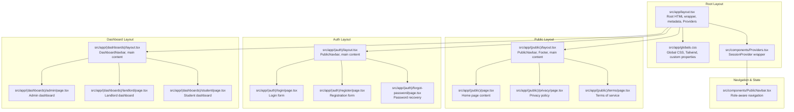

**Diagram sources**
- [layout.tsx:1-28](file://src/app/layout.tsx#L1-L28)
- [globals.css:1-246](file://src/app/globals.css#L1-L246)
- [Providers.tsx:1-13](file://src/components/Providers.tsx#L1-L13)
- [PublicLayout.tsx:1-17](file://src/app/(public)/layout.tsx#L1-L17)
- [AuthLayout.tsx:1-15](file://src/app/(auth)/layout.tsx#L1-L15)
- [DashboardLayout.tsx:1-19](file://src/app/(dashboards)/layout.tsx#L1-L19)
- [PublicNavbar.tsx:1-193](file://src/components/PublicNavbar.tsx#L1-L193)

**Section sources**
- [layout.tsx:1-28](file://src/app/layout.tsx#L1-L28)
- [globals.css:1-246](file://src/app/globals.css#L1-L246)
- [Providers.tsx:1-13](file://src/components/Providers.tsx#L1-L13)
- [PublicLayout.tsx:1-17](file://src/app/(public)/layout.tsx#L1-L17)
- [AuthLayout.tsx:1-15](file://src/app/(auth)/layout.tsx#L1-L15)
- [DashboardLayout.tsx:1-19](file://src/app/(dashboards)/layout.tsx#L1-L19)
- [PublicNavbar.tsx:1-193](file://src/components/PublicNavbar.tsx#L1-L193)

## Core Components
- **Root Layout**: Defines the HTML document structure with language attribute, preconnected fonts, and wraps all content with SessionProvider for authentication state management.
- **Three Layout Hierarchies**: 
  - Public layout: Includes PublicNavbar and Footer for visitor-facing pages
  - Authentication layout: Uses PublicNavbar for login/registration flows
  - Dashboard layout: Provides role-specific navigation and content containers
- **Global CSS**: Establishes Tailwind base/components/utilities, CSS custom properties, typography, utilities, animations, and responsive containers.
- **Navigation Components**: PublicNavbar handles role-aware navigation and mobile responsiveness.
- **Authentication**: NextAuth.js configuration with credentials provider and role-based callbacks.
- **Middleware**: Route protection enforcing role-based access to protected routes.
- **Build configuration**: Next.js, Tailwind CSS, PostCSS, TypeScript, and image optimization settings.

**Section sources**
- [layout.tsx:11-27](file://src/app/layout.tsx#L11-L27)
- [PublicLayout.tsx:1-17](file://src/app/(public)/layout.tsx#L1-L17)
- [AuthLayout.tsx:1-15](file://src/app/(auth)/layout.tsx#L1-L15)
- [DashboardLayout.tsx:1-19](file://src/app/(dashboards)/layout.tsx#L1-L19)
- [PublicNavbar.tsx:16-42](file://src/components/PublicNavbar.tsx#L16-L42)
- [Providers.tsx:10-12](file://src/components/Providers.tsx#L10-L12)

## Architecture Overview
The application uses Next.js App Router with three distinct layout hierarchies that provide context-appropriate navigation and styling. The root layout wraps all pages with SessionProvider for authentication state. Grouped routing creates separate contexts for public pages, authentication flows, and dashboard interfaces with role-based access control.

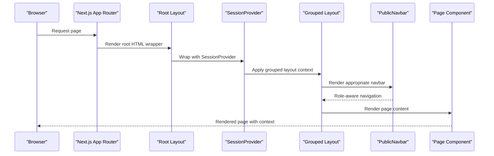

**Diagram sources**
- [layout.tsx:17-26](file://src/app/layout.tsx#L17-L26)
- [Providers.tsx:10-12](file://src/components/Providers.tsx#L10-L12)
- [PublicLayout.tsx:8-14](file://src/app/(public)/layout.tsx#L8-L14)
- [AuthLayout.tsx:7-13](file://src/app/(auth)/layout.tsx#L7-L13)
- [DashboardLayout.tsx:7-17](file://src/app/(dashboards)/layout.tsx#L7-L17)
- [PublicNavbar.tsx:16-42](file://src/components/PublicNavbar.tsx#L16-L42)

## Detailed Component Analysis

### Root Layout Configuration
The root layout sets up the HTML document with:
- Language attribute for accessibility and SEO.
- SessionProvider wrapper for global authentication state management.
- Flex layout with min-height for proper footer positioning.
- Global CSS import to apply base styles, utilities, and custom properties.

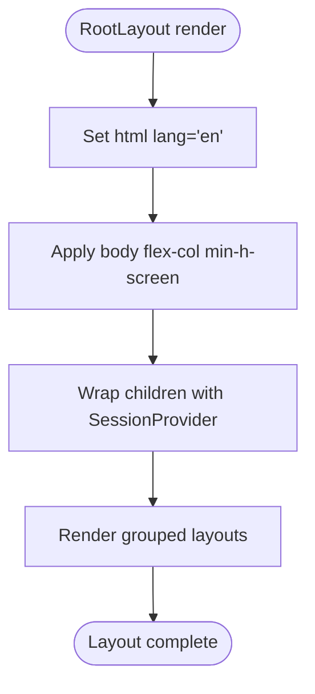

**Diagram sources**
- [layout.tsx:17-26](file://src/app/layout.tsx#L17-L26)

**Section sources**
- [layout.tsx:11-27](file://src/app/layout.tsx#L11-L27)

### Three-Tier Layout System
The application implements a sophisticated three-tier layout system:

**Public Layout**: Used for visitor-facing pages with full navigation and footer
- Includes PublicNavbar for complete navigation
- Adds Footer component for consistent branding
- Provides main content area with overflow-x-hidden

**Authentication Layout**: Used for login, registration, and password recovery
- Reuses PublicNavbar for consistent navigation
- Provides clean main content area without dashboard-specific styling
- Enables seamless navigation between public and authenticated states

**Dashboard Layout**: Used for role-based dashboards (admin, landlord, student)
- Includes DashboardNavbar for role-specific navigation
- Provides max-width container with responsive padding
- Creates structured content area for dashboard components

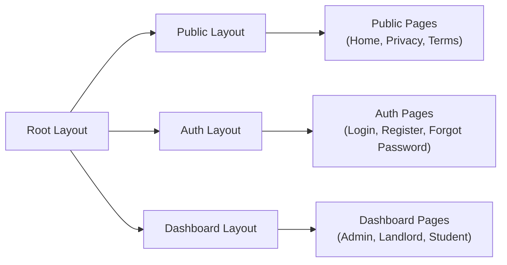

**Diagram sources**
- [PublicLayout.tsx:8-14](file://src/app/(public)/layout.tsx#L8-L14)
- [AuthLayout.tsx:7-13](file://src/app/(auth)/layout.tsx#L7-L13)
- [DashboardLayout.tsx:7-17](file://src/app/(dashboards)/layout.tsx#L7-L17)

**Section sources**
- [PublicLayout.tsx:1-17](file://src/app/(public)/layout.tsx#L1-L17)
- [AuthLayout.tsx:1-15](file://src/app/(auth)/layout.tsx#L1-L15)
- [DashboardLayout.tsx:1-19](file://src/app/(dashboards)/layout.tsx#L1-L19)

### Navigation Component Architecture
The PublicNavbar component provides role-aware navigation with mobile responsiveness:

**Role-Aware Navigation**: Automatically determines dashboard links based on user role
- LANDLORD → /landlord
- STUDENT → /student  
- ADMIN → /admin

**State Management**: Integrates with NextAuth session for authentication state
- Handles loading, authenticated, and unauthenticated states
- Provides logout functionality with callback URL
- Shows appropriate navigation based on authentication status

**Mobile Responsiveness**: Implements hamburger menu for mobile devices
- Collapses navigation links on smaller screens
- Maintains full functionality in mobile view
- Provides smooth user experience across devices

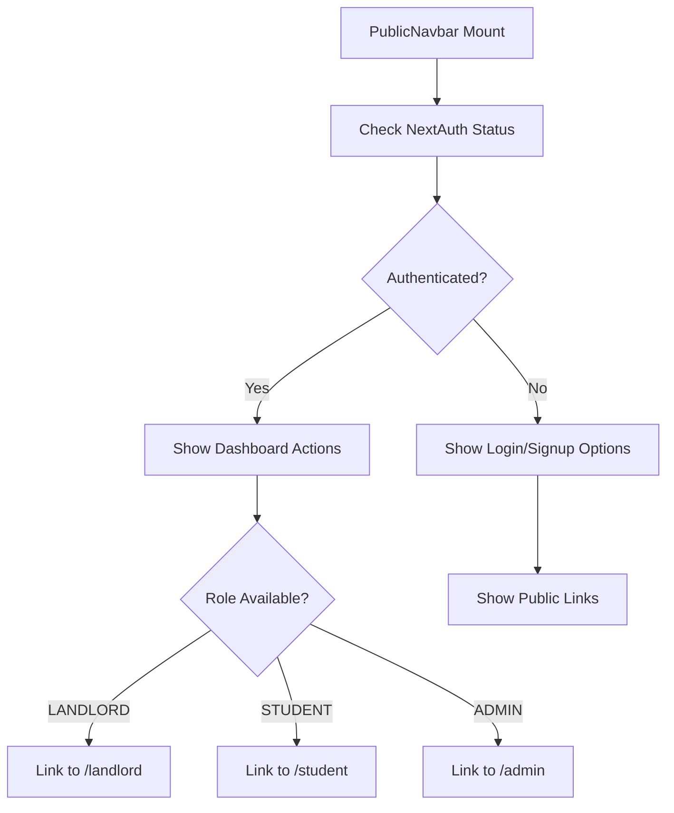

**Diagram sources**
- [PublicNavbar.tsx:16-42](file://src/components/PublicNavbar.tsx#L16-L42)
- [PublicNavbar.tsx:69-108](file://src/components/PublicNavbar.tsx#L69-L108)
- [PublicNavbar.tsx:124-188](file://src/components/PublicNavbar.tsx#L124-L188)

**Section sources**
- [PublicNavbar.tsx:16-42](file://src/components/PublicNavbar.tsx#L16-L42)
- [PublicNavbar.tsx:69-108](file://src/components/PublicNavbar.tsx#L69-L108)
- [PublicNavbar.tsx:124-188](file://src/components/PublicNavbar.tsx#L124-L188)

### Metadata Setup and SEO
The root layout defines site-wide metadata including:
- Default and template title for consistent branding across pages.
- Comprehensive description for search engine indexing.
- Author attribution for platform ownership.

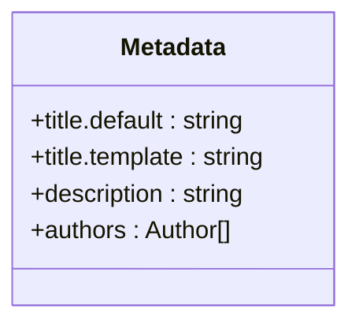

**Diagram sources**
- [layout.tsx:5-9](file://src/app/layout.tsx#L5-L9)

**Section sources**
- [layout.tsx:5-9](file://src/app/layout.tsx#L5-L9)

### Global Styling Approach
Global CSS establishes:
- Tailwind directives for base, components, and utilities.
- CSS custom properties for brand colors, backgrounds, typography, shadows, radii, and transitions.
- Base reset and smooth scrolling behavior.
- Typography system with Inter for body text and Outfit for headings.
- Utility classes for buttons, cards, inputs, badges, containers, gradient text, page headers, and skeleton loaders.
- Animation keyframes and staggered delay utilities.

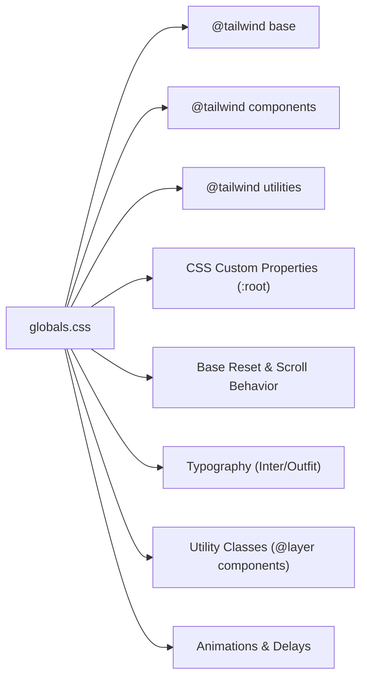

**Diagram sources**
- [globals.css:1-246](file://src/app/globals.css#L1-L246)

**Section sources**
- [globals.css:1-246](file://src/app/globals.css#L1-L246)

### Typography System
Typography is defined via:
- Tailwind theme extending font families for sans and heading.
- CSS custom properties for brand gold and navy tones.
- Global body and heading styles using Inter and Outfit respectively.
- Utility classes for gradient text effects and consistent spacing.

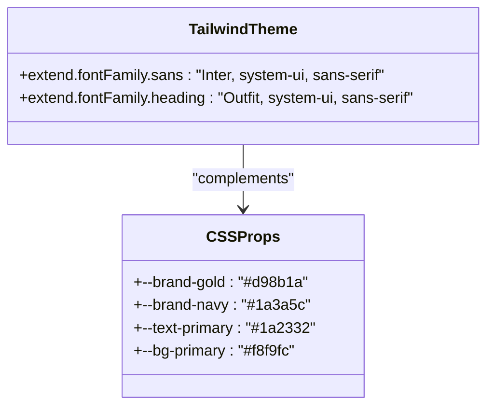

**Diagram sources**
- [tailwind.config.ts:39-42](file://tailwind.config.ts#L39-L42)
- [globals.css:8-27](file://src/app/globals.css#L8-L27)

**Section sources**
- [tailwind.config.ts:39-42](file://tailwind.config.ts#L39-L42)
- [globals.css:40-61](file://src/app/globals.css#L40-L61)

### Responsive Design Foundations
Responsive behavior is achieved through:
- Tailwind's breakpoint utilities (sm, lg) applied to container widths and grid layouts.
- Container utility class for consistent max-width and horizontal padding.
- Grid layouts adapting from 2 to 4 columns based on viewport size.
- Utility classes for responsive text sizing and spacing.

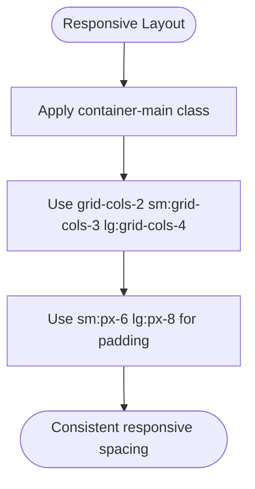

**Diagram sources**
- [globals.css:182-184](file://src/app/globals.css#L182-L184)
- [page.tsx:96-120](file://src/app/(public)/page.tsx#L96-L120)

**Section sources**
- [globals.css:182-184](file://src/app/globals.css#L182-L184)
- [page.tsx:96-120](file://src/app/(public)/page.tsx#L96-L120)

### Next.js App Router Integration
The App Router organizes:
- Root layout wrapping all pages with SessionProvider.
- Grouped routing with (public), (auth), and (dashboards) folders.
- Page components organized by functional context.
- API routes under src/app/api for server-side handlers.
- Middleware for route protection and role-based access control.

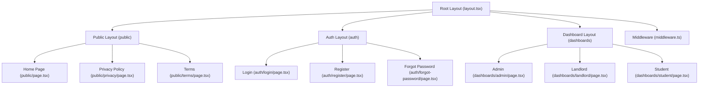

**Diagram sources**
- [layout.tsx:11-27](file://src/app/layout.tsx#L11-L27)
- [PublicLayout.tsx:1-17](file://src/app/(public)/layout.tsx#L1-L17)
- [AuthLayout.tsx:1-15](file://src/app/(auth)/layout.tsx#L1-L15)
- [DashboardLayout.tsx:1-19](file://src/app/(dashboards)/layout.tsx#L1-L19)

**Section sources**
- [layout.tsx:11-27](file://src/app/layout.tsx#L11-L27)
- [PublicLayout.tsx:1-17](file://src/app/(public)/layout.tsx#L1-L17)
- [AuthLayout.tsx:1-15](file://src/app/(auth)/layout.tsx#L1-L15)
- [DashboardLayout.tsx:1-19](file://src/app/(dashboards)/layout.tsx#L1-L19)

### Authentication and Role-Based Access
Authentication uses NextAuth.js with:
- Credentials provider validating email/password against Prisma-managed users.
- Role-based callbacks storing user role and verification status in JWT/session.
- Middleware enforcing role-based access to protected routes (/admin, /dashboard/landlord, /dashboard/student).
- Login and registration pages leveraging shared utilities and styling.
- SessionProvider enabling global authentication state management.

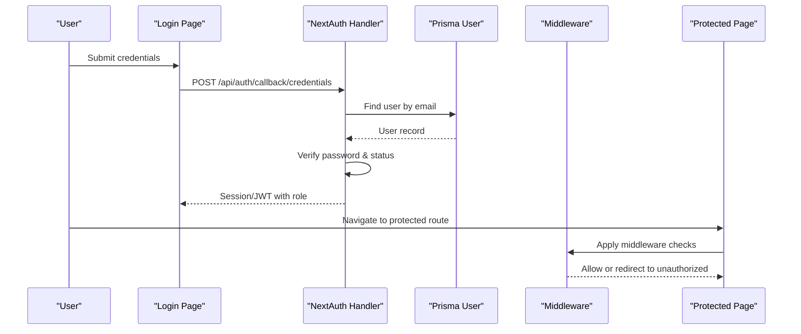

**Diagram sources**
- [login/page.tsx:19-77](file://src/app/(auth)/login/page.tsx#L19-L77)
- [auth.ts:14-90](file://src/lib/auth.ts#L14-L90)
- [middleware.ts:11-38](file://src/middleware.ts#L11-L38)

**Section sources**
- [auth.ts:14-90](file://src/lib/auth.ts#L14-L90)
- [middleware.ts:11-38](file://src/middleware.ts#L11-L38)
- [login/page.tsx:19-77](file://src/app/(auth)/login/page.tsx#L19-L77)
- [register/page.tsx:29-70](file://src/app/(auth)/register/page.tsx#L29-L70)

### Font Loading Strategy
Font loading is optimized by:
- Adding preconnect links to Google Fonts in the root layout head.
- Importing Inter and Outfit via Google Fonts CDN in global CSS.
- Using Tailwind theme font families for consistent typography.

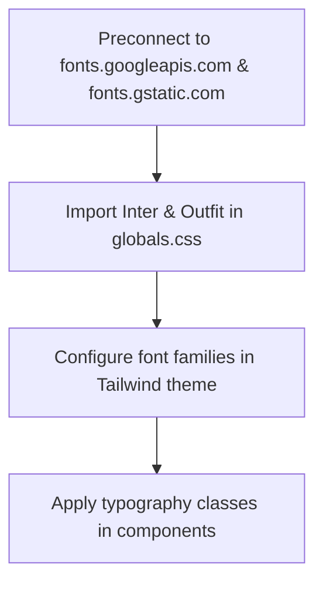

**Diagram sources**
- [layout.tsx:17-26](file://src/app/layout.tsx#L17-L26)
- [globals.css](file://src/app/globals.css#L1)
- [tailwind.config.ts:39-42](file://tailwind.config.ts#L39-L42)

**Section sources**
- [layout.tsx:17-26](file://src/app/layout.tsx#L17-L26)
- [globals.css](file://src/app/globals.css#L1)
- [tailwind.config.ts:39-42](file://tailwind.config.ts#L39-L42)

### HTML Structure and Language Attributes
The root layout ensures:
- Proper HTML structure with lang attribute set to English.
- SessionProvider wrapper for global authentication state.
- Body with flex-col and min-h-screen for proper layout.
- Overflow-x-hidden on main content areas for mobile responsiveness.

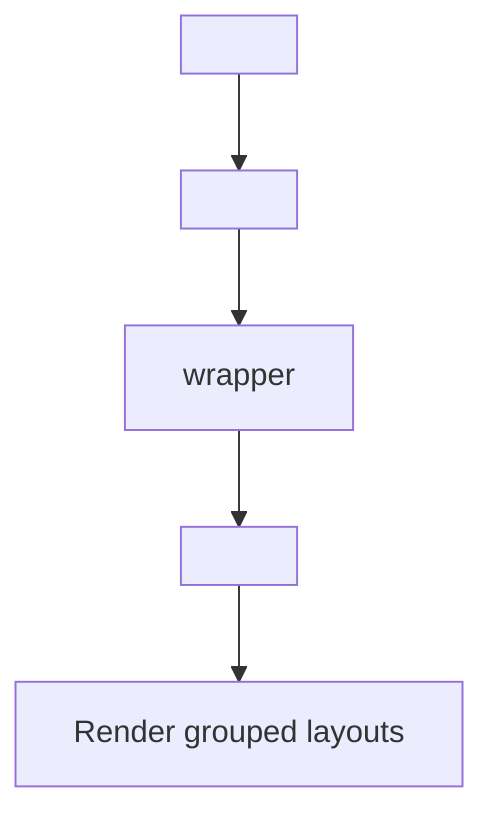

**Diagram sources**
- [layout.tsx:17-26](file://src/app/layout.tsx#L17-L26)

**Section sources**
- [layout.tsx:17-26](file://src/app/layout.tsx#L17-L26)

### Page Content and Utilities
Pages demonstrate:
- Consistent use of utility classes for gradients, cards, buttons, and containers.
- Responsive grid layouts and animation utilities.
- Integration with shared global styles and utilities.
- Role-specific styling and content organization.

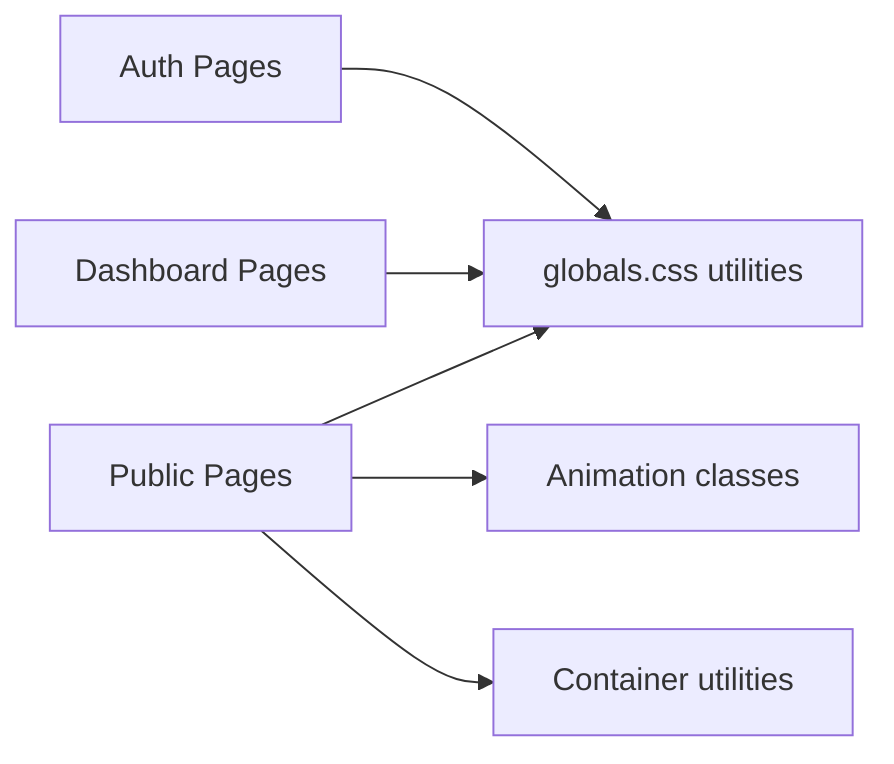

**Diagram sources**
- [page.tsx:1-269](file://src/app/(public)/page.tsx#L1-L269)
- [login/page.tsx:1-206](file://src/app/(auth)/login/page.tsx#L1-L206)
- [register/page.tsx:1-244](file://src/app/(auth)/register/page.tsx#L1-L244)
- [admin/page.tsx:1-247](file://src/app/(dashboards)/admin/page.tsx#L1-L247)
- [globals.css:83-213](file://src/app/globals.css#L83-L213)

**Section sources**
- [page.tsx:1-269](file://src/app/(public)/page.tsx#L1-L269)
- [login/page.tsx:1-206](file://src/app/(auth)/login/page.tsx#L1-L206)
- [register/page.tsx:1-244](file://src/app/(auth)/register/page.tsx#L1-L244)
- [admin/page.tsx:1-247](file://src/app/(dashboards)/admin/page.tsx#L1-L247)
- [globals.css:83-213](file://src/app/globals.css#L83-L213)

## Dependency Analysis
The application relies on:
- Next.js for routing and SSR/SSG capabilities.
- Tailwind CSS for utility-first styling and responsive design.
- PostCSS with autoprefixer for vendor prefixing and modern CSS features.
- TypeScript for type safety and IDE support.
- NextAuth.js for authentication with credentials provider.
- Prisma for database client integration.
- Lucide React for SVG iconography.

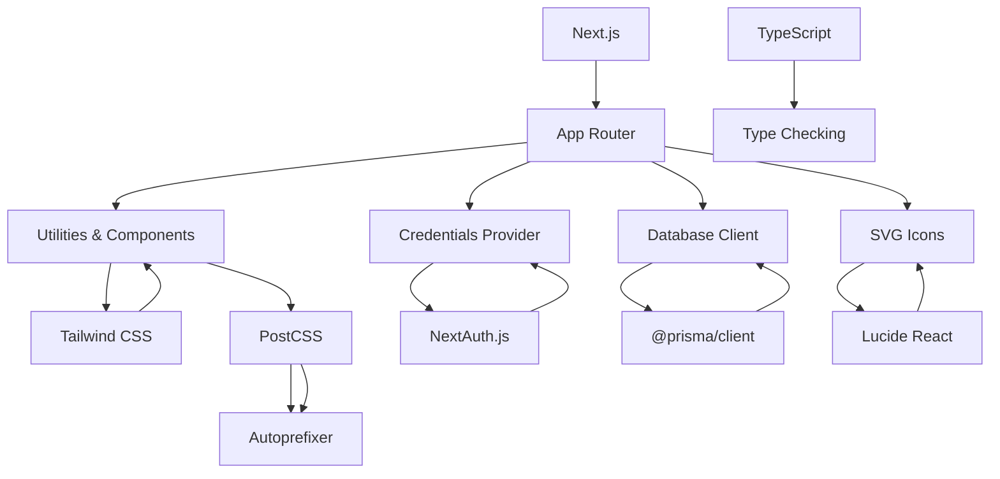

**Diagram sources**
- [package.json:19-39](file://package.json#L19-L39)
- [postcss.config.mjs:1-7](file://postcss.config.mjs#L1-L7)
- [tailwind.config.ts:1-51](file://tailwind.config.ts#L1-L51)
- [tsconfig.json:1-27](file://tsconfig.json#L1-L27)
- [PublicNavbar.tsx:8](file://src/components/PublicNavbar.tsx#L8)

**Section sources**
- [package.json:19-39](file://package.json#L19-L39)
- [postcss.config.mjs:1-7](file://postcss.config.mjs#L1-L7)
- [tailwind.config.ts:1-51](file://tailwind.config.ts#L1-L51)
- [tsconfig.json:1-27](file://tsconfig.json#L1-L27)
- [PublicNavbar.tsx:8](file://src/components/PublicNavbar.tsx#L8)

## Performance Considerations
- Font preloading via preconnect reduces render-blocking requests.
- Tailwind's purgeable content configuration minimizes CSS bundle size.
- CSS custom properties enable efficient theming without repeated declarations.
- Middleware redirects prevent unnecessary page loads for unauthorized users.
- SessionProvider enables efficient authentication state management across the application.
- Grouped routing allows for better code splitting and lazy loading of layout contexts.
- Mobile-responsive navigation reduces layout shifts and improves user experience.

## Troubleshooting Guide
- Authentication errors: Verify NEXTAUTH_SECRET environment variable and ensure credentials match Prisma user records.
- Route protection: Confirm middleware matcher patterns align with intended protected routes.
- Styling inconsistencies: Check Tailwind content globs and ensure components use utility classes consistently.
- Font rendering: Ensure preconnect links are present and fonts load from the expected CDN.
- Layout issues: Verify grouped routing syntax with parentheses and ensure layout components are properly exported.
- Navigation problems: Check PublicNavbar role detection logic and session state management.
- Dashboard access: Confirm user roles are correctly stored in JWT/session and middleware matches are accurate.

**Section sources**
- [auth.ts:87-90](file://src/lib/auth.ts#L87-L90)
- [middleware.ts:40-47](file://src/middleware.ts#L40-L47)
- [tailwind.config.ts:3-7](file://tailwind.config.ts#L3-L7)
- [layout.tsx:17-26](file://src/app/layout.tsx#L17-L26)
- [PublicNavbar.tsx:16-42](file://src/components/PublicNavbar.tsx#L16-L42)

## Conclusion
RentalHub-BOUESTI's new three-tier layout system provides a robust foundation for a responsive, accessible, and performant rental platform. The separation of concerns through grouped routing enables distinct navigation experiences for public visitors, authenticated users, and role-based dashboards. The root layout with SessionProvider, combined with specialized layout hierarchies and role-aware navigation, establishes consistent branding and user experience across all application contexts. Next.js App Router, Tailwind CSS, and NextAuth.js integrate seamlessly to deliver a scalable architecture suitable for growth and maintenance.