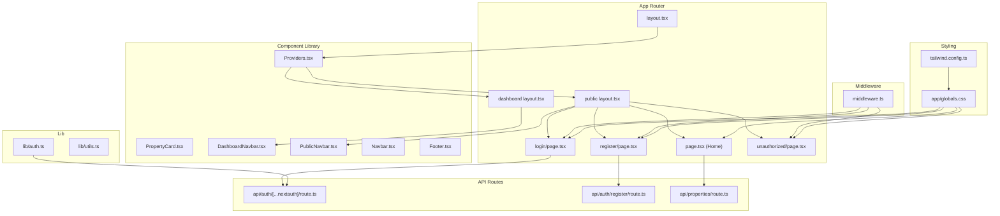
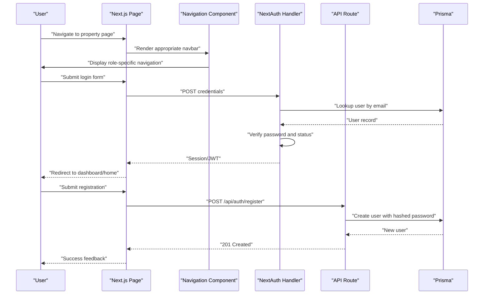
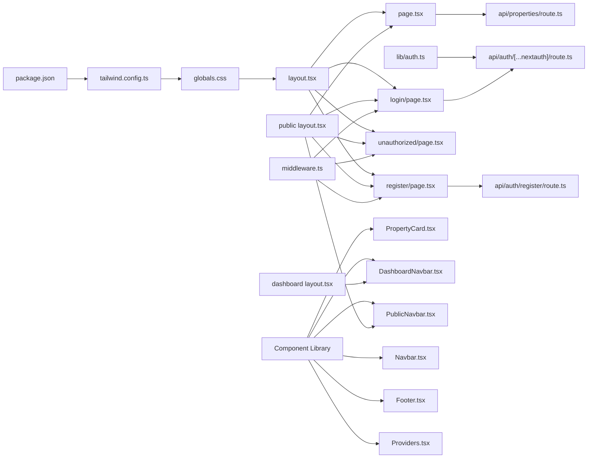

# Frontend Components & UI

<cite>
**Referenced Files in This Document**
- [layout.tsx](file://src/app/layout.tsx)
- [page.tsx](file://src/app/page.tsx)
- [globals.css](file://src/app/globals.css)
- [login/page.tsx](file://src/app/login/page.tsx)
- [register/page.tsx](file://src/app/register/page.tsx)
- [unauthorized/page.tsx](file://src/app/unauthorized/page.tsx)
- [auth.ts](file://src/lib/auth.ts)
- [middleware.ts](file://src/middleware.ts)
- [auth/route.ts](file://src/app/api/auth/[...nextauth]/route.ts)
- [auth/register/route.ts](file://src/app/api/auth/register/route.ts)
- [properties/route.ts](file://src/app/api/properties/route.ts)
- [utils.ts](file://src/lib/utils.ts)
- [tailwind.config.ts](file://tailwind.config.ts)
- [package.json](file://package.json)
- [PropertyCard.tsx](file://src/components/PropertyCard.tsx)
- [DashboardNavbar.tsx](file://src/components/DashboardNavbar.tsx)
- [PublicNavbar.tsx](file://src/components/PublicNavbar.tsx)
- [Navbar.tsx](file://src/components/Navbar.tsx)
- [Footer.tsx](file://src/components/Footer.tsx)
- [Providers.tsx](file://src/components/Providers.tsx)
- [layout.tsx](file://src/app/(public)/layout.tsx)
- [layout.tsx](file://src/app/(dashboards)/layout.tsx)
- [page.tsx](file://src/app/(public)/page.tsx)
- [page.tsx](file://src/app/(public)/properties/page.tsx)
- [page.tsx](file://src/app/(public)/properties/[id]/page.tsx)
- [page.tsx](file://src/app/(dashboards)/landlord/page.tsx)
- [page.tsx](file://src/app/(dashboards)/student/page.tsx)
</cite>

## Update Summary
**Changes Made**
- Added comprehensive component library documentation including PropertyCard, DashboardNavbar, PublicNavbar, and form components
- Updated core components section to include new reusable components
- Enhanced component composition patterns with new navbar and card components
- Added detailed analysis of dashboard and public navigation patterns
- Updated architecture overview to reflect new component-based structure

## Table of Contents
1. [Introduction](#introduction)
2. [Project Structure](#project-structure)
3. [Core Components](#core-components)
4. [Architecture Overview](#architecture-overview)
5. [Detailed Component Analysis](#detailed-component-analysis)
6. [Component Library](#component-library)
7. [Dependency Analysis](#dependency-analysis)
8. [Performance Considerations](#performance-considerations)
9. [Troubleshooting Guide](#troubleshooting-guide)
10. [Conclusion](#conclusion)
11. [Appendices](#appendices)

## Introduction
This document describes the RentalHub-BOUESTI frontend components and user interface. It covers the application layout, home page, property browsing interface, registration and login forms, unauthorized access handling, and a comprehensive component library including PropertyCard, DashboardNavbar, PublicNavbar, and form components. It explains the Tailwind CSS styling approach, responsive design, component composition patterns, form validation and error handling, user feedback mechanisms, accessibility considerations, component hierarchy, state management patterns, and integration with backend APIs. It also addresses mobile responsiveness and cross-browser compatibility.

## Project Structure
The frontend is built with Next.js App Router. Pages are organized under src/app with dedicated routes for the home page, login, registration, and unauthorized access. Global styles and Tailwind configuration define the design system. Authentication is handled via NextAuth.js with a credentials provider and protected routes via middleware. API routes under src/app/api implement backend integration for authentication, property listings, and related operations. A comprehensive component library provides reusable UI elements across different application contexts.

**Diagram sources**
- [layout.tsx](file://src/app/layout.tsx)
- [page.tsx](file://src/app/page.tsx)
- [login/page.tsx](file://src/app/login/page.tsx)
- [register/page.tsx](file://src/app/register/page.tsx)
- [unauthorized/page.tsx](file://src/app/unauthorized/page.tsx)
- [layout.tsx](file://src/app/(public)/layout.tsx)
- [layout.tsx](file://src/app/(dashboards)/layout.tsx)
- [PropertyCard.tsx](file://src/components/PropertyCard.tsx)
- [DashboardNavbar.tsx](file://src/components/DashboardNavbar.tsx)
- [PublicNavbar.tsx](file://src/components/PublicNavbar.tsx)
- [Navbar.tsx](file://src/components/Navbar.tsx)
- [Footer.tsx](file://src/components/Footer.tsx)
- [Providers.tsx](file://src/components/Providers.tsx)
- [auth.ts](file://src/lib/auth.ts)
- [middleware.ts](file://src/middleware.ts)
- [auth/route.ts](file://src/app/api/auth/[...nextauth]/route.ts)
- [auth/register/route.ts](file://src/app/api/auth/register/route.ts)
- [properties/route.ts](file://src/app/api/properties/route.ts)
- [globals.css](file://src/app/globals.css)
- [tailwind.config.ts](file://tailwind.config.ts)

**Section sources**
- [layout.tsx](file://src/app/layout.tsx)
- [page.tsx](file://src/app/page.tsx)
- [login/page.tsx](file://src/app/login/page.tsx)
- [register/page.tsx](file://src/app/register/page.tsx)
- [unauthorized/page.tsx](file://src/app/unauthorized/page.tsx)
- [globals.css](file://src/app/globals.css)
- [tailwind.config.ts](file://tailwind.config.ts)

## Core Components
- **Application Shell**: Root layout provides global providers and session management through Providers component
- **Navigation Components**: Comprehensive navbar system with PublicNavbar for guest users, DashboardNavbar for authenticated users, and traditional Navbar for simplified contexts
- **Property Display**: PropertyCard component for consistent property listing presentation with image handling, amenities display, and pricing
- **Content Organization**: Layout components (PublicLayout, DashboardLayout) provide consistent page structure
- **Utility Components**: Footer component with multi-column layout and comprehensive links
- **Authentication Forms**: Login and registration pages with form validation and NextAuth integration
- **Unauthorized Access**: Dedicated access denied page with navigation options
- **Utilities**: Shared helpers for class merging, currency formatting, dates, truncation, parsing arrays, initials, slugs, and safe search param building

Key styling and composition patterns:
- Tailwind utilities and custom components/classes (buttons, cards, inputs, badges, skeletons) defined in global CSS
- Responsive breakpoints (sm, lg) drive layout changes across devices
- Gradient backgrounds and backdrop filters create depth and visual appeal
- Animation utilities (fade-in, slide-in, pulse) enhance perceived performance and UX
- Component composition follows utility-first approach with consistent design tokens

**Section sources**
- [layout.tsx](file://src/app/layout.tsx)
- [page.tsx](file://src/app/page.tsx)
- [login/page.tsx](file://src/app/login/page.tsx)
- [register/page.tsx](file://src/app/register/page.tsx)
- [unauthorized/page.tsx](file://src/app/unauthorized/page.tsx)
- [globals.css](file://src/app/globals.css)
- [utils.ts](file://src/lib/utils.ts)
- [PropertyCard.tsx](file://src/components/PropertyCard.tsx)
- [DashboardNavbar.tsx](file://src/components/DashboardNavbar.tsx)
- [PublicNavbar.tsx](file://src/components/PublicNavbar.tsx)
- [Navbar.tsx](file://src/components/Navbar.tsx)
- [Footer.tsx](file://src/components/Footer.tsx)
- [Providers.tsx](file://src/components/Providers.tsx)

## Architecture Overview
The frontend integrates tightly with NextAuth for authentication and with API routes for data operations. Middleware enforces role-based access control and redirects to unauthorized when necessary. The design system is centralized in Tailwind configuration and global CSS. A comprehensive component library provides reusable UI elements across different application contexts and user roles.

**Diagram sources**
- [login/page.tsx](file://src/app/login/page.tsx)
- [auth/route.ts](file://src/app/api/auth/[...nextauth]/route.ts)
- [auth/register/route.ts](file://src/app/api/auth/register/route.ts)
- [auth.ts](file://src/lib/auth.ts)
- [PublicNavbar.tsx](file://src/components/PublicNavbar.tsx)
- [DashboardNavbar.tsx](file://src/components/DashboardNavbar.tsx)

**Section sources**
- [auth.ts](file://src/lib/auth.ts)
- [auth/route.ts](file://src/app/api/auth/[...nextauth]/route.ts)
- [auth/register/route.ts](file://src/app/api/auth/register/route.ts)
- [middleware.ts](file://src/middleware.ts)

## Detailed Component Analysis

### Application Layout and Global Styles
- Root layout defines metadata, Open Graph tags, and font preloads. The body applies anti-aliasing for crisp rendering.
- Global CSS establishes:
  - CSS custom properties for brand colors and shadows.
  - Base resets and typography.
  - Utility classes for buttons, cards, inputs, badges, containers, gradients, and animations.
  - Scrollbar customization for webkit-based browsers.
- Tailwind configuration extends color palettes for brand and primary, sets font families, and enables gradients.
- Providers component wraps the application with SessionProvider for NextAuth integration.

Responsive design:
- Grids and flex utilities adapt columns and alignment at small and large screens.
- Max widths and horizontal paddings ensure content remains readable on wide screens.

Accessibility:
- Proper contrast ratios for text and backgrounds.
- Focus-visible states via Tailwind utilities.
- Semantic HTML and ARIA-free markup relying on native semantics.

**Section sources**
- [layout.tsx](file://src/app/layout.tsx)
- [globals.css](file://src/app/globals.css)
- [tailwind.config.ts](file://tailwind.config.ts)
- [Providers.tsx](file://src/components/Providers.tsx)

### Home Page Components
- Hero section: Full-screen background gradient, animated decorative blobs, and a centered call-to-action block with two CTAs.
- Stats bar: Semi-transparent backdrop-filter bar with three metrics.
- Areas section: Responsive grid of clickable area cards linking to filtered property lists.
- Landlord CTA: Dark-themed section encouraging landlords to list properties.

Composition patterns:
- Reusable animation utilities for staggered entrance.
- Utility classes for button and card elevation.
- Dynamic links with encoded query parameters.

**Section sources**
- [page.tsx](file://src/app/page.tsx)

### Login Form
- Glass-morphism card with backdrop blur and subtle borders.
- Styled inputs with dark theme and focus states.
- Submit button with gradient and hover effects.
- Navigation to registration page.

Integration with backend:
- Form posts to NextAuth credentials provider endpoint.
- On success, NextAuth manages session and redirects per configured pages.

Validation and feedback:
- HTML5 required attributes on inputs.
- Backend validation errors surfaced by NextAuth pages (handled by NextAuth UI).

**Section sources**
- [login/page.tsx](file://src/app/login/page.tsx)
- [auth/route.ts](file://src/app/api/auth/[...nextauth]/route.ts)
- [auth.ts](file://src/lib/auth.ts)

### Registration Form
- Role selector with radio inputs styled as bordered cards with checked state.
- Fields for full name, email, and password with minimum length requirement.
- Submission to the registration API endpoint.

Backend integration:
- API validates presence, role, password length, and uniqueness.
- Hashes passwords and creates a user with unverified status.
- Returns structured success/error responses.

Form validation and error handling:
- Client-side: required fields and minlength.
- Server-side: explicit checks and appropriate HTTP status codes.
- Error messages returned as JSON for potential client-side display.

**Section sources**
- [register/page.tsx](file://src/app/register/page.tsx)
- [auth/register/route.ts](file://src/app/api/auth/register/route.ts)

### Unauthorized Access Handling
- Dedicated page with lock icon, descriptive message, and navigation to home or login.
- Triggered by middleware when role-based access is denied.

Middleware enforcement:
- Redirects unauthenticated users to login.
- Guards admin, landlord, and student dashboards based on JWT token claims.
- Redirects to unauthorized when roles mismatch.

**Section sources**
- [unauthorized/page.tsx](file://src/app/unauthorized/page.tsx)
- [middleware.ts](file://src/middleware.ts)

### Property Browsing Interface
- The home page's area cards link to property listings with location filters.
- API route supports filtering by location, status, price range, pagination, sorting, and ordering.
- Responses include items, totals, and pagination metadata.

Composition patterns:
- Search params building via shared utilities.
- Consistent badge and card components for property entries.

**Section sources**
- [page.tsx](file://src/app/page.tsx)
- [properties/route.ts](file://src/app/api/properties/route.ts)
- [utils.ts](file://src/lib/utils.ts)

### Tailwind CSS Styyling Approach and Responsive Design
- Centralized design tokens via CSS variables and Tailwind theme extensions.
- Utility-first approach with custom component classes for buttons, cards, inputs, and badges.
- Responsive utilities (sm, lg) ensure appropriate spacing and layout scaling.
- Animations and transitions provide subtle motion feedback.

Cross-browser compatibility:
- Webkit scrollbar customization for Chromium-based browsers.
- Font loading via Google Fonts and system-ui fallbacks.
- CSS custom properties supported across modern browsers; gradients and backdrop filters widely supported.

Mobile responsiveness:
- Flexible grids and padding scale across breakpoints.
- Touch-friendly button sizes and spacing.
- Minimal horizontal scrolling with constrained max widths.

**Section sources**
- [globals.css](file://src/app/globals.css)
- [tailwind.config.ts](file://tailwind.config.ts)
- [page.tsx](file://src/app/page.tsx)

### Component Composition Patterns
- Utility-first composition: combine base utilities with variant modifiers.
- Reusable component classes (buttons, cards, inputs) encapsulate common styles.
- Animation utilities enable staggered and entrance effects.
- Container utilities centralize max-width and padding.

State management patterns:
- Client-side: NextAuth manages authentication state via JWT and session storage.
- Server-side: API routes handle validation, persistence, and response formatting.
- Utilities centralize shared transformations and formatting.

**Section sources**
- [globals.css](file://src/app/globals.css)
- [auth.ts](file://src/lib/auth.ts)
- [utils.ts](file://src/lib/utils.ts)

### Accessibility Considerations
- Sufficient color contrast for text and interactive elements against backgrounds.
- Focus-visible indicators via default browser styles.
- Semantic structure with headings and labels aligned with form controls.
- Text alternatives implicit via labels and button text; no missing alt attributes observed.

**Section sources**
- [globals.css](file://src/app/globals.css)
- [login/page.tsx](file://src/app/login/page.tsx)
- [register/page.tsx](file://src/app/register/page.tsx)

## Component Library

### PropertyCard Component
The PropertyCard component provides a standardized way to display property information consistently across the application. It handles property data formatting, image display, and interactive elements.

Key features:
- **Image Handling**: Displays property images with fallback SVG when no images are available
- **Price Formatting**: Uses Intl.NumberFormat for Nigerian Naira currency display
- **Amenities Display**: Shows up to 3 amenities with intelligent overflow handling
- **Distance Information**: Displays distance to campus when available
- **Interactive Elements**: View Details link with hover effects
- **Status Indicators**: Available status badge with green background

Design patterns:
- **Type Safety**: Uses PropertyWithRelations interface for type-safe property data
- **Conditional Rendering**: Handles missing data gracefully with fallbacks
- **Responsive Design**: Adapts layout for different screen sizes
- **Accessibility**: Proper alt text for images and semantic HTML structure

**Section sources**
- [PropertyCard.tsx](file://src/components/PropertyCard.tsx)

### DashboardNavbar Component
The DashboardNavbar provides a comprehensive navigation solution for authenticated users with role-specific features and dashboard integration.

Key features:
- **Logo and Branding**: Company logo with responsive sizing
- **Global Search**: Centered search bar with absolute positioning
- **Action Icons**: Messaging, notifications, and help center icons
- **Profile Management**: User initials avatar with role display
- **Dashboard Access**: Role-based dashboard navigation
- **Logout Functionality**: One-click logout with callback URL

Design patterns:
- **Session Integration**: Uses NextAuth session for user data
- **Dynamic Styling**: Color variations based on user role
- **Responsive Layout**: Adapts from desktop to mobile navigation
- **State Management**: Uses useState for mobile menu toggle

**Section sources**
- [DashboardNavbar.tsx](file://src/components/DashboardNavbar.tsx)

### PublicNavbar Component
The PublicNavbar serves as the primary navigation for guests and authenticated users, featuring responsive design and role-aware navigation.

Key features:
- **Multi-role Navigation**: Differentiates between student, landlord, and admin views
- **Mobile Responsiveness**: Collapsible menu with hamburger icon
- **Guest vs Authenticated Views**: Shows login/signup for guests, dashboard/logout for users
- **Brand Consistency**: Maintains consistent styling across all pages
- **Dynamic Dashboard Links**: Role-based dashboard navigation

Design patterns:
- **Session Awareness**: Uses NextAuth session for authentication state
- **Path-based Logic**: Determines visibility based on current route
- **Conditional Rendering**: Shows appropriate navigation based on user state
- **Mobile-first Design**: Mobile menu as primary interaction method

**Section sources**
- [PublicNavbar.tsx](file://src/components/PublicNavbar.tsx)

### Additional Components

#### Navbar Component
A simplified navigation component designed for contexts where full dashboard functionality is not required.

Key features:
- **Guest Mode**: Login and property listing options for non-authenticated users
- **Authenticated Mode**: Dashboard access and profile display for logged-in users
- **Consistent Styling**: Matches the overall design system
- **Minimal Dependencies**: Lightweight implementation focused on core navigation

#### Footer Component
Provides comprehensive footer with multi-column layout and essential links.

Key features:
- **Multi-column Grid**: Four-column layout for different footer sections
- **Brand Identity**: Logo and company information
- **Quick Links**: Essential navigation links
- **Legal Information**: Terms and privacy policy links
- **Contact Information**: Support email and phone number

**Section sources**
- [Navbar.tsx](file://src/components/Navbar.tsx)
- [Footer.tsx](file://src/components/Footer.tsx)

## Dependency Analysis
The frontend depends on Next.js App Router, NextAuth for authentication, and Prisma for database operations. Tailwind CSS and PostCSS provide styling. Middleware enforces route protection. The component library adds reusable UI elements that enhance maintainability and consistency.

**Diagram sources**
- [package.json](file://package.json)
- [tailwind.config.ts](file://tailwind.config.ts)
- [globals.css](file://src/app/globals.css)
- [layout.tsx](file://src/app/layout.tsx)
- [page.tsx](file://src/app/page.tsx)
- [login/page.tsx](file://src/app/login/page.tsx)
- [register/page.tsx](file://src/app/register/page.tsx)
- [unauthorized/page.tsx](file://src/app/unauthorized/page.tsx)
- [middleware.ts](file://src/middleware.ts)
- [auth.ts](file://src/lib/auth.ts)
- [auth/route.ts](file://src/app/api/auth/[...nextauth]/route.ts)
- [auth/register/route.ts](file://src/app/api/auth/register/route.ts)
- [properties/route.ts](file://src/app/api/properties/route.ts)
- [PropertyCard.tsx](file://src/components/PropertyCard.tsx)
- [DashboardNavbar.tsx](file://src/components/DashboardNavbar.tsx)
- [PublicNavbar.tsx](file://src/components/PublicNavbar.tsx)
- [Navbar.tsx](file://src/components/Navbar.tsx)
- [Footer.tsx](file://src/components/Footer.tsx)
- [Providers.tsx](file://src/components/Providers.tsx)
- [layout.tsx](file://src/app/(public)/layout.tsx)
- [layout.tsx](file://src/app/(dashboards)/layout.tsx)

**Section sources**
- [package.json](file://package.json)
- [tailwind.config.ts](file://tailwind.config.ts)
- [globals.css](file://src/app/globals.css)
- [layout.tsx](file://src/app/layout.tsx)
- [page.tsx](file://src/app/page.tsx)
- [login/page.tsx](file://src/app/login/page.tsx)
- [register/page.tsx](file://src/app/register/page.tsx)
- [unauthorized/page.tsx](file://src/app/unauthorized/page.tsx)
- [middleware.ts](file://src/middleware.ts)
- [auth.ts](file://src/lib/auth.ts)
- [auth/route.ts](file://src/app/api/auth/[...nextauth]/route.ts)
- [auth/register/route.ts](file://src/app/api/auth/register/route.ts)
- [properties/route.ts](file://src/app/api/properties/route.ts)

## Performance Considerations
- CSS animations and transitions are lightweight and scoped to UI feedback.
- Images are not rendered in the provided pages; when used, lazy-loading and modern formats should be considered.
- Minimizing re-renders by leveraging server-rendered pages and client-side navigation.
- Tailwind purging is configured via content globs to reduce bundle size.
- Component library promotes code reuse and reduces duplication across the application.

## Troubleshooting Guide
- Authentication failures:
  - Verify NEXTAUTH_SECRET is set and consistent.
  - Check Prisma user records and password hashing.
  - Inspect NextAuth callback token/session propagation.
- Registration errors:
  - Confirm email uniqueness and password length constraints.
  - Review API error responses for validation messages.
- Access denied:
  - Ensure JWT token contains correct role claims.
  - Verify middleware matchers and redirect logic.
- Component issues:
  - Verify component props are properly typed and validated.
  - Check for missing dependencies in component imports.
  - Ensure proper session provider wrapping for authenticated components.

**Section sources**
- [auth.ts](file://src/lib/auth.ts)
- [auth/register/route.ts](file://src/app/api/auth/register/route.ts)
- [middleware.ts](file://src/middleware.ts)

## Conclusion
RentalHub-BOUESTI's frontend employs a clean, utility-driven design system with Tailwind CSS and a cohesive global stylesheet. The layout, home page, and forms are responsive and accessible, with clear composition patterns. The new component library significantly enhances maintainability and consistency across the application. Authentication is integrated via NextAuth with robust middleware protection and API-backed registration. The property browsing interface leverages server-side filtering and pagination. The comprehensive component library provides reusable, type-safe UI elements that improve development efficiency and user experience across different user roles and contexts.

## Appendices

### API Definitions
- POST /api/auth/register
  - Method: POST
  - Body: { name: string, email: string, password: string, role?: "STUDENT" | "LANDLORD" }
  - Success: 201 Created with user data
  - Errors: 400 Bad Request (validation), 409 Conflict (duplicate email), 500 Internal Server Error

- GET /api/properties
  - Query: location, status, minPrice, maxPrice, page, pageSize, sortBy, sortOrder
  - Success: 200 OK with items, total, page, pageSize, totalPages
  - Errors: 500 Internal Server Error

- POST /api/properties
  - Body: { title: string, description: string, price: number, locationId: string, distanceToCampus?: number, amenities?: string[], images?: string[] }
  - Success: 201 Created with property data
  - Errors: 400 Bad Request (validation), 401 Unauthorized (not authenticated), 403 Forbidden (role mismatch), 500 Internal Server Error

- NextAuth Credentials Provider
  - Endpoint: /api/auth/[...nextauth]
  - Behavior: Validates credentials, checks verification status, returns JWT/session

**Section sources**
- [auth/register/route.ts](file://src/app/api/auth/register/route.ts)
- [properties/route.ts](file://src/app/api/properties/route.ts)
- [auth/route.ts](file://src/app/api/auth/[...nextauth]/route.ts)
- [auth.ts](file://src/lib/auth.ts)