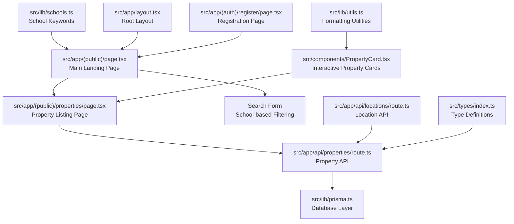
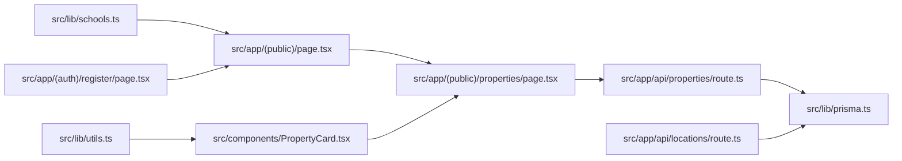

# Home Page & Property Browsing

<cite>
**Referenced Files in This Document**
- [src/app/(public)/page.tsx](file://src/app/(public)/page.tsx)
- [src/app/(public)/properties/page.tsx](file://src/app/(public)/properties/page.tsx)
- [src/app/layout.tsx](file://src/app/layout.tsx)
- [src/app/api/properties/route.ts](file://src/app/api/properties/route.ts)
- [src/app/api/locations/route.ts](file://src/app/api/locations/route.ts)
- [src/lib/prisma.ts](file://src/lib/prisma.ts)
- [src/lib/utils.ts](file://src/lib/utils.ts)
- [src/lib/schools.ts](file://src/lib/schools.ts)
- [src/types/index.ts](file://src/types/index.ts)
- [src/components/PropertyCard.tsx](file://src/components/PropertyCard.tsx)
- [src/app/(auth)/register/page.tsx](file://src/app/(auth)/register/page.tsx)
</cite>

## Update Summary
**Changes Made**
- Updated home page structure to include comprehensive property browsing interface
- Added detailed documentation for the new property listing page with advanced filtering
- Enhanced property card component documentation with client-side interactivity
- Expanded search functionality documentation including school-based filtering
- Updated API documentation to reflect new property creation and management capabilities
- Added comprehensive filtering mechanisms including location, school, price range, and status

## Table of Contents
1. [Introduction](#introduction)
2. [Project Structure](#project-structure)
3. [Core Components](#core-components)
4. [Architecture Overview](#architecture-overview)
5. [Detailed Component Analysis](#detailed-component-analysis)
6. [Dependency Analysis](#dependency-analysis)
7. [Performance Considerations](#performance-considerations)
8. [Troubleshooting Guide](#troubleshooting-guide)
9. [Conclusion](#conclusion)

## Introduction
This document describes the comprehensive home page and property browsing interface for the RentalHub BOUESTI platform. The platform features a modern landing page with property search capabilities, an advanced property listing system with sophisticated filtering, and interactive property cards. The system supports multiple search methods including location-based filtering, school-based proximity search, price range filtering, and property status management. Users can browse verified properties, compare amenities, view landlord information, and access detailed property pages with comprehensive information.

## Project Structure
The home page and property browsing system consists of several interconnected components working together to provide a seamless user experience. The main landing page features a hero section with search functionality, featured property showcases, and call-to-action sections. The property listing page handles complex filtering and sorting operations, while the property card component provides interactive property previews. All components integrate with the backend API for real-time property data retrieval and management.



**Diagram sources**
- [src/app/(public)/page.tsx:1-269](file://src/app/(public)/page.tsx#L1-L269)
- [src/app/(public)/properties/page.tsx:1-109](file://src/app/(public)/properties/page.tsx#L1-L109)
- [src/app/api/properties/route.ts:1-162](file://src/app/api/properties/route.ts#L1-L162)
- [src/app/api/locations/route.ts:1-29](file://src/app/api/locations/route.ts#L1-L29)
- [src/lib/prisma.ts:1-27](file://src/lib/prisma.ts#L1-L27)
- [src/lib/utils.ts:1-158](file://src/lib/utils.ts#L1-L158)
- [src/lib/schools.ts](file://src/lib/schools.ts)
- [src/types/index.ts:1-109](file://src/types/index.ts#L1-L109)
- [src/app/layout.tsx:1-28](file://src/app/layout.tsx#L1-L28)
- [src/app/(auth)/register/page.tsx:1-244](file://src/app/(auth)/register/page.tsx#L1-L244)

**Section sources**
- [src/app/(public)/page.tsx:1-269](file://src/app/(public)/page.tsx#L1-L269)
- [src/app/(public)/properties/page.tsx:1-109](file://src/app/(public)/properties/page.tsx#L1-L109)
- [src/app/layout.tsx:1-28](file://src/app/layout.tsx#L1-L28)

## Core Components
The system comprises several key components working together to deliver a comprehensive property browsing experience:

**Main Landing Page Features:**
- Hero section with gradient background and prominent search form
- Featured property showcase with virtual tour integration
- How-it-works section explaining platform benefits
- FAQ section addressing common concerns
- Call-to-action sections for students and landlords

**Property Listing System:**
- Advanced filtering by location, school, and price range
- Sorting capabilities by price, creation date, and distance to campus
- Pagination support for large property datasets
- Real-time property availability indicators

**Property Card Components:**
- Interactive property cards with image galleries
- Comprehensive property information display
- Amenity indicators and distance measurements
- Direct navigation to property detail pages

**Search and Filter Capabilities:**
- School-based proximity search using predefined keywords
- Location-based filtering with fuzzy matching
- Price range filtering with validation
- Status-based filtering for approved properties

**Section sources**
- [src/app/(public)/page.tsx:51-269](file://src/app/(public)/page.tsx#L51-L269)
- [src/app/(public)/properties/page.tsx:14-109](file://src/app/(public)/properties/page.tsx#L14-L109)
- [src/components/PropertyCard.tsx:1-157](file://src/components/PropertyCard.tsx#L1-L157)
- [src/app/api/properties/route.ts:15-93](file://src/app/api/properties/route.ts#L15-L93)

## Architecture Overview
The property browsing architecture follows a client-server pattern with comprehensive API endpoints supporting various property operations. The frontend components handle user interactions and data presentation, while the backend APIs manage data persistence and business logic. The system supports both server-side rendering for SEO optimization and client-side interactivity for enhanced user experience.

```mermaid
sequenceDiagram
participant User as "User Browser"
participant Home as "src/app/(public)/page.tsx"
participant Search as "Search Form"
participant Properties as "src/app/(public)/properties/page.tsx"
participant API as "src/app/api/properties/route.ts"
participant DB as "src/lib/prisma.ts"
User->>Home : "Load main page"
Home-->>User : "Display hero, search, features"
User->>Search : "Submit school/location filter"
Search->>Properties : "Navigate with query params"
Properties->>API : "GET /api/properties with filters"
API->>DB : "Query properties with filters"
DB-->>API : "Return filtered properties"
API-->>Properties : "JSON response with properties"
Properties-->>User : "Render property grid with cards"
```

**Diagram sources**
- [src/app/(public)/page.tsx:70-96](file://src/app/(public)/page.tsx#L70-L96)
- [src/app/(public)/properties/page.tsx:14-48](file://src/app/(public)/properties/page.tsx#L14-L48)
- [src/app/api/properties/route.ts:15-93](file://src/app/api/properties/route.ts#L15-L93)
- [src/lib/prisma.ts:13-24](file://src/lib/prisma.ts#L13-L24)

## Detailed Component Analysis

### Main Landing Page Structure
The main landing page serves as the primary entry point for users, featuring a comprehensive design that guides visitors through the property discovery process. The page includes multiple distinct sections designed to address different user needs and provide various touchpoints for engagement.

**Hero Section:**
- Gradient background with decorative elements
- Prominent headline emphasizing campus living
- Subtle tagline explaining verified accommodations
- Integrated search form with school selection dropdown
- Virtual tour preview with interactive elements

**Featured Properties Showcase:**
- Premium property display with key information
- Location indicators and pricing information
- Amenity badges for quick property comparison
- Direct navigation to property listings

**How It Works Section:**
- Separate guidance for students and landlords
- Step-by-step process explanation
- Clear value proposition communication

**FAQ Section:**
- Common questions about property authenticity
- Landlord registration and listing processes
- Direct communication channels
- Transparency guarantees

**Call-to-Action Section:**
- Prominent buttons for property search
- Landlord registration option
- Colorful branding elements

**Section sources**
- [src/app/(public)/page.tsx:51-269](file://src/app/(public)/page.tsx#L51-L269)

### Property Listing Page Implementation
The property listing page provides a comprehensive interface for browsing available properties with advanced filtering capabilities. The page dynamically generates property grids based on user-selected filters and search criteria.

**Dynamic Filtering System:**
- School-based proximity filtering using predefined keywords
- Location-based filtering with case-insensitive matching
- Active filter indicators showing current search parameters
- Clear filter functionality for easy navigation

**Property Display Grid:**
- Responsive grid layout adapting to screen size
- Property cards displaying essential information
- Direct navigation to detailed property views
- Consistent styling and spacing

**Search Parameter Handling:**
- Dynamic resolution of URL query parameters
- Support for both school and location filters
- Combined filtering logic for complex searches
- Automatic property query generation

**Section sources**
- [src/app/(public)/properties/page.tsx:14-109](file://src/app/(public)/properties/page.tsx#L14-L109)

### Property Card Component Architecture
The property card component provides an interactive interface for individual property display within the listing grid. Each card presents comprehensive property information in an organized, visually appealing format.

**Visual Elements:**
- Property image gallery with fallback icons
- Location indicator with directional iconography
- Pricing display with Nigerian Naira formatting
- Amenity badges with expandable functionality
- Distance-to-campus indicators

**Interactive Features:**
- Hover effects for enhanced user experience
- Direct navigation to property detail pages
- Consistent button styling and typography
- Responsive design elements

**Data Presentation:**
- Property title with line clamp for readability
- Concise description with character limit
- Landlord information display
- Status indicators for property availability

**Section sources**
- [src/components/PropertyCard.tsx:1-157](file://src/components/PropertyCard.tsx#L1-L157)

### Advanced Property Search and Filtering
The property search system supports multiple filtering mechanisms designed to help users find properties that meet their specific requirements. The system combines location-based filtering with school proximity search and price range constraints.

**Filtering Mechanisms:**
- Location-based filtering with fuzzy matching
- School-based proximity search using keyword arrays
- Price range filtering with validation
- Status-based filtering for approved properties only

**Search Parameter Processing:**
- Dynamic keyword extraction from school selections
- Multiple location name support for comprehensive coverage
- Case-insensitive search matching
- Filter combination logic for complex queries

**API Integration:**
- Server-side query construction
- Database optimization with proper indexing
- Efficient query execution with pagination
- Comprehensive property data retrieval

**Section sources**
- [src/app/api/properties/route.ts:15-93](file://src/app/api/properties/route.ts#L15-L93)
- [src/lib/schools.ts](file://src/lib/schools.ts)

### Property Creation and Management API
The property management system includes comprehensive API endpoints for property creation, modification, and status management. The system supports both landlord and administrative workflows with appropriate authorization controls.

**Property Creation Process:**
- Authentication requirement for property submission
- Role-based access control (landlords vs administrators)
- Comprehensive validation of property data
- Default status assignment for new listings

**Validation Requirements:**
- Essential property information validation
- Image gallery requirements
- Location existence verification
- Data type and format validation

**Status Management:**
- Initial status assignment (PENDING)
- Administrative review process
- Status-based visibility control
- Role-specific status filtering

**Section sources**
- [src/app/api/properties/route.ts:97-162](file://src/app/api/properties/route.ts#L97-L162)

### Location and School Integration
The system integrates with location and school data to provide intelligent property matching and filtering capabilities. This integration enables users to search for properties based on proximity to educational institutions.

**Location Management:**
- Comprehensive location database
- Classification-based ordering
- Location-based property association
- Geographic proximity calculations

**School Proximity Search:**
- Predefined school location keywords
- Multiple keyword support per institution
- Flexible matching algorithms
- Dynamic keyword expansion

**Geographic Integration:**
- Distance calculation capabilities
- Campus proximity indicators
- Location-based property ranking
- Geographic search optimization

**Section sources**
- [src/app/api/locations/route.ts:11-29](file://src/app/api/locations/route.ts#L11-L29)
- [src/lib/schools.ts](file://src/lib/schools.ts)

### Responsive Design and User Experience
The property browsing interface implements comprehensive responsive design principles to ensure optimal user experience across all device types and screen sizes.

**Grid Layout System:**
- Mobile-first responsive design approach
- Adaptive column layouts (1-3 columns)
- Flexible spacing and padding adjustments
- Touch-friendly interaction elements

**Typography and Visual Hierarchy:**
- Consistent font sizing and weight scaling
- Clear visual hierarchy for property information
- Appropriate spacing for readability
- Accessible color contrast ratios

**Interactive Elements:**
- Hover states for all clickable elements
- Focus states for keyboard navigation
- Smooth transitions and animations
- Consistent button and form styling

**Section sources**
- [src/app/(public)/page.tsx:167-191](file://src/app/(public)/page.tsx#L167-L191)
- [src/components/PropertyCard.tsx:30-155](file://src/components/PropertyCard.tsx#L30-L155)

## Dependency Analysis
The property browsing system relies on several core dependencies that work together to provide a cohesive user experience. Understanding these dependencies is crucial for maintenance, troubleshooting, and system optimization.

**Frontend Dependencies:**
- Next.js framework for server-side rendering and routing
- Tailwind CSS for responsive styling and component design
- Prisma ORM for database abstraction and query optimization
- TypeScript for type safety and development experience

**Backend Dependencies:**
- NextAuth.js for authentication and session management
- Prisma Client for database operations
- Environment-specific configuration management
- Utility functions for data formatting and validation

**External Integrations:**
- School location keyword database for proximity search
- Property image hosting and optimization services
- Authentication provider integration
- Analytics and monitoring systems



**Diagram sources**
- [src/app/(public)/page.tsx:1-269](file://src/app/(public)/page.tsx#L1-L269)
- [src/app/(public)/properties/page.tsx:1-109](file://src/app/(public)/properties/page.tsx#L1-L109)
- [src/app/api/properties/route.ts:1-162](file://src/app/api/properties/route.ts#L1-L162)
- [src/lib/prisma.ts:1-27](file://src/lib/prisma.ts#L1-L27)
- [src/components/PropertyCard.tsx:1-157](file://src/components/PropertyCard.tsx#L1-L157)
- [src/lib/utils.ts:1-158](file://src/lib/utils.ts#L1-L158)
- [src/lib/schools.ts](file://src/lib/schools.ts)
- [src/app/(auth)/register/page.tsx:1-244](file://src/app/(auth)/register/page.tsx#L1-L244)
- [src/app/api/locations/route.ts:1-29](file://src/app/api/locations/route.ts#L1-L29)

**Section sources**
- [src/app/(public)/page.tsx:1-269](file://src/app/(public)/page.tsx#L1-L269)
- [src/app/(public)/properties/page.tsx:1-109](file://src/app/(public)/properties/page.tsx#L1-L109)
- [src/app/api/properties/route.ts:1-162](file://src/app/api/properties/route.ts#L1-L162)
- [src/lib/prisma.ts:1-27](file://src/lib/prisma.ts#L1-L27)
- [src/components/PropertyCard.tsx:1-157](file://src/components/PropertyCard.tsx#L1-L157)

## Performance Considerations
The property browsing system implements several performance optimization strategies to ensure fast loading times and smooth user interactions across all components.

**Database Optimization:**
- Proper indexing on frequently queried fields (location.name, price, createdAt)
- Efficient query patterns avoiding N+1 problems
- Connection pooling and database optimization
- Query result caching for frequently accessed data

**Frontend Performance:**
- Lazy loading for property images and components
- Code splitting for improved initial load times
- Optimized CSS delivery and critical rendering path
- Efficient state management and component updates

**API Response Optimization:**
- Selective field retrieval limiting data transfer
- Pagination implementation for large datasets
- Caching strategies for static content
- Compression and minification of assets

**Image and Media Optimization:**
- Responsive image serving based on device capabilities
- Lazy loading for non-critical images
- Optimized image formats and compression
- CDN integration for global content delivery

## Troubleshooting Guide
Common issues and their solutions for the property browsing system:

**Search and Filter Issues:**
- Empty property results: Verify search parameters and check for typos in location names
- Slow search performance: Ensure database indexes are properly configured
- Incorrect filtering: Check query parameter encoding and validation logic

**Property Display Problems:**
- Missing property images: Verify image URLs and storage configuration
- Incomplete property information: Check API response structure and data mapping
- Styling inconsistencies: Review CSS class names and responsive breakpoints

**API Integration Issues:**
- Authentication failures: Verify session management and token validation
- Database connection errors: Check connection pooling and timeout settings
- CORS issues: Configure proper headers for cross-origin requests

**Performance Problems:**
- Slow page loads: Implement caching strategies and optimize database queries
- Memory leaks: Monitor component lifecycle and cleanup event listeners
- Mobile responsiveness: Test across various devices and screen sizes

**Section sources**
- [src/app/api/properties/route.ts:15-93](file://src/app/api/properties/route.ts#L15-L93)
- [src/lib/utils.ts:41-53](file://src/lib/utils.ts#L41-L53)

## Conclusion
The RentalHub BOUESTI property browsing system provides a comprehensive solution for connecting students with verified off-campus accommodation. The system combines an engaging landing page with powerful property search capabilities, interactive property cards, and robust backend APIs. Key strengths include flexible filtering mechanisms, responsive design implementation, and comprehensive property management features. The system's architecture supports scalability and extensibility, enabling future enhancements such as real-time updates, advanced recommendation algorithms, and expanded geographic coverage. The integration of school proximity search and location-based filtering creates a unique value proposition for the Nigerian student housing market.