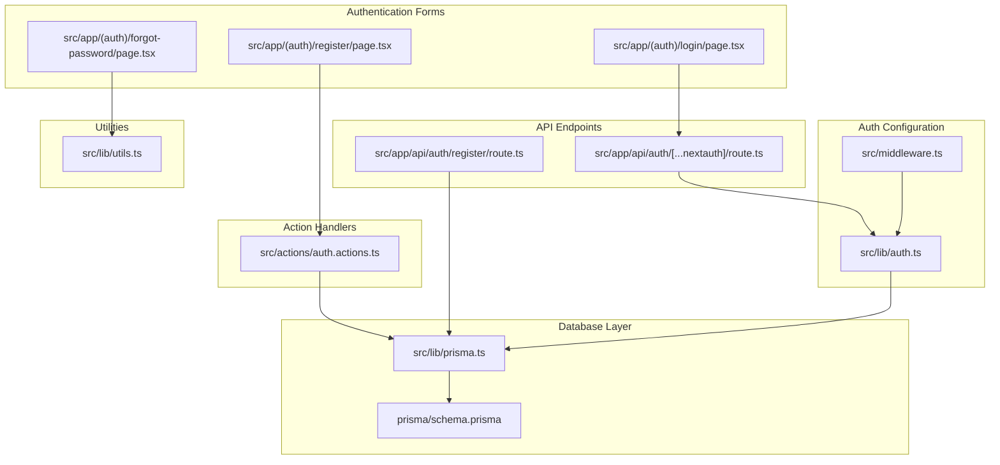
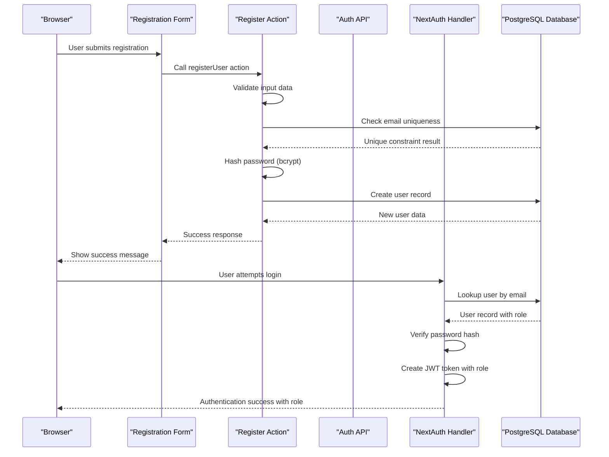
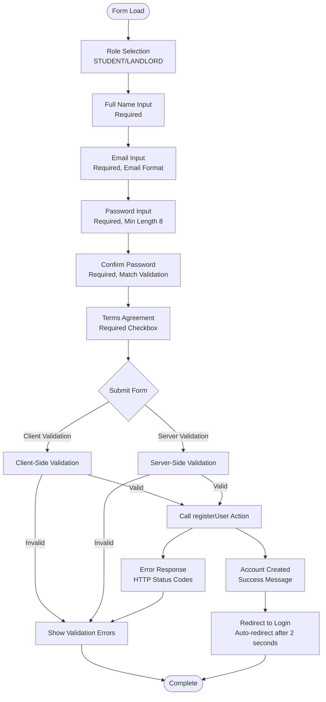
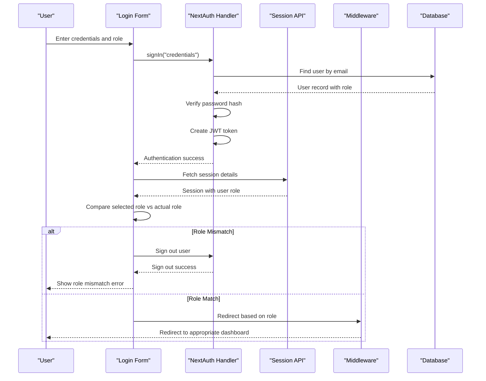
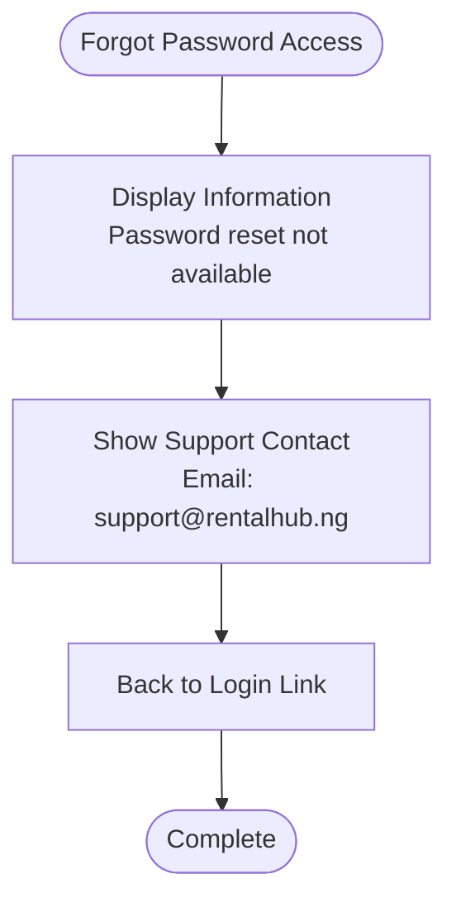
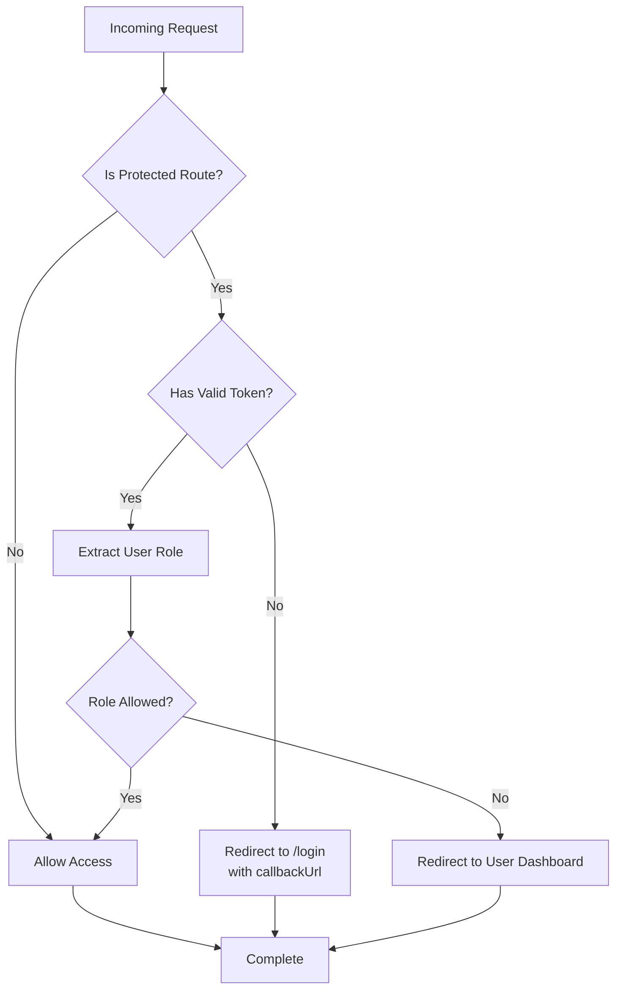
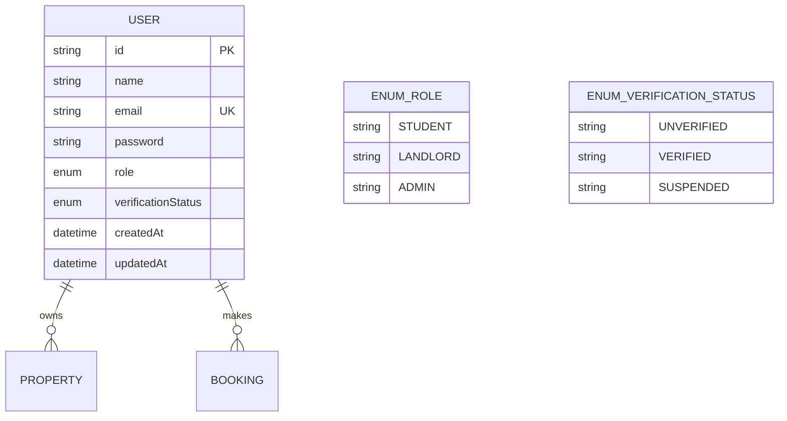

# Registration & Login Forms

<cite>
**Referenced Files in This Document**
- [src/app/(auth)/register/page.tsx](file://src/app/(auth)/register/page.tsx)
- [src/app/(auth)/login/page.tsx](file://src/app/(auth)/login/page.tsx)
- [src/app/(auth)/forgot-password/page.tsx](file://src/app/(auth)/forgot-password/page.tsx)
- [src/actions/auth.actions.ts](file://src/actions/auth.actions.ts)
- [src/app/api/auth/register/route.ts](file://src/app/api/auth/register/route.ts)
- [src/app/api/auth/[...nextauth]/route.ts](file://src/app/api/auth/[...nextauth]/route.ts)
- [src/lib/auth.ts](file://src/lib/auth.ts)
- [src/lib/prisma.ts](file://src/lib/prisma.ts)
- [prisma/schema.prisma](file://prisma/schema.prisma)
- [src/middleware.ts](file://src/middleware.ts)
- [src/lib/utils.ts](file://src/lib/utils.ts)
</cite>

## Update Summary
**Changes Made**
- Added comprehensive documentation for the new authentication forms including login, registration, and forgot password forms
- Updated architecture overview to reflect the complete authentication flow
- Enhanced form validation documentation with client-side and server-side validation details
- Added middleware protection documentation for role-based access control
- Updated security considerations for credential entry and JWT token handling

## Table of Contents
1. [Introduction](#introduction)
2. [Project Structure](#project-structure)
3. [Core Components](#core-components)
4. [Architecture Overview](#architecture-overview)
5. [Detailed Component Analysis](#detailed-component-analysis)
6. [Authentication Flow](#authentication-flow)
7. [Security Implementation](#security-implementation)
8. [Role-Based Access Control](#role-based-access-control)
9. [Form Validation & Error Handling](#form-validation--error-handling)
10. [Middleware Protection](#middleware-protection)
11. [Database Schema](#database-schema)
12. [Performance Considerations](#performance-considerations)
13. [Troubleshooting Guide](#troubleshooting-guide)
14. [Conclusion](#conclusion)

## Introduction
This document provides comprehensive documentation for the user registration and authentication forms in the RentalHub BOUESTI application. The system includes three primary authentication forms: registration, login, and forgot password. It covers the registration form components including role selection (STUDENT/LANDLORD), form validation, password requirements, and submission handling. The login form interface includes credential validation, session management, and error handling. The forgot password form currently serves as a placeholder for future password reset functionality. The document details form state management, input validation patterns, user feedback mechanisms, and integration with NextAuth.js authentication endpoints and JWT token handling. It addresses form accessibility, mobile responsiveness, and security considerations for credential entry.

## Project Structure
The authentication system is organized across several key files with a clear separation between frontend forms, backend APIs, and authentication configuration:

**Diagram sources**
- [src/app/(auth)/register/page.tsx:1-244](file://src/app/(auth)/register/page.tsx#L1-L244)
- [src/app/(auth)/login/page.tsx:1-206](file://src/app/(auth)/login/page.tsx#L1-L206)
- [src/app/(auth)/forgot-password/page.tsx:1-25](file://src/app/(auth)/forgot-password/page.tsx#L1-L25)
- [src/actions/auth.actions.ts:1-208](file://src/actions/auth.actions.ts#L1-L208)
- [src/app/api/auth/register/route.ts:1-90](file://src/app/api/auth/register/route.ts#L1-L90)
- [src/app/api/auth/[...nextauth]/route.ts:1-7](file://src/app/api/auth/[...nextauth]/route.ts#L1-L7)
- [src/lib/auth.ts:1-119](file://src/lib/auth.ts#L1-L119)
- [src/middleware.ts:1-76](file://src/middleware.ts#L1-L76)
- [src/lib/prisma.ts:1-27](file://src/lib/prisma.ts#L1-L27)
- [prisma/schema.prisma:1-136](file://prisma/schema.prisma#L1-L136)

**Section sources**
- [src/app/(auth)/register/page.tsx:1-244](file://src/app/(auth)/register/page.tsx#L1-L244)
- [src/app/(auth)/login/page.tsx:1-206](file://src/app/(auth)/login/page.tsx#L1-L206)
- [src/app/(auth)/forgot-password/page.tsx:1-25](file://src/app/(auth)/forgot-password/page.tsx#L1-L25)
- [src/actions/auth.actions.ts:1-208](file://src/actions/auth.actions.ts#L1-L208)
- [src/app/api/auth/register/route.ts:1-90](file://src/app/api/auth/register/route.ts#L1-L90)
- [src/app/api/auth/[...nextauth]/route.ts:1-7](file://src/app/api/auth/[...nextauth]/route.ts#L1-L7)
- [src/lib/auth.ts:1-119](file://src/lib/auth.ts#L1-L119)
- [src/middleware.ts:1-76](file://src/middleware.ts#L1-L76)
- [src/lib/prisma.ts:1-27](file://src/lib/prisma.ts#L1-L27)
- [prisma/schema.prisma:1-136](file://prisma/schema.prisma#L1-L136)

## Core Components
This section documents the primary components involved in user registration and authentication.

### Registration Form
The registration form is implemented as a Next.js client component with comprehensive validation and user feedback:

- **Role Selection**: Dropdown allowing users to choose between STUDENT and LANDLORD roles
- **Input Fields**: Full name, email address, password, confirm password, and terms agreement checkbox
- **Client-Side Validation**: Real-time validation for password matching, minimum length (8 characters), and terms acceptance
- **Submission Handling**: Uses server action `registerUser` for secure form processing
- **User Feedback**: Success and error notifications with automatic redirection to login after successful registration
- **Styling**: Modern card-based design with orange accent color scheme and responsive layout

Key validation rules:
- Role selection is mandatory with predefined STUDENT/LANDLORD options
- All fields except role are required (full name, email, password, confirm password)
- Password must be at least 8 characters long
- Password confirmation must match the primary password
- Terms agreement checkbox is required
- Email format is validated by the browser

**Section sources**
- [src/app/(auth)/register/page.tsx:8-70](file://src/app/(auth)/register/page.tsx#L8-L70)
- [src/app/(auth)/register/page.tsx:95-226](file://src/app/(auth)/register/page.tsx#L95-L226)

### Login Form
The login form provides credential-based authentication with role-aware redirection:

- **Role Selection**: Dropdown allowing users to specify their role (STUDENT, LANDLORD, ADMIN)
- **Input Fields**: Email and password with autocomplete attributes
- **Client-Side Validation**: Real-time validation for required fields
- **Authentication Flow**: Uses NextAuth's credentials provider with custom role verification
- **Role-Based Redirection**: Automatically redirects users to their respective dashboards based on role
- **Error Handling**: Comprehensive error messages for invalid credentials and role mismatches
- **Styling**: Consistent card-based design with orange accent color scheme

**Section sources**
- [src/app/(auth)/login/page.tsx:8-77](file://src/app/(auth)/login/page.tsx#L8-L77)
- [src/app/(auth)/login/page.tsx:96-188](file://src/app/(auth)/login/page.tsx#L96-L188)

### Forgot Password Form
The forgot password form currently serves as a placeholder for future password reset functionality:

- **Current State**: Displays informative message about password reset availability
- **Contact Information**: Provides support email for account recovery requests
- **Navigation**: Includes back-to-login link for user convenience
- **Future Enhancement**: Designed to integrate with email-based password reset system

**Section sources**
- [src/app/(auth)/forgot-password/page.tsx:3-24](file://src/app/(auth)/forgot-password/page.tsx#L3-L24)

### Registration Action Handler
The server action provides secure user registration with comprehensive validation:

- **Input Validation**: Server-side validation for required fields and password strength
- **Uniqueness Check**: Database query to prevent duplicate email registrations
- **Password Security**: Bcrypt hashing with configurable cost factor (12)
- **Role Assignment**: Default STUDENT role with optional LANDLORD specification
- **Verification Status**: Sets initial VERIFIED status for new accounts
- **Response Formatting**: Structured success/error responses with appropriate HTTP status codes

**Section sources**
- [src/actions/auth.actions.ts:24-93](file://src/actions/auth.actions.ts#L24-L93)

### NextAuth Integration
NextAuth.js provides the authentication framework with comprehensive configuration:

- **JWT Strategy**: Stateless session management using JSON Web Tokens
- **Credentials Provider**: Custom implementation for email/password authentication
- **Database Integration**: Prisma adapter for user lookup and validation
- **Security Features**: Bcrypt password comparison and account verification checks
- **Session Management**: Configurable expiration (30 days) with automatic refresh
- **Role Propagation**: Token and session callbacks for role and verification status
- **Error Handling**: Comprehensive error messages for invalid credentials or suspended accounts

**Section sources**
- [src/lib/auth.ts:36-119](file://src/lib/auth.ts#L36-L119)
- [src/app/api/auth/[...nextauth]/route.ts:1-7](file://src/app/api/auth/[...nextauth]/route.ts#L1-L7)

## Architecture Overview
The authentication architecture follows a modern Next.js pattern with clear separation of concerns and comprehensive security measures:

**Diagram sources**
- [src/app/(auth)/register/page.tsx:29-70](file://src/app/(auth)/register/page.tsx#L29-L70)
- [src/actions/auth.actions.ts:24-93](file://src/actions/auth.actions.ts#L24-L93)
- [src/app/api/auth/register/route.ts:20-89](file://src/app/api/auth/register/route.ts#L20-L89)
- [src/lib/auth.ts:53-92](file://src/lib/auth.ts#L53-L92)

The system integrates with NextAuth.js for:
- Stateless JWT-based session management
- Role-based access control implementation
- Middleware protection for authenticated routes
- Standardized authentication flows and error handling

**Section sources**
- [src/lib/auth.ts:36-119](file://src/lib/auth.ts#L36-L119)
- [src/middleware.ts:15-66](file://src/middleware.ts#L15-L66)

## Detailed Component Analysis

### Registration Form Component Analysis
The registration form implements a modern, accessible design with comprehensive validation and user feedback:

**Diagram sources**
- [src/app/(auth)/register/page.tsx:29-70](file://src/app/(auth)/register/page.tsx#L29-L70)
- [src/actions/auth.actions.ts:24-93](file://src/actions/auth.actions.ts#L24-L93)

Key implementation patterns:
- **State Management**: React hooks for form state, error handling, and loading states
- **Validation Strategy**: Dual-layer validation (client-side for UX, server-side for security)
- **User Experience**: Real-time validation feedback and loading indicators
- **Accessibility**: Proper form labeling, keyboard navigation, and screen reader support
- **Responsive Design**: Mobile-first approach with Tailwind CSS utilities

**Section sources**
- [src/app/(auth)/register/page.tsx:8-70](file://src/app/(auth)/register/page.tsx#L8-L70)
- [src/app/(auth)/register/page.tsx:95-226](file://src/app/(auth)/register/page.tsx#L95-L226)

### Login Form Component Analysis
The login form provides streamlined authentication with role-aware redirection:

**Diagram sources**
- [src/app/(auth)/login/page.tsx:19-77](file://src/app/(auth)/login/page.tsx#L19-L77)
- [src/lib/auth.ts:53-92](file://src/lib/auth.ts#L53-L92)
- [src/middleware.ts:15-66](file://src/middleware.ts#L15-L66)

Security considerations:
- **Password Security**: Bcrypt hashing prevents plaintext password storage
- **Role Verification**: Ensures users can only access their designated dashboards
- **Session Management**: JWT tokens contain minimal user data for security
- **Access Control**: Middleware enforces role-based route protection

**Section sources**
- [src/app/(auth)/login/page.tsx:8-77](file://src/app/(auth)/login/page.tsx#L8-L77)
- [src/lib/auth.ts:53-92](file://src/lib/auth.ts#L53-L92)

### Forgot Password Form Component Analysis
The forgot password form currently serves as a placeholder with future enhancement potential:

**Diagram sources**
- [src/app/(auth)/forgot-password/page.tsx:3-24](file://src/app/(auth)/forgot-password/page.tsx#L3-L24)

**Section sources**
- [src/app/(auth)/forgot-password/page.tsx:3-24](file://src/app/(auth)/forgot-password/page.tsx#L3-L24)

## Authentication Flow
The authentication system implements a comprehensive flow covering registration, login, and session management:

### Registration Flow
1. **Form Submission**: User fills out registration form with role selection
2. **Client-Side Validation**: Immediate validation for password matching and length
3. **Server-Side Processing**: Secure registration with password hashing and uniqueness check
4. **Success Response**: User receives success message and automatic redirection
5. **Database Creation**: New user record created with VERIFIED status

### Login Flow
1. **Role Selection**: User selects their role (STUDENT/LANDLORD/ADMIN)
2. **Credential Submission**: Email and password submitted to NextAuth
3. **Database Verification**: User lookup and password verification
4. **Role Validation**: Comparison between selected role and actual user role
5. **Session Creation**: JWT token created with user role and verification status
6. **Redirection**: Automatic redirect to appropriate dashboard

**Section sources**
- [src/app/(auth)/register/page.tsx:29-70](file://src/app/(auth)/register/page.tsx#L29-L70)
- [src/app/(auth)/login/page.tsx:19-77](file://src/app/(auth)/login/page.tsx#L19-L77)
- [src/lib/auth.ts:53-92](file://src/lib/auth.ts#L53-L92)

## Security Implementation
The authentication system implements multiple layers of security:

### Password Security
- **Hashing Algorithm**: Bcrypt with cost factor 12 for secure password storage
- **Salt Generation**: Automatic salt generation with each password hash
- **Comparison Method**: Secure constant-time comparison to prevent timing attacks

### Session Security
- **Token Strategy**: JWT tokens with configurable expiration (30 days)
- **Token Payload**: Minimal user data (id, email, role, verification status)
- **Secret Management**: Environment variable-based secret key for token signing
- **Refresh Mechanism**: Automatic token refresh with 24-hour update interval

### Input Validation
- **Client-Side**: Real-time validation for immediate user feedback
- **Server-Side**: Comprehensive validation preventing bypass attempts
- **Database-Level**: Unique constraints preventing duplicate registrations

### Role-Based Security
- **Access Control**: Middleware enforces role-based route protection
- **Session Validation**: Role verification during login process
- **Dashboard Isolation**: Users only access their designated dashboards

**Section sources**
- [src/actions/auth.actions.ts:54-55](file://src/actions/auth.actions.ts#L54-L55)
- [src/lib/auth.ts:38-41](file://src/lib/auth.ts#L38-L41)
- [src/lib/auth.ts:53-92](file://src/lib/auth.ts#L53-L92)
- [src/middleware.ts:15-66](file://src/middleware.ts#L15-L66)

## Role-Based Access Control
The system implements comprehensive role-based access control:

### Role Definitions
- **STUDENT**: Primary tenant role with access to property search and booking
- **LANDLORD**: Property owner role with access to property management
- **ADMIN**: System administrator with full platform access

### Access Control Implementation
- **Route Protection**: Middleware protects all dashboard routes
- **Role Matching**: Login form validates selected role matches actual user role
- **Automatic Redirection**: Users redirected to their appropriate dashboard
- **Fallback Protection**: Unknown roles redirected to login page

### Dashboard Routing
- **Student Dashboard**: `/student` - property search and booking management
- **Landlord Dashboard**: `/landlord` - property listing and tenant management
- **Admin Dashboard**: `/admin` - system administration and user management

**Section sources**
- [src/middleware.ts:5-10](file://src/middleware.ts#L5-L10)
- [src/middleware.ts:44-62](file://src/middleware.ts#L44-L62)
- [src/app/(auth)/login/page.tsx:54-72](file://src/app/(auth)/login/page.tsx#L54-L72)

## Form Validation & Error Handling
The authentication system implements comprehensive validation and error handling:

### Client-Side Validation
- **Real-time Feedback**: Immediate validation feedback during form interaction
- **Password Matching**: Confirmation password validation with visual indicators
- **Length Requirements**: Minimum 8-character password enforcement
- **Required Fields**: HTML5 validation for mandatory fields
- **Terms Agreement**: Checkbox validation for service agreement

### Server-Side Validation
- **Input Sanitization**: Email normalization and trimming
- **Uniqueness Checks**: Database queries prevent duplicate registrations
- **Role Validation**: Enumerated role checking (STUDENT/LANDLORD)
- **Password Strength**: Minimum length enforcement (8 characters)
- **Error Responses**: Structured error messages with appropriate HTTP status codes

### Error Handling Patterns
- **Registration Errors**: Duplicate email, invalid role, weak password
- **Authentication Errors**: Invalid credentials, account suspension, role mismatch
- **Network Errors**: Graceful handling of API communication failures
- **User Feedback**: Clear error messages with visual indicators

**Section sources**
- [src/app/(auth)/register/page.tsx:34-44](file://src/app/(auth)/register/page.tsx#L34-L44)
- [src/actions/auth.actions.ts:26-52](file://src/actions/auth.actions.ts#L26-L52)
- [src/app/api/auth/register/route.ts:25-45](file://src/app/api/auth/register/route.ts#L25-L45)

## Middleware Protection
The middleware provides robust route protection based on user roles:

**Diagram sources**
- [src/middleware.ts:15-66](file://src/middleware.ts#L15-L66)

**Section sources**
- [src/middleware.ts:15-66](file://src/middleware.ts#L15-L66)

## Database Schema
The authentication system relies on a well-designed database schema supporting role-based access control:

**Diagram sources**
- [prisma/schema.prisma:44-62](file://prisma/schema.prisma#L44-L62)

The schema supports:
- **Role-Based Access Control**: Enumerated role field with default STUDENT
- **Verification Tracking**: Three-state verification system (UNVERIFIED/VERIFIED/SUSPENDED)
- **Relationship Modeling**: Associations with properties and bookings
- **Index Optimization**: Email and role indexing for efficient lookups
- **Data Integrity**: Unique constraints prevent duplicate emails

**Section sources**
- [prisma/schema.prisma:17-27](file://prisma/schema.prisma#L17-L27)
- [prisma/schema.prisma:44-62](file://prisma/schema.prisma#L44-L62)

## Performance Considerations
The authentication system incorporates several performance optimizations:

### Database Optimization
- **Connection Pooling**: Prisma client manages connection pooling efficiently
- **Index Usage**: Strategic indexing on email and role fields for fast lookups
- **Query Optimization**: Minimal field selection in user queries
- **Development Caching**: Global Prisma instance caching in development

### Session Management
- **JWT Strategy**: Stateless sessions eliminate database load for authentication
- **Token Expiration**: Configurable 30-day expiration with automatic refresh
- **Minimal Payload**: JWT tokens contain only essential user data
- **Memory Efficiency**: No server-side session storage required

### Frontend Performance
- **Client-Side Validation**: Reduces unnecessary server requests
- **Loading States**: Optimistic UI updates with proper loading indicators
- **Responsive Design**: Mobile-first approach reduces layout thrashing
- **Bundle Optimization**: Minimal JavaScript bundle for authentication forms

## Troubleshooting Guide
Common issues and their solutions:

### Registration Issues
- **Email Already Exists**: Database constraint violation triggers conflict response
- **Invalid Role**: Role validation fails for values outside STUDENT/LANDLORD
- **Weak Password**: Minimum length requirement enforced (8 characters)
- **Password Mismatch**: Client-side validation prevents registration with non-matching passwords
- **Terms Not Accepted**: Required checkbox validation prevents submission

### Authentication Issues
- **Invalid Credentials**: NextAuth throws specific error messages for authentication failure
- **Account Suspension**: Suspended accounts blocked with clear messaging
- **Role Mismatch**: Selected role doesn't match actual user role triggers sign-out
- **Session Timeout**: Automatic redirect to login page after token expiration
- **Permission Denied**: Middleware redirects to appropriate dashboard based on role

### Middleware Issues
- **Access Denied**: Users redirected to their dashboard instead of unauthorized route
- **Token Extraction**: Missing NEXTAUTH_SECRET causes token validation failures
- **Route Matching**: Incorrect URL patterns bypass middleware protection

### Debugging Strategies
- **Enable Debug Mode**: Set NEXTAUTH_DEBUG=true for detailed authentication logs
- **Check Network Tab**: Monitor API responses and error codes in browser dev tools
- **Verify Environment Variables**: Ensure NEXTAUTH_SECRET and DATABASE_URL are configured
- **Test Database Connectivity**: Verify Prisma client initialization and connection pooling
- **Review Token Structure**: Check JWT token payload contains expected role and verification status

**Section sources**
- [src/actions/auth.actions.ts:34-44](file://src/actions/auth.actions.ts#L34-L44)
- [src/lib/auth.ts:53-92](file://src/lib/auth.ts#L53-L92)
- [src/middleware.ts:34-39](file://src/middleware.ts#L34-L39)

## Conclusion
The RentalHub BOUESTI authentication system provides a robust, secure, and user-friendly solution for user registration and login. The implementation combines modern frontend design with secure backend practices, utilizing NextAuth.js for authentication management and Prisma for database operations. The system enforces comprehensive validation, implements proper security measures including bcrypt password hashing and JWT token handling, and provides clear user feedback throughout the authentication process. The modular architecture ensures maintainability and scalability while the middleware provides strong role-based route protection. The three-tier authentication forms (registration, login, and forgot password) work together seamlessly to provide a complete user authentication experience with comprehensive error handling and security considerations.