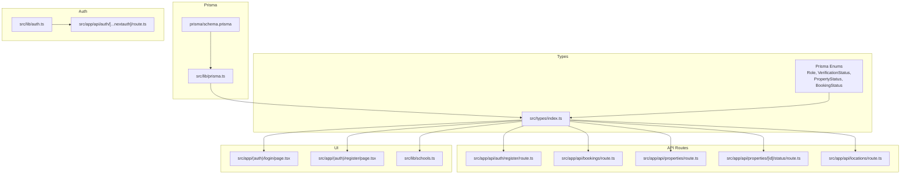
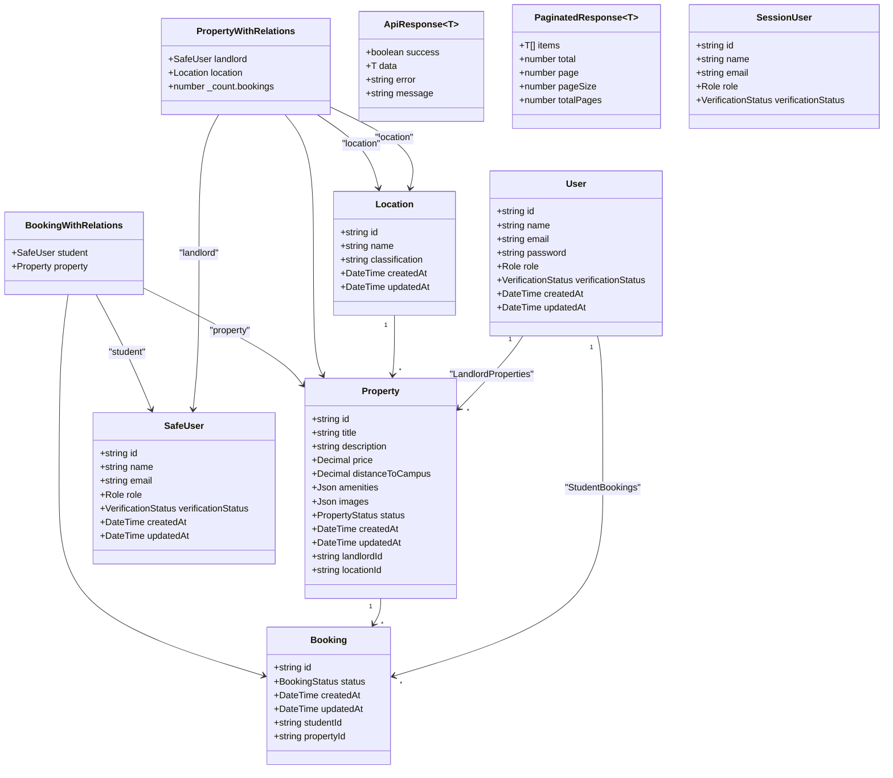
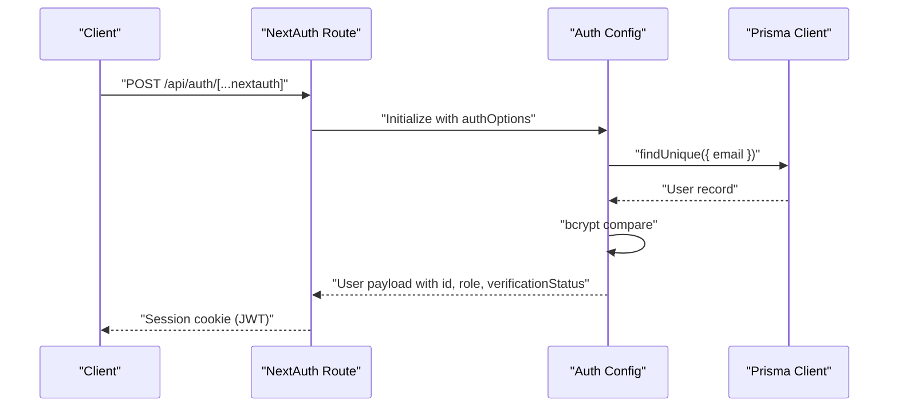
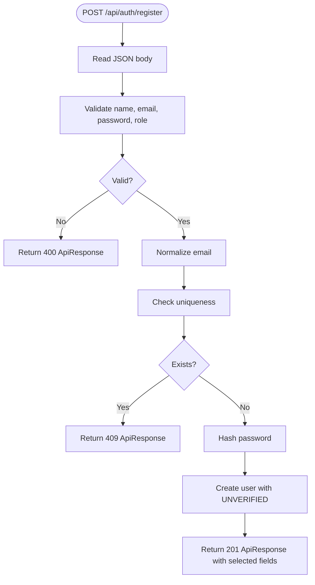
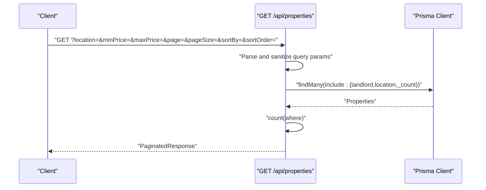
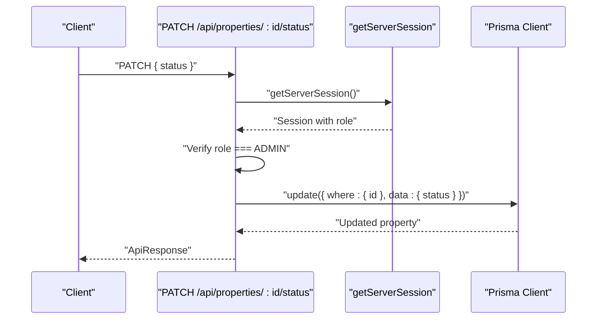
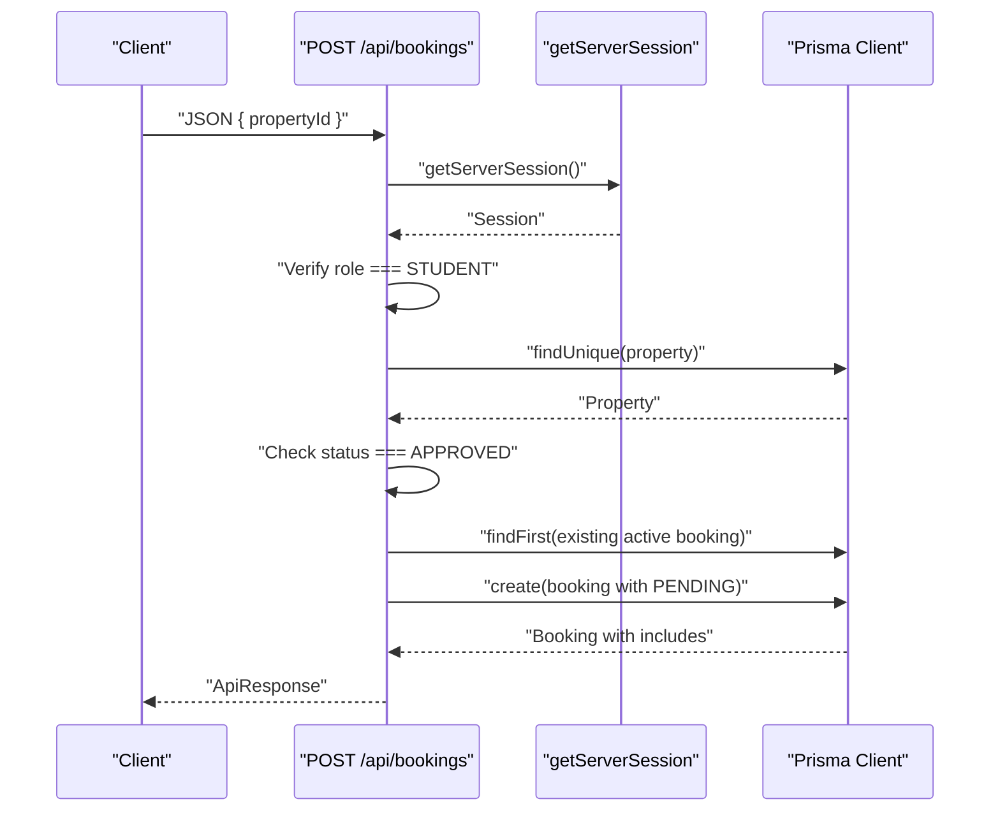
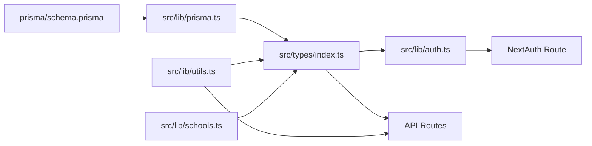

# TypeScript Types & Interfaces

<cite>
**Referenced Files in This Document**
- [src/types/index.ts](file://src/types/index.ts)
- [prisma/schema.prisma](file://prisma/schema.prisma)
- [src/lib/prisma.ts](file://src/lib/prisma.ts)
- [src/lib/auth.ts](file://src/lib/auth.ts)
- [src/lib/utils.ts](file://src/lib/utils.ts)
- [src/lib/schools.ts](file://src/lib/schools.ts)
- [src/app/api/auth/[...nextauth]/route.ts](file://src/app/api/auth/[...nextauth]/route.ts)
- [src/app/api/auth/register/route.ts](file://src/app/api/auth/register/route.ts)
- [src/app/api/bookings/route.ts](file://src/app/api/bookings/route.ts)
- [src/app/api/properties/route.ts](file://src/app/api/properties/route.ts)
- [src/app/api/properties/[id]/status/route.ts](file://src/app/api/properties/[id]/status/route.ts)
- [src/app/api/locations/route.ts](file://src/app/api/locations/route.ts)
- [src/app/(auth)/register/page.tsx](file://src/app/(auth)/register/page.tsx)
- [src/app/(auth)/login/page.tsx](file://src/app/(auth)/login/page.tsx)
</cite>

## Update Summary
**Changes Made**
- Added comprehensive documentation for new API endpoints and their type definitions
- Enhanced authentication integration documentation with NextAuth module augmentation
- Expanded utility functions documentation including new formatting and parsing helpers
- Updated property search and filtering capabilities documentation
- Added school location keyword mapping system documentation
- Enhanced booking management API documentation with PATCH endpoint support

## Table of Contents
1. [Introduction](#introduction)
2. [Project Structure](#project-structure)
3. [Core Components](#core-components)
4. [Architecture Overview](#architecture-overview)
5. [Detailed Component Analysis](#detailed-component-analysis)
6. [Dependency Analysis](#dependency-analysis)
7. [Performance Considerations](#performance-considerations)
8. [Troubleshooting Guide](#troubleshooting-guide)
9. [Conclusion](#conclusion)
10. [Appendices](#appendices)

## Introduction
This document provides comprehensive TypeScript documentation for the shared type definitions and interfaces used across the RentalHub-BOUESTI application. It covers:
- Shared interfaces for User, Property, Booking, and Location models
- Derived enums (Role, VerificationStatus, PropertyStatus, BookingStatus)
- API response schemas and pagination
- Form data interfaces for registration, login, property creation, and booking
- Session types integrated with NextAuth
- Database model types generated by Prisma
- Utility types and helpers for safe parsing and formatting
- Type safety patterns, validation interfaces, and integration with Prisma-generated types
- Examples of type usage in components, API routes, and database operations

## Project Structure
The type system is centralized under a single shared index file that re-exports Prisma enums and defines application-specific types. Prisma's schema defines the canonical database models and enums. Utilities provide safe parsing and formatting helpers. API routes consume these types to maintain consistent request/response shapes and enforce validation.

**Diagram sources**
- [src/types/index.ts:1-109](file://src/types/index.ts#L1-L109)
- [prisma/schema.prisma:15-39](file://prisma/schema.prisma#L15-L39)
- [src/lib/prisma.ts:1-27](file://src/lib/prisma.ts#L1-L27)
- [src/lib/auth.ts:1-119](file://src/lib/auth.ts#L1-L119)
- [src/app/api/auth/[...nextauth]/route.ts:1-7](file://src/app/api/auth/[...nextauth]/route.ts#L1-L7)
- [src/app/api/auth/register/route.ts:1-90](file://src/app/api/auth/register/route.ts#L1-L90)
- [src/app/api/bookings/route.ts:1-182](file://src/app/api/bookings/route.ts#L1-L182)
- [src/app/api/properties/route.ts:1-162](file://src/app/api/properties/route.ts#L1-L162)
- [src/app/api/properties/[id]/status/route.ts:1-69](file://src/app/api/properties/[id]/status/route.ts#L1-L69)
- [src/app/api/locations/route.ts:1-29](file://src/app/api/locations/route.ts#L1-L29)
- [src/app/(auth)/login/page.tsx:1-206](file://src/app/(auth)/login/page.tsx#L1-L206)
- [src/app/(auth)/register/page.tsx:1-244](file://src/app/(auth)/register/page.tsx#L1-L244)
- [src/lib/schools.ts:1-31](file://src/lib/schools.ts#L1-L31)

**Section sources**
- [src/types/index.ts:1-109](file://src/types/index.ts#L1-L109)
- [prisma/schema.prisma:15-39](file://prisma/schema.prisma#L15-L39)
- [src/lib/prisma.ts:1-27](file://src/lib/prisma.ts#L1-L27)

## Core Components
This section documents the shared types and enums used across the application.

- Re-exported Prisma enums
  - Role: STUDENT, LANDLORD, ADMIN
  - VerificationStatus: UNVERIFIED, VERIFIED, SUSPENDED
  - PropertyStatus: PENDING, APPROVED, REJECTED
  - BookingStatus: PENDING, CONFIRMED, CANCELLED

- Safe User type
  - SafeUser: excludes the password field from the Prisma User type

- Relation-enhanced types
  - PropertyWithRelations: includes landlord (SafeUser), location, and optional booking count
  - BookingWithRelations: includes student (SafeUser), property (with location and landlord), and nested relations

- API response schemas
  - ApiResponse<T>: standardized shape with success flag, optional data, error message, and optional message
  - PaginatedResponse<T>: includes items, total, page, pageSize, and totalPages

- Search and filter parameters
  - PropertySearchParams: supports location, min/max price, amenities, status, pagination, and sorting

- Session user
  - SessionUser: typed user object stored in NextAuth session with id, name, email, role, and verificationStatus

- Form data interfaces
  - RegisterFormData: name, email, password, confirmPassword, role
  - LoginFormData: email, password
  - PropertyFormData: title, description, price, locationId, optional distanceToCampus, amenities[], images[]
  - BookingFormData: propertyId

**Section sources**
- [src/types/index.ts:9-18](file://src/types/index.ts#L9-L18)
- [src/types/index.ts:20-21](file://src/types/index.ts#L20-L21)
- [src/types/index.ts:23-42](file://src/types/index.ts#L23-L42)
- [src/types/index.ts:44-58](file://src/types/index.ts#L44-L58)
- [src/types/index.ts:60-71](file://src/types/index.ts#L60-L71)
- [src/types/index.ts:73-80](file://src/types/index.ts#L73-L80)
- [src/types/index.ts:82-109](file://src/types/index.ts#L82-L109)

## Architecture Overview
The type system integrates tightly with Prisma and NextAuth:
- Prisma schema defines models and enums
- Prisma Client generates runtime types
- src/types/index.ts re-exports Prisma enums and augments them with application-specific types
- NextAuth module augmentation ensures session types include role and verificationStatus
- API routes validate inputs using form interfaces and return ApiResponse<T> or PaginatedResponse<T>
- Utilities provide safe parsing and formatting helpers

**Diagram sources**
- [prisma/schema.prisma:43-129](file://prisma/schema.prisma#L43-L129)
- [src/types/index.ts:23-58](file://src/types/index.ts#L23-L58)

**Section sources**
- [prisma/schema.prisma:43-129](file://prisma/schema.prisma#L43-L129)
- [src/types/index.ts:23-58](file://src/types/index.ts#L23-L58)

## Detailed Component Analysis

### Prisma Enums and Models
- Enums
  - Role: STUDENT, LANDLORD, ADMIN
  - VerificationStatus: UNVERIFIED, VERIFIED, SUSPENDED
  - PropertyStatus: PENDING, APPROVED, REJECTED
  - BookingStatus: PENDING, CONFIRMED, CANCELLED
- Models
  - User: includes relations to Property and Booking
  - Location: includes relation to Property
  - Property: includes relations to User (landlord) and Location, and Booking
  - Booking: includes relations to User (student) and Property

These definitions are the source of truth for types and are re-exported in the shared index.

**Section sources**
- [prisma/schema.prisma:15-39](file://prisma/schema.prisma#L15-L39)
- [prisma/schema.prisma:43-129](file://prisma/schema.prisma#L43-L129)

### Shared Types Index
- Re-exports Prisma enums
- SafeUser: removes password from User
- PropertyWithRelations: adds landlord, location, and booking count
- BookingWithRelations: adds student, property with nested relations
- ApiResponse<T> and PaginatedResponse<T>: standardized API shapes
- PropertySearchParams: filters and pagination for property browsing
- SessionUser: session payload shape
- Form interfaces: RegisterFormData, LoginFormData, PropertyFormData, BookingFormData

These types unify the API and UI layers and ensure consistent serialization/deserialization.

**Section sources**
- [src/types/index.ts:9-18](file://src/types/index.ts#L9-L18)
- [src/types/index.ts:20-21](file://src/types/index.ts#L20-L21)
- [src/types/index.ts:23-42](file://src/types/index.ts#L23-L42)
- [src/types/index.ts:44-58](file://src/types/index.ts#L44-L58)
- [src/types/index.ts:60-71](file://src/types/index.ts#L60-L71)
- [src/types/index.ts:73-80](file://src/types/index.ts#L73-L80)
- [src/types/index.ts:82-109](file://src/types/index.ts#L82-L109)

### Authentication Integration (NextAuth)
- Module augmentation extends NextAuth User, Session, and JWT with id, role, and verificationStatus
- Session payloads carry typed user info for downstream API checks and UI rendering
- The auth route delegates to NextAuth with configured providers and callbacks

**Diagram sources**
- [src/app/api/auth/[...nextauth]/route.ts:1-7](file://src/app/api/auth/[...nextauth]/route.ts#L1-L7)
- [src/lib/auth.ts:14-90](file://src/lib/auth.ts#L14-L90)
- [src/lib/prisma.ts:13-24](file://src/lib/prisma.ts#L13-L24)

**Section sources**
- [src/lib/auth.ts:92-116](file://src/lib/auth.ts#L92-L116)
- [src/app/api/auth/[...nextauth]/route.ts:1-7](file://src/app/api/auth/[...nextauth]/route.ts#L1-L7)

### Registration API Route
- Validates presence of name, email, password, and role
- Enforces role selection and password length
- Normalizes email and checks uniqueness
- Hashes password and creates user with UNVERIFIED status
- Returns ApiResponse with selected fields

**Diagram sources**
- [src/app/api/auth/register/route.ts:20-89](file://src/app/api/auth/register/route.ts#L20-L89)

**Section sources**
- [src/app/api/auth/register/route.ts:13-18](file://src/app/api/auth/register/route.ts#L13-L18)
- [src/app/api/auth/register/route.ts:20-89](file://src/app/api/auth/register/route.ts#L20-L89)

### Properties API Route
- GET: builds where conditions from query params, paginates, and returns PaginatedResponse
- POST: validates property creation payload, verifies location existence, and creates property with PENDING status

**Diagram sources**
- [src/app/api/properties/route.ts:14-64](file://src/app/api/properties/route.ts#L14-L64)

**Section sources**
- [src/app/api/properties/route.ts:14-64](file://src/app/api/properties/route.ts#L14-L64)
- [src/app/api/properties/route.ts:68-118](file://src/app/api/properties/route.ts#L68-L118)

### Property Status Update (Admin)
- PATCH endpoint restricts to ADMIN
- Validates status against PropertyStatus enum
- Updates property status and returns ApiResponse

**Diagram sources**
- [src/app/api/properties/[id]/status/route.ts:17-51](file://src/app/api/properties/[id]/status/route.ts#L17-L51)

**Section sources**
- [src/app/api/properties/[id]/status/route.ts:17-51](file://src/app/api/properties/[id]/status/route.ts#L17-L51)

### Bookings API Route
- GET: lists bookings filtered by role (student, landlord, admin)
- POST: student-only creation, validates property availability and duplicates, sets initial status to PENDING
- PATCH: updates booking status with role-based restrictions and validation

**Diagram sources**
- [src/app/api/bookings/route.ts:47-108](file://src/app/api/bookings/route.ts#L47-L108)

**Section sources**
- [src/app/api/bookings/route.ts:11-45](file://src/app/api/bookings/route.ts#L11-L45)
- [src/app/api/bookings/route.ts:47-108](file://src/app/api/bookings/route.ts#L47-L108)
- [src/app/api/bookings/route.ts:110-182](file://src/app/api/bookings/route.ts#L110-L182)

### Locations API Route
- GET: returns all locations ordered by classification and name for UI dropdowns

**Section sources**
- [src/app/api/locations/route.ts:11-28](file://src/app/api/locations/route.ts#L11-L28)

### Frontend Components and Forms
- Registration page: renders role selector and form fields bound to the RegisterFormData interface
- Login page: renders credentials form fields aligned with LoginFormData interface

**Section sources**
- [src/app/(auth)/register/page.tsx:50-115](file://src/app/(auth)/register/page.tsx#L50-L115)
- [src/app/(auth)/login/page.tsx:51-103](file://src/app/(auth)/login/page.tsx#L51-L103)

### Utilities and Helpers
- Safe parsing helpers: parseAmenities and parseImages accept unknown input and return string[]
- Formatting helpers: formatNaira, formatDate, truncate, getInitials, slugify, buildSearchParams
- Display label maps: ROLE_LABELS, PROPERTY_STATUS_LABELS, BOOKING_STATUS_LABELS
- Amenities list: AMENITIES_LIST as const
- School location keywords: SCHOOL_OPTIONS and SCHOOL_LOCATION_KEYWORDS for enhanced property search

These utilities complement the type system by ensuring robust input handling and consistent presentation.

**Section sources**
- [src/lib/utils.ts:49-66](file://src/lib/utils.ts#L49-L66)
- [src/lib/utils.ts:20-41](file://src/lib/utils.ts#L20-L41)
- [src/lib/utils.ts:68-85](file://src/lib/utils.ts#L68-L85)
- [src/lib/utils.ts:87-96](file://src/lib/utils.ts#L87-L96)
- [src/lib/utils.ts:98-117](file://src/lib/utils.ts#L98-L117)
- [src/lib/utils.ts:119-136](file://src/lib/utils.ts#L119-L136)
- [src/lib/schools.ts:1-31](file://src/lib/schools.ts#L1-L31)

## Dependency Analysis
The type system exhibits low coupling and high cohesion:
- src/types/index.ts depends on Prisma enums and models
- API routes depend on shared types for request/response typing
- NextAuth depends on module augmentation for session typing
- Utilities depend on shared enums for display labels and parsing

**Diagram sources**
- [prisma/schema.prisma:15-39](file://prisma/schema.prisma#L15-L39)
- [src/lib/prisma.ts:9-24](file://src/lib/prisma.ts#L9-L24)
- [src/types/index.ts:9-18](file://src/types/index.ts#L9-L18)
- [src/lib/auth.ts:12-116](file://src/lib/auth.ts#L12-L116)
- [src/app/api/auth/[...nextauth]/route.ts:1-7](file://src/app/api/auth/[...nextauth]/route.ts#L1-L7)
- [src/lib/utils.ts:1-137](file://src/lib/utils.ts#L1-L137)
- [src/lib/schools.ts:1-31](file://src/lib/schools.ts#L1-L31)

**Section sources**
- [src/types/index.ts:9-18](file://src/types/index.ts#L9-L18)
- [src/lib/auth.ts:12-116](file://src/lib/auth.ts#L12-L116)
- [src/lib/utils.ts:1-137](file://src/lib/utils.ts#L1-L137)
- [src/lib/schools.ts:1-31](file://src/lib/schools.ts#L1-L31)

## Performance Considerations
- Prefer selective field retrieval (select) in Prisma queries to minimize payload sizes
- Use pagination (page, pageSize) in property listings to limit response size
- Avoid unnecessary includes in queries; include only relations needed for the current view
- Cache frequently accessed enums and labels in memory (already provided via constants)
- Implement proper indexing on frequently queried fields (landlordId, locationId, status, price)

## Troubleshooting Guide
- Authentication failures
  - Ensure session user includes id, role, and verificationStatus after login
  - Verify NextAuth callbacks populate JWT and session tokens correctly
- Registration errors
  - Confirm email normalization and uniqueness checks
  - Validate password length and role constraints
- Property creation errors
  - Ensure locationId exists and payload includes required fields
  - Check that status defaults to PENDING for new listings
- Booking errors
  - Verify student-only access and property approval status
  - Prevent duplicate active bookings per student/property pair
  - Validate booking status updates according to role permissions
- Enum mismatches
  - Use re-exported enums consistently across routes and types
  - Validate status values against PropertyStatus and BookingStatus
- School location search
  - Ensure SCHOOL_LOCATION_KEYWORDS mapping includes all supported schools
  - Verify location filtering logic handles edge cases properly

**Section sources**
- [src/lib/auth.ts:55-72](file://src/lib/auth.ts#L55-L72)
- [src/app/api/auth/register/route.ts:25-56](file://src/app/api/auth/register/route.ts#L25-L56)
- [src/app/api/properties/route.ts:90-93](file://src/app/api/properties/route.ts#L90-L93)
- [src/app/api/bookings/route.ts:55-87](file://src/app/api/bookings/route.ts#L55-L87)
- [src/types/index.ts:20-21](file://src/types/index.ts#L20-L21)
- [src/lib/schools.ts:19-30](file://src/lib/schools.ts#L19-L30)

## Conclusion
The type system in RentalHub-BOUESTI provides strong guarantees across the stack:
- Centralized shared types unify API and UI
- Prisma enums and models define canonical domain types
- NextAuth module augmentation ensures secure, typed session usage
- Utilities enforce safe parsing and formatting
- API routes consistently validate inputs and return standardized responses
- Enhanced property search capabilities with school location integration
- Comprehensive booking management with role-based access control

This foundation enables maintainable, extensible development while preserving type safety and predictable behavior.

## Appendices

### Type Safety Patterns and Validation Interfaces
- Use ApiResponse<T> and PaginatedResponse<T> to standardize all API responses
- Validate request bodies with dedicated interfaces (RegisterBody, PropertyFormData, BookingFormData)
- Leverage Prisma enums for strict status and role validation
- Apply defensive parsing with parseAmenities and parseImages for JSON arrays
- Implement role-based access control using SessionUser type
- Use PropertySearchParams for consistent property filtering across the application

**Section sources**
- [src/types/index.ts:44-58](file://src/types/index.ts#L44-L58)
- [src/app/api/auth/register/route.ts:13-18](file://src/app/api/auth/register/route.ts#L13-L18)
- [src/app/api/properties/route.ts:80-88](file://src/app/api/properties/route.ts#L80-L88)
- [src/app/api/bookings/route.ts:59-63](file://src/app/api/bookings/route.ts#L59-L63)
- [src/lib/utils.ts:49-66](file://src/lib/utils.ts#L49-L66)

### Integration with Prisma Generated Types
- Re-export Prisma enums from @prisma/client for consistent typing
- Use Omit to derive SafeUser and relation-enhanced types
- Select only required fields to align with shared interfaces
- Leverage Prisma Client for type-safe database operations

**Section sources**
- [src/types/index.ts:9-18](file://src/types/index.ts#L9-L18)
- [src/types/index.ts:23-42](file://src/types/index.ts#L23-L42)
- [src/lib/prisma.ts:13-24](file://src/lib/prisma.ts#L13-L24)

### Enhanced Property Search and Filtering
- PropertySearchParams interface supports comprehensive filtering options
- School location keyword mapping enables intelligent property discovery
- Dynamic status filtering based on user roles (landlord mine view, admin visibility)
- Flexible pagination with configurable page size limits

**Section sources**
- [src/types/index.ts:60-71](file://src/types/index.ts#L60-L71)
- [src/app/api/properties/route.ts:15-93](file://src/app/api/properties/route.ts#L15-L93)
- [src/lib/schools.ts:19-30](file://src/lib/schools.ts#L19-L30)

### Booking Management System
- Comprehensive booking lifecycle management (PENDING, CONFIRMED, CANCELLED)
- Role-based booking permissions and restrictions
- Duplicate booking prevention logic
- Flexible booking status updates with validation

**Section sources**
- [src/app/api/bookings/route.ts:11-182](file://src/app/api/bookings/route.ts#L11-L182)
- [src/types/index.ts:35-42](file://src/types/index.ts#L35-L42)

### Authentication and Authorization
- NextAuth module augmentation for extended user/session types
- Role-based access control throughout API endpoints
- Secure password handling with bcrypt
- Session-based authorization with proper error handling

**Section sources**
- [src/lib/auth.ts:9-34](file://src/lib/auth.ts#L9-L34)
- [src/app/api/auth/[...nextauth]/route.ts:1-7](file://src/app/api/auth/[...nextauth]/route.ts#L1-L7)
- [src/app/api/properties/route.ts:105-107](file://src/app/api/properties/route.ts#L105-L107)
- [src/app/api/bookings/route.ts:55-57](file://src/app/api/bookings/route.ts#L55-L57)