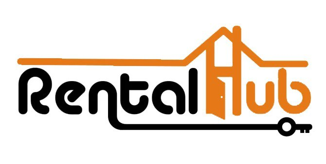

<div align="center">
  

  <h1>RentalHub</h1>
  <p><strong>Verified off-campus accommodation for university students</strong></p>

  <p>
    <a href="https://rentalhub.ng" target="_blank">🌐 Live Site</a> ·
    <a href="#features">Features</a> ·
    <a href="#architecture">Architecture</a> ·
    <a href="#tech-stack">Tech Stack</a> ·
    <a href="#getting-started">Getting Started</a>
  </p>

  
  
  
  
  
</div>

---

## Overview

RentalHub is a full-stack student housing platform that connects students seeking off-campus accommodation with verified landlords near their campus. The platform manages the entire lifecycle — from property discovery and booking to payment processing and move-in confirmation.

**Currently live for BOUESTI (Bamidele Olumilua University of Education, Science & Technology), Ikere-Ekiti** — with multi-school architecture ready to expand to additional institutions.

Key design principles:

- **Trust & Safety** — Landlords go through a document-based verification process (government ID, selfie, proof of ownership) before listings go live.
- **Secure Payments** — Students pay through the platform (Paystack). Funds are held until the student confirms move-in, then released to the landlord by an admin.
- **Fraud Prevention** — Google Gemini AI scans listings for scam signals and AI-generated or duplicate photos using perceptual image hashing.
- **Multi-school** — Admins can filter the entire dashboard by institution, allowing one platform to serve many universities.

---

## Features

### For Students
- Browse and search verified off-campus properties filtered by location, price, and distance to campus
- Book a property directly from the listing page
- Sign a tenancy agreement before payment (enforced by the platform)
- Pay rent, agency fee, and caution fee in one secure Paystack transaction
- Specify a move-in date and click **"I've Moved In"** to trigger the landlord payout process
- Track all bookings and download payment receipts from a personal dashboard

### For Landlords
- Create and manage property listings with photo and video uploads (Vercel Blob)
- Step-by-step identity and ownership verification flow
- Set up a bank account for automatic payout after tenant move-in confirmation
- Dashboard with listing status, booking activity, earnings overview, and verification status
- In-app and email notifications for every booking and payment event

### For Admins
- Multi-school dashboard — filter all stats and data by university
- Review and approve/reject property listings with rejection notes
- Review landlord verification submissions (with AI pre-screening scores) and approve/reject
- Manage users — suspend, unsuspend, change roles
- **Pending Payouts panel** — when a student confirms move-in, admin receives an in-app and email alert with the landlord's bank details and amount. Admin manually processes the bank transfer, then clicks **"Mark as Paid"** to notify both parties.
- AI-powered demand forecast with monthly booking trends

### Platform-wide
- Full SEO: Open Graph, Twitter cards, per-page metadata, `sitemap.xml`, `robots.txt`, JSON-LD
- In-app notification system (bell icon, mark as read)
- Responsive — mobile-first design
- Email notifications via Resend API (with SMTP fallback) for every major event

---

## Architecture

### Payment & Escrow Flow

```
Student pays via Paystack
        ↓
  Payment verified & booking marked PAID
        ↓
  Student signs tenancy agreement (required before payment)
        ↓
  Student sets move-in date & clicks "I've Moved In"
        ↓
  Admin receives notification with landlord bank details
        ↓
  Admin manually transfers funds to landlord's bank account
        ↓
  Admin clicks "Mark as Paid" in the Payouts panel
        ↓
  Landlord & student both receive email confirmation
```

### Directory Structure

```
src/
├── app/
│   ├── (auth)/               # Login, register, verify-email, forgot/reset password
│   ├── (public)/             # Homepage, property browse, property detail, terms, privacy
│   ├── (dashboards)/
│   │   ├── admin/            # Admin dashboard (properties, users, bookings, verifications, payouts, forecast)
│   │   ├── landlord/         # Landlord dashboard, add/edit property, profile, verification
│   │   └── student/          # Student dashboard, booking management, receipt
│   ├── api/
│   │   ├── admin/            # bookings, landlords, payouts, summary, users
│   │   ├── ai/               # check-listing, generate-description, price-advisor, verify-documents, demand-forecast
│   │   ├── auth/             # register, verify-email, forgot-password, reset-password, [...nextauth]
│   │   ├── bookings/         # list, [id], expire, moved-in, sign-agreement
│   │   ├── landlord/         # bank-account, earnings, profile, verification, verify-account
│   │   ├── payments/         # initiate, verify, refund, webhook (Paystack)
│   │   ├── paystack/         # banks
│   │   ├── properties/       # list, [id], [id]/status
│   │   ├── student/          # profile
│   │   ├── notifications/    # list, [id]
│   │   └── uploads/          # server upload, client-token (Vercel Blob)
│   ├── layout.tsx
│   ├── manifest.ts
│   ├── robots.ts
│   └── sitemap.ts
├── components/               # Navbar, Footer, DashboardNavbar, PublicNavbar, Providers, PropertyCard
├── lib/
│   ├── auth.ts               # NextAuth.js config (CredentialsProvider, JWT, email verification guard)
│   ├── email.ts              # All transactional email functions (Resend + SMTP fallback)
│   ├── notifications.ts      # In-app notification helper
│   ├── prisma.ts             # Prisma client singleton
│   ├── property-image.ts     # Placeholder image seeder
│   ├── schools.ts            # University list and location keyword map
│   └── utils.ts              # formatPrice, formatDate, cn helpers
└── middleware.ts             # Route protection by role
```

---

## Tech Stack

| Layer | Technology |
|---|---|
| Framework | Next.js 15.5.14 (App Router, Server Components) |
| Language | TypeScript 5 (strict mode) |
| Styling | Tailwind CSS 3 |
| ORM | Prisma 5 |
| Database | PostgreSQL via Neon (serverless) |
| Auth | NextAuth.js v4 (JWT, CredentialsProvider) |
| Payments | Paystack (REST API — test mode) |
| File Storage | Vercel Blob (photos, videos, verification docs) |
| AI | Google Gemini 2.0 Flash Lite (fraud detection, description generation, price advisory, doc pre-screening) |
| Email | Resend API (primary) + Nodemailer SMTP (fallback) |
| Deployment | Vercel (production at rentalhub.ng) |
| Icons | Lucide React |

---

## Getting Started

### Prerequisites

- Node.js 20+
- A PostgreSQL database (Neon recommended)
- A Paystack account (test keys)
- A Vercel account (for Blob storage)
- Email credentials (Resend API key or SMTP)
- A Google Gemini API key

### 1. Clone and install

```bash
git clone https://github.com/Mikaelson-1/RentalHub-Nigeria.git
cd RentalHub-BOUESTI
npm install
```

### 2. Configure environment variables

Create `.env.local`:

```env
# Database
DATABASE_URL="postgresql://..."

# NextAuth
NEXTAUTH_SECRET="your-secret"
NEXTAUTH_URL="http://localhost:3000"

# Paystack
PAYSTACK_SECRET_KEY="sk_test_..."
NEXT_PUBLIC_PAYSTACK_PUBLIC_KEY="pk_test_..."

# Vercel Blob
BLOB_READ_WRITE_TOKEN="vercel_blob_..."

# Email (Resend — recommended)
RESEND_API_KEY="re_..."
EMAIL_FROM="RentalHub <no-reply@rentalhub.ng>"

# OR Email (SMTP fallback)
EMAIL_HOST="smtp.example.com"
EMAIL_PORT="587"
EMAIL_USER="user@example.com"
EMAIL_PASS="password"

# AI
GEMINI_API_KEY="..."

# App
NEXT_PUBLIC_APP_URL="http://localhost:3000"
```

### 3. Push database schema and run

```bash
npx prisma db push
npm run dev
```

---

## Key API Endpoints

| Method | Path | Description |
|---|---|---|
| `POST` | `/api/auth/register` | Register student or landlord |
| `GET/POST` | `/api/properties` | List approved properties / create listing |
| `GET/POST` | `/api/bookings` | List bookings / create booking |
| `POST` | `/api/bookings/sign-agreement` | Student signs tenancy agreement |
| `POST` | `/api/payments/initiate` | Initialise Paystack payment |
| `GET` | `/api/payments/verify` | Verify payment after redirect |
| `POST` | `/api/payments/webhook` | Paystack webhook handler |
| `POST` | `/api/bookings/moved-in` | Student confirms move-in |
| `GET/PATCH` | `/api/admin/payouts` | List pending payouts / mark paid or failed |
| `GET` | `/api/landlord/bank-account` | Get landlord bank details |
| `POST` | `/api/landlord/bank-account` | Save bank account + Paystack recipient |
| `GET` | `/api/landlord/verify-account` | Resolve account name via Paystack |
| `POST` | `/api/uploads` | Upload image (server-side, AI-checked) |
| `POST` | `/api/uploads/client-token` | Issue Vercel Blob client-upload token |

---

## Deployment

The application is deployed on Vercel and aliased to **rentalhub.ng**.

```bash
npx vercel --prod
```

Database schema changes are applied automatically on every deploy via the build command:

```
prisma db push --accept-data-loss && prisma generate && next build
```

---

## License

This project is **private and proprietary**. All rights reserved © 2026 The Mikaelson Initiative. Unauthorised copying, distribution, or use of any part of this codebase is strictly prohibited.
